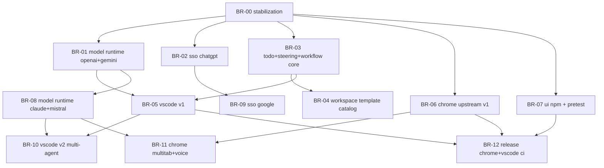

# PLAN - Two-Week Orchestrated Roadmap

Status: Draft roadmap plan (created 2026-02-22)
Window: 2026-02-23 to 2026-03-08

## 1) Delivery targets in this window

By 2026-03-01 (Week 1):
- At least 2 model providers (`OpenAI`, `Gemini`).
- OpenAI/ChatGPT SSO (admin + user).
- VSCode plugin v1 (`plan`, `tools`, `summary`, `checkpoint`).
- TODO management v1.
- Steering mode v1.
- Base workflow/autonomous agent orchestration.
- Workspace multi-template foundation (`ai-ideas`, `todo`).
- Chrome upstream control foundation (single-tab).
- Svelte UI npm publish automation.
- Playwright UI debug/pretest agent integrated in build flow.

By 2026-03-08 (Week 2):
- 4 model families (`OpenAI`, `Gemini`, `Claude`, `Mistral`).
- Google SSO (admin + user).
- VSCode plugin v2 (multi-agent, multi-model).
- Chrome multi-tab + voice.
- Automated CI publish for Chrome and VSCode plugins.

## 2) Source specifications

- `spec/SPEC_EVOL_MODEL_AUTH_PROVIDERS.md`
- `spec/SPEC_EVOL_AGENTIC_WORKSPACE_TODO.md`
- `spec/SPEC_EVOL_VSCODE_PLUGIN.md`
- `spec/SPEC_EVOL_CHROME_UPSTREAM.md`
- `spec/SPEC_EVOL_RELEASE_QA_PIPELINE.md`

Cross-reference baseline specs:
- `spec/SPEC.md`
- `spec/SPEC_CHATBOT.md`
- `spec/SPEC_CHROME_PLUGIN.md`
- `spec/WORKFLOW_AUTH.md`
- `spec/COLLAB.md`
- `spec/TOOLS.md`

## 3) Branch catalog (ordered priority)

| ID | Branch | Objective | Target | Depends on | BRANCH.md path |
|---|---|---|---|---|---|
| BR-00 | `feat/roadmap-stabilization` | Rebase/integration stabilization + minimatch exception lifecycle | W1 | none | `plan/BRANCH_feat-roadmap-stabilization.md` |
| BR-01 | `feat/model-runtime-openai-gemini` | Provider abstraction + 2 providers + BYOK precedence | W1 | BR-00 | `plan/BRANCH_feat-model-runtime-openai-gemini.md` |
| BR-02 | `feat/sso-chatgpt` | OpenAI/ChatGPT SSO (admin/user) | W1 | BR-00 | `plan/BRANCH_feat-sso-chatgpt.md` |
| BR-03 | `feat/todo-steering-workflow-core` | TODO v1 + steering v1 + workflow core | W1 | BR-00 | `plan/BRANCH_feat-todo-steering-workflow-core.md` |
| BR-04 | `feat/workspace-template-catalog` | Multi-template workspace foundation (`ai-ideas`, `todo`) | W1 | BR-03 | `plan/BRANCH_feat-workspace-template-catalog.md` |
| BR-05 | `feat/vscode-plugin-v1` | VSCode plugin v1 (`plan/tools/summary/checkpoint`) | W1 | BR-01, BR-03 | `plan/BRANCH_feat-vscode-plugin-v1.md` |
| BR-06 | `feat/chrome-upstream-v1` | Upstream remote control foundation (single-tab) | W1 | BR-00 | `plan/BRANCH_feat-chrome-upstream-v1.md` |
| BR-07 | `feat/release-ui-npm-and-pretest` | UI npm publish + Playwright pretest/debug agent | W1 | BR-00 | `plan/BRANCH_feat-release-ui-npm-and-pretest.md` |
| BR-08 | `feat/model-runtime-claude-mistral` | Expand model runtime to Claude + Mistral | W2 | BR-01 | `plan/BRANCH_feat-model-runtime-claude-mistral.md` |
| BR-09 | `feat/sso-google` | Google SSO (admin/user) | W2 | BR-02 | `plan/BRANCH_feat-sso-google.md` |
| BR-10 | `feat/vscode-plugin-v2-multi-agent` | VSCode v2 multi-agent + multi-model | W2 | BR-05, BR-08 | `plan/BRANCH_feat-vscode-plugin-v2-multi-agent.md` |
| BR-11 | `feat/chrome-upstream-multitab-voice` | Chrome multi-tab orchestration + voice | W2 | BR-06, BR-08 | `plan/BRANCH_feat-chrome-upstream-multitab-voice.md` |
| BR-12 | `feat/release-chrome-vscode-ci-publish` | CI automated publishing for Chrome + VSCode | W2 | BR-05, BR-06, BR-07 | `plan/BRANCH_feat-release-chrome-vscode-ci-publish.md` |

## 4) Dependency graph

## 5) Waves (max 3 parallel branches)

### Wave W0 (2026-02-23)
- BR-00

### Wave W1 (2026-02-24 to 2026-02-26)
- BR-01
- BR-02
- BR-03

### Wave W2 (2026-02-26 to 2026-03-01)
- BR-04
- BR-05
- BR-06

### Wave W3 (2026-02-27 to 2026-03-01)
- BR-07

### Wave W4 (2026-03-02 to 2026-03-05)
- BR-08
- BR-09
- BR-10

### Wave W5 (2026-03-05 to 2026-03-08)
- BR-11
- BR-12

## 6) Environment and branch execution convention

Mandatory execution model:
- User UAT stays on root workspace (`./`) with `ENV=dev`.
- Each branch uses isolated workspace `tmp/feat-<slug>/`.
- Keep at most 3 active implementation branches in parallel.
- All test campaigns run outside root `dev` (`ENV=test-*` / `ENV=e2e-*`).

Port convention per branch index (`nn`):
- `API_PORT = 87nn`
- `UI_PORT = 51nn`
- `MAILDEV_UI_PORT = 10nn`

Example for BR-05 (`nn=05`):
- `ENV=feat-vscode-plugin-v1`
- `API_PORT=8705`
- `UI_PORT=5105`
- `MAILDEV_UI_PORT=1005`

## 7) Question lots (to resolve before each wave)

### QL-1 (deadline: 2026-02-24, blocks W1)
- `MPA-Q1`, `MPA-Q2`, `MPA-Q3` from `spec/SPEC_EVOL_MODEL_AUTH_PROVIDERS.md`
- `AWT-Q1`, `AWT-Q2`, `AWT-Q5` from `spec/SPEC_EVOL_AGENTIC_WORKSPACE_TODO.md`

### QL-2 (deadline: 2026-02-27, blocks W2/W3)
- `AWT-Q3`, `AWT-Q4` from `spec/SPEC_EVOL_AGENTIC_WORKSPACE_TODO.md`
- `VSC-Q2`, `VSC-Q3` from `spec/SPEC_EVOL_VSCODE_PLUGIN.md`
- `CHU-Q1`, `CHU-Q2` from `spec/SPEC_EVOL_CHROME_UPSTREAM.md`
- `REL-Q1`, `REL-Q4` from `spec/SPEC_EVOL_RELEASE_QA_PIPELINE.md`

### QL-3 (deadline: 2026-03-03, blocks W4/W5)
- `MPA-Q4`, `MPA-Q5` from `spec/SPEC_EVOL_MODEL_AUTH_PROVIDERS.md`
- `VSC-Q1`, `VSC-Q4`, `VSC-Q5` from `spec/SPEC_EVOL_VSCODE_PLUGIN.md`
- `CHU-Q3`, `CHU-Q4`, `CHU-Q5` from `spec/SPEC_EVOL_CHROME_UPSTREAM.md`
- `REL-Q2`, `REL-Q3`, `REL-Q5` from `spec/SPEC_EVOL_RELEASE_QA_PIPELINE.md`

## 8) Definition of done per branch

Each branch is closable when all conditions are met:
- Scope limited to one roadmap capability.
- Branch-specific plan file `plan/BRANCH_<feat-slug>.md` completed and checked.
- Typecheck/lint/tests run in isolated envs.
- Relevant E2E checks executed for impacted surfaces.
- Specs updated and linked in commit/PR description.
- No unresolved security exceptions added without register entry and mitigation date.

## 9) Post-window backlog policy

All remaining unchecked items in `TODO.md` remain in legacy backlog.
After 2026-03-08, create a new planning pass to map them into branch waves using the same orchestration model.
