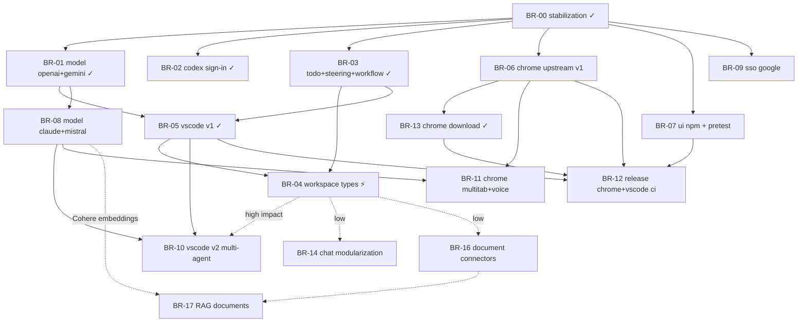

# PLAN - Orchestrated Roadmap

Status: Updated 2026-03-12 — BR-04 structural branch in progress
Previous window (2026-02-23 → 2026-03-08) closed. New timeline driven by BR-04 scope.

## 1) Current state

**Completed branches:**
- BR-00 `feat/roadmap-stabilization` — done
- BR-01 `feat/model-runtime-openai-gemini` — done, merged
- BR-02 `feat/sso-chatgpt` — done (product pivot, docs only)
- BR-03 `feat/todo-steering-workflow-core` — done, merged
- BR-05 `feat/vscode-plugin-v1` — done, merged
- BR-13 `feat/chrome-plugin-download-distribution` — done, merged

**Active branch:**
- BR-04 `feat/workspace-template-catalog` — **in progress** (Lot 0 spec framework). Scope expanded to full workspace type system, neutral orchestrator, initiative lifecycle, multi-domain foundation. Budget ~400 commits in 4 segments. See `BRANCH.md`.

**Pending branches (blocked or dependent on BR-04):**
- BR-06 through BR-12 — not started, pending BR-04 completion or independent scheduling.
- BR-14, BR-16, BR-17 — new branches identified during BR-04 Lot 0 cross-cutting analysis (2026-03-12).

## 2) BR-04 as structural branch

BR-04 is now the structural foundation for most future branches:
- Introduces workspace type system (neutral, ai-ideas, opportunity, code)
- Renames `use_cases` → `initiatives` (impacts all downstream branches)
- Delivers multi-workflow registry (replaces single hardcoded workflow)
- Adds extended business objects (solutions, products, bids)
- Adds gate system for initiative maturity
- Defines workspace-type-aware chat tool scoping (§14)
- Defines cross-cutting exclusions and branch articulation for parallel work (§15)

Full spec: `spec/SPEC_EVOL_WORKSPACE_TYPES.md`

## 3) Branch catalog

| ID | Branch | Status | Depends on | BR-04 impact |
|---|---|---|---|---|
| BR-00 | `feat/roadmap-stabilization` | done | — | — |
| BR-01 | `feat/model-runtime-openai-gemini` | done | BR-00 | — |
| BR-02 | `feat/sso-chatgpt` | done | BR-00 | — |
| BR-03 | `feat/todo-steering-workflow-core` | done | BR-00 | — |
| BR-04 | `feat/workspace-template-catalog` | **active** | BR-03, BR-05 | — |
| BR-05 | `feat/vscode-plugin-v1` | done | BR-01, BR-03 | — |
| BR-06 | `feat/chrome-upstream-v1` | plan | BR-00 | low (contextType rename) |
| BR-07 | `feat/release-ui-npm-and-pretest` | plan | BR-00 | none |
| BR-08 | `feat/model-runtime-claude-mistral-cohere` | done | BR-01 | none (scope extended: +Cohere) |
| BR-09 | `feat/sso-google` | plan | BR-00 | none |
| BR-10 | `feat/vscode-plugin-v2-multi-agent` | plan | BR-05, BR-08, **BR-04** | **high** (workspace-type-aware agents) |
| BR-11 | `feat/chrome-upstream-multitab-voice` | plan | BR-06, BR-08 | low (contextType rename) |
| BR-12 | `feat/release-chrome-vscode-ci-publish` | plan | BR-05, BR-06, BR-07, BR-13 | none |
| BR-13 | `feat/chrome-plugin-download-distribution` | done | BR-06 | — |
| BR-14 | `feat/chat-modularization` | plan | BR-04 (low) | low (ChatPanel/ChatWidget refactoring) |
| BR-15 | _(reserved: agent workflow config robustness)_ | plan | BR-04 | — |
| BR-16 | `feat/document-connectors` | plan | BR-04 (low) | low (initiative rename in contextType) |
| BR-17 | `feat/rag-documents` | plan | BR-16 (optional), BR-08 (Cohere embeddings) | none |

## 4) Dependency graph

```mermaid
graph TD
  BR00[BR-00 stabilization ✓]
  BR01[BR-01 model openai+gemini ✓]
  BR02[BR-02 codex sign-in ✓]
  BR03[BR-03 todo+steering+workflow ✓]
  BR04[BR-04 workspace types ⚡]
  BR05[BR-05 vscode v1 ✓]
  BR06[BR-06 chrome upstream v1]
  BR07[BR-07 ui npm + pretest]
  BR08[BR-08 model claude+mistral]
  BR09[BR-09 sso google]
  BR10[BR-10 vscode v2 multi-agent]
  BR11[BR-11 chrome multitab+voice]
  BR12[BR-12 release chrome+vscode ci]
  BR13[BR-13 chrome download ✓]
  BR14[BR-14 chat modularization]
  BR16[BR-16 document connectors]
  BR17[BR-17 RAG documents]

  BR00 --> BR01
  BR00 --> BR02
  BR00 --> BR03
  BR03 --> BR04
  BR05 --> BR04
  BR01 --> BR05
  BR03 --> BR05
  BR00 --> BR06
  BR00 --> BR07
  BR06 --> BR13

  BR01 --> BR08
  BR00 --> BR09
  BR05 --> BR10
  BR08 --> BR10
  BR04 -.->|high impact| BR10
  BR06 --> BR11
  BR08 --> BR11
  BR05 --> BR12
  BR06 --> BR12
  BR07 --> BR12
  BR13 --> BR12
  BR04 -.->|low| BR14
  BR04 -.->|low| BR16
  BR16 -.-> BR17
  BR08 -.->|Cohere embeddings| BR17
```

## 5) Scheduling post-BR-04

After BR-04 merge, independent branches can proceed in parallel:
- **Wave A**: BR-06 (Chrome upstream) + BR-07 (UI npm) + BR-08 (Claude/Mistral/Cohere) — no BR-04 dependency
- **Wave A'** (parallelizable with BR-04): BR-14 (chat modularization) + BR-16 (document connectors) — low BR-04 dependency, can start on non-overlapping files
- **Wave B**: BR-09 (SSO Google) — independent
- **Wave C**: BR-10 (VSCode v2) + BR-11 (Chrome multitab) — after Wave A + BR-04
- **Wave C'**: BR-17 (RAG documents) — after BR-16 (optional) + BR-08 (Cohere embeddings)
- **Wave D**: BR-12 (CI publish) — after Wave A/C

Exact timeline TBD after BR-04 Lot 0 gate.

## 6) Environment convention

Port convention per branch index (`nn`): `API_PORT=87nn`, `UI_PORT=51nn`, `MAILDEV_UI_PORT=10nn`.
User UAT on root workspace (`ENV=dev`). Branch dev in worktree or root workspace.

## 7) Source specifications

- `spec/SPEC_EVOL_WORKSPACE_TYPES.md` (BR-04)
- `spec/SPEC_EVOL_AGENTIC_WORKSPACE_TODO.md` (residual)
- `spec/SPEC_EVOL_BR15_AGENT_WORKFLOW_CONFIG_ROBUSTNESS.md` (deferred)
- `spec/SPEC_EVOL_VSCODE_PLUGIN.md`
- `spec/SPEC_EVOL_CHROME_UPSTREAM.md`
- `spec/SPEC_EVOL_RELEASE_QA_PIPELINE.md`
- `spec/SPEC_EVOL_MODEL_AUTH_PROVIDERS.md`
