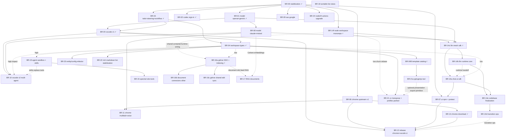

# PLAN - Orchestrated Roadmap

Status: Updated 2026-05-06 — BR-14f (Node workspace monorepo infra) is ready to merge on PR #125: CI is green after rerunning external-network failures, isolated branch dev-stack startup is validated on `API_PORT=8715 UI_PORT=5115 MAILDEV_UI_PORT=1015 ENV=chore-node-workspace-monorepo-14f`, and root user smoke UAT is validated on `ENV=dev` with user data. Existing active scoping remains: Entropic transition, BR-14c (LLM mesh npm library, priority), BR-14a (chat UI SDK), BR-16 follow-ups. BR-14 split → BR-14a + BR-14b + BR-14c + BR-14d + BR-14e + BR-14f. Selected execution order: PR-117 transition ops → BR-14f → BR-14c → BR-14b → BR-14a → BR-14e → BR-14d. BR-16 split → BR-16a + BR-16b + BR-16c. See §5 Scheduling, `TRANSITION.md`, and `spec/SPEC_EVOL_ENTROPIC_BR14_ORCHESTRATION.md`.

## 1) Current state

**Completed branches (merged):**
- BR-00 `feat/roadmap-stabilization`
- BR-01 `feat/model-runtime-openai-gemini`
- BR-02 `feat/sso-chatgpt` (product pivot, docs only)
- BR-03 `feat/todo-steering-workflow-core`
- BR-04 `feat/workspace-template-catalog` (workspace type system, initiative rename, multi-workflow registry, extended objects, gate system)
- BR-04B `feat/workspace-template-catalog` continuation (template-driven rendering, generic workflow runtime, freeform DOCX, chat tools wiring)
- BR-05 `feat/vscode-plugin-v1`
- BR-06 `feat/chrome-upstream-v1` — **merged 2026-04-17** (`62de15ad`). Webapp tab_read/tab_action to Chrome tabs via extension + in-memory Tab Registry.
- BR-08 `feat/model-runtime-claude-mistral-cohere` (scope extended: +Cohere)
- BR-13 `feat/chrome-plugin-download-distribution`

**Ready to merge:**
- BR-14f `chore/node-workspace-monorepo-14f` — PR #125 (`e7ff9880`). Root Node workspace + full-repo container mounts; CI green and root smoke UAT validated 2026-05-06.

**Next branches (explicitly queued):**
- BR-23 `feat/multi-agent-framework-comparison` — compare LangGraph/Agno/Temporal. See `plan/23-BRANCH_feat-multi-agent-framework-comparison.md`.
- BR-24 `chore/node24-actions-upgrade` — upgrade GitHub Actions workflows and third-party actions for Node 24 compatibility before the runner cutover; verify CI/CD and Scaleway deploy lanes end-to-end.
- BR-25 `chore/rules-skills-audit` — absorb BR-04B audit learnings. See `plan/25-BRANCH_chore-rules-skills-audit.md`.

**Active scoping (Lot 0 in progress):**
- BR-14c `feat/llm-mesh-sdk` — priority extraction: publishable npm lib `@entropic/llm-mesh`, Vercel AI SDK-like access to GPT/Claude/Gemini/Mistral/Cohere with token and Codex-account modes.
- BR-14a `feat/chat-ui-sdk` — former BR-14, renamed: chat publishable as npm lib `@entropic/chat`, using the LLM mesh contract rather than application runtime internals.
- BR-16a `feat/gdrive-sso-indexing` — Google Drive OAuth + Picker search/selection + in-situ `document_summary` indexing (docs stay in Drive). Split from former BR-16.
- `fix/high-vulnerabilities` — isolated remediation branch for the API HIGH dependency vulnerability currently failing `security-sast-sca` and API image audit gates.

**Pending branches (unblocked):**
- BR-07, BR-10, BR-11, BR-12, BR-14b (after BR-14c contract), BR-14e (codebase finalization after 14a/14b/14c), BR-14d (mandatory transition ops after PR-117 release and BR-14e), BR-15, BR-16b, BR-16c, BR-17, BR-18, BR-19, BR-20, BR-21a, BR-21, BR-22, BR-24 — see §3 catalog for descriptions, dependencies, and priorities.

**Deferred:**
- BR-09 `feat/sso-google` — deferred post-refacto (OOM resolution required before SSO Google work; exact target TBD by conductor).

**BR-14 orchestration (selected):**
- PR-117 release ops decide/execute repo rename + DNS/redirect, or hand off remaining operational work to BR-14d.
- BR-14f lands first if the repo still mounts `api`/`ui` as isolated containers and cannot consume internal packages from root. It adds the Node workspace / full-repo mount baseline only; BR-14c keeps ownership of the mesh contract and thin proof path.
- BR-14c is the first BR-14 package/product branch because `@entropic/llm-mesh` owns the public model-access contract.
- BR-14b migrates the application LLM runtime onto that contract.
- BR-14a extracts `@entropic/chat` after the mesh contract; Lot 0 may scope in parallel only.
- BR-14e performs the final non-chat/non-LLM codebase naming sweep and residual-name report.
- BR-14d executes remaining transition ops and is mandatory unless all repo/DNS/Scaleway/workflow rename items are complete during PR-117 release.
- BR-14f now rebases on a baseline where BR-16a and BR-21a are already merged, so its local workspace gates must be rerun on that post-merge state.
- Historical proof snapshot (2026-04-25): BR-14f local workspace gates were green on `ff6190cb`; BR-14c, BR-16a, and BR-21a rebase simulations were doc-conflict only before BR-16a/BR21a merged.
- Detailed branch contracts and rejected order options are in `spec/SPEC_EVOL_ENTROPIC_BR14_ORCHESTRATION.md`.

## 2) BR-04/04B as structural branch

BR-04 (merged) and BR-04B (merged) together form the structural foundation for most future branches:
- Introduces workspace type system (neutral, ai-ideas, opportunity, code)
- Renames `use_cases` → `initiatives` (impacts all downstream branches)
- Delivers multi-workflow registry (replaces single hardcoded workflow)
- Adds extended business objects (solutions, products, bids)
- Adds gate system for initiative maturity
- Defines workspace-type-aware chat tool scoping (§14)
- Defines cross-cutting exclusions and branch articulation for parallel work (§15)

BR-04B adds:
- Template-driven rendering via TemplateRenderer (initiative, organization, dashboard)
- Config UX alignment (ConfigItemCard shared component, copy/reset/delete)
- Generic executable workflow runtime (transition-driven, replaces hardcoded sequencing)
- Freeform DOCX generation via sandboxed code execution
- Chat tools wiring (document_generate, batch_create_organizations)
- Multi-org folder creation with fanout/join workflow

Full spec: `spec/SPEC_EVOL_WORKSPACE_TYPES.md`

## 3) Branch catalog

```
+--------+--------------------------------------------------+------------------------------------------------------------+----------------------+--------------------------------+
| ID     | Branch                                           | Description                                                | Status               | Depends on                     |
+--------+--------------------------------------------------+------------------------------------------------------------+----------------------+--------------------------------+
| BR-00  | feat/roadmap-stabilization                       | Roadmap stabilization, rules/workflow bootstrap.           | done                 | —                              |
+--------+--------------------------------------------------+------------------------------------------------------------+----------------------+--------------------------------+
| BR-01  | feat/model-runtime-openai-gemini                 | Model runtime v1: OpenAI + Gemini providers.               | done                 | BR-00                          |
+--------+--------------------------------------------------+------------------------------------------------------------+----------------------+--------------------------------+
| BR-02  | feat/sso-chatgpt                                 | ChatGPT SSO (product pivot, docs only).                    | done                 | BR-00                          |
+--------+--------------------------------------------------+------------------------------------------------------------+----------------------+--------------------------------+
| BR-03  | feat/todo-steering-workflow-core                 | TODO + steering + workflow core engine.                    | done                 | BR-00                          |
+--------+--------------------------------------------------+------------------------------------------------------------+----------------------+--------------------------------+
| BR-04  | feat/workspace-template-catalog                  | Workspace types, initiative rename, multi-workflow         | done                 | BR-03, BR-05                   |
|        |                                                  | registry, extended objects, gate system.                   |                      |                                |
+--------+--------------------------------------------------+------------------------------------------------------------+----------------------+--------------------------------+
| BR-04B | feat/workspace-template-catalog (continuation)   | Template-driven rendering, generic executable workflow     | done                 | BR-04                          |
|        |                                                  | runtime, freeform DOCX, chat tools wiring.                 |                      |                                |
+--------+--------------------------------------------------+------------------------------------------------------------+----------------------+--------------------------------+
| BR-05  | feat/vscode-plugin-v1                            | VSCode plugin v1 (chat sidepanel, single agent).           | done                 | BR-01, BR-03                   |
+--------+--------------------------------------------------+------------------------------------------------------------+----------------------+--------------------------------+
| BR-06  | feat/chrome-upstream-v1                          | Webapp dispatches tab_read/tab_action to Chrome tabs via   | done                 | BR-00                          |
|        |                                                  | extension (in-memory Tab Registry).                        |                      |                                |
+--------+--------------------------------------------------+------------------------------------------------------------+----------------------+--------------------------------+
| BR-07  | feat/release-ui-npm-and-pretest                  | UI npm publish + packaged debug assistant with CI          | plan                 | BR-00, BR-14a                  |
|        |                                                  | artifacts (screens/videos/logs).                           |                      |                                |
+--------+--------------------------------------------------+------------------------------------------------------------+----------------------+--------------------------------+
| BR-08  | feat/model-runtime-claude-mistral-cohere         | Model runtime v2: Claude + Mistral + Cohere providers.     | done                 | BR-01                          |
+--------+--------------------------------------------------+------------------------------------------------------------+----------------------+--------------------------------+
| BR-09  | feat/sso-google                                  | Google SSO for admin + standard users, account linking,    | deferred             | BR-00                          |
|        |                                                  | session compat.                                            | (post-refacto / OOM  |                                |
|        |                                                  |                                                            | resolution)          |                                |
+--------+--------------------------------------------------+------------------------------------------------------------+----------------------+--------------------------------+
| BR-10  | feat/vscode-plugin-v2-multi-agent                | VSCode v2 multi-agent/multi-model + detached tool          | plan                 | BR-05, BR-08, BR-04            |
|        |                                                  | lifecycle.                                                 |                      |                                |
+--------+--------------------------------------------------+------------------------------------------------------------+----------------------+--------------------------------+
| BR-11  | feat/chrome-upstream-multitab-voice              | Extend upstream to multi-tab orchestration + voice         | plan                 | BR-06, BR-08                   |
|        |                                                  | commands with consent gates.                               |                      |                                |
+--------+--------------------------------------------------+------------------------------------------------------------+----------------------+--------------------------------+
| BR-12  | feat/release-chrome-vscode-ci-publish            | CI publishing for Chrome + VSCode plugins with release     | plan                 | BR-05, BR-06, BR-07, BR-13     |
|        |                                                  | gating.                                                    |                      |                                |
+--------+--------------------------------------------------+------------------------------------------------------------+----------------------+--------------------------------+
| BR-13  | feat/chrome-plugin-download-distribution         | Chrome extension build + download/distribution flow.       | done                 | BR-06                          |
+--------+--------------------------------------------------+------------------------------------------------------------+----------------------+--------------------------------+
| BR-14f | chore/node-workspace-monorepo-14f               | Introduce a root Node workspace and full-repo container    | ready                | BR-00                          |
|        |                                                  | mounts for `api`/`ui`, so internal packages can be         |                      |                                |
|        |                                                  | consumed cleanly by future extracted libraries.            |                      |                                |
+--------+--------------------------------------------------+------------------------------------------------------------+----------------------+--------------------------------+
| BR-14c | feat/llm-mesh-sdk                                | Publish @entropic/llm-mesh: Vercel AI SDK-like access      | scoping (priority)   | BR-01, BR-08                   |
|        |                                                  | to GPT/Claude/Gemini/Mistral/Cohere, token auth, Codex     |                      |                                |
|        |                                                  | account mode, later Gemini Code Assist / Claude Code.      |                      |                                |
+--------+--------------------------------------------------+------------------------------------------------------------+----------------------+--------------------------------+
| BR-14b | refacto/llm-runtime-core                         | Migrate the application LLM runtime onto the mesh:          | plan (after BR-14c   | BR-08, BR-14c                  |
|        |                                                  | provider contracts, capability matrix, streaming           | contract)            |                                |
|        |                                                  | normalization, retries, quotas.                            |                      |                                |
+--------+--------------------------------------------------+------------------------------------------------------------+----------------------+--------------------------------+
| BR-14a | feat/chat-ui-sdk                                 | Former BR-14. Extract @entropic/chat from web, Chrome,      | plan (after BR-14c,  | BR-04 (low), BR-14c            |
|        |                                                  | and VSCode surfaces as publishable npm lib.                | can scope in parallel)|                                |
+--------+--------------------------------------------------+------------------------------------------------------------+----------------------+--------------------------------+
| BR-14e | chore/entropic-codebase-finalization             | Final codebase naming sweep outside chat/LLM/ops: API/UI   | plan (mandatory)     | BR-14a, BR-14b, BR-14c         |
|        |                                                  | packages, labels, tests, fixtures, exports, residual       |                      |                                |
|        |                                                  | old-name allowlist and report.                             |                      |                                |
+--------+--------------------------------------------------+------------------------------------------------------------+----------------------+--------------------------------+
| BR-14d | chore/entropic-transition-ops                    | Execute remaining transition ops: repo rename follow-up,    | plan (mandatory)     | TRANSITION, PR-117 release ops |
|        |                                                  | DNS/redirect verification, Scaleway containers, registry   |                      | BR-14e                         |
|        |                                                  | images, secrets, workflow names, dashboards, metadata.     |                      |                                |
+--------+--------------------------------------------------+------------------------------------------------------------+----------------------+--------------------------------+
| BR-15  | feat/spectral-site-tools                         | HTTP traffic capture + LLM analysis -> auto-generated      | plan                 | BR-06, BR-19                   |
|        |                                                  | per-site API tools (complement to DOM                      |                      |                                |
|        |                                                  | tab_read/tab_action).                                      |                      |                                |
+--------+--------------------------------------------------+------------------------------------------------------------+----------------------+--------------------------------+
| BR-16a | feat/gdrive-sso-indexing                         | Google Drive OAuth (per-user) + Picker search/selection +  | scoping              | BR-04 (low)                    |
|        |                                                  | in-situ document_summary indexing: docs stay in Drive,     |                      |                                |
|        |                                                  | summaries/detailed summaries stored in Entropic, retrieval |                      |                                |
|        |                                                  | via gdrive refs. Google Cloud app provisioned by Codex     |                      |                                |
|        |                                                  | through Playwright MCP + user CDP browser session.         |                      |                                |
+--------+--------------------------------------------------+------------------------------------------------------------+----------------------+--------------------------------+
| BR-16b | feat/document-connectors-other                   | SharePoint/OneDrive connectors + local upload wiring +     | plan (after BR-16a)  | BR-16a (connector pattern)     |
|        |                                                  | connector abstraction beyond Drive. Split from former      |                      |                                |
|        |                                                  | BR-16.                                                     |                      |                                |
+--------+--------------------------------------------------+------------------------------------------------------------+----------------------+--------------------------------+
| BR-16c | feat/gdrive-shared-edit-sync                     | Google Drive shared-doc collaboration follow-up: sharing    | plan (after BR-16a)  | BR-16a                         |
|        |                                                  | assistance, change notifications/polling, queued summary   |                      |                                |
|        |                                                  | regeneration, direct Google Docs editing tool, and Google  |                      |                                |
|        |                                                  | Slides/PPT generation/editing tool.                        |                      |                                |
+--------+--------------------------------------------------+------------------------------------------------------------+----------------------+--------------------------------+
| BR-17  | feat/rag-documents                               | RAG on context-attached documents: retrieve semantically   | plan                 | BR-16a (optional), BR-08       |
|        |                                                  | relevant chunks instead of full-document summaries.        |                      | (Cohere embeddings)            |
+--------+--------------------------------------------------+------------------------------------------------------------+----------------------+--------------------------------+
| BR-18  | feat/sortable-list-views                         | Sortable columns for all list views (folders, initiatives, | plan                 | none                           |
|        |                                                  | workspaces).                                               |                      |                                |
+--------+--------------------------------------------------+------------------------------------------------------------+----------------------+--------------------------------+
| BR-19  | feat/agent-sandbox-skills                        | V8 sandbox for tool execution + skill catalog replacing    | plan                 | BR-04                          |
|        |                                                  | hardcoded tool dispatch.                                   |                      |                                |
+--------+--------------------------------------------------+------------------------------------------------------------+----------------------+--------------------------------+
| BR-20  | refacto/entity-page-neutral-config               | Neutral entity route + config-driven view templates        | plan                 | BR-04                          |
|        |                                                  | (follow-up absorbing BR-04B learnings).                    |                      |                                |
+--------+--------------------------------------------------+------------------------------------------------------------+----------------------+--------------------------------+
| BR-21a | feat/pptxgenjs-tool                              | Generic PptGenJS presentation generation tool, analogous   | scoping              | BR-04B                         |
|        |                                                  | to freeform DOCX: upskill, sandboxed generation, storage,  |                      |                                |
|        |                                                  | download card. No profile-export ownership.                |                      |                                |
+--------+--------------------------------------------------+------------------------------------------------------------+----------------------+--------------------------------+
| BR-21  | feat/cv-transpose-profiles                       | CV transpose: upload -> extract profiles (officeparser +   | parked               | BR-04                          |
|        |                                                  | LLM) -> edit -> export DOCX; proposal + staffing           | (not launched)       | BR-21a optional for PPTX later |
|        |                                                  | integration. No BR-21 worktree is active.                  |                      |                                |
+--------+--------------------------------------------------+------------------------------------------------------------+----------------------+--------------------------------+
| BR-22  | fix/rich-markdown-list-stabilization             | Stabilize rich markdown list rendering/editing (freeze on  | plan                 | BR-04                          |
|        |                                                  | initiative cc884370... in constraints field).              |                      |                                |
+--------+--------------------------------------------------+------------------------------------------------------------+----------------------+--------------------------------+
| BR-23  | feat/multi-agent-framework-comparison            | Compare LangGraph / Agno / Temporal; recommendation +      | plan                 | BR-04B                         |
|        |                                                  | runtime extension plan.                                    |                      |                                |
+--------+--------------------------------------------------+------------------------------------------------------------+----------------------+--------------------------------+
| BR-24  | chore/node24-actions-upgrade                     | Update GitHub Actions workflows and third-party actions    | plan                 | BR-00                          |
|        |                                                  | to Node 24-compatible versions, then re-verify CI/CD       |                      |                                |
|        |                                                  | including Scaleway deploy lanes.                           |                      |                                |
+--------+--------------------------------------------------+------------------------------------------------------------+----------------------+--------------------------------+
| BR-25  | chore/rules-skills-audit                         | Absorb BR-04B audit learnings (2 agents, 13 sessions, 400+ | plan                 | BR-04B                         |
|        |                                                  | incidents) into rules + skills. Mechanical enforcement     |                      |                                |
|        |                                                  | over text rules.                                           |                      |                                |
+--------+--------------------------------------------------+------------------------------------------------------------+----------------------+--------------------------------+
```

## 4) Dependency graph


```mermaid
graph TD
  BR00[BR-00 stabilization ✓]
  BR01[BR-01 model openai+gemini ✓]
  BR02[BR-02 codex sign-in ✓]
  BR03[BR-03 todo+steering+workflow ✓]
  BR04[BR-04 workspace types ✓]
  BR04B[BR-04B template catalog ⚡]
  BR05[BR-05 vscode v1 ✓]
  BR06[BR-06 chrome upstream v1]
  BR07[BR-07 ui npm + pretest]
  BR08[BR-08 model claude+mistral]
  BR09[BR-09 sso google]
  BR10[BR-10 vscode v2 multi-agent]
  BR11[BR-11 chrome multitab+voice]
  BR12[BR-12 release chrome+vscode ci]
  BR13[BR-13 chrome download ✓]
  BR14f[BR-14f node workspace monorepo ⚡]
  BR14c[BR-14c llm mesh sdk ⚡]
  BR14b[BR-14b llm runtime core]
  BR14a[BR-14a chat ui sdk]
  BR14e[BR-14e codebase finalization]
  BR14d[BR-14d transition ops]
  BR15[BR-15 spectral site tools]
  BR16a[BR-16a gdrive SSO + indexing ⚡]
  BR16b[BR-16b document connectors other]
  BR16c[BR-16c gdrive shared edit sync]
  BR17[BR-17 RAG documents]
  BR18[BR-18 sortable list views]
  BR19[BR-19 agent sandbox + skills]
  BR20[BR-20 entity/config refactor]
  BR21a[BR-21a pptxgenjs tool]
  BR21[BR-21 cv transpose + profiles parked]
  BR22[BR-22 rich markdown list stabilization]
  BR24[BR-24 node24 actions upgrade]

  BR00 --> BR01
  BR00 --> BR02
  BR00 --> BR03
  BR03 --> BR04
  BR05 --> BR04
  BR04 --> BR04B
  BR01 --> BR05
  BR03 --> BR05
  BR00 --> BR06
  BR00 --> BR07
  BR06 --> BR13

  BR01 --> BR08
  BR00 --> BR09
  BR05 --> BR10
  BR08 --> BR10
  BR04 -.->|high impact| BR10
  BR06 --> BR11
  BR08 --> BR11
  BR05 --> BR12
  BR06 --> BR12
  BR07 --> BR12
  BR13 --> BR12
  BR00 --> BR14f
  BR14f --> BR14c
  BR14f -.->|shared container/runtime wiring| BR16a
  BR14f -.->|low churn rebase| BR21
  BR01 --> BR14c
  BR08 --> BR14c
  BR14c --> BR14b
  BR14c --> BR14a
  BR14b -.->|runtime handoff| BR14a
  BR04 -.->|low| BR14a
  BR14b --> BR14e
  BR14a --> BR14e
  BR14e --> BR14d
  BR14a --> BR07
  BR14d -.->|transition ops| BR12
  BR04 -.->|low| BR16a
  BR16a --> BR16b
  BR16a --> BR16c
  BR16a -.->|document refs feed RAG| BR17
  BR08 -.->|Cohere embeddings| BR17
  BR04 -.->|high| BR19
  BR19 --> BR15
  BR19 -.->|skills replace tools| BR10
  BR04 --> BR20
  BR04B --> BR21a
  BR04 --> BR21
  BR21a -.->|optional presentation export primitive| BR21
  BR04 --> BR22
  BR00 --> BR24
```

## 5) Scheduling post-BR-04

**Wave in progress (2026-04-21)**: this transition branch (README pair, Entropic URL, repo/DNS/SCW plan, BR-14 split, PR-117 transition TODO) ∥ BR-16a Lot 0 (gdrive SSO + document_summary indexing scoping). Planning-only.
**PR-117 release ops**: decide and execute repository rename + public DNS/redirect changes, or explicitly hand off each unchecked item to BR-14d with owner/date.
**Wave next (priority)**: BR-14f (root Node workspace + full-repo mounts) before the BR-14c thin proof path. BR-14f must re-validate on the post-BR16a/BR21a baseline now present on `main`.
**BR-14f activation contract**: BR-14f has value only if the next branches exercise it. BR-14c must create the first reusable package under `packages/*` and prove `api/` consumes it through the root workspace. BR-14b must then migrate application LLM runtime consumption to that package contract. BR-14a must consume the mesh contract instead of defining a competing provider/model layer. If BR-14c cannot import and test `@entropic/llm-mesh` from `api/` through workspace wiring, BR-14f is incomplete.
**Wave after BR-14f**: BR-14c Lot 0/1 (`@entropic/llm-mesh`) with an API proof path on top of the new workspace baseline, then BR-14b (application LLM runtime migration to the mesh), then BR-14a (chat UI SDK extraction). BR-14a Lot 0 may scope in parallel, but implementation must not define a separate provider/model abstraction.
**Wave Code Finalization**: BR-14e (non-chat/non-LLM codebase naming sweep, residual-name allowlist, test fixture cleanup) after BR-14a/14b/14c and before BR-14d.
**Wave A2** (right after BR-04B merge — deferred behind current wave): BR-20 (entity/config refactor follow-up) + BR-22 (rich markdown list stabilization hotfix)
**Platform wave**: BR-24 (Node 24 GitHub Actions compatibility) should run before the GitHub-hosted runner Node 24 cutover and can proceed in parallel with product work because it is workflow/infra-only.
**Wave B** (after BR-14a merge): BR-07 (UI npm, needs chat lib) + BR-11 (Chrome multitab, after BR-06+BR-08) + BR-17 (RAG, after BR-16a + BR-08)
**Wave Transition**: BR-14d (repo/DNS follow-up, Scaleway/container/registry/secret/workflow rename) is mandatory transition work after PR-117 release ops and BR-14e, when code names and package names are stable enough to avoid duplicate rename churn.
**Wave C** (after BR-04 + BR-08): BR-10 (VSCode v2) + BR-21a (generic PptGenJS presentation tool). BR-21 CV transpose remains parked until explicitly relaunched.
**Wave D** (after Wave B/C): BR-12 (CI publish, after BR-05+BR-06+BR-07+BR-13) + BR-16b (document connectors other, after BR-16a) + BR-16c (Google Drive shared/edit/sync follow-up, after BR-16a)
**Wave E** (after BR-04): BR-19 (Agent sandbox + skill catalog — structural). Then BR-15 (spectral site tools — registers generated tools as skills in BR-19 catalog)
**Deferred**: BR-09 (SSO Google — pending OOM resolution; may reuse Google OAuth setup after BR-16a but remains a separate authentication branch).
**Scope note**: the generic executable workflow runtime is no longer tracked as a separate BR-23 line; it is reabsorbed into BR-04B Lot 12 and must be completed there for existing workflows.

## 6) Environment convention

Root local dev/UAT is reserved for the user: `API_PORT=8787`, `UI_PORT=5173`, `MAILDEV_UI_PORT=1080`, `ENV=dev`.

Branch/sub-agent port convention per branch index (`nn`) and slot `0..4`:

- `API_PORT = 9000 + (nn * 5) + slot`
- `UI_PORT = 5200 + (nn * 5) + slot`
- `MAILDEV_UI_PORT = 1100 + (nn * 5) + slot`

Example: BR-16 slot `0..4` uses API `9080..9084`, UI `5280..5284`, Maildev UI `1180..1184`.

All active branch plans and new sub-agent launch packets must use this slot convention when multiple agents or OAuth callback registration are involved.
User UAT on root workspace (`ENV=dev`). Branch development and automated tests run in isolated worktrees only.

## 7) Source specifications

- `TRANSITION.md` (Entropic repo/DNS/SCW transition and BR-14 split)
- `spec/SPEC_EVOL_ENTROPIC_BR14_ORCHESTRATION.md` (BR-14 selected order, options considered, and branch contracts)
- `plan/14a-BRANCH_feat-chat-ui-sdk.md` (BR-14a branch pointer)
- `plan/14b-BRANCH_refacto-llm-runtime-core.md` (BR-14b branch pointer)
- `plan/14c-BRANCH_feat-llm-mesh-sdk.md` (BR-14c branch pointer)
- `plan/done/14f-BRANCH_chore-node-workspace-monorepo.md` (BR-14f archived branch pointer)
- `plan/14d-BRANCH_chore-entropic-transition-ops.md` (BR-14d branch pointer)
- `plan/14e-BRANCH_chore-entropic-codebase-finalization.md` (BR-14e branch pointer)
- `spec/SPEC_EVOL_WORKSPACE_TYPES.md` (BR-04)
- `spec/SPEC_EVOL_AGENTIC_WORKSPACE_TODO.md` (residual)
- `spec/SPEC_EVOL_BR15_AGENT_WORKFLOW_CONFIG_ROBUSTNESS.md` (deferred)
- `spec/SPEC_EVOL_VSCODE_PLUGIN.md`
- `spec/SPEC_EVOL_RELEASE_QA_PIPELINE.md`
- `spec/SPEC_EVOL_MODEL_AUTH_PROVIDERS.md`
