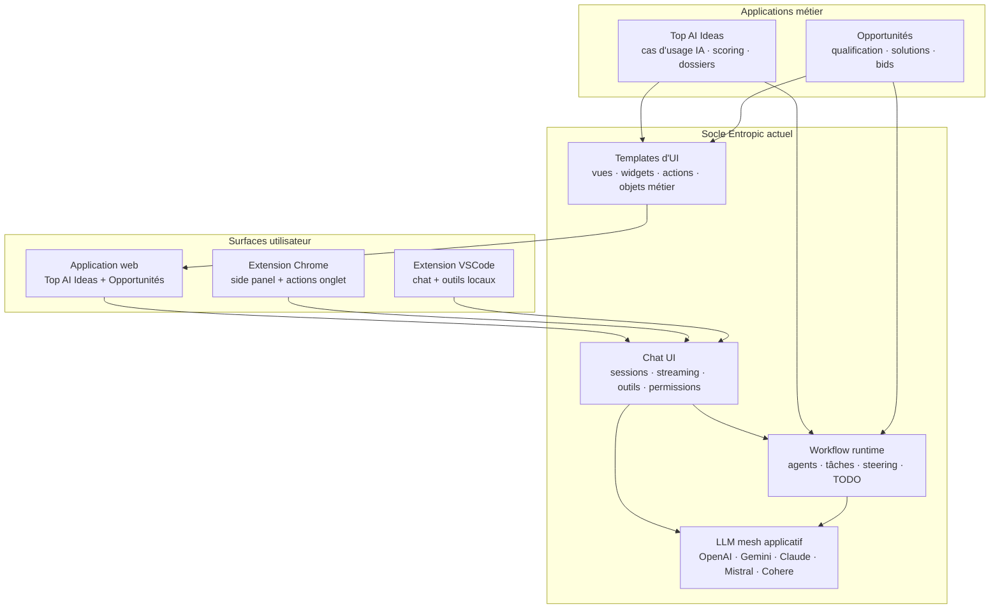
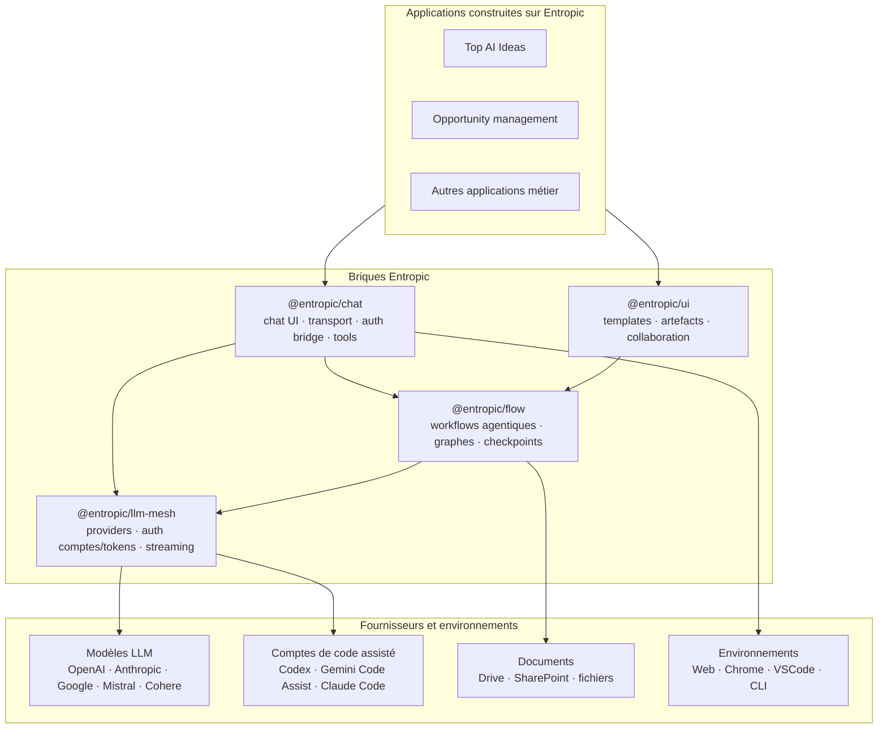

# Entropic

Site public : https://entropic.sent-tech.ca

Version anglaise : [README.md](README.md)

Plan de transition : [TRANSITION.md](TRANSITION.md)

Entropic est un socle open source pour construire des logiciels dont l'IA n'est pas un module ajouté après coup, mais une partie structurante de l'expérience : interface de chat, workflows agentiques, runtime multi-modèles, templates d'interface et applications métier générées ou assistées par IA.

Le projet part d'une conviction simple : avec l'accélération du développement assisté par agents, les organisations vont pouvoir reprendre la main sur une partie croissante de leur système logiciel. Au lieu d'empiler des SaaS fermés, elles pourront assembler, adapter et maintenir des outils plus proches de leurs processus réels.

Entropic explore cette direction de façon pragmatique : en construisant d'abord un produit réel, puis en extrayant progressivement les briques génériques qui le rendent possible.

## Pourquoi ce nom

Le nom Entropic renvoie d'abord à l'entropie au sens de Shannon : information, incertitude, compression, distribution de probabilité. C'est le vocabulaire mathématique dans lequel opèrent les modèles de langage, bien avant les marques et les interfaces qui les commercialisent.

Il assume aussi un clin d'oeil à Anthropic. Là où les grands laboratoires concentrent les modèles, les plateformes et l'accès, Entropic s'intéresse au mouvement inverse : redistribuer les briques, rendre les usages composables, documenter les interfaces, permettre à d'autres de les adapter.

Enfin, le nom fait écho à la "SaaSpocalypse" : l'idée que de nombreux logiciels de métier seront recomposés par des équipes plus petites, mieux outillées, capables de produire des systèmes spécifiques au lieu d'acheter des outils génériques et contraignants.

## Orientations

Nous partons de TypeScript et JavaScript parce que ce sont aujourd'hui les langages les plus proches du point de convergence entre interface, serveur, extension, automatisation et distribution. Ce choix est pratique avant d'être idéologique : il permet de relier rapidement un runtime, une UI, une extension navigateur, une extension IDE et des bibliothèques publiables.

Le projet vise à remplacer progressivement certaines briques de l'écosystème IA commercial : SDK de chat, runtime multi-LLM, workflows agentiques, outils de codage, connecteurs documentaires, templates d'interface et surfaces collaboratives autour d'objets générés par IA.

Les applications métier construites dessus peuvent être spécifiques, commerciales ou internes, mais le noyau doit rester inspectable, réutilisable et adaptable.

## Engagement

Le socle Entropic reste et restera open source et libre d'usage. Il vise à proposer un ensemble de fonctions permettant à chacun d'éviter les "god nodes" et le lock-in que le modèle SaaS à finalité lucrative produit par construction. Le but non lucratif est assumé, et la non-croissance du projet également.

## Où nous en sommes

Le premier terrain d'application est le conseil : Top AI Ideas pour l'identification et l'évaluation de cas d'usage IA, puis les workflows d'opportunité, de qualification, de proposition et de bid management.

Ces applications ne sont pas le projet lui-même. Elles servent à éprouver le socle dans des cas réels, avec des objets métier, des documents, des workflows, des utilisateurs, des droits, des exports et des contraintes opérationnelles.

## Ce qui est déjà en place

Entropic n'est pas seulement une intention d'architecture. Le dépôt contient déjà un produit utilisable et plusieurs briques de socle qui commencent à se détacher du cas métier initial.

### Chat UI

L'interface de chat existe déjà dans l'application web et sert de surface commune aux interactions avec les modèles, les outils, les contextes métier et les workflows. Elle gère les sessions, l'historique, le streaming, les appels d'outils, les permissions et les différents contextes de travail.

Deux extensions prolongent cette surface :

- une extension Chrome, capable d'exposer le chat en side panel et de permettre des actions contrôlées sur l'onglet courant ;
- une extension VSCode, qui embarque la même logique d'assistance dans l'environnement de développement, avec des outils locaux et une couche de permission.

BR-14a doit extraire cette surface en bibliothèque publiable, `@entropic/chat`, afin que le chat ne soit plus seulement un composant de Top AI Ideas mais une brique réutilisable.

### Workflow agentique

Le projet dispose déjà d'un runtime de workflows : agents configurables, définitions de workflows, tâches ordonnées, état d'exécution, TODO de pilotage et mécanismes de steering. Les workflows historiques de génération d'idées IA ont été généralisés vers un modèle multi-workflow par type d'espace de travail.

La trajectoire est de passer d'une orchestration métier encore partiellement liée aux premiers cas d'usage à un moteur plus générique : graphes de tâches, transitions explicites, fanout/join, checkpoints, reprises et interventions humaines.

Cette couche préfigure `@entropic/flow`.

### LLM mesh

Le runtime LLM supporte déjà plusieurs fournisseurs : OpenAI, Gemini, Claude, Mistral et Cohere selon les branches livrées. Il gère la sélection de modèles, les clés globales ou utilisateur, le streaming, les quotas, les retries et les différences de capacité entre fournisseurs.

Cette brique devient prioritaire dans la séquence BR-14 : avant d'extraire le chat, Entropic doit publier une première bibliothèque npm centrée sur l'accès aux modèles, `@entropic/llm-mesh`. L'objectif est un équivalent ouvert du Vercel AI SDK pour l'accès aux LLM : mêmes contrats côté application, fournisseurs interchangeables côté exécution, capacités explicites par modèle.

BR-14c porte cette extraction : OpenAI, Anthropic/Claude, Google/Gemini, Mistral et Cohere ; usage par token ou par compte Codex ; et préparation ultérieure des accès Gemini Code Assist et Claude Code. BR-14b devient le refactor interne qui migre le runtime applicatif sur cette abstraction.

### Templates d'UI

Entropic contient déjà un système de templates de vues. Les écrans ne sont plus uniquement pensés comme des composants codés en dur : certains objets métier peuvent être rendus via des descriptors de vues, avec des layouts, widgets, champs, actions et variantes par type d'espace de travail.

Cette logique est centrale pour la suite. Les objets générés ou enrichis par IA ne sont pas de simples blocs de texte : ce sont des artefacts structurés, éditables, comparables, exportables et parfois collaboratifs. Les templates d'UI doivent permettre de rendre ces objets sans reconstruire une interface spécifique à chaque nouveau cas métier.

### Business cases

Top AI Ideas est le premier business case : identifier, générer, évaluer et prioriser des cas d'usage IA pour une organisation. Il sert de terrain initial pour le chat, le runtime LLM, les matrices d'évaluation, les dossiers, les organisations, les exports et les workflows de génération.

Le deuxième axe est la gestion d'opportunités : qualification, solutions, produits, propositions, bids et gates de maturité. Ce cas sort Entropic du seul domaine "idées IA" et vérifie que le socle peut porter des processus métier plus génériques.

## Vue d'ensemble actuelle

## Architecture cible

La trajectoire consiste à extraire les briques génériques du produit actuel sans perdre le contact avec les usages réels.

La structure du dépôt suit le même principe. Les racines applicatives restent `api/` et `ui/` ; les bibliothèques Node réutilisables vivent dans `packages/*` et sont consommées via le workspace racine. La première activation réelle de cette fondation est `@entropic/llm-mesh` : BR-14c doit prouver que `api/` peut importer le package depuis le workspace avant que les extractions runtime et chat s'appuient dessus.

## Prochaines extractions

- **BR-14c** : extraire en priorité le LLM mesh en `@entropic/llm-mesh`, publié comme bibliothèque npm, avec OpenAI, Claude, Gemini, Mistral, Cohere, gestion par token ou compte Codex, et préparation des comptes Gemini Code Assist / Claude Code.
- **BR-14b** : refactorer le runtime LLM applicatif pour qu'il consomme cette abstraction provider-agnostic au lieu de rester un runtime interne monolithique.
- **BR-14a** : extraire la surface de chat en `@entropic/chat`, publiable et réutilisable hors de Top AI Ideas, en s'appuyant sur le contrat LLM mesh plutôt que sur les détails du runtime applicatif.
- **BR-16a** : connecter Google Drive en gardant les documents in situ, avec indexation des chunks et embeddings côté Entropic.
- **BR-07 / BR-07b** : préparer la publication npm et rapprocher le runtime de workflows d'une brique autonome comparable à LangGraph ou Temporal dans l'esprit, mais adaptée au projet.

Le point important est que chaque extraction doit rester reliée à un usage concret. Entropic ne cherche pas à accumuler des abstractions pour elles-mêmes : chaque brique est d'abord éprouvée dans une application réelle, puis rendue réutilisable.
