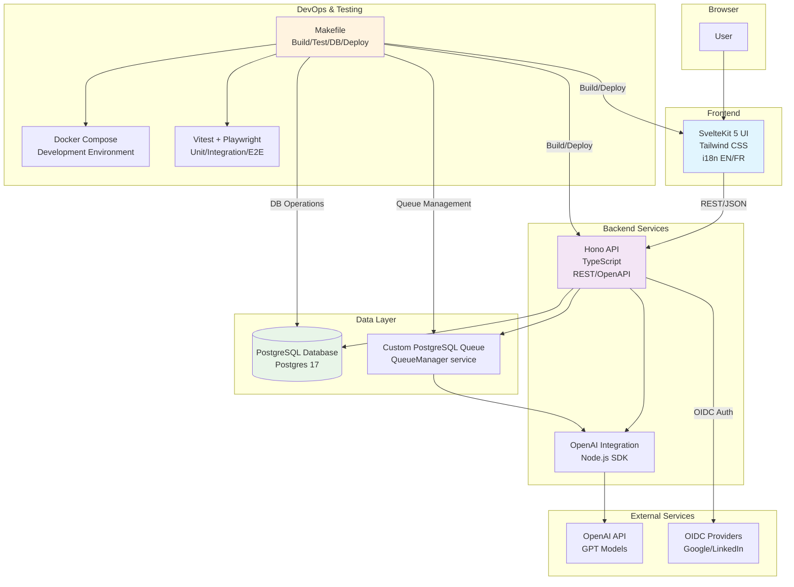

# Top AI Ideas

MANDATORY: read `.cursor/rules/MASTER.mdc` and follow the rules first.

**Un assistant à génération et évaluation de cas d'usage d'intelligence artificielle**

Top AI Ideas est une application web qui aide les organisations à identifier, générer et évaluer des cas d'usage d'IA pertinents pour leur activité. L'application utilise l'intelligence artificielle (OpenAI) pour générer automatiquement des propositions de cas d'usage détaillés, puis les évalue selon des critères de valeur métier et de complexité d'implémentation.

## Fonctionnalités principales

- **Génération automatique** : Création de cas d'usage d'IA via prompts intelligents et contextuels
- **Évaluation structurée** : Scoring automatique selon des matrices de valeur/complexité configurables
- **Gestion d'organisations** : Profils d'organisations pour contextualiser les générations
- **Organisation par dossiers** : Classification et organisation des cas d'usage par projet
- **Dashboard analytique** : Visualisation des cas d'usage avec graphiques de priorisation
- **Interface bilingue** : Support français et anglais (à venir)
- **Queue asynchrone** : Traitement en arrière-plan des générations IA

### Architecture globale (mermaid)




## Configuration

### Environment Variables

#### UI Configuration

The UI uses environment variables for configuration. These are set via Vite's `VITE_*` prefix:

##### `VITE_API_BASE_URL`

API backend base URL. The UI will make all API calls to this URL.

**Values by environment:**
- **Local development**: `http://localhost:8787/api/v1` (default fallback)
- **Docker Compose**: `http://api:8787/api/v1` (set in `docker-compose.yml`)
- **Production**: `https://top-ai-ideas-api.sent-tech.ca/api/v1` (set in GitHub Actions CI)

**Usage:**
```typescript
import { API_BASE_URL } from '$lib/config';
const response = await fetch(`${API_BASE_URL}/organizations`);
```

#### API Configuration

##### `CORS_ALLOWED_ORIGINS`

Comma-separated list of allowed origins for CORS. Supports wildcard subdomain patterns using `*`.

**Default value:**
```
http://localhost:5173,http://127.0.0.1:5173,http://ui:5173,https://*.sent-tech.ca
```

**Examples:**
- Exact match: `http://localhost:5173`
- Wildcard subdomain: `https://*.sent-tech.ca` (matches `https://app.sent-tech.ca`, `https://api.sent-tech.ca`, etc.)

**Production override:**
Set this environment variable in your deployment environment (e.g., Scaleway Container) to restrict CORS to production domains only:
```bash
CORS_ALLOWED_ORIGINS=https://*.sent-tech.ca,https://top-ai-ideas.sent-tech.ca
```

### Local Development

1. **Start with Docker Compose** (mandatory):
   ```bash
   make dev
   ```
   The `VITE_API_BASE_URL` is automatically configured in `docker-compose.yml`.

2. **Custom API URL**:
   Create `ui/.env.local` (gitignored):
   ```bash
   VITE_API_BASE_URL=http://custom-api:8787/api/v1
   ```

Native (non-Docker) development is not supported in this repo.

## Spécification technique

Pour les détails complets de la spécification technique, voir [spec/SPEC.md](spec/SPEC.md).

## Sécurité

### Authentification WebAuthn

L'application utilise l'authentification WebAuthn (passwordless) pour une sécurité renforcée :

- **Passkeys** : Support des credentials discoverables (passkeys) pour une expérience sans mot de passe
- **Vérification email obligatoire** : Code à 6 chiffres avec TTL 10 minutes avant enrôlement du device
- **Magic link fallback** : Uniquement pour réinitialisation de device (activation, pas de connexion directe)
- **Sessions sécurisées** : Cookies `HttpOnly`, `Secure`, `SameSite=Lax` avec tokens JWT
- **RBAC** : Hiérarchie de rôles (admin_app > admin_org > editor > guest) avec User Verification requise pour admins
- **Protection anti-replay** : Validation stricte des challenges WebAuthn avec TTL
- **Protection anti-cloning** : Vérification des compteurs de credentials
- **Rate limiting** : Protection contre les attaques par force brute sur tous les endpoints d'authentification

Pour plus de détails sur les workflows d'authentification, voir [spec/WORKFLOW_AUTH.md](spec/WORKFLOW_AUTH.md).

### Variables d'environnement sensibles

**Production (Scaleway Container Serverless) :**
- `JWT_SECRET` : Secret aléatoire fort (minimum 32 caractères) pour signer les tokens JWT
- `MAIL_PASSWORD` : Mot de passe SMTP (Brevo ou autre)
- `OPENAI_API_KEY` : Clé API OpenAI (si utilisée)
- `DATABASE_URL` : URL de connexion PostgreSQL avec credentials

**Configuration WebAuthn :**
- `WEBAUTHN_RP_ID` : Domaine Relying Party (ex: `sent-tech.com`)
- `WEBAUTHN_ORIGIN` : Origines autorisées (ex: `https://top-ai-ideas.sent-tech.com,https://top-ai-ideas-api.sent-tech.com`)

⚠️ **Important** : Ne jamais commiter ces variables dans le code source. Utiliser les secrets du gestionnaire de secrets (GitHub Secrets, Scaleway Secrets, etc.).

### Headers de sécurité

L'API applique automatiquement les headers de sécurité suivants :
- `Content-Security-Policy` (CSP)
- `Strict-Transport-Security` (HSTS)
- `Cross-Origin-Opener-Policy` (COOP)
- `Cross-Origin-Embedder-Policy` (COEP)
- `X-Content-Type-Options: nosniff`
- `X-Frame-Options: DENY`

### CORS

Configuration CORS stricte avec origines autorisées limitées. En production, configurer `CORS_ALLOWED_ORIGINS` pour n'autoriser que les domaines de production.

### Rate Limiting

Tous les endpoints d'authentification sont protégés par rate limiting pour prévenir les attaques par force brute :
- Email verification : Max 3 codes par email toutes les 10 minutes
- Login attempts : Limite configurable par IP
- API endpoints : Protection globale avec seuils configurables

## Projet

### Décisions actées

1. Authentification/ACL: **✅ Implémenté** - WebAuthn (passwordless) avec passkeys, vérification email obligatoire, magic link fallback pour réinitialisation. Sessions serveur en cookie HttpOnly avec JWT. RBAC avec hiérarchie de rôles.
2. Scores: calcul strictement côté serveur (source de vérité) selon 2.1.
3. OpenAI: gestion de quotas, retries exponentiels, limite de parallélisme configurable.
4. Historisation: versionner `matrix_config`, `use_cases` (timestamps, journaux d'audit), conserver les prompts utilisés.
5. Observabilité: logs structurés, tracing minimal, métriques basiques. Intégration Scaleway Logs possible.
6. **Queue SQLite**: Système de queue personnalisé avec QueueManager (pas de Redis/BullMQ).
7. Dashboard: endpoints d'agrégation dédiés (pré-normalisés) côté API.
8. i18n: FR + EN via `svelte-i18n`. FR par défaut.
9. Pas de SSR: build statique (ultra low-cost). UI = GitHub Pages.
10. **Tests**: Vitest pour UI/API, Playwright pour E2E, commandes Make pour orchestration.


### État d'avancement du projet

**✅ Étape 0 – Scaffolding (TERMINÉE)**
- Structure créée: `/ui` (SvelteKit 5 + adapter-static + svelte-i18n), `/api` (Hono + Drizzle + Zod), `Makefile`, `docker-compose.yml`, `Dockerfile.ui`, `Dockerfile.api`, `data/` (montage volume).

**✅ Étape 1 – Données & API (TERMINÉE)**
- Schéma PostgreSQL 17 avec migrations Drizzle.
- CRUD: organizations, folders (+ matrix_config), use_cases, settings, business_config, sessions, job_queue.
- Génération OpenAI (list/detail/folder) + `/use-cases/generate` (validation Zod, recalcul des scores).
- Queue basée sur PostgreSQL avec QueueManager pour jobs asynchrones.
- Agrégations Dashboard pré-normalisées.

**✅ Étape 2 – UI SvelteKit (TERMINÉE)**
- Pages implémentées: `Home`, `Folders`, `UseCaseList`, `UseCaseDetail`, `Matrix`, `Dashboard`, `Organizations`, `Settings`, `NotFound`.
- i18n FR/EN pour libellés UI.
- Navigation et stores fonctionnels.
- Refresh automatique des vues pendant traitement IA.

**✅ Étape 3 – Qualité/CI/CD (TERMINÉE)**
- Tests unitaires API (121 tests Vitest).
- Tests E2E (91/101 tests Playwright, 10 skipped).
- GitHub Actions pour CI/CD (build, test, deploy).
- Déploiement automatisé: UI → GitHub Pages, API → Scaleway Container Serverless.

**✅ Étape 4 – Authentification WebAuthn (TERMINÉE)**
- Authentification passwordless avec WebAuthn (passkeys/biométrie)
- Vérification email obligatoire avec code à 6 chiffres
- Magic link fallback pour réinitialisation de device
- Gestion multi-devices avec activation/révocation
- RBAC avec hiérarchie de rôles (admin_app > admin_org > editor > guest)
- Tests unitaires, intégration et E2E complets

**⏳ Étape 5 – Fonctionnalités manquantes**
- **À implémenter**: Pages `/configuration-metier` et `/donnees`.
- **À implémenter**: Backups automatisés PostgreSQL (partiellement fait via `make db-backup-prod`).


