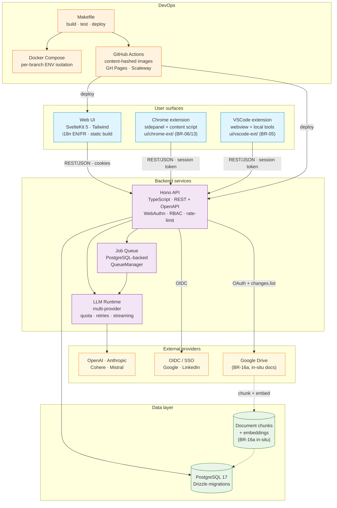
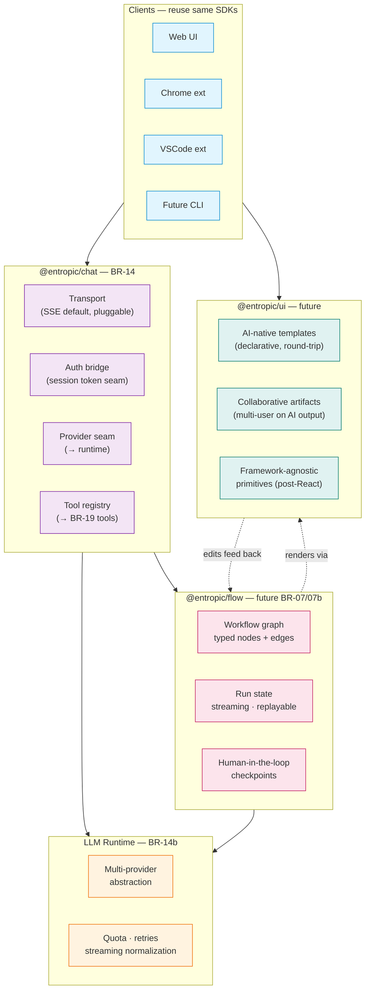

# Entropic

> **Heads-up — this PR renames the repo.** Until the GitHub rename of
> `rhanka/top-ai-ideas-fullstack` → `rhanka/entropic` lands and the in-code
> rename of `@top-ai/*` is dispatched across BR-14 / BR-14b, references to
> "top-ai" still appear in the codebase. See
> [`README.intent.md`](README.intent.md) for the founding intent, and
> [`PLAN.md`](PLAN.md) for the dispatch status.

**Entropic is a decentralized, open-source substrate for AI-coded software.**

> MANDATORY for contributors: read [`rules/MASTER.md`](rules/MASTER.md) and the
> companion rule files before opening any PR.

## What this is

Entropic is a working repository that doubles as:

1. **A progressively-growing replacement for the commercial AI ecosystem** —
   agentic workflows, AI SDKs, coding CLIs — rebuilt standalone, in open source,
   with no commercial telos.
2. **A platform for real consulting business cases** — AI/IT assessment,
   opportunity & bid management — running *on* the substrate as proof that it
   holds up under real workloads.
3. **A long-horizon bet** that agent coding makes it realistic for any company
   to build its own OS, its own AI stack, and its own tools — and that the
   software industry's next decade is entropic (dispersion), not consolidative.

The name carries three meanings, in order of seriousness:

- **Shannon entropy** — the mathematical substrate LLMs actually operate on.
- **A counter-positioning to Anthropic** — decentralized alternative to
  frontier-lab-as-platform.
- **A wink at the SaaSpocalypse** — the industry-wide refactor we're betting on.

Read [`README.intent.md`](README.intent.md) for the founding 10-point manifesto.

## Current state — what actually runs today

The repository currently hosts one working application — **Top AI Ideas** — a
consulting-facing tool that generates and evaluates AI use-cases for an
organization. Top AI Ideas is *one business case* running on the platform; it
is not the project.

What ships today:

- **UI** — SvelteKit 5 + Tailwind, static build, EN/FR i18n.
- **API** — Hono + Drizzle + Zod on Node 20, REST + OpenAPI.
- **Data** — PostgreSQL 17 with a custom PostgreSQL-backed job queue (no Redis).
- **AI** — multi-provider runtime around OpenAI / Anthropic / Cohere, quota and
  retry management.
- **Auth** — WebAuthn passkeys, email verification, magic-link fallback, RBAC.
- **Delivery** — UI on GitHub Pages, API on Scaleway Container Serverless,
  Docker-first dev environment, Make-only commands.

### System architecture — today

End-to-end picture: the three user surfaces (web UI, Chrome extension,
VSCode extension), the Hono API and LLM runtime, the PostgreSQL-backed data
layer, and the external AI / identity providers.


```mermaid
flowchart TB
    subgraph Surfaces["User surfaces"]
        WebUI["Web UI<br/>SvelteKit 5 · Tailwind<br/>i18n EN/FR · static build"]
        Chrome["Chrome extension<br/>sidepanel + content script<br/>ui/chrome-ext/ (BR-06/13)"]
        VSCode["VSCode extension<br/>webview + local tools<br/>ui/vscode-ext/ (BR-05)"]
    end

    subgraph Backend["Backend services"]
        API["Hono API<br/>TypeScript · REST + OpenAPI<br/>WebAuthn · RBAC · rate-limit"]
        Runtime["LLM Runtime<br/>multi-provider<br/>quota · retries · streaming"]
        Queue["Job Queue<br/>PostgreSQL-backed<br/>QueueManager"]
    end

    subgraph Data["Data layer"]
        DB[("PostgreSQL 17<br/>Drizzle migrations")]
        Docs[("Document chunks<br/>+ embeddings<br/>(BR-16a in-situ)")]
    end

    subgraph External["External providers"]
        LLMs["OpenAI · Anthropic<br/>Cohere · Mistral"]
        OIDC["OIDC / SSO<br/>Google · LinkedIn"]
        GDrive["Google Drive<br/>(BR-16a, in-situ docs)"]
    end

    subgraph DevOps["DevOps"]
        Make["Makefile<br/>build · test · deploy"]
        Compose["Docker Compose<br/>per-branch ENV isolation"]
        CI["GitHub Actions<br/>content-hashed images<br/>GH Pages · Scaleway"]
    end

    WebUI -->|REST/JSON · cookies| API
    Chrome -->|REST/JSON · session token| API
    VSCode -->|REST/JSON · session token| API

    API --> Runtime
    API --> DB
    API --> Queue
    Queue --> Runtime
    Runtime --> LLMs

    API -->|OIDC| OIDC
    API -->|OAuth + changes.list| GDrive
    GDrive -.->|chunk + embed| Docs
    Docs -.-> DB

    Make --> Compose
    Make --> CI
    CI -->|deploy| WebUI
    CI -->|deploy| API

    classDef surface fill:#e1f5fe,stroke:#0288d1
    classDef backend fill:#f3e5f5,stroke:#7b1fa2
    classDef data fill:#e8f5e8,stroke:#2e7d32
    classDef external fill:#fff8e1,stroke:#f57f17
    classDef devops fill:#fff3e0,stroke:#ef6c00
    class WebUI,Chrome,VSCode surface
    class API,Runtime,Queue backend
    class DB,Docs data
    class LLMs,OIDC,GDrive external
    class Make,Compose,CI devops
```

**Surface notes.**

- **Web UI** (`ui/`) — SvelteKit 5, static build, served on GitHub Pages in
  prod. All application features live here today.
- **Chrome extension** (`ui/chrome-ext/`) — MV3 sidepanel that hosts the chat
  surface against *any* web page, with a content script for in-page tool
  execution and a network bridge for upstream control. Packaged as a
  downloadable `.zip` (BR-13), upstream control shipped in BR-06.
- **VSCode extension** (`ui/vscode-ext/`) — webview hosting the same chat
  surface, with an auth bridge for session continuity, a stream proxy for
  model output, and local tools (file read / write / exec) governed by a
  permission layer. Packaged as `.vsix` (BR-05).

All three surfaces talk to the same API — the chat SDK extraction (BR-14) is
what lets them share the exact same client code, not just the same endpoints.

## Near-term scope — the ecosystem pieces, one brick at a time

The active engineering plan lives in [`PLAN.md`](PLAN.md). The agenda, in plain
language:

- **`@entropic/chat` — publishable chat SDK** (BR-14). The bar is "as well put
  together as the Vercel AI SDK", shipped as an npm library independent from
  the Top AI Ideas UI.
- **LLM runtime refactor** (BR-14b). Clean multi-provider abstraction so the
  chat SDK can be embedded in any project.
- **Document connectors** (BR-16a, BR-16b). Google Drive SSO with in-situ
  indexing first; SharePoint / OneDrive and generic abstraction next.
- **Agentic workflows** (BR-07 / BR-07b). A LangGraph-equivalent positioned for
  standalone publication.
- **UI templating for AI-generated interfaces** and collaborative work on
  AI-generated artifacts — new surface area, not yet broken out into branches.

Long horizon (not on any current wave): TypeScript OS primitives, a compiler,
and eventually an in-house LLM.

## Target architecture — workflows and AI-native UI

Two architectural pillars sit above the system described in the previous
section. Today they are partial (chat SDK in BR-14, runtime in BR-14b,
connectors in BR-16a); the diagram below sketches the steady-state they
converge towards.

### Workflow runtime — `@entropic/flow` (agentic graphs)

A LangGraph / Temporal equivalent published standalone. A workflow is a graph
of typed nodes (LLM call, tool call, human-in-the-loop, sub-workflow) with
explicit state, streaming events, and replayable runs. It drives the chat SDK
and is driven by it symmetrically — a chat turn is just one workflow type.

### AI-native UI templating — `@entropic/ui`

UI primitives designed from the ground up for AI generation and collaborative
editing of AI-generated artifacts. A template is declarative and
round-trippable: the model proposes structure, the UI renders it, edits flow
back into the same shape. Deliberately framework-agnostic (conviction: step
away from React), with a SvelteKit reference implementation.


```mermaid
flowchart TB
    subgraph Clients["Clients — reuse same SDKs"]
        WebC["Web UI"]
        ChromeC["Chrome ext"]
        VSCodeC["VSCode ext"]
        CLI["Future CLI"]
    end

    subgraph ChatSDK["@entropic/chat — BR-14"]
        Transport["Transport<br/>(SSE default, pluggable)"]
        AuthBridge["Auth bridge<br/>(session token seam)"]
        ProviderSeam["Provider seam<br/>(→ runtime)"]
        ToolReg["Tool registry<br/>(→ BR-19 tools)"]
    end

    subgraph Flow["@entropic/flow — future BR-07/07b"]
        Graph["Workflow graph<br/>typed nodes + edges"]
        State["Run state<br/>streaming · replayable"]
        HITL["Human-in-the-loop<br/>checkpoints"]
    end

    subgraph UI["@entropic/ui — future"]
        Tpl["AI-native templates<br/>(declarative, round-trip)"]
        Collab["Collaborative artifacts<br/>(multi-user on AI output)"]
        Primitives["Framework-agnostic<br/>primitives (post-React)"]
    end

    subgraph Runtime["LLM Runtime — BR-14b"]
        MultiLLM["Multi-provider<br/>abstraction"]
        Quota["Quota · retries<br/>streaming normalization"]
    end

    Clients --> ChatSDK
    Clients --> UI

    ChatSDK --> Flow
    ChatSDK --> Runtime
    Flow --> Runtime
    Flow -.->|renders via| UI
    UI -.->|edits feed back| Flow

    classDef clients fill:#e1f5fe,stroke:#0288d1
    classDef sdk fill:#f3e5f5,stroke:#7b1fa2
    classDef flow fill:#fce4ec,stroke:#c2185b
    classDef ui fill:#e0f2f1,stroke:#00796b
    classDef rt fill:#fff3e0,stroke:#ef6c00
    class WebC,ChromeC,VSCodeC,CLI clients
    class Transport,AuthBridge,ProviderSeam,ToolReg sdk
    class Graph,State,HITL flow
    class Tpl,Collab,Primitives ui
    class MultiLLM,Quota rt
```

**How it maps to active branches.**

- **BR-14** — extracts the web UI's chat into `@entropic/chat`, a publishable
  npm library with explicit seams (transport, auth, provider, tool registry).
  Benchmark: Vercel AI SDK. All three surfaces (web, Chrome, VSCode) switch
  to it.
- **BR-14b** — extracts the API's LLM runtime into the same namespace, so
  `@entropic/chat` can drive any backend that speaks the runtime's protocol.
  Blocked on the BR-14 handoff contract (seams defined in BR-14 scoping).
- **BR-07 / BR-07b** — `@entropic/flow`. Initial implementation is the chat
  request graph; expands to agentic graphs with tools, sub-workflows, and
  HITL checkpoints. Published alongside `@entropic/chat`.
- **BR-16a** — Google Drive SSO + in-situ indexing. Documents stay in Drive;
  only chunks + embeddings land in our DB. This is the first real consumer of
  the runtime's tool abstraction beyond LLM calls.
- **AI-native UI templating** — not yet a branch. Prior art from the Top AI
  Ideas matrix / dashboard feeds the design; the first target is a
  collaborative artifact surface for AI-generated assessment reports.

## Using the repo

### Dev environment

```bash
make dev         # Docker-first, starts UI + API + Postgres + MailDev
make down        # Stop everything
make ps-all      # Inspect running services across branch worktrees
```

Never run `npm`, `python`, or `docker` directly. All commands go through
`make`. Never set `ENV=...` as a shell prefix — it is always the *last*
argument to a `make` target.

### Branch isolation

Each active branch uses its own worktree under `tmp/<slug>/`, with its own
`ENV`, `API_PORT`, `UI_PORT`, and `MAILDEV_UI_PORT`. See
[`rules/workflow.md`](rules/workflow.md) and [`PLAN.md`](PLAN.md) §6 for the
port convention.

### Contributing

- Commits are atomic (`make commit MSG="..."`), under ~150 lines, with
  selective `git add` (never `git add .`).
- Every branch declares `Allowed Paths` / `Forbidden Paths` in its `BRANCH.md`,
  templated from [`plan/BRANCH_TEMPLATE.md`](plan/BRANCH_TEMPLATE.md).
- Full rule set: [`rules/MASTER.md`](rules/MASTER.md).

## Configuration reference

### UI

- `VITE_API_BASE_URL` — API backend base URL. Defaults to
  `http://localhost:8787/api/v1` locally; set in `docker-compose.yml` for
  Compose runs; set in CI for production.

### API

- `CORS_ALLOWED_ORIGINS` — comma-separated origin list, supports `*` subdomain
  wildcards (e.g. `https://*.sent-tech.ca`).
- `JWT_SECRET` — random 32+ chars for JWT signing.
- `DATABASE_URL` — PostgreSQL connection string.
- `OPENAI_API_KEY` / provider API keys — as needed by the LLM runtime.
- `WEBAUTHN_RP_ID`, `WEBAUTHN_ORIGIN` — WebAuthn relying-party config.
- `MAIL_PASSWORD` — SMTP password (Brevo or other).

Never commit these. Use the platform secrets manager (GitHub Secrets, Scaleway
Secrets).

## Security posture

- **Passkeys by default** — WebAuthn with discoverable credentials, email
  verification (6-digit code, 10-min TTL), magic-link fallback for device
  reset only.
- **Sessions** — `HttpOnly` / `Secure` / `SameSite=Lax` cookies with JWT.
- **RBAC hierarchy** — `admin_app > admin_org > editor > guest`, with User
  Verification required for admin actions.
- **Anti-replay & anti-cloning** — strict challenge TTL and credential-counter
  validation.
- **Rate limiting** — every auth endpoint; email verification capped at
  3 codes / email / 10 min.
- **Security headers** — CSP, HSTS, COOP, COEP, `X-Content-Type-Options`,
  `X-Frame-Options`.

Details: [`spec/WORKFLOW_AUTH.md`](spec/WORKFLOW_AUTH.md).

## Repository layout

- `ui/` — SvelteKit 5 application (Top AI Ideas front-end, soon `@entropic/chat`
  consumer).
- `api/` — Hono API and LLM runtime.
- `rules/` — engineering rules (MASTER + workflow + conductor + subagents +
  testing + security).
- `plan/` — active branch execution files and orchestration artifacts.
- `spec/` — technical specs per surface.
- `e2e/` — Playwright end-to-end tests.
- `docs/` — user-facing documentation.
- `tmp/` — per-branch worktrees (gitignored).

## License & intent

Open source. No commercial telos for the substrate itself. Business-case
surfaces (Top AI Ideas and successors) are separate products running on top.
See [`README.intent.md`](README.intent.md) for the founding manifesto.
