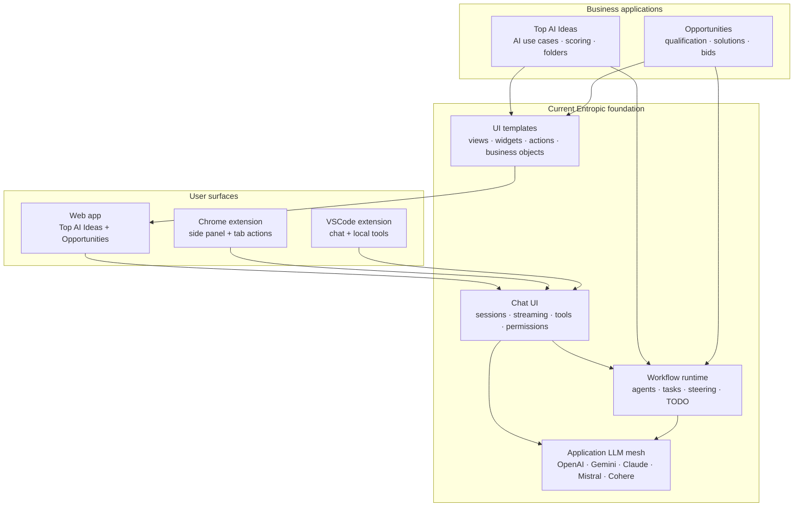
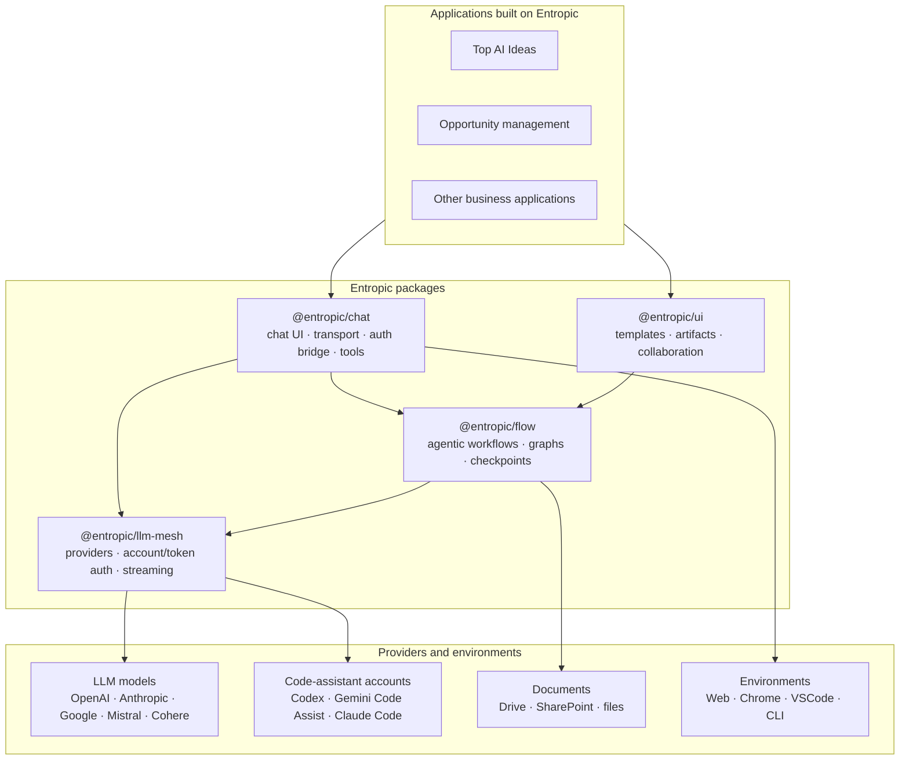

# Entropic

Public site: https://entropic.sent-tech.ca

French editorial reference: [README.fr.md](README.fr.md)

Transition plan: [TRANSITION.md](TRANSITION.md)

Entropic is an open-source foundation for building software where AI is not bolted on after the fact, but becomes a structural part of the experience: chat interfaces, agentic workflows, multi-model runtimes, UI templates, and business applications generated or assisted by AI.

The project starts from a simple conviction: as agent-assisted development accelerates, organizations will be able to reclaim a growing share of their software systems. Instead of stacking closed SaaS products, they will be able to assemble, adapt, and maintain tools that are closer to their real processes.

Entropic explores that direction pragmatically: by building a real product first, then progressively extracting the generic building blocks that make it possible.

## Why this name

The name Entropic first points to Shannon entropy: information, uncertainty, compression, probability distributions. This is the mathematical vocabulary language models operate in, long before the brands and interfaces that commercialize them.

It also carries a deliberate nod to Anthropic. Where the large labs concentrate models, platforms, and access, Entropic is interested in the opposite movement: redistributing building blocks, making usage composable, documenting interfaces, and letting others adapt them.

Finally, the name echoes the "SaaSpocalypse": the idea that many business software categories will be recomposed by smaller, better-tooled teams that can produce specific systems instead of buying generic and constraining tools.

## Direction

We start from TypeScript and JavaScript because they are currently the closest languages to the convergence point between interface, server, extension, automation, and distribution. This is a practical choice before it is an ideological one: it lets us connect a runtime, a UI, a browser extension, an IDE extension, and publishable libraries quickly.

The project aims to progressively replace selected pieces of the commercial AI ecosystem: chat SDKs, multi-LLM runtimes, agentic workflows, coding tools, document connectors, interface templates, and collaborative surfaces around AI-generated objects.

The business applications built on top may be specific, commercial, or internal, but the core must remain inspectable, reusable, and adaptable.

## Commitment

The Entropic foundation remains, and will remain, open source and free to use. It aims to provide a set of functions that lets people avoid the "god nodes" and lock-in that for-profit SaaS tends to produce by design. The non-profit purpose is explicit, and so is the non-growth posture of the project.

## Current state

The first application ground is consulting: Top AI Ideas for identifying and evaluating AI use cases, followed by opportunity, qualification, proposal, and bid-management workflows.

These applications are not the project itself. They are used to test the foundation in real cases, with business objects, documents, workflows, users, permissions, exports, and operational constraints.

## What already exists

Entropic is not only an architectural intention. This repository already contains a usable product and several foundation pieces that are starting to detach from the initial business case.

### Chat UI

The chat interface already exists in the web application and acts as the common surface for interactions with models, tools, business contexts, and workflows. It handles sessions, history, streaming, tool calls, permissions, and multiple work contexts.

Two extensions extend that surface:

- a Chrome extension that exposes the chat in a side panel and allows controlled actions on the current tab;
- a VSCode extension that embeds the same assistance logic in the development environment, with local tools and a permission layer.

BR-14a extracts this surface into a publishable library, `@entropic/chat`, so the chat is no longer only a Top AI Ideas component but a reusable building block.

### Agentic Workflow

The project already has a workflow runtime: configurable agents, workflow definitions, ordered tasks, execution state, steering TODOs, and steering mechanisms. The historical AI-idea generation workflows have been generalized into a multi-workflow model by workspace type.

The trajectory is to move from business orchestration that is still partly tied to the first use cases toward a more generic engine: task graphs, explicit transitions, fanout/join, checkpoints, resumability, and human interventions.

This layer prefigures `@entropic/flow`.

### LLM Mesh

The LLM runtime already supports several providers: OpenAI, Gemini, Claude, Mistral, and Cohere across the delivered branches. It handles model selection, global or user keys, streaming, quotas, retries, and capability differences between providers.

This piece now becomes the priority in the BR-14 sequence: before extracting the chat, Entropic should publish a first npm library centered on model access, `@entropic/llm-mesh`. The goal is an open equivalent to the Vercel AI SDK for LLM access: stable contracts on the application side, interchangeable providers on the execution side, explicit capabilities per model.

BR-14c owns that extraction: OpenAI, Anthropic/Claude, Google/Gemini, Mistral, and Cohere; token-based or Codex-account-based usage; and later preparation for Gemini Code Assist and Claude Code accounts. BR-14b becomes the internal refactor that migrates the application runtime onto this abstraction.

### UI Templates

Entropic already contains a view-template system. Screens are no longer only hard-coded components: some business objects can be rendered through view descriptors, with layouts, widgets, fields, actions, and variants by workspace type.

This logic is central to what comes next. AI-generated or AI-enriched objects are not just text blocks: they are structured, editable, comparable, exportable, and sometimes collaborative artifacts. UI templates should make it possible to render these objects without rebuilding a specific interface for every new business case.

### Business Cases

Top AI Ideas is the first business case: identifying, generating, evaluating, and prioritizing AI use cases for an organization. It is the initial testbed for chat, the LLM runtime, evaluation matrices, folders, organizations, exports, and generation workflows.

The second axis is opportunity management: qualification, solutions, products, proposals, bids, and maturity gates. This moves Entropic beyond "AI ideas" and verifies that the foundation can support more generic business processes.

## Current Overview

```mermaid
flowchart TB
    subgraph Surfaces["User surfaces"]
        Web["Web app<br/>Top AI Ideas + Opportunities"]
        Chrome["Chrome extension<br/>side panel + tab actions"]
        VSCode["VSCode extension<br/>chat + local tools"]
    end

    subgraph Core["Current Entropic foundation"]
        Chat["Chat UI<br/>sessions · streaming · tools · permissions"]
        Workflow["Workflow runtime<br/>agents · tasks · steering · TODO"]
        LLM["Application LLM mesh<br/>OpenAI · Gemini · Claude · Mistral · Cohere"]
        Templates["UI templates<br/>views · widgets · actions · business objects"]
    end

    subgraph Business["Business applications"]
        Ideas["Top AI Ideas<br/>AI use cases · scoring · folders"]
        Opps["Opportunities<br/>qualification · solutions · bids"]
    end

    Web --> Chat
    Chrome --> Chat
    VSCode --> Chat

    Chat --> Workflow
    Chat --> LLM
    Workflow --> LLM
    Templates --> Web

    Ideas --> Templates
    Opps --> Templates
    Ideas --> Workflow
    Opps --> Workflow
```

## Target Architecture

The trajectory is to extract generic building blocks from the current product without losing contact with real usage.

```mermaid
flowchart TB
    subgraph Apps["Applications built on Entropic"]
        TopAI["Top AI Ideas"]
        Opportunity["Opportunity management"]
        Future["Other business applications"]
    end

    subgraph Packages["Entropic packages"]
        EntropicMesh["@entropic/llm-mesh<br/>providers · account/token auth · streaming"]
        EntropicChat["@entropic/chat<br/>chat UI · transport · auth bridge · tools"]
        EntropicFlow["@entropic/flow<br/>agentic workflows · graphs · checkpoints"]
        EntropicUI["@entropic/ui<br/>templates · artifacts · collaboration"]
    end

    subgraph Providers["Providers and environments"]
        Models["LLM models<br/>OpenAI · Anthropic · Google · Mistral · Cohere"]
        CodeAssist["Code-assistant accounts<br/>Codex · Gemini Code Assist · Claude Code"]
        Docs["Documents<br/>Drive · SharePoint · files"]
        DevTools["Environments<br/>Web · Chrome · VSCode · CLI"]
    end

    Apps --> EntropicChat
    Apps --> EntropicUI
    EntropicChat --> EntropicFlow
    EntropicChat --> EntropicMesh
    EntropicFlow --> EntropicMesh
    EntropicUI --> EntropicFlow
    EntropicMesh --> Models
    EntropicMesh --> CodeAssist
    EntropicFlow --> Docs
    EntropicChat --> DevTools
```

## Next Extractions

- **BR-14c**: extract the LLM mesh first as `@entropic/llm-mesh`, published as an npm library, with OpenAI, Claude, Gemini, Mistral, Cohere, token or Codex-account usage, and preparation for Gemini Code Assist / Claude Code accounts.
- **BR-14b**: refactor the application LLM runtime so it consumes this provider-agnostic abstraction instead of remaining a monolithic internal runtime.
- **BR-14a**: extract the chat surface into `@entropic/chat`, publishable and reusable outside Top AI Ideas, built on the LLM mesh contract rather than the details of the application runtime.
- **BR-16a**: connect Google Drive while keeping documents in situ, with chunk indexing and embeddings stored by Entropic.
- **BR-07 / BR-07b**: prepare npm publication and move the workflow runtime toward a standalone building block comparable in spirit to LangGraph or Temporal, but adapted to this project.

The important point is that each extraction must remain connected to concrete usage. Entropic is not trying to accumulate abstractions for their own sake: every building block is first tested in a real application, then made reusable.
