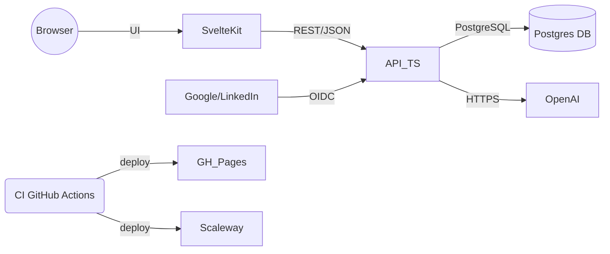

# Top AI Ideas

MANDATORY: va lire .cursor/rules/MASTER.mdc et suis les instructions avant tout

**Un assistant à génération et évaluation de cas d'usage d'intelligence artificielle**

Top AI Ideas est une application web qui aide les entreprises à identifier, générer et évaluer des cas d'usage d'IA pertinents pour leur activité. L'application utilise l'intelligence artificielle (OpenAI) pour générer automatiquement des propositions de cas d'usage détaillés, puis les évalue selon des critères de valeur métier et de complexité d'implémentation.

## Fonctionnalités principales

- **Génération automatique** : Création de cas d'usage d'IA via prompts intelligents et contextuels
- **Évaluation structurée** : Scoring automatique selon des matrices de valeur/complexité configurables
- **Gestion d'entreprises** : Profils d'entreprises pour contextualiser les générations
- **Organisation par dossiers** : Classification et organisation des cas d'usage par projet
- **Dashboard analytique** : Visualisation des cas d'usage avec graphiques de priorisation
- **Interface bilingue** : Support français et anglais (à venir)
- **Queue asynchrone** : Traitement en arrière-plan des générations IA

### Architecture globale (mermaid)

## Spécification technique

Pour les détails complets de la spécification technique, voir [SPEC.md](SPEC.md).

## Projet

### Décisions actées

1. Authentification/ACL: **À implémenter** - OIDC Google et LinkedIn. Sessions serveur en cookie HttpOnly.
2. Scores: calcul strictement côté serveur (source de vérité) selon 2.1.
3. OpenAI: gestion de quotas, retries exponentiels, limite de parallélisme configurable.
4. Historisation: versionner `matrix_config`, `use_cases` (timestamps, journaux d'audit), conserver les prompts utilisés.
5. Observabilité: logs structurés, tracing minimal, métriques basiques. Intégration Scaleway Logs possible.
6. **Queue SQLite**: Système de queue personnalisé avec QueueManager (pas de Redis/BullMQ).
7. Dashboard: endpoints d'agrégation dédiés (pré-normalisés) côté API.
8. i18n: FR + EN via `svelte-i18n`. FR par défaut.
9. Pas de SSR: build statique (ultra low-cost). UI = GitHub Pages.
10. **Tests**: Vitest pour UI/API, Playwright pour E2E, commandes Make pour orchestration.

### État d'avancement du projet

**✅ Étape 0 – Scaffolding (TERMINÉE)**
- Structure créée: `/ui` (SvelteKit 5 + adapter-static + svelte-i18n), `/api` (Hono + Drizzle + Zod), `Makefile`, `docker-compose.yml`, `Dockerfile.ui`, `Dockerfile.api`, `data/` (montage volume).

**✅ Étape 1 – Données & API (TERMINÉE)**
- Schéma PostgreSQL 16 avec migrations Drizzle.
- CRUD: companies, folders (+ matrix_config), use_cases, settings, business_config, sessions, job_queue.
- Génération OpenAI (list/detail/folder) + `/use-cases/generate` (validation Zod, recalcul des scores).
- Queue basée sur Postgres avec QueueManager pour jobs asynchrones.
- Agrégations Dashboard pré-normalisées.

**✅ Étape 2 – UI SvelteKit (TERMINÉE)**
- Pages implémentées: `Home`, `Folders`, `UseCaseList`, `UseCaseDetail`, `Matrix`, `Dashboard`, `Companies`, `Settings`, `NotFound`.
- i18n FR/EN pour libellés UI.
- Navigation et stores fonctionnels.
- Refresh automatique des vues pendant traitement IA.

**✅ Étape 3 – Qualité/CI/CD (TERMINÉE)**
- Tests unitaires API (121 tests Vitest).
- Tests E2E (91/101 tests Playwright, 10 skipped).
- GitHub Actions pour CI/CD (build, test, deploy).
- Déploiement automatisé: UI → GitHub Pages, API → Scaleway Container Serverless.

**⏳ Étape 4 – Fonctionnalités manquantes**
- **À implémenter**: Auth OIDC Google/LinkedIn.
- **À implémenter**: Pages `/configuration-metier` et `/donnees`.
- **À implémenter**: Backups automatisés Postgres.

