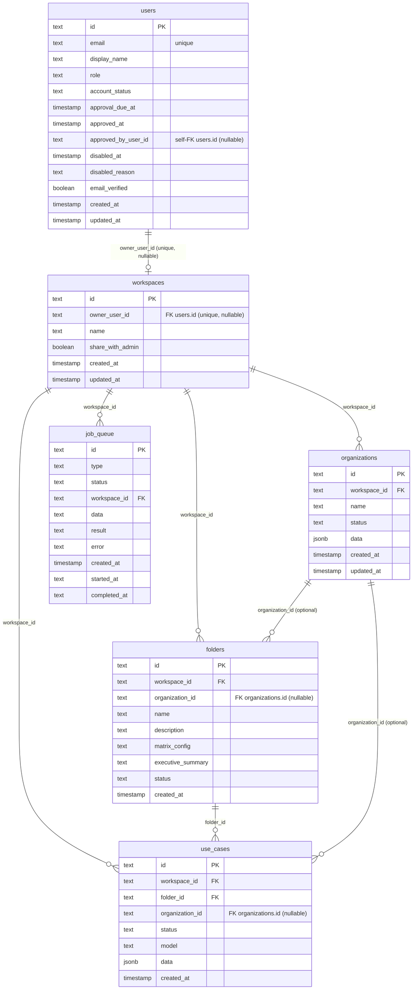
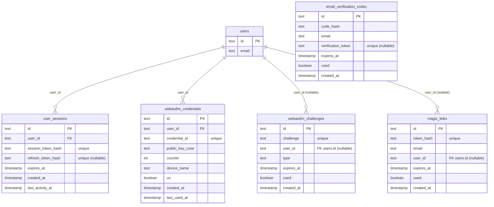
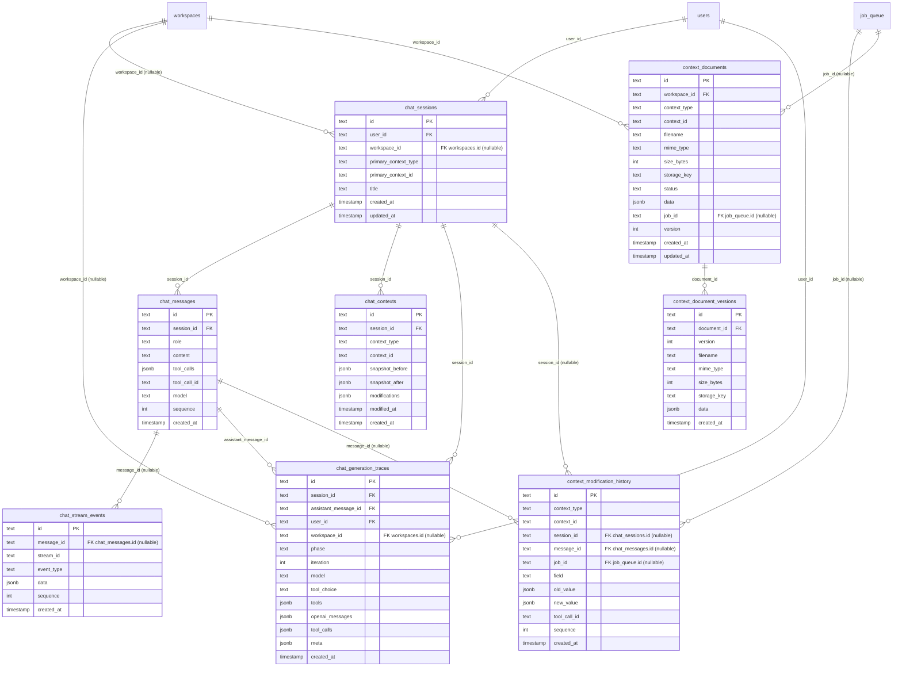
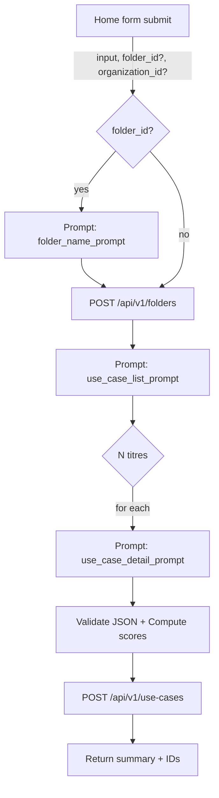
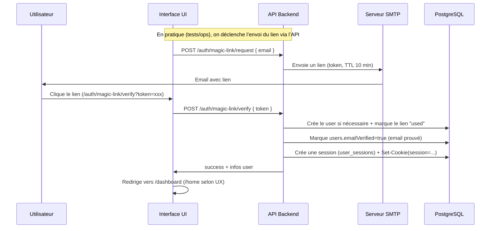
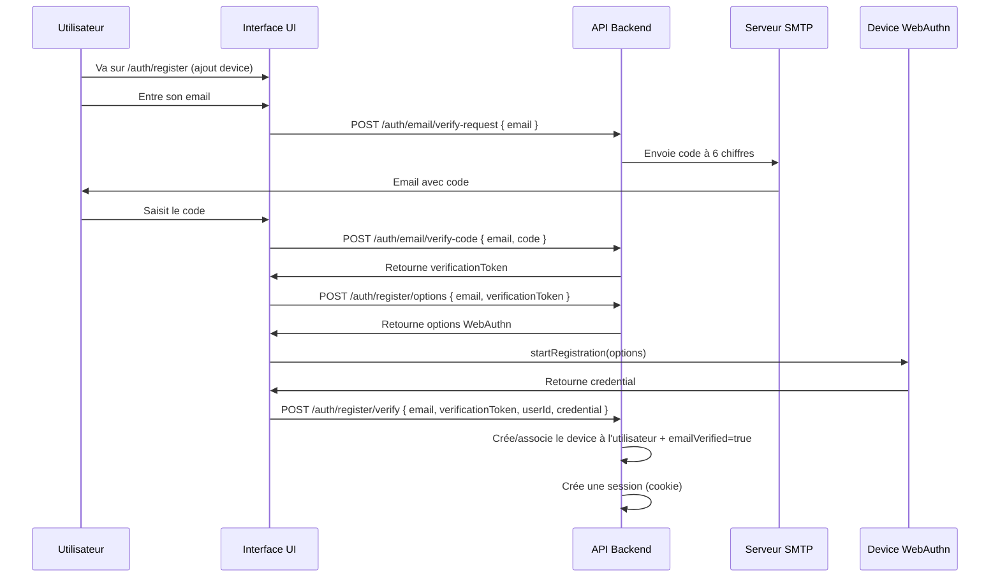
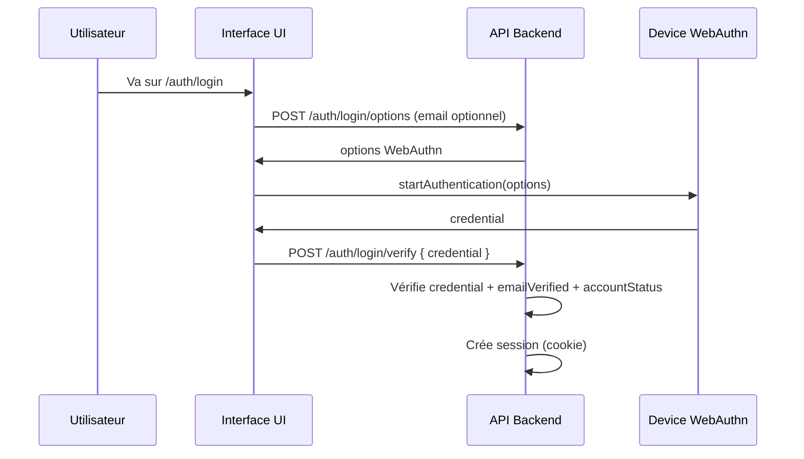
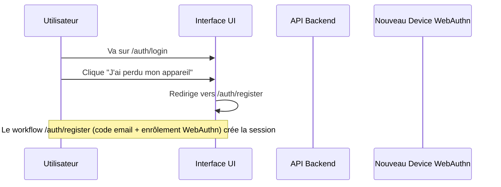
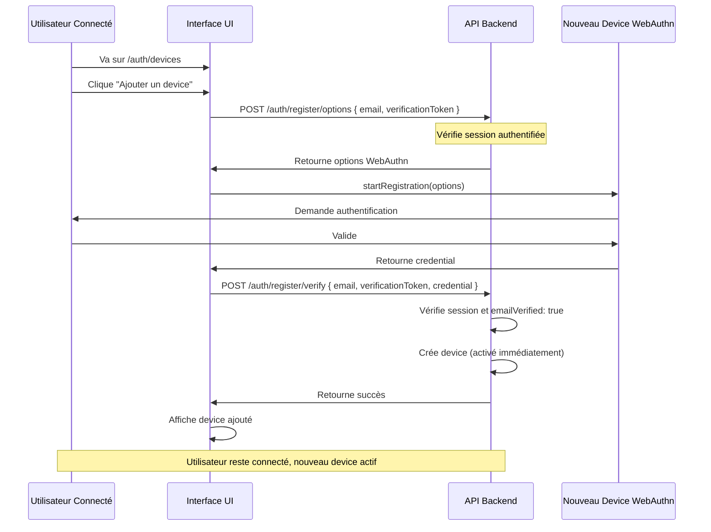

# Modèle de données (PostgreSQL 16 / Drizzle)

Source de vérité : `api/src/db/schema.ts` (Drizzle).  
Conventions : tables en `snake_case`, clés primaires `text` (UUID string), multi-tenant via `workspace_id` (private-by-default).

## Vue d’ensemble (tenancy + objets métier)



Notes :
- `organizations.data` est **JSONB** (profil organisation : `industry`, `size`, `products`, `processes`, `kpis`, `references`, etc.).
- `use_cases.data` est **JSONB** (contient `name`, `description`, scores, etc. – migration 0008).
- `workspaces.owner_user_id` est **unique mais nullable** (Postgres autorise plusieurs `NULL`).

## Prompts (état actuel vs cible)

### État actuel (implémenté)

- Il n’y a **pas** de tables `prompts` / `prompt_versions` dans `api/src/db/schema.ts`.
- Les prompts sont stockés dans `settings` (table `settings`) dans une valeur text (souvent JSON) — ex: `settings.key = 'prompts'` ou via une structure équivalente côté API.

Conséquence :
- La traçabilité “prompt/version” dans le chat et les générations est **partielle** : certaines colonnes existent (`chat_messages.prompt_id`, `chat_messages.prompt_version_id`, `context_modification_history.prompt_id|prompt_version_id|prompt_type`) mais ne pointent pas vers des tables relationnelles aujourd’hui.

### Cible (non implémentée)

À terme, on pourra normaliser avec :
- `prompts` (définition logique)
- `prompt_versions` (versioning, contenu, variables, auteur)

et rendre les références réellement relationnelles (`FK`) depuis `chat_messages` / `context_modification_history` / (éventuellement) une table de runs structurés.

## Auth (sessions, WebAuthn, magic link, codes email)



## Chat / streaming / tracing



Notes :
- `context_modification_history.context_type/context_id` sont des **références logiques** (pas de FK DB) vers `organizations/folders/use_cases` (et `folders` pour `executive_summary`).
- `chat_stream_events.message_id` est nullable : les appels structurés utilisent `stream_id` déterministe (`folder_<id>`, `usecase_<id>`, etc.).
- `context_documents.context_type/context_id` sont des **références logiques** (pas de FK DB) vers `organizations/folders/use_cases`.


# Rapport d'analyse : Rendu JSON en streaming

## Contexte

L'objectif est d'afficher les JSONs (arguments de tool calls et réponses structurées) de manière formatée et lisible pendant le streaming, tout en gérant les JSONs incomplets/invalides qui apparaissent naturellement pendant le streaming.

## État actuel

### Rendu actuel
- **Fichier** : `ui/src/lib/components/StreamMessage.svelte`
- **Méthode** : Texte brut avec `whitespace-pre-wrap`
- **Zones concernées** :
  - `st.toolArgsById[toolId]` : Arguments JSON des tool calls (streaming via `tool_call_delta`)
  - `st.contentText` : Réponses structurées (potentiellement JSON)
  - `step.body` : Corps des étapes (peut contenir des JSONs)

### Problématique principale

**JSON incomplet/invalide pendant le streaming** :
- Pendant le streaming, le JSON est construit progressivement
- Exemple : `{"useCaseId": "123", "updates": [` → JSON invalide
- `JSON.parse()` échoue sur des JSONs incomplets
- Affichage brut = illisible pour des JSONs complexes

**Exemples de JSONs partiels** :
```json
// Étape 1 : {"useCaseId"
// Étape 2 : {"useCaseId": "123"
// Étape 3 : {"useCaseId": "123", "updates": [
// Étape 4 : {"useCaseId": "123", "updates": [{"path": "description"
// Étape 5 : {"useCaseId": "123", "updates": [{"path": "description", "value": "..."}]}
```

## Analyse technique

### 1. Problème du JSON incomplet

**Fonctionnement de `JSON.parse()`** :
- Parse uniquement des JSONs **valides et complets**
- Lance une exception `SyntaxError` sur JSON incomplet
- Ne peut pas parser progressivement

**Impact sur le streaming** :
- Impossible d'utiliser `JSON.parse()` pendant le streaming
- Affichage brut = illisible pour JSONs complexes
- Besoin d'une stratégie de "best-effort" parsing

### 2. Fréquence des updates

**Estimation** :
- Deltas tool_call : ~10-50ms entre chaque delta
- Taille typique d'un delta : 1-20 caractères
- Taille finale typique d'un JSON tool call : 100-2000 caractères
- Nombre de deltas pour un JSON complet : 10-100

**Impact** :
- **10-100 tentatives de parsing** pour un JSON complet
- Chaque tentative = validation + formatage (si valide)

### 3. Types de JSONs à gérer

**1. Arguments de tool calls** (`tool_call_delta`) :
```json
{
  "useCaseId": "abc123",
  "updates": [
    {"path": "description", "value": "Nouvelle description"},
    {"path": "problem", "value": "Nouveau problème"}
  ]
}
```

**2. Réponses structurées** (`content_delta`) :
```json
{
  "status": "completed",
  "results": [
    {"url": "https://...", "content": "..."}
  ]
}
```

**3. Erreurs JSON** :
```json
{
  "status": "error",
  "error": "Use case not found"
}
```

## Options proposées

### Option 1 : Formatage JSON simple avec try/catch

**Implémentation** :
```svelte
function formatJsonSafely(text: string): string {
  try {
    const parsed = JSON.parse(text);
    return JSON.stringify(parsed, null, 2);
  } catch {
    // JSON incomplet : retourner tel quel ou avec indication
    return text + ' ⏳';
  }
}

$: formattedToolArgs = Object.entries(st.toolArgsById).map(([id, args]) => ({
  id,
  formatted: formatJsonSafely(args)
}));
```

**Avantages** :
- ✅ Simple à implémenter (5-10 lignes)
- ✅ Formatage automatique quand JSON valide
- ✅ Pas de crash sur JSON incomplet

**Inconvénients** :
- ❌ Pas de formatage pendant le streaming (JSON invalide)
- ❌ Affichage brut jusqu'à ce que JSON soit complet
- ❌ Indicateur visuel minimal (⏳)

**Performance estimée** :
- CPU : Faible (1 parse par delta, échoue rapidement si invalide)
- DOM : Updates fréquents (chaque delta)
- UX : Formatage seulement à la fin

**Recommandation** : ⚠️ **Acceptable mais UX limitée**

---

### Option 2 : Parser JSON partiel (best-effort)

**Implémentation** :
```svelte
function formatJsonPartial(text: string): string {
  // Essayer de parser le JSON complet
  try {
    const parsed = JSON.parse(text);
    return JSON.stringify(parsed, null, 2);
  } catch {
    // JSON incomplet : essayer de formater ce qui est valide
    // Exemple : {"key": "val → {"key": "val
    // On peut au moins indenter les parties valides
    return formatPartialJson(text);
  }
}

function formatPartialJson(text: string): string {
  // Algorithme simple : indent selon niveau de nesting
  let indent = 0;
  let result = '';
  let inString = false;
  
  for (let i = 0; i < text.length; i++) {
    const char = text[i];
    const prev = text[i - 1];
    
    if (char === '"' && prev !== '\\') inString = !inString;
    if (inString) {
      result += char;
      continue;
    }
    
    if (char === '{' || char === '[') {
      result += char + '\n' + '  '.repeat(++indent);
    } else if (char === '}' || char === ']') {
      indent = Math.max(0, indent - 1);
      result += '\n' + '  '.repeat(indent) + char;
    } else if (char === ',') {
      result += ',\n' + '  '.repeat(indent);
    } else if (char === ':') {
      result += ': ';
    } else {
      result += char;
    }
  }
  
  return result;
}
```

**Avantages** :
- ✅ Formatage progressif même sur JSON incomplet
- ✅ Meilleure lisibilité pendant le streaming
- ✅ Indentation basique même si JSON invalide

**Inconvénients** :
- ❌ Complexité modérée (algorithme de parsing partiel)
- ❌ Peut produire des indentations incorrectes
- ❌ Nécessite gestion des cas edge (strings, échappements)

**Performance estimée** :
- CPU : Modéré (parsing caractère par caractère)
- DOM : Updates fréquents mais formatage visible
- UX : Formatage visible pendant streaming

**Recommandation** : ✅ **Bon compromis complexité/UX**

---

### Option 3 : Buffer avec formatage différé (debounce)

**Implémentation** :
```svelte
let bufferedToolArgs: Record<string, string> = {};
let formattedToolArgs: Record<string, string> = {};
let formatTimeout: ReturnType<typeof setTimeout> | null = null;

$: {
  bufferedToolArgs = st.toolArgsById;
  // Debounce : attendre 300ms sans update avant de formater
  if (formatTimeout) clearTimeout(formatTimeout);
  formatTimeout = setTimeout(() => {
    formattedToolArgs = {};
    for (const [id, args] of Object.entries(bufferedToolArgs)) {
      try {
        const parsed = JSON.parse(args);
        formattedToolArgs[id] = JSON.stringify(parsed, null, 2);
      } catch {
        // JSON incomplet : essayer formatage partiel
        formattedToolArgs[id] = formatPartialJson(args) + ' ⏳';
      }
    }
    formatTimeout = null;
  }, 300);
}
```

**Avantages** :
- ✅ Réduit les re-renders (10-100 → ~5-10)
- ✅ Formatage visible pendant streaming (avec délai)
- ✅ Combine Option 1 + Option 2
- ✅ Moins de blink

**Inconvénients** :
- ❌ Délai de 300ms avant formatage
- ❌ Complexité modérée (debounce + parsing)
- ❌ Nécessite gestion des timeouts

**Performance estimée** :
- CPU : Faible (10x moins de formatages)
- DOM : Blink minimal (updates <1Hz)
- UX : Formatage visible avec délai acceptable

**Recommandation** : ✅ **Meilleur compromis pour production**

---

### Option 4 : Bibliothèque de JSON streaming

**Bibliothèques candidates** :
- `json-stream-stringify` : Streaming JSON stringify
- `stream-json` : Parse JSON en streaming
- `oboe` : JSON streaming parser

**Implémentation** :
```svelte
import { StreamParser } from 'stream-json';

let parser = new StreamParser();

$: {
  parser.write(st.toolArgsById[toolId]);
  const formatted = parser.getFormatted();
  // ...
}
```

**Avantages** :
- ✅ Conçu pour le streaming JSON
- ✅ Gestion native des JSONs incomplets
- ✅ Performance optimale

**Inconvénients** :
- ❌ Nouvelle dépendance (maintenance, taille bundle)
- ❌ Peut nécessiter adaptation à notre architecture
- ❌ Complexité d'intégration

**Performance estimée** :
- CPU : Optimal (parsing streaming natif)
- DOM : Selon implémentation
- Maintenance : Risque (dépendance externe)

**Recommandation** : ⚠️ **À évaluer si Option 2/3 ne suffisent pas**

---

### Option 5 : Rendu hybride (texte brut → JSON formaté final)

**Implémentation** :
```svelte
$: isTerminal = isTerminalStatus(status);
$: formattedToolArgs = isTerminal
  ? Object.entries(st.toolArgsById).reduce((acc, [id, args]) => {
      try {
        const parsed = JSON.parse(args);
        acc[id] = JSON.stringify(parsed, null, 2);
      } catch {
        acc[id] = args; // Fallback brut si invalide
      }
      return acc;
    }, {} as Record<string, string>)
  : {};

{#each Object.entries(st.toolArgsById) as [id, args]}
  {#if isTerminal && formattedToolArgs[id]}
    <pre class="json-formatted">{formattedToolArgs[id]}</pre>
  {:else}
    <pre class="json-raw">{args}</pre>
  {/if}
{/each}
```

**Avantages** :
- ✅ Pas de parsing pendant streaming (performance optimale)
- ✅ JSON formaté à la fin (meilleure lisibilité)
- ✅ Simple à implémenter
- ✅ Pas de blink (pas de remplacement pendant streaming)

**Inconvénients** :
- ❌ Pas de formatage pendant le streaming (texte brut)
- ❌ Transition visuelle à la fin (brut → formaté)
- ❌ Moins "fluide" visuellement

**Performance estimée** :
- CPU : Optimal (0 parsing pendant streaming)
- DOM : Pas de blink (pas de remplacement)
- UX : Formatage seulement à la fin

**Recommandation** : ✅ **Excellent pour performance, UX acceptable**

---

### Option 6 : Syntax highlighting avec highlight.js ou Prism

**Implémentation** :
```svelte
import hljs from 'highlight.js/lib/core';
import json from 'highlight.js/lib/languages/json';

hljs.registerLanguage('json', json);

function formatJsonWithHighlight(text: string, isComplete: boolean): string {
  if (isComplete) {
    try {
      const parsed = JSON.parse(text);
      const formatted = JSON.stringify(parsed, null, 2);
      return hljs.highlight(formatted, { language: 'json' }).value;
    } catch {
      return hljs.highlight(text, { language: 'json' }).value;
    }
  } else {
    // JSON incomplet : highlight basique
    return hljs.highlight(text, { language: 'json' }).value;
  }
}
```

**Avantages** :
- ✅ Coloration syntaxique professionnelle
- ✅ Meilleure lisibilité (couleurs pour clés, valeurs, strings)
- ✅ Support des JSONs incomplets (highlight basique)

**Inconvénients** :
- ❌ Nouvelle dépendance (`highlight.js` ~50KB minifié)
- ❌ Coût CPU pour highlight (modéré)
- ❌ Nécessite styles CSS additionnels

**Performance estimée** :
- CPU : Modéré (highlight à chaque update)
- DOM : Blink possible selon fréquence
- UX : Excellente lisibilité

**Recommandation** : ⚠️ **Optionnel, à combiner avec Option 2 ou 3**

---

## Recommandation finale

### Pour les arguments de tool calls (`st.toolArgsById`)

**Option recommandée** : **Option 3 (Buffer avec debounce) + Option 6 (Syntax highlighting optionnel)**

**Justification** :
- Les tool calls sont souvent des JSONs complexes (arrays, objets imbriqués)
- Le formatage améliore drastiquement la lisibilité
- Le debounce de 300ms réduit les re-renders (10-100 → ~5-10)
- Le syntax highlighting améliore encore la lisibilité (optionnel)

**Implémentation** :
```svelte
let formattedToolArgs: Record<string, string> = {};
let formatTimeout: ReturnType<typeof setTimeout> | null = null;

function formatJsonSafely(text: string): string {
  try {
    const parsed = JSON.parse(text);
    return JSON.stringify(parsed, null, 2);
  } catch {
    // JSON incomplet : formatage partiel basique
    return formatPartialJson(text) + ' ⏳';
  }
}

function formatPartialJson(text: string): string {
  // Algorithme simple d'indentation
  let indent = 0;
  let result = '';
  let inString = false;
  
  for (let i = 0; i < text.length; i++) {
    const char = text[i];
    const prev = text[i - 1];
    
    if (char === '"' && prev !== '\\') inString = !inString;
    if (inString) {
      result += char;
      continue;
    }
    
    if (char === '{' || char === '[') {
      result += char + '\n' + '  '.repeat(++indent);
    } else if (char === '}' || char === ']') {
      indent = Math.max(0, indent - 1);
      result += '\n' + '  '.repeat(indent) + char;
    } else if (char === ',') {
      result += ',\n' + '  '.repeat(indent);
    } else if (char === ':') {
      result += ': ';
    } else {
      result += char;
    }
  }
  
  return result;
}

$: {
  if (formatTimeout) clearTimeout(formatTimeout);
  formatTimeout = setTimeout(() => {
    formattedToolArgs = {};
    for (const [id, args] of Object.entries(st.toolArgsById)) {
      formattedToolArgs[id] = formatJsonSafely(args);
    }
    formatTimeout = null;
  }, 300);
}

onDestroy(() => {
  if (formatTimeout) clearTimeout(formatTimeout);
});
```

**Affichage** :
```svelte
{#each Object.entries(st.toolArgsById) as [id, args]}
  <div class="tool-args">
    <pre class="json-content language-json">
      {formattedToolArgs[id] || args}
    </pre>
  </div>
{/each}
```

### Pour les réponses structurées (`st.contentText`)

**Option recommandée** : **Option 5 (Hybride) - Détection automatique JSON**

**Justification** :
- Les réponses peuvent être JSON ou texte/markdown
- Détection automatique : si JSON valide → formater, sinon → markdown/texte
- Formatage seulement à la fin (performance optimale)
- Pas de parsing pendant streaming

**Implémentation** :
```svelte
function isJsonContent(text: string): boolean {
  const trimmed = text.trim();
  return (
    (trimmed.startsWith('{') && trimmed.endsWith('}')) ||
    (trimmed.startsWith('[') && trimmed.endsWith(']'))
  );
}

function formatJsonIfValid(text: string): string | null {
  if (!isJsonContent(text)) return null;
  try {
    const parsed = JSON.parse(text);
    return JSON.stringify(parsed, null, 2);
  } catch {
    return null; // JSON invalide ou incomplet
  }
}

$: isTerminal = isTerminalStatus(status);
$: contentJson = isTerminal && st.contentText
  ? formatJsonIfValid(st.contentText)
  : null;
```

**Affichage** :
```svelte
{#if contentJson}
  <pre class="json-formatted">{contentJson}</pre>
{:else if st.contentText}
  <!-- Rendu markdown/texte normal -->
  <div class="content-text">{st.contentText}</div>
{/if}
```

---

## Impact estimé

### Option 3 (Buffer debounce) - Recommandée pour tool calls
- **CPU** : Réduction de ~90% des formatages (100 → 10)
- **DOM** : Blink minimal (updates <1Hz)
- **UX** : Formatage visible avec délai de 300ms
- **Complexité** : Modérée (+30-40 lignes de code)

### Option 5 (Hybride) - Recommandée pour réponses
- **CPU** : Optimal (0 parsing pendant streaming)
- **DOM** : Pas de blink (pas de remplacement)
- **UX** : Formatage seulement à la fin (acceptable)
- **Complexité** : Faible (+15 lignes de code)

### Option 6 (Syntax highlighting) - Optionnel
- **CPU** : Modéré (highlight à chaque formatage)
- **Bundle** : +50KB (highlight.js)
- **UX** : Excellente lisibilité
- **Complexité** : Faible (+10 lignes de code)

---

## Plan d'implémentation

1. **Phase 1** : Implémenter Option 5 (Hybride) pour réponses structurées
   - Détection automatique JSON
   - Formatage à la fin seulement
   - Test rapide, impact minimal

2. **Phase 2** : Implémenter Option 3 (Buffer) pour tool calls
   - Parser JSON partiel (`formatPartialJson`)
   - Debounce 300ms
   - Validation UX

3. **Phase 3** : Optionnel - Ajouter syntax highlighting
   - Intégrer `highlight.js` ou `Prism`
   - Styles CSS pour JSON
   - Amélioration visuelle

---

## Détection JSON vs Markdown/Text

**Stratégie de détection** :

```typescript
function detectContentType(text: string): 'json' | 'markdown' | 'text' {
  const trimmed = text.trim();
  
  // Détection JSON
  if (
    (trimmed.startsWith('{') && trimmed.endsWith('}')) ||
    (trimmed.startsWith('[') && trimmed.endsWith(']'))
  ) {
    try {
      JSON.parse(trimmed);
      return 'json';
    } catch {
      // JSON invalide : peut être JSON incomplet ou autre
      // On considère comme JSON si structure ressemble à JSON
      if (trimmed.match(/^[{\[]/)) return 'json';
    }
  }
  
  // Détection Markdown (patterns basiques)
  if (
    trimmed.includes('##') || // Titres
    trimmed.includes('- ') || // Listes
    trimmed.includes('*') || // Emphasis
    trimmed.includes('`') // Code
  ) {
    return 'markdown';
  }
  
  return 'text';
}
```

**Alternative** : Flag depuis l'API (ex: `contentFormat: 'json' | 'markdown' | 'text'`)

---

## Gestion des erreurs JSON

**Cas d'erreur** :
1. **JSON incomplet** (streaming) : Formatage partiel + indicateur ⏳
2. **JSON invalide** (syntax error) : Affichage brut + message d'erreur
3. **JSON malformé** (structure incorrecte) : Affichage brut + warning

**Implémentation** :
```typescript
type JsonFormatResult = {
  formatted: string;
  isValid: boolean;
  isComplete: boolean;
  error?: string;
};

function formatJsonWithStatus(text: string): JsonFormatResult {
  try {
    const parsed = JSON.parse(text);
    return {
      formatted: JSON.stringify(parsed, null, 2),
      isValid: true,
      isComplete: true
    };
  } catch (error) {
    // JSON invalide ou incomplet
    const isIncomplete = text.match(/[{\[].*[^}\]\s]*$/); // Se termine par { ou [
    return {
      formatted: formatPartialJson(text) + (isIncomplete ? ' ⏳' : ' ❌'),
      isValid: false,
      isComplete: !isIncomplete,
      error: error instanceof Error ? error.message : 'Invalid JSON'
    };
  }
}
```

---

## Conclusion

**Recommandation principale** :
- **Tool calls** : Option 3 (Buffer debounce 300ms) + formatage partiel
- **Réponses structurées** : Option 5 (Hybride) - Formatage à la fin seulement
- **Syntax highlighting** : Optionnel (Option 6) pour amélioration visuelle

**Bénéfices attendus** :
- Réduction de 90%+ des formatages
- Formatage visible pendant streaming (avec délai)
- Gestion robuste des JSONs incomplets
- Complexité modérée

**Risques** :
- Délai de 300ms avant formatage (acceptable)
- Formatage partiel peut être imparfait (acceptable)
- Syntax highlighting ajoute ~50KB au bundle (optionnel)

# SPEC: Admin approval + private workspaces (user namespace)

Status: Draft (updated with latest decisions and chat fixes)

## Context
The app currently has a minimal role-based access control (RBAC) model with roles:
- `guest` < `editor` < `admin_org` < `admin_app`

Core business routes are protected by `requireEditor` (API) and the UI relies on `/auth/session` to obtain `role`.

However, the business data model (`organizations`, `folders`, `use_cases`) is not scoped to a user or workspace yet (no owner/tenant columns). This means data is effectively shared across all authenticated users, which conflicts with a "private-by-default" workspace/namespace requirement.

This spec introduces:
- an **admin approval workflow** with a **48h approval deadline**,
- **user workspaces** with strict data isolation,
- **admin visibility** that is disabled by default (only possible when user shares),
- **self-service account deactivation and deletion** (immediate data deletion on delete).

In addition (recent decisions / fixes):
- **Admin workspace switcher (A1/A2)**: admins can switch scope to a shared user workspace in UI, with **read-only** access.
- **Chat scoping (Chat-1 + read-only)**: chat sessions are owned by the admin, but can be scoped to a shared workspace in read-only mode.
- **Queue tenancy**: jobs are segregated by workspace; users can monitor and purge their own jobs.
- **Chat tracing (dev/debug)**: store the exact OpenAI payload + tool calls to debug loops and malformed payloads (see `spec/SPEC_CHATBOT.md`).

## Goals
- New users can use the product immediately after enrollment (trial window).
- An admin must approve the user within **48 hours**; otherwise access is invalidated.
- Each user has their own workspace/namespace by default; their objects are isolated.
- Admins cannot access user objects by default; only if the user explicitly enables sharing with admin.
- The Settings panel allows the user to manage their own namespace (workspace) and account lifecycle.
- Users can deactivate their account or permanently delete it; deletion removes data immediately.

## Non-goals (initial iteration)
- Full multi-organization (team) workspaces and collaboration (future TODO exists).
- Fine-grained per-object sharing between users (beyond "share with admin").
- Billing, payments, and full quota enforcement (we will define the model but may implement later).

## Definitions
- **Account status**: independent from RBAC role; used to enable/disable access.
- **Approval**: an explicit admin action that validates the user rights/profile.
- **Approval deadline**: `approvalDueAt = createdAt + 48h`.
- **Workspace / namespace**: logical tenant boundary owning all user data objects.
- **Share with admin**: user-controlled flag allowing admin to access user objects.

## Current system snapshot (for alignment)
- **Roles**: `admin_app`, `admin_org`, `editor`, `guest` (API: `api/src/middleware/rbac.ts`, UI: `ui/src/lib/stores/session.ts`).
- **New user role today**: defaults to `guest` (except first `admin_app` via `ADMIN_EMAIL`).
- **Session validation**: checks JWT + session existence + `emailVerified` (no account status checks yet).
- **Settings UI**: currently an admin-oriented screen (prompts, AI settings, queue, reset) and is protected by admin routes.

## Proposed model

### 1) Account status & approval
Add explicit fields to `users` (names in DB are illustrative; confirm exact naming during implementation):
- `accountStatus`: enum-like text
  - `active`
  - `pending_admin_approval`
  - `disabled_by_user`
  - `disabled_due_to_missing_approval`
  - `disabled_by_admin`
- `approvalDueAt`: timestamp (set at enrollment, now + 48h)
- `approvedAt`: timestamp nullable
- `approvedByUserId`: text nullable (FK to `users.id` - admin user)
- `disabledAt`: timestamp nullable
- `disabledReason`: text nullable

**Rules**
- Email verification is a hard prerequisite for any access: if `emailVerified=false`, the user is fully blocked (no read-only).
- On enrollment: `accountStatus = pending_admin_approval`, `approvalDueAt = now + 48h`.
- Access is allowed while pending and `now <= approvalDueAt`.
- If `now > approvalDueAt` and still not approved: user becomes **read-only** (`guest`) until approval happens.
- Admin can approve at any time (within or after the deadline), which unlocks full access again.
- Admin can disable/re-enable at any time.
- User can self-disable (deactivate) at any time; user can self-reactivate.

### 2) Roles vs "profiles" (unlimited usage)
At this stage, we do **not** implement quotas (number of objects, model restrictions, number of calls).

The "unlimited usage profile" is effectively the default behavior for any user with full access (i.e., role `editor` or higher) within their own private workspace.

We keep the existing RBAC roles as-is for route protection.

Future (out of scope for this iteration):
- Add an `entitlementProfile` field to support freemium/paid and model restrictions.

### 3) Private workspace/namespace
Introduce a `workspaces` table and scope business objects by workspace:
- `workspaces`
  - `id` (uuid/text)
  - `ownerUserId` (FK to `users.id`, unique)
  - `name` (text)
  - `shareWithAdmin` (boolean, default false)
  - timestamps (`createdAt`, `updatedAt`)

Add `workspaceId` (FK to `workspaces.id`) to:
- `organizations`
- `folders`
- `use_cases`
- `job_queue` (queue tenancy; user can only see their own jobs by default)
- chatbot tables:
  - `chat_sessions.workspace_id` (used to scope assistant behavior and read-only mode)
  - (recommended) `chat_contexts`, `context_modification_history` and any other table where object IDs are referenced

**Access rule**
- All CRUD on business objects must filter by `workspaceId = currentUser.workspaceId`.
- Role `admin_*` does not bypass workspace filters by default.
- Admin access to user objects is only allowed if `workspaces.shareWithAdmin = true` (or a more granular model, see below).

**Queue rule**
- Jobs are visible to the owning workspace only (`job_queue.workspace_id = current workspace`).
- Users must be able to purge their own jobs (workspace-scoped purge).

### 4) Share-with-admin semantics
Default: `shareWithAdmin = false`.

If user enables sharing, admin access is allowed via explicit admin endpoints (not via normal user routes) to avoid accidental leakage.

Decision:
- **Option A (workspace-level share)** is selected for the first implementation.
- **Option B (per-object share)** is explicitly deferred (track in `TODO.md`).

## Workflows

### Enrollment (new user)
1. User verifies email and registers WebAuthn device.
2. System creates `users` row (if not existing) with:
   - `role = editor` (to allow immediate full app usage; no quotas at this stage),
   - `accountStatus = pending_admin_approval`,
   - `approvalDueAt = now + 48h`,
   - (no entitlement/quota fields in this iteration).
3. System creates default workspace:
   - `workspaces.ownerUserId = users.id`,
   - `shareWithAdmin = false`.
4. User can use UI and create objects in their workspace immediately.

### Automatic invalidation after 48h (if not approved)
On every authenticated API request (session validation path):
- If `accountStatus = pending_admin_approval` and `now > approvalDueAt`:
  - transition to a read-only state (keep status explicit, e.g. `approval_expired_readonly`),
  - revoke all sessions (logout everywhere) so that the next login gets the reduced effective role,
  - allow login again but enforce **read-only** permissions (`guest`) until admin approval.

Optionally (recommended):
- Add a background sweep job (using existing Postgres queue) to move overdue users to read-only without waiting for the next API call.
  - Decision: **accepted** (we will implement it).

### Admin approval
Admin (`admin_app`) sees list of pending users and can:
- approve user (sets `approvedAt`, `approvedByUserId`, `accountStatus = active`)
- set entitlement profile (e.g. keep `trial_unlimited` or set to `standard`)
- optionally change role (e.g. keep `editor`, or downgrade to `guest`)

### Admin reactivation
Admin can re-enable a disabled user:
- set `accountStatus = active`
- revoke stale sessions (optional) and require re-login

### User self-deactivate
User triggers deactivation:
- set `accountStatus = disabled_by_user`
- revoke all sessions
- keep data intact

### User self-reactivate
User triggers self-reactivation:
- if user is approved: set `accountStatus = active`
- if user is not approved and approval window is still valid: set `accountStatus = pending_admin_approval`
- if user is not approved and approval window has expired: keep in read-only state (until admin approval)

### User deletion (immediate)
User triggers permanent deletion:
- hard delete user row (`DELETE FROM users WHERE id = ...`)
- cascade delete workspace and all owned objects
- revoke all sessions

UI requirement:
- After `DELETE /me` or `POST /me/deactivate`, the UI must **log out immediately** (clear session and redirect), even if the API invalidated the session server-side.

This must be immediate and irreversible (no recycle bin).

## API surface (proposal)

### User-facing
- `GET /api/v1/me`
  - returns user info, account status, approval deadline, workspace meta, share flag, effective role
- `PATCH /api/v1/me`
  - update `displayName` (and other safe profile fields)
  - update workspace metadata (name) and sharing flag (shareWithAdmin) if exposed under `/me` (implementation choice)
- `POST /api/v1/me/deactivate`
  - self-deactivate + revoke sessions
- `POST /api/v1/me/reactivate`
  - self-reactivate (see workflow rules)
- `DELETE /api/v1/me`
  - delete account + immediate data deletion + revoke sessions

- `GET /api/v1/workspace`
  - current workspace info (name, shareWithAdmin)
- `PATCH /api/v1/workspace`
  - update workspace name, toggle `shareWithAdmin`

### Admin-facing (admin_app only)
- `GET /api/v1/admin/users?status=pending_admin_approval`
- `POST /api/v1/admin/users/:userId/approve`
- `POST /api/v1/admin/users/:userId/disable`
- `POST /api/v1/admin/users/:userId/reactivate`
- `GET /api/v1/admin/users/:userId/workspace` (metadata only)
- `GET /api/v1/admin/users/:userId/objects/*` (only if workspace is shared; read-only)

Workspace switcher support:
  - list workspaces that are either:
    - admin workspace, or
    - shared by their owner (`shareWithAdmin=true`)
  - includes labels (owner email + workspace name) for UI selector.

### Error contract (important for UI)
Return structured errors so UI can present the right state:
- `ACCOUNT_DISABLED`
- `APPROVAL_REQUIRED`
- `APPROVAL_EXPIRED`
 - `EMAIL_VERIFICATION_REQUIRED`

## UI changes (proposal)

### Settings (`/parametres`)
Split global admin settings from user settings:
- **My account**
  - status banner (pending approval, due date, disabled)
  - deactivate account
  - delete account (danger zone)
- **My workspace / namespace**
  - rename workspace
  - privacy: toggle "Share my workspace with admin"
  - (optional) export data

- **Admin workspace scope (admin_app only)**
  - location: **Settings > Workspace** (not in the global header)
  - selector label: show **owner email** + workspace name (avoid ambiguous "My Workspace")
  - selecting a user workspace switches the admin scope for:
    - dashboard, organizations, folders, use cases, matrix pages
  - access mode: **read-only** when scoped to a user workspace (A1/A2)

### Admin panel
Add a dedicated admin view (visible only for `admin_app`) to:
- list pending approvals, approve/disable/reactivate users
- view whether user has enabled "share with admin"

## Security considerations
- Enforce workspace scoping on all business object queries to prevent IDOR.
- Do not rely on UI-only checks; API must filter by workspace.
- Admin endpoints must not allow bypass unless sharing is enabled.
- Log admin actions (approve/disable/reactivate) in an audit table (recommended):
  - `admin_audit_log` with actor, target, action, timestamp, metadata.

## Migration plan (high-level)
This change introduces tenancy where none exists today.

Recommended approach:
1. Create `workspaces` table.
2. Add nullable `workspace_id` to business tables.
3. Backfill existing rows into an **"Admin Workspace"** that is **not visible to regular users**.
   - Goal: make user data truly private-by-default; do not keep global data visible to all users.
   - Implementation choice:
     - Create a workspace named `"Admin Workspace"` owned by the `admin_app` user (the initial platform admin).
     - Scope this workspace to admin-only access via explicit admin endpoints (separate from user routes).
4. Make `workspace_id` non-null once all rows are backfilled and code enforces it.

## Testing plan
- **Unit**: session validation rejects expired approval; status transitions.
- **Integration**: CRUD routes enforce workspace scoping (no cross-tenant access).
- **E2E**:
  - New user enrolls -> can create objects immediately
  - After simulated deadline expiry (time travel in tests) -> access invalid
  - Admin approves -> user regains access
  - User toggles shareWithAdmin -> admin can/cannot access read-only endpoint
  - User delete -> data gone immediately

## Open questions (need confirmation)
1. (Resolved) "Unlimited usage" has no quotas for now; full access is role `editor` within user's own workspace.
2. (Resolved) Approval expiry -> **read-only** (`guest`) until admin approval. Email not verified -> full block.
3. (Resolved) User self-reactivation is allowed.
4. (Resolved) Share-with-admin is **workspace-wide** (Option A). Per-object is future work.
5. (Resolved direction) Existing global data should be locked down; user data must be private-by-default (via workspace scoping and a system/legacy workspace).

## Chat / AI / Streaming (additional spec section)

### Admin chat when scoped to a shared workspace (Chat-1 + read-only)

Decision:
- Admin keeps ownership of their chat sessions (no access to user's chat history).
- When the admin scopes to a shared user workspace, the assistant:
  - acts **on that workspace** for reads (e.g. read_usecase / read references),
  - is **read-only** for writes (e.g. `update_usecase_field` must be disabled).

Implementation notes:
- Store `chat_sessions.workspace_id`.
- Server must compute `readOnly` based on:
  - current user role
  - selected workspace scope
  - `shareWithAdmin` flag for the target workspace

### Streaming & SSE tenancy

Requirements:
- SSE must not leak cross-workspace events.
- Prefer a single stable SSE connection in UI; avoid resets/reconnect loops.
- Queue monitor should not trigger massive history replays by default (load history on demand / for active jobs only).

### Debuggability (chat tracing)

See `spec/SPEC_CHATBOT.md` (section Chat tracing).

## Spécification fonctionnelle (cas d'usage CU)

> **Résumé :** 21 cas d'usage identifiés (CU-001 à CU-021) couvrant : modification d'objets, historique, streaming reasoning, rejeu, gestion du contexte, switch de modèle, approfondissement, distinction appels structurés/sessions informelles, création d'objets via chat, consultation/recherche, annulation/rollback, multi-contexte, suggestions, export/partage, gestion de sessions, affichage dans les vues, contexte long, validation/confirmation, intégration queue, notifications/feedback, et gestion des erreurs.
        
- [x] **CU-001 : Modification d'objets existants via chat** (use case uniquement)
          - [x] Modification de `use_cases.data.*` via tool `update_usecase_field`
          - [x] Tool `read_usecase` pour lire l'état actuel
          - [ ] Modification de `folders` (à venir)
          - [ ] Modification de `organizations` (à venir)
          - [ ] Modification de `executive_summary` (à venir)
          - [ ] Modification par regénération complète (à venir)
          - [ ] L'IA peut modifier plusieurs objets dans une même session (à venir)
- [x] **CU-002 : Historique et traçabilité** (partiel : prompts dans settings, pas de tables prompts/prompt_versions)
          - [x] Chaque objet est associé à son historique complet (primo génération, regénération, sessions interactives)
          - [x] Chaque action d'IA est stockée avec le prompt_id utilisé (dans settings.prompts JSON)
          - [x] `context_modification_history` stocke toutes les modifications
          - [x] `chat_contexts` stocke les snapshots avant/après
          - [x] `chat_stream_events` stocke le reasoning complet
          - [ ] Tables `prompts` et `prompt_versions` (prompts actuellement dans `settings.prompts` JSON)
- [x] **CU-003 : Affichage du reasoning en streaming**
          - [x] Les étapes de raisonnement de l'IA sont affichées en temps réel pendant la génération
          - [x] Le reasoning est streamé via PostgreSQL LISTEN/NOTIFY et affiché dans l'UI
          - [x] Le reasoning complet est stocké pour relecture ultérieure
- [x] **CU-004 : Rejeu de session (affichage)**
          - [x] Possibilité de rejouer une session complète pour voir l'évolution de la conversation
          - [x] Affichage des messages avec reasoning, tool calls, et modifications
          - [x] Endpoints `GET /api/v1/chat/sessions/:id/stream-events` (batch) et `GET /api/v1/chat/messages/:id/stream-events`
- [x] **CU-005 : Contexte et historique dans les sessions** (partiel : use case uniquement)
          - [x] `primaryContextType` et `primaryContextId` dans `chat_sessions`
          - [x] Détection automatique du contexte depuis la route (UI)
          - [x] Tool `read_usecase` pour accéder à l'état actuel
          - [x] Tool `update_usecase_field` pour modifier
          - [ ] Accès à l'historique des modifications de l'objet (via tools) (à venir)
          - [ ] Résumé du contexte si trop long (à venir)
- [ ] **CU-006 : Switch de modèle de langage dans les sessions**
          - [x] Le modèle utilisé pour chaque message est stocké dans `chat_messages.model`
          - [ ] L'utilisateur peut changer de modèle OpenAI en cours de session
          - [ ] L'utilisateur peut spécifier le modèle à utiliser pour la prochaine réponse
- [ ] **CU-007 : Approfondissement avec modèle supérieur**
          - [ ] L'utilisateur peut demander un approfondissement d'un objet avec une version supérieure du modèle
          - [ ] Le système peut suggérer automatiquement l'utilisation d'un modèle supérieur
- [x] **CU-008 : Appels IA structurés (prompts managés)** (partiel : streaming fonctionnel, pas de tables structured_generation_runs)
          - [x] Générations classiques utilisent le streaming (`executeWithToolsStream`)
          - [x] Événements dans `chat_stream_events` avec `message_id=null`
          - [x] `streamId` déterministes : `folder_<folderId>`, `usecase_<useCaseId>`, `organization_<organizationId>`
          - [x] Affichage dans les vues objets via `StreamMessage` (jobs)
          - [ ] Table `structured_generation_runs` (non créée)
          - [ ] Tables `prompts`/`prompt_versions` (prompts dans `settings.prompts` JSON)
- [ ] **CU-009 : Création d'objets via chat**
          - L'utilisateur ne peut PAS créer directement de nouveaux objets via le chat (pas de création directe)
          - L'IA peut suggérer la création d'objets basés sur la conversation (suggestion uniquement)
          - Les opérations de création/suppression/déplacement de fiches se font via des tools dans le chat
- [x] **CU-010 : Consultation et recherche (navigation historique chat)** (partiel : consultation via tools)
          - [x] L'utilisateur peut consulter les détails d'un objet via le chat (tool `read_usecase`)
          - [x] Tool `web_search` pour rechercher des informations
          - [x] Tool `web_extract` pour extraire le contenu des références
          - [ ] Recherche textuelle dans l'historique des sessions
          - [ ] Recherche dans les modifications d'un objet
- [ ] **CU-011 : Annulation et rollback**
          - [x] Snapshots `snapshot_before` et `snapshot_after` dans `chat_contexts` (infrastructure prête)
          - [ ] L'utilisateur peut annuler une modification en cours avant qu'elle soit appliquée
          - [ ] Système de rollback pour revenir à un état précédent d'un objet
          - [ ] Fonctionnalité de comparaison entre deux versions d'un objet (diff visuel)
- [ ] **CU-012 : Multi-contexte dans une session**
          - [x] Un seul contexte principal par session (`primaryContextType`, `primaryContextId`)
          - [ ] Une session peut modifier plusieurs objets différents
          - [ ] L'IA peut comprendre les relations hiérarchiques entre objets
- [ ] **CU-013 : Suggestions et recommandations**
          - L'IA peut suggérer des améliorations sur demande (pas proactif)
          - L'IA peut détecter des incohérences et proposer des corrections sur demande
          - L'IA peut suggérer des cas d'usage similaires ou complémentaires sur demande
          - Les suggestions sont explicites dans la conversation (pas implicites)
- [ ] **CU-014 : Export et partage**
          - Export d'une session de chat (format : JSON, Markdown, PDF) - fonctionnalité secondaire
          - Partage de sessions entre utilisateurs (collaboration)
          - Export de l'historique des modifications d'un objet pour audit - fonctionnalité secondaire
          - Les exports incluent le reasoning complet pour traçabilité
- [x] **CU-015 : Gestion des sessions** (partiel : création et suppression)
          - [x] Un utilisateur peut avoir plusieurs sessions actives pour le même objet
          - [x] Suppression de sessions (`DELETE /api/v1/chat/sessions/:id`)
          - [ ] Reprise d'une session interrompue (après déconnexion)
          - [ ] Renommage de sessions pour organisation
- [x] **CU-016 : Affichage dans les vues existantes** (partiel : streaming visible dans QueueMonitor)
          - [x] Streaming temps réel via SSE affiché dans QueueMonitor
          - [x] `StreamMessage` unifié pour chat et jobs
          - [ ] Onglet "Historique" dans les vues objets (folder, use case, organization)
          - [ ] Liste des sessions ayant modifié l'objet
          - [ ] Lien direct depuis un objet vers la dernière session
          - [ ] Indicateur visuel (badge, icône) sur les objets modifiés via chat
- [ ] **CU-017 : Gestion du contexte long**
          - Limite de tokens pour le contexte envoyé à l'IA (fonction du modèle utilisé)
          - Résumé automatique du contexte si la session devient trop longue (à terme, fonctionnalité future)
          - Sélection manuelle des messages à inclure dans le contexte (fonctionnalité secondaire)
          - Système de "mémoire" persistante pour les objets (résumé des modifications importantes)
- [ ] **CU-018 : Validation et confirmation**
          - [x] Modifications appliquées directement (pas de confirmation)
          - [ ] Confirmation explicite avant d'appliquer une modification (bouton "Appliquer")
          - [ ] Preview des modifications avant application (diff visuel)
          - [ ] Mode "auto-apply" pour les modifications mineures et confirmation pour les majeures
- [x] **CU-019 : Intégration avec la queue existante** (partiel : jobs chat dans queue)
          - [x] Les générations via chat utilisent la même queue (`job_queue`)
          - [x] Affichage du statut de la queue dans l'interface chat (QueueMonitor)
          - [ ] Priorité différente pour les générations chat
          - [ ] Les générations chat sont annulables via la queue
- [x] **CU-020 : Notifications et feedback** (partiel : notifications SSE)
          - [x] Notifications en temps réel via SSE (events `usecase_update`, etc.)
          - [x] Refresh automatique de l'UI après modification
          - [ ] Toast/badge pour notifications visuelles
          - [ ] Feedback utilisateur sur la qualité des suggestions de l'IA (👍/👎)
- [x] **CU-021 : Gestion des erreurs** (partiel : erreurs affichées)
          - [x] Messages d'erreur dans le stream (`error` event)
          - [x] Affichage des erreurs dans `StreamMessage`
          - [ ] Retry automatique avec correction pour les erreurs récupérables
          - [ ] Messages d'erreur clairs avec suggestions de correction
- [ ] **CU-022 : Contexte documentaire attaché aux objets**
          - [ ] Attacher un ou plusieurs documents à une organisation, un dossier ou un cas d'usage
          - [ ] Upload avec résumé automatique (0,1k token/page)
          - [ ] Consultation des métadonnées et du résumé

## Admin scoped chat (Chat-1 + read-only)

Décision (liée au modèle workspaces / partage admin) :

- L’admin **reste propriétaire** de ses sessions (pas d’accès à l’historique chat de l’utilisateur).
- Quand l’admin est **scopé** sur un workspace utilisateur **partagé** (`shareWithAdmin=true`) :
  - le chat peut **lire** les données du workspace (ex: `read_usecase`, lecture des références),
  - le chat doit être **read-only** pour les écritures (ex: `update_usecase_field` interdit).

Implémentation attendue :

- Stocker le scope dans `chat_sessions.workspace_id`.
- Le serveur calcule un flag `readOnly` selon :
  - user role
  - workspace scope courant
  - `shareWithAdmin` du workspace cible

## Streaming OpenAI → DB → NOTIFY → SSE

- [x] Transport : appel OpenAI en streaming côté API/worker (Hono). Chaque chunk est écrit dans `chat_stream_events` puis un `NOTIFY` (payload minimal : `stream_id`, `sequence`, éventuellement `event_type`) signale la nouveauté. L'UI SvelteKit (SPA statique) consomme un endpoint SSE global `GET /api/v1/streams/sse` qui est abonné aux NOTIFY PG ; pas de forward direct OpenAI → SSE. Websocket optionnelle plus tard, SSE par défaut.
- [x] Identifiants de flux : `stream_id` = `message_id` pour sessions informelles ; pour appels structurés `stream_id` = `folder_<folderId>`, `usecase_<useCaseId>`, `organization_<organizationId>` (déterministes par entité).
- [x] Événements stockés dans `chat_stream_events` (ordre par `sequence` sur `stream_id`), `message_id` nullable pour appels structurés.

Types d'événements (payload JSON, clé `type` + `data`) :
- `reasoning_delta` : `{ delta: string }` (tokens de reasoning)
- `content_delta` : `{ delta: string }` (tokens assistant)
- `tool_call_start` : `{ tool_call_id, name, args }`
- `tool_call_delta` : `{ tool_call_id, delta }`
- `tool_call_result` : `{ tool_call_id, result }`
- `status` : `{ state: 'started' | 'queued' | 'running' | 'succeeded' | 'failed' | 'cancelled', job_id? }`
- `error` : `{ code?, message }`
- `done` : `{}` (fin de flux)

Persisté :
- `chat_stream_events`: `stream_id`, `message_id` (nullable), `event_type`, `data`, `sequence`.
- `structured_generation_runs`: `stream_id`, `status`, `job_id`, `prompt_version_id`, `context_type/id`, timestamps.
- PG LISTEN/NOTIFY : sert uniquement de signal temps réel (pas de stockage). Le payload complet reste dans la base (`chat_stream_events`). Si le payload NOTIFY dépasse 8k, on envoie uniquement un pointeur (`stream_id`, `sequence`) et le SSE relit l’event en base.

Règles :
- Séquence strictement croissante par `stream_id`.
- `status.started` dès ouverture de flux, `done` ou `error` clôture.
- Tool calls : `tool_call_start` puis zéro ou plusieurs `tool_call_delta`, puis `tool_call_result`.
- Les deltas reasoning/content sont alternables, l’UI agrège.

## Chat tracing (debug) — 7 jours (20–30 lignes)

Objectif : debug des problèmes “agents” (boucles d’outils, payloads mal construits, perte de contexte) en stockant **le payload exact envoyé à OpenAI** et les tool calls exécutés.

Activation (env) :
- `CHAT_TRACE_ENABLED=true|false`
- `CHAT_TRACE_RETENTION_DAYS=7` (défaut 7)

Stockage (DB) :
- Table `chat_generation_traces` :
  - identifiants: `session_id`, `assistant_message_id`, `user_id`, `workspace_id`
  - `phase` (`pass1`/`pass2`), `iteration`, `model`, `tool_choice`
  - `tools` (**définitions complètes**: description + schema)
  - `openai_messages` / `input` (**payload exact**) + `previous_response_id` quand applicable
  - `tool_calls` (args + results)
  - `meta` (callSite, flags readOnly, etc.)

Purge :
- sweep 1x au démarrage puis toutes les 24h
- suppression des traces plus anciennes que `CHAT_TRACE_RETENTION_DAYS`

SQL utile :

```sql
SELECT phase, iteration, model, tool_choice, created_at
FROM chat_generation_traces
WHERE assistant_message_id = '<messageId>'
ORDER BY created_at ASC;
```

## Composants UI & Streaming (SvelteKit)

- [x] **Composants clés implémentés** :
  - [x] `StreamMessage.svelte` : composant unifié pour chat et jobs, affiche reasoning en cours, contenu généré, et sous-sections pour tool calls (start/deltas/result)
  - [x] `ChatWidget.svelte` : widget flottant global (bulle + panneau) avec switch Chat ↔ QueueMonitor
  - [x] `ChatPanel.svelte` : liste sessions + messages + composer
  - [x] `QueueMonitor.svelte` : affichage des jobs avec streaming
  - [x] Historique streaming : reconstruit depuis `chat_stream_events` pour rejouer (via `historySource="chat"` ou `historySource="stream"`)
  - [ ] `DiffViewer.svelte` : avant/après sur objets (à venir)
  - [ ] Barre de contrôle : choix du modèle, arrêt/annulation (à venir)

- [x] **Architecture simplifiée** : Composants intégrés dans l'app au lieu d'un module autonome. `StreamMessage` unifie chat et jobs.

- [x] **SSE global** : Endpoint unique `GET /api/v1/streams/sse` avec filtrage côté client par `streamId` (au lieu d'endpoints dédiés par stream).

## Archi technique (queue + PG LISTEN/Notify)

- [x] **Chemin happy path (session informelle)** :
  1. `POST /api/v1/chat/messages` → crée `chat_message` (user), lance stream OpenAI (assistant) via job `chat_message` en queue
  2. Streaming → push `chat_stream_events` (+ NOTIFY) ; SSE global lit sur `stream_id` (filtrage client)
  3. Tool call éventuel → exécution, puis `context_modification_history` + snapshots dans `chat_contexts`
  4. Fin : `done` + update status (message/stream)

- [x] **Chemin appels structurés (générations classiques)** :
  1. Générations classiques (use_case_list, use_case_detail, executive_summary, organization_enrich) → job en queue
  2. Worker exécute OpenAI stream → écrit `chat_stream_events` (message_id null) avec `streamId` déterministe (`folder_<id>`, `usecase_<id>`, etc.)
  3. Modifications → `context_modification_history` (session_id null pour générations classiques)
  4. NOTIFY → SSE client abonné au `stream_id` via endpoint global

- [ ] **Annulation / erreurs** :
  - [x] `error` event envoyé, propagation UI
  - [ ] Annulation via `job_id` (cancel queue + stop stream)

- [x] **Index/contraintes** :
  - [x] `chat_stream_events(stream_id, sequence)` unique
  - [ ] `structured_generation_runs` (table non créée)


## Modèle de données

### Schéma de base de données

Le modèle de données pour le chatbot permet de :
- Gérer les sessions de chat utilisateur
- Lier les sessions aux objets métier (organizations, folders, usecases, executive_summary)
- Stocker l'historique complet des messages avec reasoning
- Tracker les modifications d'objets via les sessions
- Permettre le rejeu de sessions
- Streamer les réponses en temps réel via PostgreSQL LISTEN/NOTIFY

#### Tables documents contextuels (à ajouter)
- `context_documents` : id, context_type (organization|folder|usecase), context_id, filename, mime_type, size_bytes, storage_key (S3/MinIO), status (`uploaded|processing|ready|failed`), summary, summary_lang, prompt_id/prompt_version_id pour le résumé, created_at/updated_at, version.
- `context_document_versions` (optionnel) : historique des fichiers/résumés (document_id, version, summary, storage_key, created_at).
- Traçabilité : events `document_added` / `document_summarized` dans `context_modification_history` (avec prompt_version_id du résumé et job_id du résumé).

### Diagramme ERD

Voir `spec/DATA_MODEL.md` (section **Chat / streaming / tracing**) : on centralise l’ERD là-bas pour éviter les duplications et rester aligné avec `api/src/db/schema.ts`.

### Tables principales

#### Tables créées ✅
- [x] `chat_sessions`
- [x] `chat_messages`
- [x] `chat_contexts`
- [x] `chat_stream_events`
- [x] `context_modification_history`

#### Tables non créées (prévues)
- [ ] `structured_generation_runs` (générations classiques trackées via `chat_stream_events` avec `message_id=null`)
- [ ] `prompts` (prompts actuellement dans `settings.prompts` JSON)
- [ ] `prompt_versions` (prompts actuellement dans `settings.prompts` JSON)
- [ ] `context_documents` (prévu Lot B)

#### `chat_sessions`
Table principale pour les sessions de chat utilisateur.

**Colonnes :**
- `id` (PK) : Identifiant unique de la session
- `user_id` (FK → users.id) : Utilisateur propriétaire de la session
- `primary_context_type` : Type du contexte principal ('organization' | 'folder' | 'usecase' | 'executive_summary')
- `primary_context_id` : ID de l'objet principal (facilite les requêtes)
- `title` : Titre de la session (peut être généré automatiquement)
- `created_at` : Date de création
- `updated_at` : Date de dernière mise à jour

**Index :**
- `chat_sessions_user_id_idx` : Sur `user_id`
- `chat_sessions_primary_context_idx` : Sur `primary_context_type, primary_context_id`

#### `chat_messages`
Messages de la conversation (utilisateur et assistant).

**Colonnes :**
- `id` (PK) : Identifiant unique du message
- `session_id` (FK → chat_sessions.id) : Session à laquelle appartient le message
- `role` : Rôle du message ('user' | 'assistant' | 'system' | 'tool')
- `content` : Contenu textuel du message (peut être null pour tool calls)
- `tool_calls` (JSONB) : Appels d'outils effectués (array de tool calls OpenAI)
- `tool_call_id` : ID du tool call si ce message est un résultat d'outil
- `reasoning` : Tokens de reasoning (pour modèles avec reasoning comme o1)
- `model` : Modèle OpenAI utilisé pour cette réponse
- `prompt_id` : ID du prompt utilisé (référence aux prompts dans settings)
- `prompt_version_id` (FK → prompt_versions.id) : Version précise du prompt utilisé (nullable pour sessions informelles)
- `sequence` : Ordre du message dans la conversation
- `created_at` : Date de création

**Index :**
- `chat_messages_session_id_idx` : Sur `session_id`
- `chat_messages_sequence_idx` : Sur `session_id, sequence`
- `chat_messages_prompt_version_idx` : Sur `prompt_version_id`

#### `chat_contexts`
Table de liaison entre les sessions de chat et les objets métier modifiés.

**Colonnes :**
- `id` (PK) : Identifiant unique
- `session_id` (FK → chat_sessions.id) : Session qui modifie l'objet
- `context_type` : Type d'objet ('organization' | 'folder' | 'usecase' | 'executive_summary')
- `context_id` : ID de l'objet modifié
- `snapshot_before` (JSONB) : État de l'objet avant modification (pour comparaison/revert)
- `snapshot_after` (JSONB) : État de l'objet après modification
- `modifications` (JSONB) : Détail des champs modifiés et leurs valeurs
- `modified_at` : Date de dernière modification
- `created_at` : Date de création

**Index :**
- `chat_contexts_session_id_idx` : Sur `session_id`
- `chat_contexts_context_idx` : Sur `context_type, context_id`
- `chat_contexts_context_type_id_idx` : Sur `context_type, context_id` (composite)

**Relations :**
- `context_type='organization'` + `context_id` → référence `organizations.id`
- `context_type='folder'` + `context_id` → référence `folders.id`
- `context_type='usecase'` + `context_id` → référence `use_cases.id`
- `context_type='executive_summary'` + `context_id` → référence `folders.id` (executive_summary est dans folders)

#### `chat_stream_events`
Événements de streaming en temps réel pour chaque message ou appel structuré.

**Colonnes :**
- `id` (PK) : Identifiant unique
- `message_id` (FK → chat_messages.id, nullable) : Message associé (nullable pour appels structurés)
- `stream_id` : Identifiant du stream (message_id pour sessions, `folder_<folderId>`, `usecase_<useCaseId>`, `organization_<organizationId>` pour appels structurés)
- `event_type` : Type d'événement ('content_delta' | 'reasoning_delta' | 'tool_call_start' | 'tool_call_delta' | 'tool_call_result' | 'status' | 'error' | 'done')
- `data` (JSONB) : Données de l'événement (delta, tool call, etc.)
- `sequence` : Ordre des événements pour ce stream
- `created_at` : Date de création

**Index :**
- `chat_stream_events_message_id_idx` : Sur `message_id`
- `chat_stream_events_stream_id_idx` : Sur `stream_id`
- `chat_stream_events_sequence_idx` : Sur `stream_id, sequence`

**Utilisation :**
- Stockage des événements pour relecture (sessions informelles et appels structurés)
- Notification via PostgreSQL NOTIFY pour streaming temps réel
- Permet de reconstruire le flux complet d'une réponse
- **Note** : Pour les appels structurés, `message_id` est null et `stream_id` est déterministe par entité (`folder_<id>`, `usecase_<id>`, etc.)

#### `context_modification_history`
Historique détaillé de toutes les modifications d'objets (toutes sessions confondues).

**Colonnes :**
- `id` (PK) : Identifiant unique
- `context_type` : Type d'objet modifié ('organization' | 'folder' | 'usecase' | 'executive_summary')
- `context_id` : ID de l'objet modifié
- `session_id` (FK → chat_sessions.id) : Session qui a modifié (nullable si modification non liée à une session)
- `message_id` (FK → chat_messages.id) : Message qui a déclenché la modification (nullable)
- `field` : Nom du champ modifié (ex: 'name', 'description', 'data.value_scores')
- `old_value` (JSONB) : Ancienne valeur
- `new_value` (JSONB) : Nouvelle valeur
- `tool_call_id` : ID du tool call si modification via tool
- `prompt_id` : ID du prompt utilisé pour cette modification (obligatoire pour appels structurés)
- `prompt_type` : Type de prompt pour les appels structurés ('organization_info' | 'folder_name' | 'use_case_list' | 'use_case_detail' | 'executive_summary') - nullable pour sessions informelles
- `prompt_version_id` (FK → prompt_versions.id) : Version exacte du prompt utilisée (obligatoire pour appels structurés)
- `job_id` (FK → job_queue.id) : Job de génération (appels structurés)
- `sequence` : Ordre des modifications pour cet objet
- `created_at` : Date de création

**Index :**
- `context_modification_history_context_idx` : Sur `context_type, context_id`
- `context_modification_history_session_id_idx` : Sur `session_id`
- `context_modification_history_sequence_idx` : Sur `context_type, context_id, sequence`

**Utilisation :**
- Historique complet des modifications d'un objet
- Traçabilité des changements par session (si `session_id` non null) ou par appel structuré (si `session_id` null)
- Permet de voir l'évolution d'un objet au fil du temps

**Distinction appels structurés vs sessions informelles :**
- **Appels structurés** : `session_id = null`, `prompt_id` obligatoire, `prompt_type` et `prompt_version_id` remplis, `job_id` renseigné si orchestré via la queue
  - Ce sont les générations classiques existantes (ex: `/api/v1/use-cases/generate`, `/api/v1/organizations/ai-enrich`)
  - Types de prompts : 'organization_info', 'folder_name', 'use_case_list', 'use_case_detail', 'executive_summary'
  - Ce sont des appels uniques avec system prompt fixe, trackés directement dans `context_modification_history` et `structured_generation_runs`
  - Pas de session de chat associée, pas de messages dans `chat_messages` (sauf si déclenché depuis une session : on garde `message_id` nullable)
  - Le streaming/reasoning est tracké via `chat_stream_events` avec identification spécifique (partage de modèle avec sessions informelles)
  - Affichage dans les vues objets : outil dépliable avec titre spécifique (ex: "Génération de la liste des cas d'usage")
  - Intégration dans sessions : via tool si l'IA décide de l'appeler (pas par défaut)
- **Sessions informelles** : `session_id` non null, `prompt_id` optionnel, `prompt_type` et `prompt_version_id` null
  - Conversations libres avec l'IA, trackées dans `chat_sessions` et `chat_messages`
  - Modifications via tools dans le contexte de la conversation

#### `prompts` (non créée, prompts dans `settings.prompts` JSON)
Table prévue pour les prompts managés des appels IA structurés (générations classiques).

**État actuel** : Les prompts sont stockés dans `settings.prompts` (JSON). La table `prompts` permettra de normaliser et de tracker l'historique des versions.

**Mapping prompts → objets générés :**
- `organization_info` → modifie `organizations` (`name` + `data.*`: industry, size, products, processes, kpis, challenges, objectives, technologies, references)
- `folder_name` → modifie `folders` (name, description)
- `use_case_list` → crée plusieurs `use_cases` (name, description dans data JSONB)
- `use_case_detail` → modifie `use_cases` (tous les champs dans data JSONB + scoring)
- `executive_summary` → modifie `folders.executive_summary`

#### `prompt_versions` (non créée)
Table prévue pour l'historique des versions de chaque prompt pour traçabilité complète.

#### `structured_generation_runs` (non créée)
Table prévue pour la traçabilité opérationnelle d'un appel structuré (génération classique) et de son exécution.

**État actuel** : Les générations classiques sont trackées via `chat_stream_events` avec `message_id=null` et `streamId` déterministe. Le statut est géré via `job_queue`.

### Relations avec les objets métier existants

#### Organizations
- **Relation** : `chat_contexts.context_type='organization'` + `context_id=organizations.id`
- **Modifications possibles** : `organizations.name` + champs de profil dans `organizations.data` (industry, size, products, processes, kpis, challenges, objectives, technologies, references)
- **Historique** : Stocké dans `context_modification_history` avec `context_type='organization'`

#### Folders
- **Relation** : `chat_contexts.context_type='folder'` + `context_id=folders.id`
- **Modifications possibles** : name, description, matrix_config, executive_summary
- **Historique** : Stocké dans `context_modification_history` avec `context_type='folder'`
- **Note** : `executive_summary` est stocké dans `folders.executive_summary` mais peut être traité comme un contexte séparé (`context_type='executive_summary'`)

#### Use Cases
- **Relation** : `chat_contexts.context_type='usecase'` + `context_id=use_cases.id`
- **Modifications possibles** : Tous les champs dans `use_cases.data` (JSONB) : name, description, problem, solution, domain, technologies, valueScores, complexityScores, etc.
- **Historique** : Stocké dans `context_modification_history` avec `context_type='usecase'`
- **Note** : Les modifications de champs dans `data` JSONB sont trackées avec `field` comme 'data.name', 'data.valueScores', etc.

### Exemples d'utilisation

#### Créer une session pour modifier un folder
```typescript
const sessionId = await createChatSession({
  userId: 'user-123',
  contextType: 'folder',
  contextId: 'folder-456',
  title: 'Modification du dossier IA Manufacturing'
});
```

#### Envoyer un message et streamer la réponse
```typescript
const { messageId, streamPromise } = await sendChatMessage({
  sessionId: 'session-789',
  content: 'Peux-tu améliorer la description du cas d\'usage X ?',
  model: 'o1-preview',
  promptId: 'use_case_detail'
});

// Écouter les événements de streaming
const eventSource = new EventSource(`/api/v1/chat/stream/${messageId}`);
eventSource.onmessage = (event) => {
  const data = JSON.parse(event.data);
  if (data.type === 'reasoning_delta') {
    console.log('Reasoning:', data.data.delta);
  } else if (data.type === 'content_delta') {
    console.log('Content:', data.data.delta);
  }
};
```

#### Récupérer l'historique des modifications d'un use case
```typescript
const history = await db
  .select()
  .from(contextModificationHistory)
  .where(
    and(
      eq(contextModificationHistory.contextType, 'usecase'),
      eq(contextModificationHistory.contextId, 'usecase-123')
    )
  )
  .orderBy(contextModificationHistory.sequence);
```

#### Rejouer une session complète
```typescript
const replay = await replayChatSession('session-789');
// Retourne tous les messages avec leur contenu, reasoning, tool calls, etc.
```

### Intégration avec les prompts

**État actuel** : Les prompts sont stockés dans `settings.prompts` (JSON). Les tables `prompts` et `prompt_versions` ne sont pas encore créées.

**Types de prompts disponibles (appels structurés) :**

| `prompt_id` | `prompt_type` | Objet généré | Description |
|-------------|---------------|--------------|-------------|
| `organization_info` | `organization_info` | `organizations` | Enrichissement d'organisation (`name` + `data.*`: industry, size, products, processes, kpis, challenges, objectives, technologies, references) |
| `folder_name` | `folder_name` | `folders` | Génération de nom et description de dossier |
| `use_case_list` | `use_case_list` | `use_cases` (multiple) | Génération de liste de cas d'usage (titre + description) |
| `use_case_detail` | `use_case_detail` | `use_cases` (détail) | Génération détaillée d'un cas d'usage avec scoring (data JSONB) |
| `executive_summary` | `executive_summary` | `folders.executive_summary` | Génération de synthèse exécutive complète d'un dossier |

### Flux de données

#### Sessions informelles (chat)
1. **Création de session** → `chat_sessions` + `chat_contexts`
2. **Envoi de message** → `chat_messages` (user) + streaming → `chat_messages` (assistant) + `chat_stream_events`
3. **Modification d'objet via tool** → `context_modification_history` (avec `session_id`) + mise à jour de l'objet (organizations/folders/use_cases)
4. **Notification temps réel** → PostgreSQL NOTIFY → Client via SSE
5. **Relecture** → `chat_stream_events` pour reconstruire le flux
6. **Historique** → `context_modification_history` pour voir toutes les modifications d'un objet

#### Appels structurés (générations classiques)
1. **Appel IA structuré** → Appel OpenAI avec system prompt fixe (ex: `use_case_detail`, `organization_info`, `folder_name`, `use_case_list`, `executive_summary`)
2. **Prompt utilisé** → Référence dans `settings.prompts` JSON (tables `prompts`/`prompt_versions` non créées)
3. **Streaming** → `chat_stream_events` (avec `message_id=null`, `stream_id` = `folder_<folderId>`, `usecase_<useCaseId>`, `organization_<organizationId>` - déterministe par entité)
4. **Traçabilité run** → Via `job_queue` et `chat_stream_events` (table `structured_generation_runs` non créée)
5. **Modification d'objet** → `context_modification_history` (avec `session_id=null` pour générations classiques) + mise à jour de l'objet
6. **Notification temps réel** → PostgreSQL NOTIFY → Client via SSE global (même mécanisme)
7. **Historique** → `context_modification_history` pour voir toutes les modifications (appels structurés + sessions)

#### Documents contextuels
1. **Upload** → POST `/api/documents` (context_type/id, fichier) → stockage S3/MinIO, enregistrement `context_documents` (status=uploaded)
2. **Résumé auto** → Job queue “document_summary” lancé immédiatement (prompt résumé versionné, 0,1k token/page, langue configurable, défaut FR) → update `context_documents` (status=processing→ready/failed, summary, prompt_version_id, job_id) + event `document_summarized`
3. **Consultation** → GET `/api/documents?context_type=&context_id=` + GET `/api/documents/:id` (métadonnées + résumé) ; pas de viewer riche (download simple via GET `/api/documents/:id/content` si nécessaire)
4. **Notifications** → l’IA est notifiée à l’upload pour accusé de réception ; le traitement cas d’usage qui dépend du doc attend le statut ready (résumé disponible)
5. **Traçabilité** → `context_modification_history` events `document_added` / `document_summarized` avec `prompt_version_id` et `job_id`

## Étude d'impact technique (ancrage API/UI/DB/queue)

- [x] **Base de données** :
  - [x] Schéma principal : `api/src/db/schema.ts` avec tables `chat_sessions`, `chat_messages`, `chat_contexts`, `chat_stream_events`, `context_modification_history`
  - [x] Index/contrainte : `chat_stream_events(stream_id, sequence)` unique ; snapshots `chat_contexts`
  - [ ] Tables `prompts`, `prompt_versions`, `structured_generation_runs` (non créées, prompts dans `settings.prompts` JSON)

- [x] **Queue** :
  - [x] Jobs `chat_message` dans la queue
  - [x] Générations classiques via queue avec streaming
  - [ ] Annulation via queue (à finaliser)

- [x] **API (Hono)** :
  - [x] Router `api/src/routes/api/chat.ts` monté dans `api/src/routes/api/index.ts`
  - [x] Endpoints : `POST /api/v1/chat/messages`, `GET /api/v1/chat/sessions`, `GET /api/v1/chat/sessions/:id/messages`, `GET /api/v1/chat/sessions/:id/stream-events`, `GET /api/v1/chat/messages/:id/stream-events`, `DELETE /api/v1/chat/sessions/:id`
  - [x] Endpoint SSE global : `GET /api/v1/streams/sse`
  - [x] Endpoint historique : `GET /api/v1/streams/events/:streamId`
  - [x] Services : `chat-service.ts`, `stream-service.ts`, `tool-service.ts`
  - [ ] Routes documents (prévu Lot B)

- [x] **Backend streaming** :
  - [x] SSE handler global (`GET /api/v1/streams/sse`), abonnements PG LISTEN/NOTIFY
  - [x] Écriture `chat_stream_events` au fil du stream + NOTIFY avec payload minimal

- [x] **UI (SvelteKit)** :
  - [x] Composants intégrés : `ChatWidget.svelte`, `ChatPanel.svelte`, `StreamMessage.svelte`, `QueueMonitor.svelte`
  - [x] Chat global disponible partout via `+layout.svelte`
  - [x] Détection automatique du contexte depuis la route
  - [ ] Bloc "Documents" sur les pages objets (prévu Lot B)

- [x] **Tests** :
  - [x] Tests unitaires API (agrégation SSE, tool calls)
  - [x] Tests d'intégration API (endpoints chat, streams, tool calls)
  - [x] Tests unitaires UI (`streamHub` store)
  - [x] Tests E2E Playwright (chat/stream/tool-calls)

## Lots orientés valeur (workplan livrable)

### Lot A — "Mise à jour ciblée d'un objet" ✅ Terminé (fonctionnel + tests)

**Valeur** : Démonstration client dès le premier incrément. L'IA propose et applique une amélioration ciblée sur un objet métier existant avec reasoning temps réel et traçabilité.

**Portée fonctionnelle** : Mise à jour de `use_cases.data.*` via tool `update_usecase_field` (use case uniquement).

**Implémenté** :
- [x] API : POST `/api/v1/chat/messages` (chat informel) + SSE global `/api/v1/streams/sse`
- [x] Tools : `read_usecase`, `update_usecase_field`, `web_search`, `web_extract`
- [x] Rehydratation : GET `/api/v1/chat/sessions/:id/stream-events` (batch) et GET `/api/v1/chat/messages/:id/stream-events`
- [x] UI : `ChatWidget` (bulle + panneau), `ChatPanel` (sessions + messages), `StreamMessage` (reasoning + content + tools)
- [x] Détection automatique du contexte depuis la route
- [x] Données : `chat_stream_events` rempli (reasoning/content/tools), `context_modification_history` écrit pour l'update, snapshots dans `chat_contexts`
- [x] Refresh automatique de l'UI après modification (SSE events)
- [x] Tests unitaires API (`stream-service`, `tool-service`, `tools`)
- [x] Tests d'intégration API (endpoints chat, streams, tool calls)
- [x] Tests unitaires UI (`streamHub` store)
- [x] Tests E2E Playwright (chat, tool calls, génération IA)

**À venir** :
- [ ] Extension aux autres objets (folder, organization, executive_summary)

**Couverture CU** : CU-001 (use case), CU-002 (partiel), CU-003, CU-004, CU-005 (use case), CU-010 (partiel), CU-015 (partiel), CU-016 (partiel), CU-019 (partiel), CU-020 (partiel), CU-021 (partiel)

### Lot B — "Contexte documentaire (ingestion + résumé + consultation)"

**Valeur** : Attacher des documents aux objets (organization/folder/usecase), lancer automatiquement un résumé (0,1k token/page, langue configurable, défaut FR), consulter le résumé et le statut.

**Couverture CU** : CU-022

**À implémenter** :
- [ ] API : POST `/api/documents` (upload + context_type/id) ; GET `/api/documents?context_type=&context_id=` (liste) ; GET `/api/documents/:id` (meta+résumé) ; GET `/api/documents/:id/content` (download)
- [ ] Job queue "document_summary" déclenché à l'upload ; statut dans `context_documents` ; events `document_added` / `document_summarized`
- [ ] Tables `context_documents` (+ option `context_document_versions`) ; stockage S3/MinIO
- [ ] UI : Bloc "Documents" dans les pages objets (dossiers, cas d'usage, organisations) : upload, liste, statut, résumé
- [ ] Tests : Unit/int/E2E pour upload → job résumé → statut ready/failed

### Lot C — "Tool-calls parallèles et appels structurés"

**Valeur** : Lancer plusieurs actions en parallèle, voir statut/annuler, appliquer. Finaliser la traçabilité des appels structurés.

**Couverture CU** : CU-008 (finalisation), CU-011 (annulation), CU-012 (multi-contexte), CU-019 (annulation queue)

**Partiellement implémenté** :
- [x] Tool calls parallèles fonctionnels (boucle itérative dans `runAssistantGeneration`)
- [x] Affichage des tool calls dans `StreamMessage` (accordéon par tool_call_id)
- [x] Générations classiques streamées via `chat_stream_events` (message_id null)

**À implémenter** :
- [ ] Table `structured_generation_runs` pour traçabilité complète
- [ ] Tables `prompts`/`prompt_versions` pour versioning des prompts
- [ ] Endpoint POST `/api/structured/:prompt_id` pour appels structurés dédiés
- [ ] Annulation via queue (PATCH `/api/structured/:run_id/cancel`)
- [ ] Multi-contexte dans une session (plusieurs objets)
- [ ] **UndoBar** : Bouton "Annuler" + preview de la dernière modification (via `context_modification_history` + `chat_contexts`), option confirmation humaine pour actions ⚠️
- [ ] Tests : Unit/int/E2E pour appels structurés parallèles, annulation

### Lot D — "Audit, diff et résilience"

**Valeur** : L'utilisateur visualise les diffs, peut rollback, UI intégrée au thème, résilience accrue.

**Couverture CU** : CU-011 (rollback), CU-016 (onglet Historique), CU-017 (contexte long), CU-018 (validation/confirmation)

**Infrastructure prête** :
- [x] Snapshots `snapshot_before` et `snapshot_after` dans `chat_contexts`
- [x] Resync SSE fonctionnel (via `historySource` et endpoints batch)

**À implémenter** :
- [ ] Composant `DiffViewer` pour afficher les différences avant/après
- [ ] Rollback via snapshots (API + UI)
- [ ] Onglet "Historique" dans les vues objets (folder, use case, organization)
- [ ] Liste des sessions ayant modifié l'objet
- [ ] Preview des modifications avant application (diff visuel)
- [ ] Confirmation explicite avant d'appliquer une modification (bouton "Appliquer")
- [ ] Gestion du contexte long (limite tokens, résumé automatique)
- [ ] Tests : Unit/int/E2E pour diff/rollback, reprise SSE

### Lot E — "Robustesse + fonctionnalités avancées"

**Valeur** : Parcours complet testé E2E, fonctionnalités avancées (switch modèle, suggestions, export, voix).

**Couverture CU** : CU-006 (switch modèle), CU-007 (approfondissement), CU-009 (création objets), CU-013 (suggestions), CU-014 (export/partage), CU-017 (contexte long), CU-020 (feedback), CU-021 (gestion erreurs améliorée)

**À implémenter** :
- [ ] Switch de modèle dans les sessions (UI + API)
- [ ] Approfondissement avec modèle supérieur
- [ ] Création d'objets via chat (tools)
- [ ] Suggestions et recommandations (IA proactive)
- [ ] Export et partage (JSON, Markdown, PDF)
- [ ] Feedback utilisateur (👍/👎) sur les suggestions
- [ ] Retry automatique avec correction pour erreurs récupérables
- [ ] Extension voix : stub `audio_chunk` (type d'événement) côté SSE
- [ ] Tests : Unit/int/E2E couvrant un flux complet (chat + structured + tool-calls + rollback)# SPÉCIFICATION TECHNIQUE - Top AI Ideas

## 1) Cartographie fonctionnelle et écrans

Les écrans et leurs responsabilités sont implémentés en Svelte avec SvelteKit (routing fichiers) et des Svelte stores pour l'état partagé. L'API REST TypeScript est la source de vérité (pas de persistance critique en localStorage).

1. Accueil `Index` (/)
   - CTA pour démarrer et rediriger vers `/home`.
   - Sous-jacent: pas d'état, toasts UI.

2. Génération `Home` (/home)
   - Champs: `currentInput` (texte libre), sélection d'`organisation` (facultative), option `createNewFolder`.
   - Actions: `generateUseCases(input, createNewFolder)` → crée éventuellement un dossier + génère une liste de cas puis leurs détails via OpenAI.
   - Dépendances: `organizations`, `currentOrganizationId`, `folders`, `currentFolderId`, toasts.
   - Navigation: redirige vers `/cas-usage` après succès.

3. Dossiers `Folders` (/dossiers)
   - CRUD de dossiers: `addFolder(name, description)`, `updateFolder`, `deleteFolder`, `setCurrentFolder`.
   - Affiche nombre de cas d'usage par dossier, association éventuelle à une `organizationId`.
   - Navigation: sélectionner un dossier redirige vers `/cas-usage`.

4. Liste des cas `UseCaseList` (/cas-usage)
   - Filtre par `currentFolderId`.
   - Actions: voir détail, supprimer (boîte de dialogue), future création manuelle.
   - Affiche des notes synthétiques valeur/complexité selon `matrixConfig`.

5. Détail d'un cas `UseCaseDetail` (/cas-usage/:id)
   - Affiche les champs d'un `UseCase` et permet l'édition: description, benefits, metrics, risks, nextSteps, sources, relatedData, process, technology, deadline, contact.
   - Tableaux d'évaluation par axes de `valueScores` et `complexityScores` avec recomputation de `totalValueScore`/`totalComplexityScore`.
   - Suppression du cas.

6. Dashboard `Dashboard` (/dashboard)
   - Visualisation scatter Valeur vs Facilité d'implémentation (inverse de complexité), légende par `process`.
   - Comptes/bornes basés sur `matrixConfig` et cas du `currentFolder`.

7. Matrice `Matrix` (/matrice)
   - Configuration des axes de valeur/complexité (poids), seuils (points, threshold, cases) et descriptions de niveaux (1..5).
   - Met à jour les scores des cas du dossier courant.

8. Organisations `Organizations` (/organisations, /organisations/:id)
   - CRUD d'organisations, sélection d'une `currentOrganizationId`.
   - Utilisée pour contextualiser les prompts de génération (OpenAI) et l'association dossier→organisation.

9. Paramètres `Settings` (/parametres)
   - Stocker via l'API backend: prompts, modèles (liste/détail/dossier/organisation), paramètres avancés `maxRetries`, `parallelQueue`. La clé `OPENAI_API_KEY` reste côté serveur (jamais côté client).

10. Configuration métier `BusinessConfiguration` (/configuration-metier)
    - **À implémenter** - Liste/modification basique des secteurs et processus.
    - Sert de référentiel pour la cohérence des prompts détaillés.

11. Données `Data` (/donnees)
    - **À implémenter** - Vue technique/outillage (tableaux, prévisualisation de données).

12. 404 `NotFound`
    - Page d'erreur simple.

### Header (Navigation principale)

- Intention: fournir une barre de navigation cohérente, accès rapide aux vues principales, statut d'auth, sélecteur de langue FR/EN.
- Items:
  - Accueil `/`
  - Dossiers `/dossiers`
  - Organisations `/organisations`
  - Secteurs et processus `/configuration-metier`
  - Cas d'usage `/cas-usage`
  - Matrice `/matrice`
  - Dashboard `/dashboard`
  - Design `/design`
  - Données `/donnees`
  - Paramètres `/parametres`
- Comportements:
  - Mise en évidence de l'onglet actif.
  - À droite: bouton Connexion (Google/LinkedIn) si non connecté; avatar + menu (Déconnexion) si connecté; sélecteur FR/EN.
  - Responsive (pile vertical sur mobile, horizontal desktop).

### 1.1) Détails par écran: flux, API et données

1) Accueil `Index` (/)
- Intention: onboarding minimal; introduit l'outil et conduit l'utilisateur vers la génération.
- UI: Titre + CTA "Commencer" → redirige `/home`.
- API: aucun appel.
- État: aucun.

2) Génération `Home` (/home)
- Intention: point d'entrée métier pour décrire le contexte et lancer une génération encadrée (dossier + cas d'usage) via **job queue**.
- UI:
  - Zone de texte `currentInput` (obligatoire).
  - Sélecteur d'organisation (optionnel) alimenté par `/organizations`.
  - Case `createNewFolder` (par défaut: true).
  - Bouton "Générer vos cas d'usage".
- Stores utilisés: `organizationsStore`, `foldersStore` (lecture), `useCasesStore` (aucune écriture directe ici).
- API:
  - GET `/api/v1/organizations`
    - Response 200: `{ items: Organization[] }`
  - POST `/api/v1/use-cases/generate`
    - Request JSON: `{ input: string; folder_id?: string; organization_id?: string }`
    - Response 200: `{ success: true; status: "generating"; created_folder_id?: string; jobId: string }`
    - Effets serveur: création éventuelle d'un dossier (`folders.status="generating"`), enqueue job `usecase_list` (puis `usecase_detail`), persistance, streaming via `chat_stream_events` + SSE global.
  - Erreurs: 400 si `input` vide, 429/5xx pour OpenAI/serveur; UI affiche toasts d'erreur.
- États/UI:
  - Loading pendant génération; toasts d'avancement.
  - Succès → navigation `/dossiers` (suivi du statut/stream), puis accès au listing `/cas-usage`.

3) Dossiers `Folders` (/dossiers)
- Intention: organiser la production par périmètre; associer un dossier à une organisation; gérer le dossier actif.
- UI:
  - Liste des dossiers avec: nom, description, date, organisation associée (si présente), nombre de cas.
  - Actions: Créer, Éditer, Supprimer, Sélectionner (définit le dossier actif côté store).
- Stores: `foldersStore` (list + currentFolderId), `organizationsStore` (pour nom d'organisation), `useCasesStore` (compter par dossier côté front ou via count API optionnelle).
- API:
  - GET `/api/v1/folders` → `{ items: Folder[] }`
  - POST `/api/v1/folders` body `{ name, description, organizationId? }` → `{ id, ... }`
  - PUT `/api/v1/folders/{id}` body `{ name?, description?, organizationId?, matrix_config? }` → `{ id, ... }`
  - DELETE `/api/v1/folders/{id}` → 204 (cascade `use_cases`)
  - Optionnel (count): GET `/api/v1/use-cases/count?folder_id=...` → `{ count: number }`
- États/UI: modales de création/édition/suppression; confirmations; toasts.

4) Liste des cas `UseCaseList` (/cas-usage)
- Intention: visualiser rapidement les cas du dossier actif, accéder au détail, faire du tri basique, préparer la priorisation.
- UI:
  - Grille/liste des cas filtrés par dossier actif.
  - Actions: Voir détail, Supprimer, (future Création manuelle).
- Stores: `useCasesStore` (liste), `matrixStore` (seuils pour rendu des ratings), `foldersStore` (dossier actif).
- API:
  - GET `/api/v1/use-cases?folder_id={currentFolderId}` → `{ items: UseCase[] }`
  - DELETE `/api/v1/use-cases/{id}` → 204
- États/UI: empty state si aucun dossier actif ou liste vide; toasts succès/erreur.

5) Détail d'un cas `UseCaseDetail` (/cas-usage/:id)
- Intention: permettre l'édition enrichie et la qualification complète d'un cas avec traçabilité du scoring.
- UI:
  - Affiche/édite: `name`, `description`, `benefits[]`, `metrics[]`, `risks[]`, `next_steps[]`, `sources[]`, `related_data[]`, `process`, `technology`, `deadline`, `contact`.
  - Tables de notation: `value_scores[]`, `complexity_scores[]` avec changements de `rating` (1..5) et `description` par niveau.
  - Affiche `total_value_score`, `total_complexity_score` et niveaux agrégés sous forme étoiles/croix.
  - Actions: Enregistrer, Supprimer, Retour à la liste.
- Stores: `useCasesStore` (lecture/écriture après PUT), `matrixStore` (axes/thresholds).
- API:
  - GET `/api/v1/use-cases/{id}` → `UseCase`
  - PUT `/api/v1/use-cases/{id}` body `Partial<UseCase>` → `UseCase`
    - Serveur: recalcule les scores (2.1) en fonction de la `matrix_config` du dossier lié; renvoie l'objet final.
  - DELETE `/api/v1/use-cases/{id}` → 204
- États/UI: gestion des champs liste via textarea (1 item/ligne); toasts sauvegarde/suppression.

6) Dashboard `Dashboard` (/dashboard)
- Intention: offrir une vue portfolio priorisée par valeur/facilité et des KPIs synthétiques par dossier.
- UI:
  - Cartes KPI: nombre de cas, moyenne valeur, moyenne complexité.
  - Scatter Valeur (%) vs Facilité (% = 100−complexité_norm) coloré par `process`.
- Stores: `foldersStore` (dossier actif), `matrixStore` (pour bornes si besoin).
- API (agrégation côté serveur):
  - GET `/api/v1/analytics/summary?folder_id=...`
    - Response: `{ total_use_cases: number; avg_value: number; avg_complexity: number }`
  - GET `/api/v1/analytics/scatter?folder_id=...`
    - Response: `{ items: { id: string; name: string; process: string; value_norm: number; ease: number; original_value: number; original_ease: number }[] }`
- États/UI: loading; empty state si aucun cas.

7) Matrice `Matrix` (/matrice)
- Intention: gouverner la méthode d'évaluation (axes, poids, seuils, descriptions) et recalculer les scores des cas.
- UI:
  - Tables d'édition des poids `weight` pour axes valeur/complexité.
  - Tables d'édition des `thresholds` (points, threshold) pour niveaux 1..5 (valeur et complexité).
  - Dialogue pour éditer `level_descriptions` (par axe, 5 niveaux).
  - Action "Enregistrer configuration".
- Stores: `matrixStore`, `foldersStore` (dossier actif).
- API:
  - GET `/api/v1/folders/{id}/matrix` → `MatrixConfig`
  - PUT `/api/v1/folders/{id}/matrix` body `MatrixConfig` → `MatrixConfig`
  - POST `/api/v1/folders/{id}/recalculate` → 202/200 (recalcule tous les scores du dossier)
- États/UI: confirmation d'impact (recalcul); toasts succès/erreur.

8) Organisations `Organizations` (/organisations, /organisations/:id)
- Intention: créer/maintenir des profils d'organisation riches pour contextualiser la génération et l'analyse.
- UI:
  - Liste des organisations; fiche avec `name` + profil dans `data` (`industry`, `size`, `products`, `processes`, `kpis`, `challenges`, `objectives`, `technologies`, `references`).
  - Actions: Créer/Éditer/Supprimer; Définir "active" côté store si besoin pour `/home`.
  - Option: auto-remplissage via OpenAI sur saisie du nom.
- Stores: `organizationsStore` (list + currentOrganizationId).
- API:
  - GET `/api/v1/organizations` → `{ items: Organization[] }`
  - POST `/api/v1/organizations` body `OrganizationInput` → `Organization`
  - GET `/api/v1/organizations/{id}` → `Organization`
  - PUT `/api/v1/organizations/{id}` body `Partial<Organization>` → `Organization`
  - DELETE `/api/v1/organizations/{id}` → 204
  - POST `/api/v1/organizations/{id}/enrich` body `{ model?: string }` → `{ success: true; status: "enriching"; jobId: string }`
  - POST `/api/v1/organizations/ai-enrich` body `{ name: string; model?: string }` → `OrganizationData` (enrichissement sync, sans persister)
- États/UI: feuille latérale (sheet) de création/édition; toasts.

9) Paramètres `Settings` (/parametres)
- Intention: industrialiser la génération (prompts, modèles, limites), séparer secrets et tuning côté serveur.
- UI:
  - Édition des prompts: `useCaseListPrompt`, `useCaseDetailPrompt`, `folderNamePrompt`, `organizationInfoPrompt`.
  - Sélection des modèles: `listModel`, `detailModel`, `folderModel`, `organizationInfoModel`.
  - Limites: `maxRetries`, `parallelQueue`.
  - Actions: Sauvegarder, Réinitialiser.
- Store: `settingsStore`.
- API:
  - GET `/api/v1/settings` → `Settings`
  - PUT `/api/v1/settings` body `SettingsInput` → `Settings`
- États/UI: validations simples; toasts.

10) Configuration métier `BusinessConfiguration` (/configuration-metier)
- Intention: maîtriser le référentiel secteurs/processus utilisé par les prompts et l'analyse.
- UI:
  - Tables éditables des secteurs et processus; actions Ajouter/Éditer/Supprimer.
- Store: `businessStore`.
- API:
  - GET `/api/v1/business-config` → `{ sectors: Sector[]; processes: Process[] }`
  - PUT `/api/v1/business-config` body `{ sectors: Sector[]; processes: Process[] }` → même objet
- États/UI: toasts succès/erreur.

11) 404 `NotFound`
- Aucun appel; lien retour `/`.

12) Design `/design`
- Intention: espace d'exploration UI (bibliothèque de composants, prototypes visuels).
- API: aucun appel métier.

13) Données `/donnees`
- Intention: vue technique/outillage (tableaux, prévisualisation de données).
- API: endpoints utilitaires si nécessaire (facultatif), sinon mock/démo.

Variables sous-jacentes clés côté backend/API:
- Gestion des entités: `Organization`, `Folder`, `UseCase`, `MatrixConfig` (axes, poids, thresholds, descriptions), `BusinessConfig` (sectors, processes).
- Contexte de génération: `currentOrganizationId`, association dossier→organisation, prompts/configs.
- Agrégations: comptages par niveaux, scoring, normalisation pour graphiques.

## 2) Modèle de données (PostgreSQL 16 + Drizzle + workspaces)

Base: **PostgreSQL 16** (Docker volume `pg_data`). ORM: **Drizzle** (`api/src/db/schema.ts`). Migrations: `api/drizzle/`.

Principe: **tenancy par workspace** (private-by-default) :
- Table `workspaces` (avec `share_with_admin`)
- Tous les objets métier sont scoppés par `workspace_id` (`organizations`, `folders`, `use_cases`, `job_queue`, etc.)

Tables principales (simplifié) :
- `workspaces`: `id`, `owner_user_id` (unique nullable), `name`, `share_with_admin`, timestamps
- `users`: `id`, `email`, `display_name`, `role`, `account_status`, `approval_due_at`, `email_verified`, timestamps
- `organizations`: `id`, `workspace_id`, `name`, `status` (`draft|enriching|completed`), `data` (**JSONB**: contient `industry`, `size`, `products`, `processes`, `kpis`, `references`, etc.)
- `folders`: `id`, `workspace_id`, `name`, `organization_id?`, `matrix_config` (texte JSON), `status` (`generating|completed`), `executive_summary` (texte JSON)
- `use_cases`: `id`, `workspace_id`, `folder_id`, `organization_id?`, `status` (`draft|generating|detailing|completed`), `model?`, `data` (**JSONB**: contient `name`, `description`, `valueScores`, `complexityScores`, `references`, etc.)
- `job_queue`: `id`, `workspace_id`, `type`, `status`, `data` (JSON string), `result?`, `error?`, timestamps

Auth & sessions :
- `user_sessions`: sessions (hash token + refresh, expiresAt, deviceName, ip/userAgent)
- `webauthn_credentials`: passkeys (credential_id, public_key, counter, uv, etc.)
- `webauthn_challenges`: challenges registration/auth
- `magic_links`: tokens magic link (hash + expiresAt)
- `email_verification_codes`: codes email (hash + verificationToken)

Streaming/chat :
- `chat_sessions` (inclut `workspace_id` pour scope admin read-only)
- `chat_messages`
- `chat_stream_events`
- `chat_generation_traces` (debug)

### 2.1) Méthode de calcul des scores (serveur)

Définitions:
- Soit `value_axes = [{ name, weight, level_descriptions? }]` et `complexity_axes = [...]`.
- Soit `value_thresholds = [{ level ∈ {1..5}, points, threshold }, ...]` et `complexity_thresholds = [...]`.
- Chaque cas d'usage possède `value_scores = [{ axisId: name, rating ∈ {1..5}, description }]` et `complexity_scores = [...]`.

Calcul des points par axe:
- Pour chaque axe de valeur `a` avec poids `w_a` et note `r_a`, on récupère `points(r_a)` dans `value_thresholds` (l'entrée où `level = r_a`).
- Contribution axe valeur: `c_a = points(r_a) × w_a`.
- Total valeur: `total_value_score = Σ_a c_a`.

- Pour la complexité, idem: `d_c = points(r_c) × w_c` et `total_complexity_score = Σ_c d_c`.

Niveaux agrégés (1..5):
- On détermine le niveau agrégé en trouvant le plus grand `level` tel que `total_score ≥ threshold(level)` dans le tableau de thresholds correspondant.

Bornes et normalisation (Dashboard):
- `max_possible_value = Σ_a points(level=5) × w_a`.
- `max_possible_complexity = Σ_c points(level=5) × w_c`.
- Normalisation valeur: `value_norm = round(100 × total_value_score / max_possible_value)`.
- Normalisation complexité: `complexity_norm = round(100 × total_complexity_score / max_possible_complexity)`.
- Facilité d'implémentation: `ease = 100 − complexity_norm`.

Remarques d'implémentation API:
- Les colonnes `total_*` ne sont plus stockées en base : les scores agrégés sont **calculés dynamiquement** côté API/UI à partir de `matrix_config` + `use_cases.data.valueScores|complexityScores`.
- La génération IA remplit les scores dans `use_cases.data` (JSONB).

## 3) API backend (TypeScript) – Contrats

Base: `/api/v1` (Node + TypeScript; framework: **Hono**; ORM: **Drizzle**; DB: **PostgreSQL 16**; migrations Drizzle Kit)

Auth (passwordless) :
- **Connexion exposée dans l’UI** : **WebAuthn** (passkeys) via `POST /api/v1/auth/login/options` puis `POST /api/v1/auth/login/verify`.
- **Inscription / enrôlement device** : preuve d’email par **code (6 chiffres)** pour obtenir un `verificationToken` (`/api/v1/auth/email/*`), puis `POST /api/v1/auth/register/options|verify`.
- **Magic link (utilitaire, non exposé sur l’écran de login)** : endpoints présents (`POST /api/v1/auth/magic-link/request|verify`) + page `/auth/magic-link/verify`, principalement pour tests/E2E/ops (pas un mode de connexion “produit” dans l’écran de login).
- Sessions serveur (cookie `HttpOnly`, `Secure`, `SameSite=Lax`), stockage sessions en PostgreSQL.
- RBAC avec hiérarchie de rôles (admin_app > admin_org > editor > guest).
- Gestion multi-devices avec activation/révocation.
- Variables requises: `WEBAUTHN_RP_ID`, `WEBAUTHN_RP_NAME`, `WEBAUTHN_ORIGIN`, `JWT_SECRET`, `MAIL_HOST`, `MAIL_PORT`, `MAIL_SECURE`, `MAIL_USERNAME`, `MAIL_PASSWORD`, `MAIL_FROM`, `ADMIN_EMAIL`.
- Pour les détails complets des workflows, voir [WORKFLOW_AUTH.md](WORKFLOW_AUTH.md).

### 3.1) Architecture WebAuthn

L'authentification WebAuthn est implémentée avec les composants suivants :

**Schéma de base de données :**
- `users` : Utilisateurs avec email, rôle, et statut de vérification email
- `webauthn_credentials` : Credentials WebAuthn (devices) associés aux utilisateurs
- `webauthn_challenges` : Challenges temporaires pour cérémonies WebAuthn (TTL)
- `user_sessions` : Sessions utilisateur avec tokens JWT
- `magic_links` : Tokens magic link pour activation/réinitialisation (TTL)

**Services backend :**
- `webauthn-registration.ts` : Gestion de l'enrôlement des devices
- `webauthn-authentication.ts` : Gestion de l'authentification avec devices
- `session-manager.ts` : Gestion des sessions JWT
- `challenge-manager.ts` : Gestion des challenges WebAuthn
- `email-verification.ts` : Vérification email avec code à 6 chiffres
- `magic-link.ts` : Génération et vérification de magic links

**Configuration WebAuthn :**
- Relying Party (RP) configuré via variables d'environnement
- Support des discoverable credentials (passkeys)
- User Verification (UV) requis pour admins, préféré pour autres rôles
- Attestation par défaut: `none` (configurable)

Pour plus de détails sur les workflows d'authentification, voir [WORKFLOW_AUTH.md](WORKFLOW_AUTH.md).

### 3.2) Endpoints d'authentification (API v1)

**Email Verification :**
- POST `/api/v1/auth/email/verify-request` → Demande un code de vérification à 6 chiffres (body: `{ email: string }`)
- POST `/api/v1/auth/email/verify-code` → Vérifie le code et retourne un token de validation temporaire (body: `{ email: string, code: string }`)

**WebAuthn Registration :**
- POST `/api/v1/auth/register/options` → Génère les options d'enrôlement WebAuthn (body: `{ email: string, verificationToken: string }`)
- POST `/api/v1/auth/register/verify` → Vérifie la réponse d'enrôlement et crée l'utilisateur + device (body: `{ email: string, verificationToken: string, userId: string, credential: RegistrationResponseJSON, deviceName?: string }`)

**WebAuthn Authentication :**
- POST `/api/v1/auth/login/options` → Génère les options d'authentification WebAuthn (body: `{ email?: string }` - optionnel pour passkeys)
- POST `/api/v1/auth/login/verify` → Vérifie la réponse d'authentification et crée une session (body: `{ credential: AuthenticationResponseJSON, deviceName?: string }`)

**Magic Link (Fallback) :**
- POST `/api/v1/auth/magic-link/request` → Génère et envoie un magic link (body: `{ email: string }`)
- POST `/api/v1/auth/magic-link/verify` → Vérifie le magic link et active le device (body: `{ token: string }`)
- GET `/api/v1/auth/magic-link/verify?token=xxx` → Version GET pour redirection depuis email

**Session Management :**
- GET `/api/v1/auth/session` → Récupère les informations de la session actuelle
- POST `/api/v1/auth/session/refresh` → Rafraîchit le token de session (body: `{ refreshToken: string }`)
- DELETE `/api/v1/auth/session` → Déconnecte la session actuelle
- DELETE `/api/v1/auth/session/all` → Déconnecte toutes les sessions de l'utilisateur
- GET `/api/v1/auth/session/list` → Liste toutes les sessions de l'utilisateur

**Credential Management :**
- GET `/api/v1/auth/credentials` → Liste tous les devices enregistrés de l'utilisateur
- PUT `/api/v1/auth/credentials/:id` → Met à jour le nom d'un device (body: `{ deviceName: string }`)
- DELETE `/api/v1/auth/credentials/:id` → Révoque un device (suppression)

**Health Check :**
- GET `/api/v1/auth/health` → Health check du service d'authentification

**Sécurité :**
- Rate limiting sur tous les endpoints d'authentification
- Protection CSRF via SameSite cookies
- Validation stricte des challenges (anti-replay)
- Vérification des compteurs de credentials (anti-cloning)
- Sessions JWT avec expiration configurable

Endpoints principaux (API v1):
- Health
  - GET `/api/v1/health` → health check

- Organizations
  - GET `/api/v1/organizations` → list
  - POST `/api/v1/organizations` → create (body = Organization sans id)
  - GET `/api/v1/organizations/{id}` → retrieve
  - PUT `/api/v1/organizations/{id}` → update
  - DELETE `/api/v1/organizations/{id}` → delete
  - POST `/api/v1/organizations/{id}/enrich` → enrichissement IA async (queue)
  - POST `/api/v1/organizations/ai-enrich` → enrichissement IA sync (sans persistance)

- Folders
  - GET `/api/v1/folders` → list (+ filtre organization_id)
  - POST `/api/v1/folders` → create (name, description, organizationId?)
  - GET `/api/v1/folders/{id}` → retrieve (incl. `matrix_config`)
  - PUT `/api/v1/folders/{id}` → update (name, description, organizationId, matrix_config)
  - DELETE `/api/v1/folders/{id}` → delete (cascade use_cases)

- Use Cases
  - GET `/api/v1/use-cases?folder_id=...` → list by folder
  - POST `/api/v1/use-cases` → create
  - GET `/api/v1/use-cases/{id}` → retrieve
  - PUT `/api/v1/use-cases/{id}` → update
  - DELETE `/api/v1/use-cases/{id}` → delete
  - POST `/api/v1/use-cases/generate` → démarre une génération (job queue): body `{ input, folder_id?, organization_id? }` → retourne `{ created_folder_id, jobId }`

- Analytics
  - GET `/api/v1/analytics/summary?folder_id=...` → résumé statistiques
  - GET `/api/v1/analytics/scatter?folder_id=...` → données scatter plot

- Settings/Prompts
  - GET `/api/v1/settings` → config unique (ou multi-profil si besoin)
  - PUT `/api/v1/settings` → met à jour `prompts`, `openai_models`, `generation_limits`
  - GET `/api/v1/prompts` → liste des prompts par défaut
  - PUT `/api/v1/prompts` → mettre à jour les prompts

- AI Settings
  - GET `/api/v1/ai-settings` → paramètres IA
  - PUT `/api/v1/ai-settings` → mettre à jour paramètres IA

- Business Config
  - GET `/api/v1/business-config`
  - PUT `/api/v1/business-config`

- Queue Management
  - GET `/api/v1/queue/jobs` → liste des jobs
  - GET `/api/v1/queue/jobs/{id}` → statut d'un job
  - POST `/api/v1/queue/jobs/{id}/cancel` → annuler un job
  - POST `/api/v1/queue/jobs/{id}/retry` → relancer un job
  - DELETE `/api/v1/queue/jobs/{id}` → supprimer un job
  - POST `/api/v1/queue/purge` → purger la queue

- Admin
  - GET `/api/v1/admin/status` → statut système

Schémas (Zod/TypeBox) alignés avec les types front, `camelCase` en JSON, `snake_case` en DB.

Règles de calcul:
- Scores recalculés côté serveur conformément à 2.1.
- Endpoints d'agrégation pour le dashboard renvoient directement `value_norm`, `ease`, et bornes max.

## 4) Génération LLM (OpenAI, Node)

Services TypeScript dédiés :
- `api/src/services/queue-manager.ts` → Gestionnaire de queue **PostgreSQL** (table `job_queue`) pour jobs asynchrones
- `api/src/services/context-organization.ts` → Enrichissement d'organisations via IA
- `api/src/services/context-usecase.ts` → Génération de cas d'usage via IA
- `api/src/services/settings.ts` → Gestion des paramètres et configuration
- `api/src/services/tools.ts` → Utilitaires et outils généraux

Fonctions de génération IA :
- `generateFolderNameAndDescription(input, model, organization?)`
- `generateUseCaseList(input, model, organization?)`
- `generateUseCaseDetail(title, input, matrix_config, model, organization?)` → renvoie un JSON strict; l'API valide (Zod), calcule les scores et persiste.

Paramètres: prompts, modèles, limites (retries/file parallèle) stockés en DB (`/settings`). `OPENAI_API_KEY` uniquement côté serveur. Concurrence contrôlée (p-limit) + retries exponentiels.

### 4.1) Prompts et orchestration

**Prompts disponibles :**
- `use_case_list_prompt` → Génération de liste de cas d'usage
- `use_case_detail_prompt` → Génération détaillée d'un cas d'usage avec scoring
- `folder_name_prompt` → Génération de nom et description de dossier
- `organization_info_prompt` → Enrichissement d'informations d'organisation

**Association prompts ↔ endpoints :**
- `/api/v1/use-cases/generate` :
  - Si `folder_id` n’est pas fourni : crée un dossier `folders.status="generating"` (nom/description peuvent être générés via prompt)
  - Enqueue job `usecase_list` (prompt liste), puis jobs `usecase_detail` (prompt détail)
  - Persistance dans `use_cases.data` (JSONB) + events de stream `chat_stream_events`
- `/api/v1/organizations/{id}/enrich` : enqueue job `organization_enrich` (prompt organisation)
- `/api/v1/organizations/ai-enrich` : enrichissement sync (retourne données, sans persister)

**Workflow de génération :**



## 5) UI SvelteKit (build statique, i18n FR/EN)

Routing (adapter-static):
- `/` → Index
- `/home` → Home (génération)
- `/dossiers` → Folders
- `/cas-usage` → UseCaseList
- `/cas-usage/[id]` → UseCaseDetail
- `/dashboard` → Dashboard
- `/matrice` → Matrix
- `/organisations` (+ `/organisations/[id]`) → Organizations
- `/parametres` → Settings
- `/configuration-metier` → BusinessConfiguration
- `+error.svelte` → NotFound

State management:
- Stores Svelte: `organizationsStore`, `foldersStore`, `useCasesStore`, `matrixStore`, `settingsStore`, `businessStore`.
- Les stores synchronisent via l'API backend; aucune persistance locale critique. Des caches peuvent exister en `sessionStorage` si besoin UX.

Composants clés:
- Éditeurs (textarea/input) pour tous champs du `UseCaseDetail` avec mise à jour optimiste et sauvegarde sur PUT.
- Tableaux `RatingsTable` pour axes valeur/complexité; binding direct aux stores + recalcul (serveur côté API ou client côté affichage seulement).
- `Matrix` page: formulaires poids/thresholds, dialogue d'édition des descriptions de niveaux.
- `Dashboard`: graphiques (Recharts → alternatives Svelte: `layercake`, `apexcharts` svelte, ou `recharts` via wrapper si nécessaire); le backend peut fournir des données pré-normalisées.

## 6) DevOps & Outillage (Docker, Make, CI/CD)

Structure de repo (implémentée):
- `/ui` (SvelteKit 5) → Interface utilisateur statique
- `/api` (Hono + TypeScript) → API REST avec Drizzle ORM
- `/e2e` (Playwright) → Tests end-to-end
- `Makefile` à la racine avec cibles: `make build`, `make test`, `make lint`, `make up`, `make down`, `make db-*`.
- `docker-compose.yml` dev local: services `ui`, `api`, `postgres` (+ `maildev` en test/e2e).
- `Dockerfile` séparés `ui/` et `api/` (prod-ready, multi-stage build).
- **À implémenter**: `.github/workflows/ci.yml` + `deploy.yml` pour CI/CD.
- Déploiement (à implémenter):
  - UI: build statique SvelteKit.
  - API: build image → push Scaleway Container Registry → déploiement Container PaaS (DB PostgreSQL managée ou service dédié).

Variables/Secrets CI:
- `OPENAI_API_KEY` (secret)
- `SCW_ACCESS_KEY`, `SCW_SECRET_KEY`, `SCW_DEFAULT_ORGANIZATION_ID`, `SCW_DEFAULT_PROJECT_ID`, `SCW_NAMESPACE_ID` (secrets)
 - `S3_BUCKET_NAME`, `S3_ENDPOINT`, `S3_REGION` (secrets)
# Tools (Chat) — Inventory & Roadmap

This document is the single checklist for **chat tools**: what is already implemented and what remains to implement.

## Implemented ✅

### Web tools (available in all views)
- [x] `web_search`
- [x] `web_extract`

### Organizations tools
- [x] `organizations_list` (supports `idsOnly` + `select`)
- [x] `organization_get` (supports `select`)
- [x] `organization_update` (single-entity update; blocked in read-only workspace)

### Folders tools
- [x] `folders_list` (supports optional `organizationId`, `idsOnly` + `select`)
- [x] `folder_get` (supports `select`)
- [x] `folder_update` (single-entity update; blocked in read-only workspace)

### Folder → Use cases list tools
- [x] `usecases_list` (folder-scoped list; supports `idsOnly` + `select` on `use_cases.data`)

### Executive summary tools (stored on `folders.executiveSummary`)
- [x] `executive_summary_get` (supports `select`)
- [x] `executive_summary_update` (updates selected fields; blocked in read-only workspace)

### Matrix tools (stored on `folders.matrixConfig`)
- [x] `matrix_get`
- [x] `matrix_update` (replaces matrixConfig; blocked in read-only workspace)

## Implemented wiring / behavior ✅

### Contexts enabled in API (tool availability)
- [x] `primaryContextType=usecase`: use case tools + web tools
- [x] `primaryContextType=organization`: organizations tools (+ folders_list) + web tools
- [x] `primaryContextType=folder`: folder tools + usecases_list + executive summary tools + matrix tools + organization_get (restricted) + web tools
- [x] `primaryContextType=executive_summary`: executive summary tools + usecases_list + folder_get + matrix_get + organization_get (restricted) + web tools

### Security / scope rules
- [x] Workspace scope enforced via `workspaceId` in ToolService queries
- [x] Read-only workspace disables mutation tools (update tools)
- [x] Context-id matching for detail contexts (prevents cross-object writes)
- [x] Folder list context (`primaryContextType=folder` without id) allows read-only:
  - [x] `folder_get(folderId=...)`
  - [x] `usecases_list(folderId=...)`
  - [x] `executive_summary_get(folderId=...)`
  - [x] `matrix_get(folderId=...)`
- [x] Folder → organization read-only constraint:
  - [x] `organization_get` is allowed from `folder`/`executive_summary` only if `organizationId` matches the folder’s `organizationId`

### UI context wiring
- [x] `/organisations` (organizations list) sends `primaryContextType=organization` (no id)
- [x] `/organisations/[id]` sends `primaryContextType=organization` + `primaryContextId`
- [x] `/dossiers` (folders list) sends `primaryContextType=folder` (no id)
- [x] `/dossiers/[id]` sends `primaryContextType=folder` + `primaryContextId`
- [x] `/cas-usage` uses `currentFolderId` and sends `primaryContextType=folder` + `primaryContextId=currentFolderId`
- [x] `/cas-usage/[id]` sends `primaryContextType=usecase` + `primaryContextId`
- [x] `/dashboard` sends `primaryContextType=folder` + `primaryContextId=currentFolderId` (dashboard syncs `currentFolderId`)
- [x] `/matrice` sends `primaryContextType=folder` + `primaryContextId=currentFolderId`

### UI live refresh (SSE)
- [x] Dashboard listens to `folder_update` and refreshes executive summary + matrix via `loadMatrix(folderId)`

## Remaining / Not implemented ⬜

### Naming migration (Option B)
- [x] Add alias tool `usecase_get` (detail) for `read_usecase`
- [x] Add alias tool `usecase_update` (single-entity) for `update_usecase_field`
- [x] Update prompts to prefer `usecase_get`/`usecase_update` (legacy names still supported)
- [ ] Deprecate/remove `read_usecase`/`update_usecase_field` once stable

### Use case detail: matrix + organization access (read-only)
- [ ] From `primaryContextType=usecase`, allow:
  - [ ] read-only access to parent folder matrix (`matrix_get`) **with secure folderId derivation**
  - [ ] read-only access to parent folder organization (`organization_get`) **with secure folderId derivation**

### Matrix view: richer access to use cases + organization + folder
- [ ] Add explicit “matrix view” tool contract:
  - [ ] use case detail reads from matrix view with folder scoping (`usecase_get` with folder ownership check)
  - [ ] organization reads from matrix view (read-only, via folder.organizationId)

### Batch / destructive tools (⚠ high-impact)
- [ ] `organizations_create_batch`
- [ ] `organizations_update_batch`
- [ ] `organizations_delete_batch`
- [ ] Folder batch create/update/delete tools
- [ ] Use case batch operations (translate-all, batch delete, etc.)
- [ ] Dry-run and explicit confirmation pattern for high-impact tools

### AI-assisted “populate” tools (⚠ high-impact)
- [ ] Organization AI populate / enrich batch from chat tools
- [ ] Folder AI populate (create folders + generate use cases) from chat tools
- [ ] Cost/limits safeguards + job queue integration for AI actions


# Recipe – Use Case Markdown Editing

## Objectif
Garantir que les cartes « cas d’usage » exploitent `EditableInput` exactement comme le dashboard, sans casser les données historiques (puces `•`, sauts simples, totaux calculés côté API) et sans perturber les colonnes dérivées (`total_value_score`, `total_complexity_score`). Cette recette décrit le pipeline à répliquer pour les phases suivantes (listes, justifications, etc.).

---

## Chaîne de données

1. **Génération / stockage**
   - Les prompts (`use_case_detail`) imposent du Markdown, mais l’historique contient souvent des puces Unicode (`•`, `▪`) et des sauts simples.
   - L’API (`POST /use-cases`, `POST /:id/detail`) stocke la valeur telle quelle, sans normalisation.

2. **Lecture côté UI**
   - Toujours récupérer le use case via `apiGet('/use-cases/:id')` et pousser la version brute dans `useCasesStore`.
   - Avant d’initialiser `EditableInput`, normaliser localement la chaîne (cf. helper ci-dessous) pour assurer un rendu identique au dashboard.

3. **Écriture**
   - `EditableInput` n’envoie que les champs réellement modifiés. Pour la description : `fullData = { description: normalizeUseCaseMarkdown(value) }`.
   - L’API `PUT /use-cases/:id` recalcule les scores **uniquement si le payload fournit `valueScores` ou `complexityScores`** ; sinon les colonnes dérivées ne bougent pas.

---

## Helper de normalisation

Fichier : `ui/src/lib/utils/markdown.ts`

```ts
const BULLET_PATTERN = /(^|\n)[ \t]*[•▪‣●◦]/g;
const SINGLE_NEWLINE_PATTERN = /([^\n\r])\r?\n(?!\r?\n|\s*[-*•])/g;

export function normalizeUseCaseMarkdown(text?: string | null) {
  if (!text) return '';
  return text
    .replace(/\r\n/g, '\n')        // CRLF → LF
    .replace(BULLET_PATTERN, '$1- ')
    .replace(SINGLE_NEWLINE_PATTERN, '$1\n\n')
    .trim();
}
```

- **Idempotent** : une fois les puces converties et les doubles sauts ajoutés, relancer la fonction ne modifie plus la chaîne.
- **Performance** : deux passages linéaires (pas de lookbehind), donc négligeable même pour des textes longs.

---

## Pattern côté composant (`UseCaseDetail.svelte`)

1. **Imports clés**
   ```ts
   import EditableInput from '$lib/components/EditableInput.svelte';
   import { apiGet } from '$lib/utils/api';
   import { useCasesStore } from '$lib/stores/useCases';
   import { normalizeUseCaseMarkdown } from '$lib/utils/markdown';
   ```

2. **État local**
   ```ts
   let editedDescription = '';
   let descriptionOriginalValue = '';
   let lastUseCaseId: string | null = null;

   $: if (useCase?.id) {
     const normalized = normalizeUseCaseMarkdown(useCase.description || '');
     if (useCase.id !== lastUseCaseId) {
       lastUseCaseId = useCase.id;
       editedDescription = normalized;
       descriptionOriginalValue = normalized;
     }
   }

   $: descriptionFullData = useCase?.id
     ? { description: normalizeUseCaseMarkdown(editedDescription || '') }
     : null;
   ```

3. **Wrapper HTML identique au dashboard**
   ```svelte
   {#if mode === 'print-only'}
     <div class="prose ..." class:description-compact-print={isDescriptionLong}>
       {@html descriptionHtml}
     </div>
   {:else}
     <div class="prose prose-slate max-w-none" class:description-compact-print={isDescriptionLong}>
       <div class="text-slate-700 ...">
         <EditableInput
           markdown={true}
           value={editedDescription}
           apiEndpoint={`/use-cases/${useCase.id}`}
           fullData={descriptionFullData}
           changeId={`usecase-description-${useCase.id}`}
           originalValue={descriptionOriginalValue}
           references={useCase?.references || []}
           on:change={(e) => editedDescription = e.detail.value}
           on:saved={() => reloadUseCase(useCase.id)}
         />
       </div>
     </div>
   {/if}
   ```

4. **Reload après sauvegarde**
   ```ts
   const reloadUseCase = async (id: string) => {
     const updated = await apiGet(`/use-cases/${id}`);
     useCasesStore.update(items => items.map(uc => uc.id === id ? updated : uc));
     useCase = updated;
   };
   ```

---

## Backend : route `PUT /use-cases/:id`

- **Avant** : recalcul systématique des totaux (donnant parfois des décimales) → tentative d’écriture `"111.5"` dans une colonne `integer` → erreur `22P02`.
- **Maintenant** :
  ```ts
  const shouldRecompute = payload.valueScores !== undefined || payload.complexityScores !== undefined;
  if (matrix && shouldRecompute) {
    const computed = withComputedScores(...);
    roundedValueScore = Math.round(computed.totalValueScore);
    roundedComplexityScore = Math.round(computed.totalComplexityScore);
  }
  ```
- Résultat : une simple mise à jour (`description`, `contact`, etc.) ne touche plus aux totaux, et les recalculs sont arrondis comme lors de la génération initiale.

---

## Tests recommandés

1. **Edition description**
   - Modifier la description d’un use case contenant des puces `•` / références `[1]`.
   - Attendre la sauvegarde (5 s) et vérifier dans les logs API l’absence d’erreurs `22P02`.
   - Confirmer que la valeur rechargée dans la page reflète le markdown normalisé.

2. **Print**
   - Passer en preview impression et vérifier que `description-compact-print` continue de réduire la taille si besoin.

3. **Regression API**
   - Appeler `PUT /use-cases/:id` sans `valueScores`/`complexityScores` (ex via curl) → les colonnes `total_*` ne changent pas.
   - Appeler la même route avec un payload incluant des scores → arrondi appliqué, pas d’erreur Postgres.

Ce document doit servir de référence pour les phases suivantes (listes, justifications, etc.) afin de reproduire fidèlement le workflow dashboard côté cas d’usage.


## Vélocité (base commits Git)

Périmètre : dépôt `/home/antoinefa/src/top-ai-ideas-fullstack`, fenêtre glissante 8 semaines.

### Commandes reproductibles
```bash
# Total des commits sur 8 semaines
git log --since='8 weeks ago' --pretty=oneline | wc -l

# Répartition journalière (iso date)
git log --since='8 weeks ago' --pretty='%ad' --date=iso-strict \
  | cut -c1-10 | sort | uniq -c
```

### Résultats observés (au 2025-12-09)
- Total 8 semaines : **262 commits** ⇒ moyenne ~33 commits/sem.
- Pic ponctuel (14/10) : 43 commits/jour (probablement batch).
- Répartition hétérogène ; prudence sur la taille moyenne d’un commit (non mesurée ici).

### Lecture prudente de capacité
- Base empirique : ~33 commits/sem. Pour planification réaliste, prendre une **capacité planif ~24-26 commits/sem** (marge imprévus/QA).
- Rythme cible incrémental : 1 incrément e2e (back+front) livrable toutes les 1-2 semaines.

### Rejouabilité
- Relancer les commandes ci-dessus après chaque sprint pour ajuster la capacité.
- Option future : mesurer “changeset size” (lignes ajout/suppression) et durée moyenne des PR pour affiner. 

# Workflow d'Authentification (WebAuthn + Magic Link utilitaire)

## Principes de sécurité

1. **Email vérifié requis pour une session** : `validateSession()` bloque si `users.emailVerified=false`.
2. **Connexion exposée dans l’UI** : **WebAuthn** (passkeys / discoverable credentials) — bouton unique sur `/auth/login`.
3. **Vérification email par code (6 chiffres)** : utilisée sur `/auth/register` pour obtenir un `verificationToken` nécessaire à l’enrôlement WebAuthn (anti-abus).
4. **Magic link (utilitaire, non exposé sur l’écran de login)** : endpoints API présents + page UI `/auth/magic-link/verify`, principalement utile pour tests/E2E/ops (pas un mode de connexion “produit” dans l’écran de login).
5. **Sessions** : cookie `session` HttpOnly, `Secure` en prod, `SameSite=Lax`, persistées en DB (`user_sessions`).
6. **Règles d’accès** : statut de compte (`accountStatus` + `approvalDueAt`) et `emailVerified` influencent l’accès (voir `session-manager.ts`).

## Workflows détaillés

### 1. Magic link (utilitaire, non exposé dans l’UI de login)

Ce flux existe côté API et via la page `/auth/magic-link/verify`, mais **n’est pas proposé comme méthode de connexion dans l’UI de login** (pas de champ email / pas de bouton “recevoir un lien”).



**Détails :**
1. UI demande un lien via `POST /api/v1/auth/magic-link/request`.
2. L’utilisateur clique le lien ; l’UI appelle `POST /api/v1/auth/magic-link/verify`.
3. Le backend crée l’utilisateur si besoin, **met `emailVerified=true`**, et crée une session (cookie).

### 2. Enrôlement WebAuthn via code email (UI `/auth/register`)

Ce flux permet d’ajouter une passkey pour les connexions futures.



**Détails :**
1. Le code email donne un `verificationToken` (TTL, usage unique).
2. Ce token est requis pour `POST /auth/register/options` et `POST /auth/register/verify`.
3. `register/verify` crée le credential et ouvre une session.

### 3. Connexion WebAuthn (passkeys)



### 4. Perte d’appareil / récupération (UI “J’ai perdu mon appareil”)



**Détails :**
1. Utilisateur va sur /auth/login
2. Clique sur "J'ai perdu mon appareil"
3. Suit le workflow `/auth/register` : code email + enrôlement WebAuthn (même principe que l’inscription)
   → POST /auth/register/options (avec email)
     - Le navigateur demande à l'utilisateur d'utiliser son device (biométrie, PIN, etc.)
     - L'utilisateur valide sur son device (empreinte digitale, Face ID, etc.)
   → POST /auth/register/verify (avec credential retourné par le device)
   → Vérifie que le device n'est pas déjà enregistré pour cet utilisateur
     * Si le device existe déjà : retourne erreur "Ce device est déjà enregistré, utilisez-le pour vous connecter"
     * Propose de rediriger vers /auth/login
   → Marque `emailVerified=true` pendant `/auth/register/verify` (preuve par code email)
   → Crée une session (cookie)
4. L’utilisateur peut maintenant se connecter avec son nouveau device WebAuthn.

### 5. Enregistrement d'un device supplémentaire (utilisateur déjà connecté)



**Détails :**
1. Utilisateur connecté va sur /auth/devices
2. Clique sur "Ajouter un device"
3. Enregistre le nouveau device → POST /auth/register/options puis /verify
   → Vérifie que l'utilisateur est authentifié
   → Vérifie que emailVerified: true
   → Crée le device (activé car email déjà vérifié)
   → Pas de nouvelle session (utilisateur déjà connecté)

## Règles de sécurité API

### POST /auth/email/verify-request
- ✅ Accepte l'email
- ✅ Génère un code à 6 chiffres (aléatoire)
- ✅ Hash le code (SHA-256) avant stockage
- ✅ Stocke le code en base avec email, expiration (10 min), utilisé: false
- ✅ Envoie le code par email (non hashé)
- ✅ Rate limiting : max 3 codes par email toutes les 10 minutes

### POST /auth/email/verify-code
- ✅ Accepte email + code (6 chiffres)
- ✅ Vérifie le code (hash comparé, non expiré, non utilisé)
- ✅ Marque le code comme utilisé
- ✅ Génère un token de validation temporaire (JWT, valide 15 minutes)
- ✅ Retourne le token de validation
- ✅ Ce token sera utilisé pour valider l'email lors de l'enrôlement WebAuthn

### POST /auth/register/options
- ✅ Accepte l'email + verificationToken (token retourné par verify-code)
- ✅ Vérifie que le verificationToken est valide et correspond à l'email
- ✅ Retourne les options WebAuthn

### POST /auth/register/verify
- ✅ Accepte email + verificationToken + credential
- ✅ Vérifie que le verificationToken est valide et correspond à l'email
- ✅ Vérifie que le device n'est pas déjà enregistré pour cet utilisateur
  - Si le device existe déjà : retourne erreur avec message "Ce device est déjà enregistré, utilisez-le pour vous connecter"
- ✅ Crée l'utilisateur (emailVerified: true directement)
- ✅ Crée le device WebAuthn (activé et utilisable)
- ✅ Crée une session complète (cookie)
- ✅ Retourne success avec session

### POST /auth/login/options
- ✅ Génère les options WebAuthn pour discoverable credentials (pas besoin d'email)
- ✅ Permet la sélection de passkeys directement par le navigateur

### POST /auth/login/verify
- ✅ Vérifie que le device existe et est valide
- ✅ Vérifie que emailVerified: true (device activé)
- ✅ Bloque la connexion si email non vérifié (device inactif)
- ✅ Crée une session uniquement si tout est vérifié

### POST /auth/magic-link/request
- ✅ Génère et envoie le magic link
- ✅ Peut être utilisé pour login (utilisateur existant) ou première inscription (crée l’utilisateur si besoin)

### POST /auth/magic-link/verify
- ✅ Marque `users.emailVerified = true` (email prouvé) après vérification
- ✅ Crée une session (cookie `session`) si le compte n’est pas désactivé
  - Les anciens devices déjà activés restent actifs (sauf si explicitement révoqués)
- ✅ Vérifie si l'utilisateur a un nouveau device en attente d'activation
- ✅ Si c'est la validation après enrôlement (nouveau device en attente) :
  - Crée une session complète
  - Redirige vers /home
  - Le nouveau device est maintenant activé et utilisable
- ✅ Si l'utilisateur n'a pas de device en attente (cas edge) :
  - Crée une session temporaire
  - Redirige vers /auth/register pour enrôlement

### GET /auth/magic-link/verify (page UI)
- ✅ Même logique que POST /verify
- ✅ Redirige vers /home si session créée (validation après enrôlement)
- ✅ Redirige vers /auth/register si pas de device en attente (cas edge)

### GET /auth/login
- ✅ N'affiche PAS de champ email (pas nécessaire avec passkeys)
- ✅ Affiche uniquement le bouton WebAuthn (passkeys discoverables)
- ✅ N'affiche PAS l'option magic link comme méthode de connexion principale
- ✅ Affiche "J'ai perdu mon appareil" → renvoie vers `/auth/register` (code email + enrôlement WebAuthn)

## Validation de session

### validateSession()
- ✅ Vérifie que l'utilisateur a `emailVerified: true`
- ✅ Bloque les sessions si email non vérifié (sécurité renforcée)

## Gestion des devices WebAuthn

### État des devices
- **Enregistré mais inactif** : Device créé mais emailVerified: false → PAS utilisable pour login
- **Actif** : Device créé et emailVerified: true → Utilisable pour login

### Activation des devices
- Les devices deviennent utilisables lorsque `users.emailVerified=true` (ex: preuve d’email par code sur `/auth/register`, ou via magic link utilitaire).
- Un utilisateur peut avoir plusieurs devices, tous utilisables tant que l’email est vérifié.

## États possibles d'un utilisateur

1. **Email non vérifié, device enregistré (inactif)** : 
   - Device existe mais ne peut pas être utilisé pour login
   - Doit vérifier l’email (ex: par code sur `/auth/register`, ou magic link utilitaire)
   - Pas de session active

2. **Email vérifié, device enregistré (actif)** : 
   - Device utilisable pour login
   - Peut se connecter via WebAuthn

3. **Email vérifié, devices enregistrés (perte)** : 
   - Enrôle un nouveau device via `/auth/register` (preuve d’email par code)
   - Les anciens devices restent actifs (peuvent être révoqués plus tard)

4. **Email vérifié, pas de device (cas edge)** : 
   - Peut enregistrer un device, activé immédiatement
   - Magic link aurait créé une session, redirection vers register si besoin

## Flux d'activation après validation email

Lorsqu’un mécanisme valide l’email (code `/auth/register` ou magic link utilitaire) :
1. Marque `emailVerified: true` sur l'utilisateur
2. Les credentials WebAuthn deviennent utilisables pour se connecter
3. Les flows d’enrôlement créent typiquement une session (cookie) à la fin du workflow

## Migration

Pour les utilisateurs existants sans `emailVerified` :
- Par défaut `emailVerified: false`
- Ils doivent refaire la vérification email si nécessaire
- Ou migration one-time pour marquer comme vérifié (à décider selon le cas)
