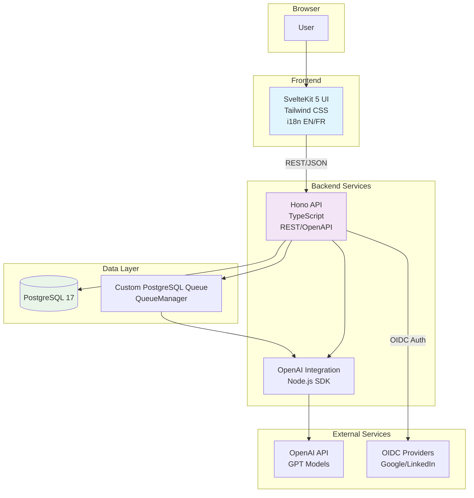

# ARCHITECTURE

## Tech Stack
- **UI**: SvelteKit 5 (`ui/`) -- bilingual FR/EN (FR-first, EN to-be), i18n, static build, Tailwind CSS
- **API**: Hono + TypeScript (`api/`) -- REST/OpenAPI, Drizzle ORM
- **Database**: PostgreSQL 17 + Make targets for Drizzle ORM -- Docker volume persistence
- **Queue**: Custom PostgreSQL-based job queue with QueueManager (no external libs)
- **AI**: OpenAI integration via Node.js (no separate Python service)
- **Tests**: Make targets + Vitest (unit/integration) + Playwright (E2E)
- **Security**: OIDC sessions (Google/LinkedIn), human approval on critical actions
- **CI/CD**: Make for local dev, GitHub Actions (based on make targets) for automation
- **Dev environment**: Docker Compose with volume mounts
- **Prod environment**: Scaleway Container Serverless (to-be)

## Architecture Diagram

## Bilingual Policy
- FR-first for user-facing content, EN to-be
- All code, comments, commit messages, and technical docs in English

## WARNING: No Generic UI Abstractions Without Spec

NEVER create generic UI abstractions (ViewTemplateRenderer, generic widget system, etc.) without:
1. A user-validated prototype or mockup
2. A concrete UI spec showing before/after screens
3. Preservation of existing working components (EditableInput, cards, StreamMessage, comments, field types)

**Incident context**: ViewTemplateRenderer was created as a "generic rendering infra" that replaced the existing design (editable cards, streaming, comments, markdown/list types) with a raw JSON renderer. The result was unusable and required complete eradication. If a template system is needed, it must USE existing components, not replace them.
