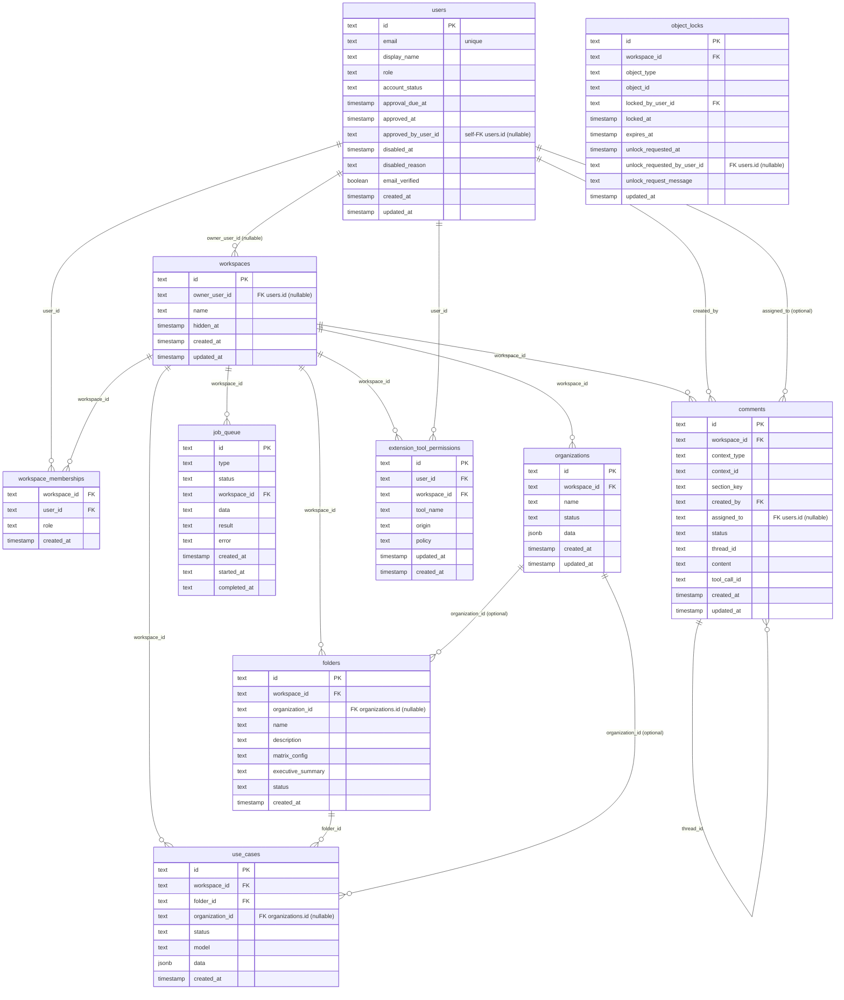
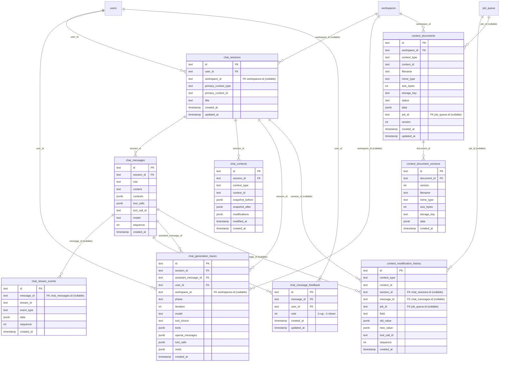
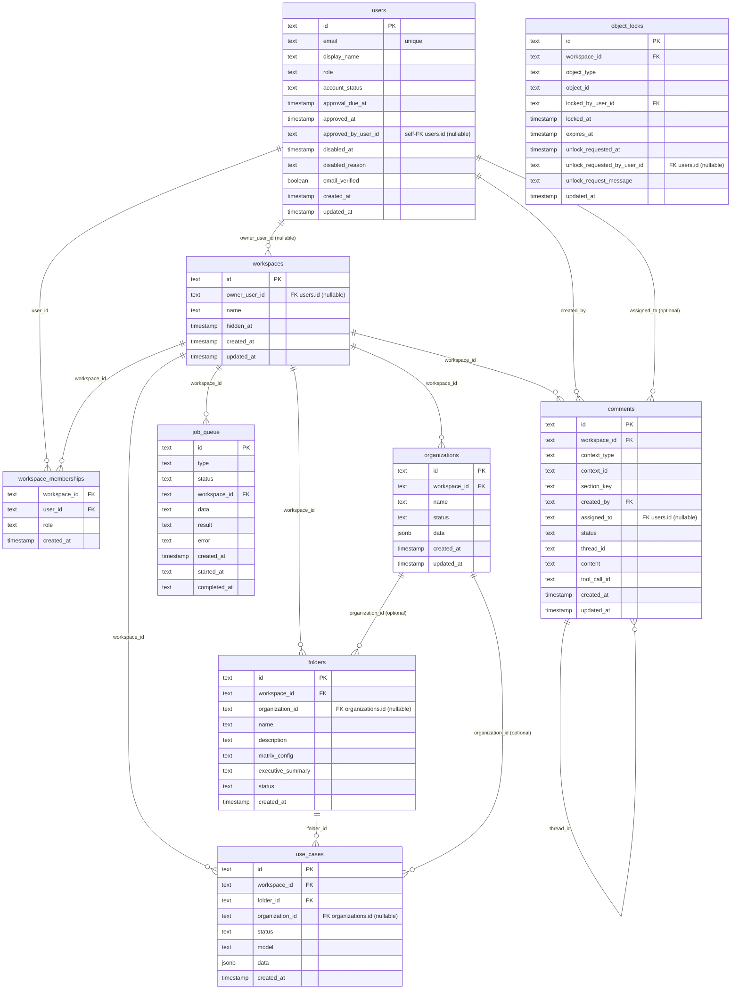
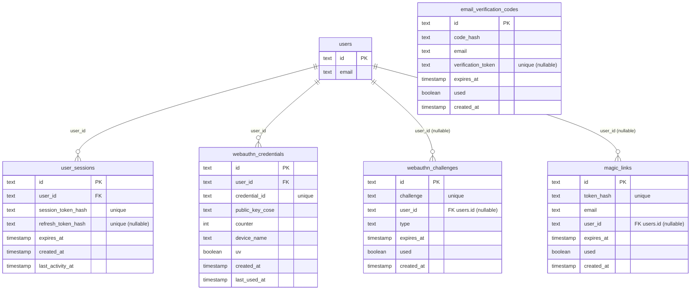
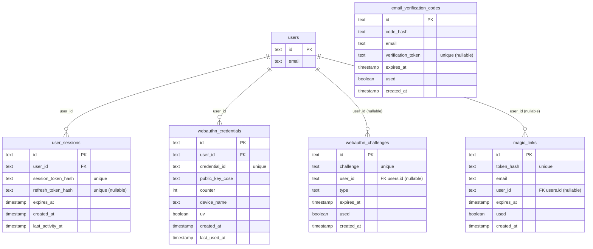
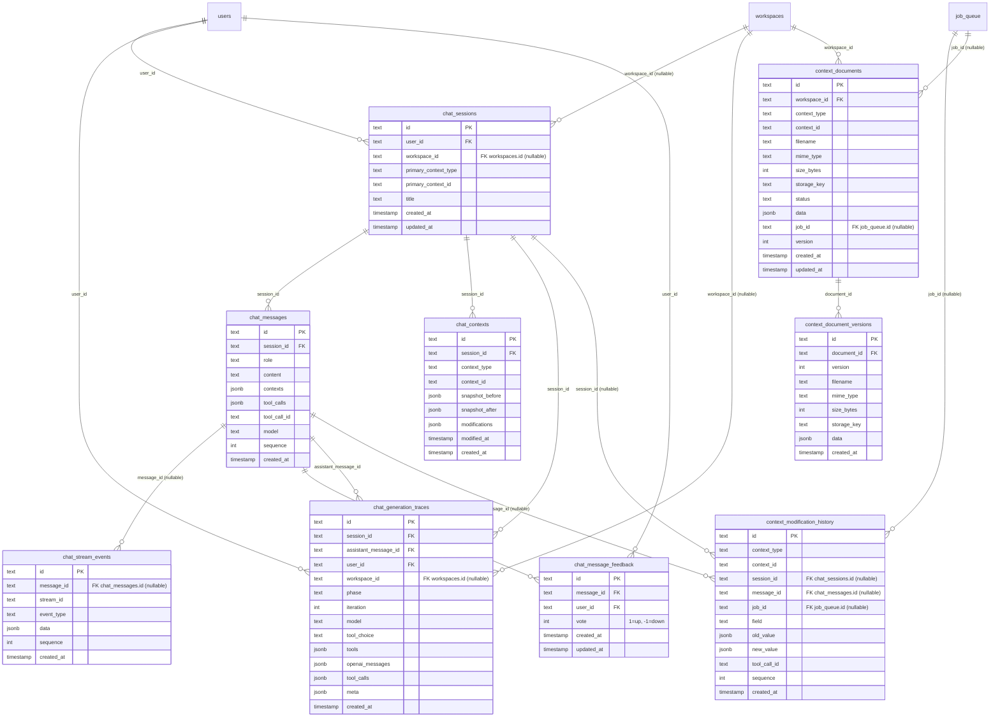

# Data model (PostgreSQL 17 / Drizzle)

Source of truth: `api/src/db/schema.ts` (Drizzle).  
Conventions: tables in `snake_case`, primary keys `text` (UUID string), multi-tenant via `workspace_id` + `workspace_memberships` (private-by-default).

## Overview (tenancy + business objects)

Notes:
- `organizations.data` is **JSONB** (organization profile: `industry`, `size`, `products`, `processes`, `kpis`, `references`, etc.).
- `use_cases.data` is **JSONB** (contains `name`, `description`, scores, etc. - migration 0008).
- `workspaces.owner_user_id` is **nullable** (no unique constraint).
- `workspaces.hidden_at` indicates visibility (hidden workspaces).
- `workspace_memberships` is the source of truth for roles (`viewer` | `commenter` | `editor` | `admin`).
- `comments` stores comments in flat threads (`thread_id`), scoped by workspace.
- `comments.tool_call_id` traces AI tool-driven notes/comments.
- `extension_tool_permissions` persists extension local-tool authorization policies (`allow` / `deny`) per user/workspace/tool/origin.

## Prompts (current vs target)

### Current state (implemented)

- There are **no** `prompts` / `prompt_versions` tables in `api/src/db/schema.ts`.
- Prompts are stored in `settings` (table `settings`) as a text value (often JSON) - e.g., `settings.key = 'prompts'` or an equivalent API structure.

Consequence:
- Prompt/version traceability in chat and generations is **partial**: some columns exist (`chat_messages.prompt_id`, `chat_messages.prompt_version_id`, `context_modification_history.prompt_id|prompt_version_id|prompt_type`) but do not reference relational tables today.

### Target state (not implemented)

Eventually, normalize with:
- `prompts` (logical definition)
- `prompt_versions` (versioning, content, variables, author)

and make references truly relational (FK) from `chat_messages` / `context_modification_history` / (possibly) a structured runs table.

## Auth (sessions, WebAuthn, magic link, email codes)

## Chat / streaming / tracing

Notes:
- `context_modification_history.context_type/context_id` are **logical references** (no DB FK) to `organizations/folders/use_cases` (and `folders` for `executive_summary`).
- `chat_stream_events.message_id` is nullable: structured calls use deterministic `stream_id` (`folder_<id>`, `usecase_<useCaseId>`, etc.).
- `context_documents.context_type/context_id` are **logical references** (no DB FK) to `organizations/folders/use_cases`.
- `chat_message_feedback` stores per-user feedback on assistant messages (unique by `message_id` + `user_id`).

Chat runtime notes (extension local tools):

- `POST /api/v1/chat/messages` can include `localToolDefinitions` (merged with server-side tools before generation).
- `POST /api/v1/chat/messages/:id/tool-results` injects local tool outputs and resumes generation.
- Local tool call state is tracked in stream events (`chat_stream_events`) and resumed in the same assistant message stream.

## Extension local-tool permissions

Table: `extension_tool_permissions` (`api/src/db/schema.ts`)

- Primary role: persist `allow` / `deny` decisions for extension runtime permission prompts.
- Scope key: unique (`user_id`, `workspace_id`, `tool_name`, `origin`).
- Indices:
  - `extension_tool_permissions_user_workspace_idx`
  - `extension_tool_permissions_tool_origin_idx`
- Patterns are normalized at API layer (`/api/v1/chat/tool-permissions`) before persistence:
  - tool patterns: e.g. `tab_read:*`, `tab_action:click`
  - origin patterns: `*`, `https://*`, `*.example.com`, `https://*.example.com`, exact origins
# Data model (PostgreSQL 17 / Drizzle)

Source of truth: `api/src/db/schema.ts` (Drizzle).  
Conventions: tables in `snake_case`, primary keys `text` (UUID string), multi-tenant via `workspace_id` + `workspace_memberships` (private-by-default).

## Overview (tenancy + business objects)

Notes:
- `organizations.data` is **JSONB** (organization profile: `industry`, `size`, `products`, `processes`, `kpis`, `references`, etc.).
- `use_cases.data` is **JSONB** (contains `name`, `description`, scores, etc. - migration 0008).
- `workspaces.owner_user_id` is **nullable** (no unique constraint).
- `workspaces.hidden_at` indicates visibility (hidden workspaces).
- `workspace_memberships` is the source of truth for roles (`viewer` | `commenter` | `editor` | `admin`).
- `comments` stores comments in flat threads (`thread_id`), scoped by workspace.
- `comments.tool_call_id` traces AI tool-driven notes/comments.

## Prompts (current vs target)

### Current state (implemented)

- There are **no** `prompts` / `prompt_versions` tables in `api/src/db/schema.ts`.
- Prompts are stored in `settings` (table `settings`) as a text value (often JSON) - e.g., `settings.key = 'prompts'` or an equivalent API structure.

Consequence:
- Prompt/version traceability in chat and generations is **partial**: some columns exist (`chat_messages.prompt_id`, `chat_messages.prompt_version_id`, `context_modification_history.prompt_id|prompt_version_id|prompt_type`) but do not reference relational tables today.

### Target state (not implemented)

Eventually, normalize with:
- `prompts` (logical definition)
- `prompt_versions` (versioning, content, variables, author)

and make references truly relational (FK) from `chat_messages` / `context_modification_history` / (possibly) a structured runs table.

## Auth (sessions, WebAuthn, magic link, email codes)

## Chat / streaming / tracing

Notes:
- `context_modification_history.context_type/context_id` are **logical references** (no DB FK) to `organizations/folders/use_cases` (and `folders` for `executive_summary`).
- `chat_stream_events.message_id` is nullable: structured calls use deterministic `stream_id` (`folder_<id>`, `usecase_<useCaseId>`, etc.).
- `context_documents.context_type/context_id` are **logical references** (no DB FK) to `organizations/folders/use_cases`.
- `chat_message_feedback` stores per-user feedback on assistant messages (unique by `message_id` + `user_id`).
# Data model (PostgreSQL 17 / Drizzle)

Source of truth: `api/src/db/schema.ts` (Drizzle).  
Conventions: tables in `snake_case`, primary keys `text` (UUID string), multi-tenant via `workspace_id` + `workspace_memberships` (private-by-default).

## Overview (tenancy + business objects)

Notes:
- `organizations.data` is **JSONB** (organization profile: `industry`, `size`, `products`, `processes`, `kpis`, `references`, etc.).
- `use_cases.data` is **JSONB** (contains `name`, `description`, scores, etc. - migration 0008).
- `workspaces.owner_user_id` is **nullable** (no unique constraint).
- `workspaces.hidden_at` indicates visibility (hidden workspaces).
- `workspace_memberships` is the source of truth for roles (`viewer` | `commenter` | `editor` | `admin`).
- `comments` stores comments in flat threads (`thread_id`), scoped by workspace.
- `comments.tool_call_id` traces AI tool-driven notes/comments.

## Prompts (current vs target)

### Current state (implemented)

- There are **no** `prompts` / `prompt_versions` tables in `api/src/db/schema.ts`.
- Prompts are stored in `settings` (table `settings`) as a text value (often JSON) - e.g., `settings.key = 'prompts'` or an equivalent API structure.

Consequence:
- Prompt/version traceability in chat and generations is **partial**: some columns exist (`chat_messages.prompt_id`, `chat_messages.prompt_version_id`, `context_modification_history.prompt_id|prompt_version_id|prompt_type`) but do not reference relational tables today.

### Target state (not implemented)

Eventually, normalize with:
- `prompts` (logical definition)
- `prompt_versions` (versioning, content, variables, author)

and make references truly relational (FK) from `chat_messages` / `context_modification_history` / (possibly) a structured runs table.

## Auth (sessions, WebAuthn, magic link, email codes)

## Chat / streaming / tracing

Notes:
- `context_modification_history.context_type/context_id` are **logical references** (no DB FK) to `organizations/folders/use_cases` (and `folders` for `executive_summary`).
- `chat_stream_events.message_id` is nullable: structured calls use deterministic `stream_id` (`folder_<id>`, `usecase_<useCaseId>`, etc.).
- `context_documents.context_type/context_id` are **logical references** (no DB FK) to `organizations/folders/use_cases`.
- `chat_message_feedback` stores per-user feedback on assistant messages (unique by `message_id` + `user_id`).
# Data model (PostgreSQL 17 / Drizzle)

Source of truth: `api/src/db/schema.ts` (Drizzle).  
Conventions: tables in `snake_case`, primary keys `text` (UUID string), multi-tenant via `workspace_id` + `workspace_memberships` (private-by-default).

## Overview (tenancy + business objects)

Notes:
- `organizations.data` is **JSONB** (organization profile: `industry`, `size`, `products`, `processes`, `kpis`, `references`, etc.).
- `use_cases.data` is **JSONB** (contains `name`, `description`, scores, etc. - migration 0008).
- `workspaces.owner_user_id` is **nullable** (no unique constraint).
- `workspaces.hidden_at` indicates visibility (hidden workspaces).
- `workspace_memberships` is the source of truth for roles (`viewer` | `commenter` | `editor` | `admin`).
- `comments` stores comments in flat threads (`thread_id`), scoped by workspace.
- `comments.tool_call_id` traces AI tool-driven notes/comments.

## Prompts (current vs target)

### Current state (implemented)

- There are **no** `prompts` / `prompt_versions` tables in `api/src/db/schema.ts`.
- Prompts are stored in `settings` (table `settings`) as a text value (often JSON) - e.g., `settings.key = 'prompts'` or an equivalent API structure.

Consequence:
- Prompt/version traceability in chat and generations is **partial**: some columns exist (`chat_messages.prompt_id`, `chat_messages.prompt_version_id`, `context_modification_history.prompt_id|prompt_version_id|prompt_type`) but do not reference relational tables today.

### Target state (not implemented)

Eventually, normalize with:
- `prompts` (logical definition)
- `prompt_versions` (versioning, content, variables, author)

and make references truly relational (FK) from `chat_messages` / `context_modification_history` / (possibly) a structured runs table.

## Auth (sessions, WebAuthn, magic link, email codes)

## Chat / streaming / tracing

Notes:
- `context_modification_history.context_type/context_id` are **logical references** (no DB FK) to `organizations/folders/use_cases` (and `folders` for `executive_summary`).
- `chat_stream_events.message_id` is nullable: structured calls use deterministic `stream_id` (`folder_<id>`, `usecase_<id>`, etc.).
- `context_documents.context_type/context_id` are **logical references** (no DB FK) to `organizations/folders/use_cases`.
- `chat_message_feedback` stores per-user feedback on assistant messages (unique by `message_id` + `user_id`).
# Data model (PostgreSQL 17 / Drizzle)

Source of truth: `api/src/db/schema.ts` (Drizzle).  
Conventions: tables in `snake_case`, primary keys `text` (UUID string), multi‑tenant via `workspace_id` + `workspace_memberships` (private‑by‑default).

## Overview (tenancy + business objects)

Notes:
- `organizations.data` is **JSONB** (organization profile: `industry`, `size`, `products`, `processes`, `kpis`, `references`, etc.).
- `use_cases.data` is **JSONB** (contains `name`, `description`, scores, etc. – migration 0008).
- `workspaces.owner_user_id` is **nullable** (no unique constraint).
- `workspaces.hidden_at` indicates visibility (hidden workspaces).
- `workspace_memberships` is the source of truth for roles (`viewer` | `commenter` | `editor` | `admin`).
- `comments` stores comments in flat threads (`thread_id`), scoped by workspace.
- `comments.tool_call_id` traces AI‑assisted notes/comments.

## Prompts (current vs target)

### Current state (implemented)

- There are **no** `prompts` / `prompt_versions` tables in `api/src/db/schema.ts`.
- Prompts are stored in `settings` (table `settings`) as a text value (often JSON) — e.g., `settings.key = 'prompts'` or an equivalent API structure.

Consequence:
- Prompt/version traceability in chat and generations is **partial**: some columns exist (`chat_messages.prompt_id`, `chat_messages.prompt_version_id`, `context_modification_history.prompt_id|prompt_version_id|prompt_type`) but do not reference relational tables today.

### Target state (not implemented)

Eventually, normalize with:
- `prompts` (logical definition)
- `prompt_versions` (versioning, content, variables, author)

and make references truly relational (`FK`) from `chat_messages` / `context_modification_history` / (possibly) a structured runs table.

## Auth (sessions, WebAuthn, magic link, email codes)

## Chat / streaming / tracing

Notes:
- `context_modification_history.context_type/context_id` are **logical references** (no DB FK) to `organizations/folders/use_cases` (and `folders` for `executive_summary`).
- `chat_stream_events.message_id` is nullable: structured calls use deterministic `stream_id` (`folder_<id>`, `usecase_<id>`, etc.).
- `context_documents.context_type/context_id` are **logical references** (no DB FK) to `organizations/folders/use_cases`.
- `chat_message_feedback` stores per‑user feedback on assistant messages (unique by `message_id` + `user_id`).

Source de vérité : `api/src/db/schema.ts` (Drizzle).  
Conventions : tables en `snake_case`, clés primaires `text` (UUID string), multi-tenant via `workspace_id` + `workspace_memberships` (private-by-default).

## Vue d’ensemble (tenancy + objets métier)

Notes :
- `organizations.data` est **JSONB** (profil organisation : `industry`, `size`, `products`, `processes`, `kpis`, `references`, etc.).
- `use_cases.data` est **JSONB** (contient `name`, `description`, scores, etc. – migration 0008).
- `workspaces.owner_user_id` est **nullable** (plus de contrainte unique).
- `workspaces.hidden_at` indique la visibilité (workspaces cachés).
- `workspace_memberships` est la source de vérité des rôles (`viewer` | `commenter` | `editor` | `admin`).
- `comments` stocke les commentaires dans des conversations à plat (`thread_id`), scoppés par workspace.
- `comments.tool_call_id` trace AI-assisted notes/comments.

## Prompts (état actuel vs cible)

### État actuel (implémenté)

- Il n’y a **pas** de tables `prompts` / `prompt_versions` dans `api/src/db/schema.ts`.
- Les prompts sont stockés dans `settings` (table `settings`) dans une valeur text (souvent JSON) — ex: `settings.key = 'prompts'` ou via une structure équivalente côté API.

Conséquence :
- La traçabilité “prompt/version” dans le chat et les générations est **partielle** : certaines colonnes existent (`chat_messages.prompt_id`, `chat_messages.prompt_version_id`, `context_modification_history.prompt_id|prompt_version_id|prompt_type`) mais ne pointent pas vers des tables relationnelles aujourd’hui.

### Cible (non implémentée)

À terme, on pourra normaliser avec :
- `prompts` (définition logique)
- `prompt_versions` (versioning, contenu, variables, auteur)

et rendre les références réellement relationnelles (`FK`) depuis `chat_messages` / `context_modification_history` / (éventuellement) une table de runs structurés.

## Auth (sessions, WebAuthn, magic link, codes email)

## Chat / streaming / tracing

Notes :
- `context_modification_history.context_type/context_id` sont des **références logiques** (pas de FK DB) vers `organizations/folders/use_cases` (et `folders` pour `executive_summary`).
- `chat_stream_events.message_id` est nullable : les appels structurés utilisent `stream_id` déterministe (`folder_<id>`, `usecase_<id>`, etc.).
- `context_documents.context_type/context_id` sont des **références logiques** (pas de FK DB) vers `organizations/folders/use_cases`.
- `chat_message_feedback` stocke le feedback par utilisateur sur les messages assistant (unique par `message_id` + `user_id`).

