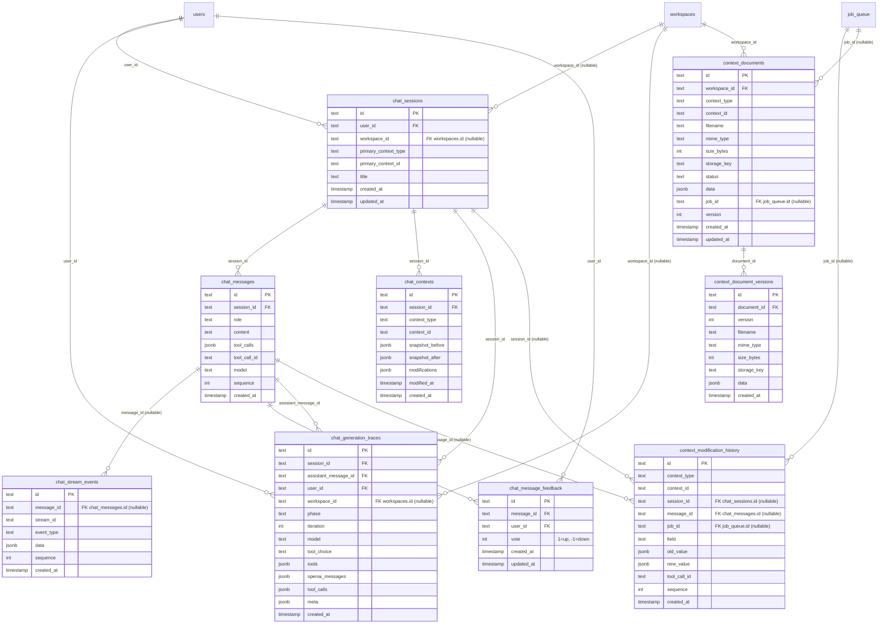

# Modèle de données (PostgreSQL 16 / Drizzle)

Source de vérité : `api/src/db/schema.ts` (Drizzle).  
Conventions : tables en `snake_case`, clés primaires `text` (UUID string), multi-tenant via `workspace_id` + `workspace_memberships` (private-by-default).

## Vue d’ensemble (tenancy + objets métier)

Notes :
- `organizations.data` est **JSONB** (profil organisation : `industry`, `size`, `products`, `processes`, `kpis`, `references`, etc.).
- `use_cases.data` est **JSONB** (contient `name`, `description`, scores, etc. – migration 0008).
- `workspaces.owner_user_id` est **nullable** (plus de contrainte unique).
- `workspaces.hidden_at` indique la visibilité (workspaces cachés).
- `workspace_memberships` est la source de vérité des rôles (`viewer` | `editor` | `admin`).

## Prompts (état actuel vs cible)

### État actuel (implémenté)

- Il n’y a **pas** de tables `prompts` / `prompt_versions` dans `api/src/db/schema.ts`.
- Les prompts sont stockés dans `settings` (table `settings`) dans une valeur text (souvent JSON) — ex: `settings.key = 'prompts'` ou via une structure équivalente côté API.

Conséquence :
- La traçabilité “prompt/version” dans le chat et les générations est **partielle** : certaines colonnes existent (`chat_messages.prompt_id`, `chat_messages.prompt_version_id`, `context_modification_history.prompt_id|prompt_version_id|prompt_type`) mais ne pointent pas vers des tables relationnelles aujourd’hui.

### Cible (non implémentée)

À terme, on pourra normaliser avec :
- `prompts` (définition logique)
- `prompt_versions` (versioning, contenu, variables, auteur)

et rendre les références réellement relationnelles (`FK`) depuis `chat_messages` / `context_modification_history` / (éventuellement) une table de runs structurés.

## Auth (sessions, WebAuthn, magic link, codes email)

## Chat / streaming / tracing

Notes :
- `context_modification_history.context_type/context_id` sont des **références logiques** (pas de FK DB) vers `organizations/folders/use_cases` (et `folders` pour `executive_summary`).
- `chat_stream_events.message_id` est nullable : les appels structurés utilisent `stream_id` déterministe (`folder_<id>`, `usecase_<id>`, etc.).
- `context_documents.context_type/context_id` sont des **références logiques** (pas de FK DB) vers `organizations/folders/use_cases`.
- `chat_message_feedback` stocke le feedback par utilisateur sur les messages assistant (unique par `message_id` + `user_id`).

