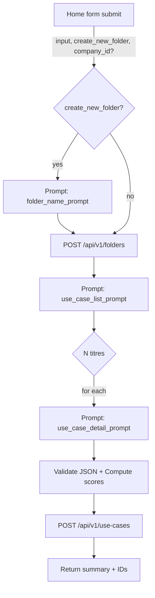

# SPÉCIFICATION TECHNIQUE - Top AI Ideas

## 1) Cartographie fonctionnelle et écrans

Les écrans et leurs responsabilités sont implémentés en Svelte avec SvelteKit (routing fichiers) et des Svelte stores pour l'état partagé. L'API REST TypeScript est la source de vérité (pas de persistance critique en localStorage).

1. Accueil `Index` (/)
   - CTA pour démarrer et rediriger vers `/home`.
   - Sous-jacent: pas d'état, toasts UI.

2. Génération `Home` (/home)
   - Champs: `currentInput` (texte libre), sélection d'`entreprise` (facultative), option `createNewFolder`.
   - Actions: `generateUseCases(input, createNewFolder)` → crée éventuellement un dossier + génère une liste de cas puis leurs détails via OpenAI.
   - Dépendances: `companies`, `currentCompanyId`, `folders`, `currentFolderId`, toasts.
   - Navigation: redirige vers `/cas-usage` après succès.

3. Dossiers `Folders` (/dossiers)
   - CRUD de dossiers: `addFolder(name, description)`, `updateFolder`, `deleteFolder`, `setCurrentFolder`.
   - Affiche nombre de cas d'usage par dossier, association éventuelle à une `companyId`.
   - Navigation: sélectionner un dossier redirige vers `/cas-usage`.

4. Liste des cas `UseCaseList` (/cas-usage)
   - Filtre par `currentFolderId`.
   - Actions: voir détail, supprimer (boîte de dialogue), future création manuelle.
   - Affiche des notes synthétiques valeur/complexité selon `matrixConfig`.

5. Détail d'un cas `UseCaseDetail` (/cas-usage/:id)
   - Affiche les champs d'un `UseCase` et permet l'édition: description, benefits, metrics, risks, nextSteps, sources, relatedData, process, technology, deadline, contact.
   - Tableaux d'évaluation par axes de `valueScores` et `complexityScores` avec recomputation de `totalValueScore`/`totalComplexityScore`.
   - Suppression du cas.

6. Dashboard `Dashboard` (/dashboard)
   - Visualisation scatter Valeur vs Facilité d'implémentation (inverse de complexité), légende par `process`.
   - Comptes/bornes basés sur `matrixConfig` et cas du `currentFolder`.

7. Matrice `Matrix` (/matrice)
   - Configuration des axes de valeur/complexité (poids), seuils (points, threshold, cases) et descriptions de niveaux (1..5).
   - Met à jour les scores des cas du dossier courant.

8. Entreprises `Companies` (/entreprises, /entreprises/:id)
   - CRUD d'entreprises, sélection d'une `currentCompanyId`.
   - Utilisée pour contextualiser les prompts de génération (OpenAI) et l'association dossier→entreprise.

9. Paramètres `Settings` (/parametres)
   - Stocker via l'API backend: prompts, modèles (liste/détail/dossier/entreprise), paramètres avancés `maxRetries`, `parallelQueue`. La clé `OPENAI_API_KEY` reste côté serveur (jamais côté client).

10. Configuration métier `BusinessConfiguration` (/configuration-metier)
    - **À implémenter** - Liste/modification basique des secteurs et processus.
    - Sert de référentiel pour la cohérence des prompts détaillés.

11. Données `Data` (/donnees)
    - **À implémenter** - Vue technique/outillage (tableaux, prévisualisation de données).

12. 404 `NotFound`
    - Page d'erreur simple.

### Header (Navigation principale)

- Intention: fournir une barre de navigation cohérente, accès rapide aux vues principales, statut d'auth, sélecteur de langue FR/EN.
- Items:
  - Accueil `/`
  - Dossiers `/dossiers`
  - Entreprises `/entreprises`
  - Secteurs et processus `/configuration-metier`
  - Cas d'usage `/cas-usage`
  - Matrice `/matrice`
  - Dashboard `/dashboard`
  - Design `/design`
  - Données `/donnees`
  - Paramètres `/parametres`
- Comportements:
  - Mise en évidence de l'onglet actif.
  - À droite: bouton Connexion (Google/LinkedIn) si non connecté; avatar + menu (Déconnexion) si connecté; sélecteur FR/EN.
  - Responsive (pile vertical sur mobile, horizontal desktop).

### 1.1) Détails par écran: flux, API et données

1) Accueil `Index` (/)
- Intention: onboarding minimal; introduit l'outil et conduit l'utilisateur vers la génération.
- UI: Titre + CTA "Commencer" → redirige `/home`.
- API: aucun appel.
- État: aucun.

2) Génération `Home` (/home)
- Intention: point d'entrée métier pour décrire le contexte et lancer une génération encadrée (dossier + cas d'usage). 
- UI:
  - Zone de texte `currentInput` (obligatoire).
  - Sélecteur d'entreprise (optionnel) alimenté par `/companies`.
  - Case `createNewFolder` (par défaut: true).
  - Bouton "Générer vos cas d'usage".
- Stores utilisés: `companiesStore`, `foldersStore` (lecture), `useCasesStore` (aucune écriture directe ici).
- API:
  - GET `/api/v1/companies`
    - Response 200: `{ items: Company[] }`
  - POST `/api/v1/use-cases/generate`
    - Request JSON: `{ input: string; create_new_folder: boolean; company_id?: string }`
    - Response 200: `{ created_folder_id?: string; created_use_case_ids: string[]; summary: string }`
    - Effets serveur: création éventuelle d'un dossier, génération titres + détails via OpenAI, validation JSON, calcul de scores (voir 2.1), persistance.
  - Erreurs: 400 si `input` vide, 429/5xx pour OpenAI/serveur; UI affiche toasts d'erreur.
- États/UI:
  - Loading pendant génération; toasts d'avancement.
  - Succès → navigation `/cas-usage`.

3) Dossiers `Folders` (/dossiers)
- Intention: organiser la production par périmètre; associer un dossier à une entreprise; gérer le dossier actif.
- UI:
  - Liste des dossiers avec: nom, description, date, entreprise associée (si présente), nombre de cas.
  - Actions: Créer, Éditer, Supprimer, Sélectionner (définit le dossier actif côté store).
- Stores: `foldersStore` (list + currentFolderId), `companiesStore` (pour nom d'entreprise), `useCasesStore` (compter par dossier côté front ou via count API optionnelle).
- API:
  - GET `/api/v1/folders` → `{ items: Folder[] }`
  - POST `/api/v1/folders` body `{ name, description, company_id? }` → `{ id, ... }`
  - PUT `/api/v1/folders/{id}` body `{ name?, description?, company_id?, matrix_config? }` → `{ id, ... }`
  - DELETE `/api/v1/folders/{id}` → 204 (cascade `use_cases`)
  - Optionnel (count): GET `/api/v1/use-cases/count?folder_id=...` → `{ count: number }`
- États/UI: modales de création/édition/suppression; confirmations; toasts.

4) Liste des cas `UseCaseList` (/cas-usage)
- Intention: visualiser rapidement les cas du dossier actif, accéder au détail, faire du tri basique, préparer la priorisation.
- UI:
  - Grille/liste des cas filtrés par dossier actif.
  - Actions: Voir détail, Supprimer, (future Création manuelle).
- Stores: `useCasesStore` (liste), `matrixStore` (seuils pour rendu des ratings), `foldersStore` (dossier actif).
- API:
  - GET `/api/v1/use-cases?folder_id={currentFolderId}` → `{ items: UseCase[] }`
  - DELETE `/api/v1/use-cases/{id}` → 204
- États/UI: empty state si aucun dossier actif ou liste vide; toasts succès/erreur.

5) Détail d'un cas `UseCaseDetail` (/cas-usage/:id)
- Intention: permettre l'édition enrichie et la qualification complète d'un cas avec traçabilité du scoring.
- UI:
  - Affiche/édite: `name`, `description`, `benefits[]`, `metrics[]`, `risks[]`, `next_steps[]`, `sources[]`, `related_data[]`, `process`, `technology`, `deadline`, `contact`.
  - Tables de notation: `value_scores[]`, `complexity_scores[]` avec changements de `rating` (1..5) et `description` par niveau.
  - Affiche `total_value_score`, `total_complexity_score` et niveaux agrégés sous forme étoiles/croix.
  - Actions: Enregistrer, Supprimer, Retour à la liste.
- Stores: `useCasesStore` (lecture/écriture après PUT), `matrixStore` (axes/thresholds).
- API:
  - GET `/api/v1/use-cases/{id}` → `UseCase`
  - PUT `/api/v1/use-cases/{id}` body `Partial<UseCase>` → `UseCase`
    - Serveur: recalcule les scores (2.1) en fonction de la `matrix_config` du dossier lié; renvoie l'objet final.
  - DELETE `/api/v1/use-cases/{id}` → 204
- États/UI: gestion des champs liste via textarea (1 item/ligne); toasts sauvegarde/suppression.

6) Dashboard `Dashboard` (/dashboard)
- Intention: offrir une vue portfolio priorisée par valeur/facilité et des KPIs synthétiques par dossier.
- UI:
  - Cartes KPI: nombre de cas, moyenne valeur, moyenne complexité.
  - Scatter Valeur (%) vs Facilité (% = 100−complexité_norm) coloré par `process`.
- Stores: `foldersStore` (dossier actif), `matrixStore` (pour bornes si besoin).
- API (agrégation côté serveur):
  - GET `/api/v1/analytics/summary?folder_id=...`
    - Response: `{ total_use_cases: number; avg_value: number; avg_complexity: number }`
  - GET `/api/v1/analytics/scatter?folder_id=...`
    - Response: `{ items: { id: string; name: string; process: string; value_norm: number; ease: number; original_value: number; original_ease: number }[] }`
- États/UI: loading; empty state si aucun cas.

7) Matrice `Matrix` (/matrice)
- Intention: gouverner la méthode d'évaluation (axes, poids, seuils, descriptions) et recalculer les scores des cas.
- UI:
  - Tables d'édition des poids `weight` pour axes valeur/complexité.
  - Tables d'édition des `thresholds` (points, threshold) pour niveaux 1..5 (valeur et complexité).
  - Dialogue pour éditer `level_descriptions` (par axe, 5 niveaux).
  - Action "Enregistrer configuration".
- Stores: `matrixStore`, `foldersStore` (dossier actif).
- API:
  - GET `/api/v1/folders/{id}/matrix` → `MatrixConfig`
  - PUT `/api/v1/folders/{id}/matrix` body `MatrixConfig` → `MatrixConfig`
  - POST `/api/v1/folders/{id}/recalculate` → 202/200 (recalcule tous les scores du dossier)
- États/UI: confirmation d'impact (recalcul); toasts succès/erreur.

8) Entreprises `Companies` (/entreprises, /entreprises/:id)
- Intention: créer/maintenir des profils d'entreprise riches pour contextualiser la génération et l'analyse.
- UI:
  - Liste des entreprises; fiche avec `name`, `industry`, `size`, `products`, `processes`, `challenges`, `objectives`, `technologies`.
  - Actions: Créer/Éditer/Supprimer; Définir "active" côté store si besoin pour `/home`.
  - Option: auto-remplissage via OpenAI sur saisie du nom.
- Stores: `companiesStore` (list + currentCompanyId).
- API:
  - GET `/api/v1/companies` → `{ items: Company[] }`
  - POST `/api/v1/companies` body `CompanyInput` → `Company`
  - GET `/api/v1/companies/{id}` → `Company`
  - PUT `/api/v1/companies/{id}` body `Partial<Company>` → `Company`
  - DELETE `/api/v1/companies/{id}` → 204
  - POST `/api/v1/companies/ai-enrich` body `{ name: string }` → `Partial<Company>` (champs enrichis)
- États/UI: feuille latérale (sheet) de création/édition; toasts.

9) Paramètres `Settings` (/parametres)
- Intention: industrialiser la génération (prompts, modèles, limites), séparer secrets et tuning côté serveur.
- UI:
  - Édition des prompts: `useCaseListPrompt`, `useCaseDetailPrompt`, `folderNamePrompt`, `companyInfoPrompt`.
  - Sélection des modèles: `listModel`, `detailModel`, `folderModel`, `companyInfoModel`.
  - Limites: `maxRetries`, `parallelQueue`.
  - Actions: Sauvegarder, Réinitialiser.
- Store: `settingsStore`.
- API:
  - GET `/api/v1/settings` → `Settings`
  - PUT `/api/v1/settings` body `SettingsInput` → `Settings`
- États/UI: validations simples; toasts.

10) Configuration métier `BusinessConfiguration` (/configuration-metier)
- Intention: maîtriser le référentiel secteurs/processus utilisé par les prompts et l'analyse.
- UI:
  - Tables éditables des secteurs et processus; actions Ajouter/Éditer/Supprimer.
- Store: `businessStore`.
- API:
  - GET `/api/v1/business-config` → `{ sectors: Sector[]; processes: Process[] }`
  - PUT `/api/v1/business-config` body `{ sectors: Sector[]; processes: Process[] }` → même objet
- États/UI: toasts succès/erreur.

11) 404 `NotFound`
- Aucun appel; lien retour `/`.

12) Design `/design`
- Intention: espace d'exploration UI (bibliothèque de composants, prototypes visuels).
- API: aucun appel métier.

13) Données `/donnees`
- Intention: vue technique/outillage (tableaux, prévisualisation de données).
- API: endpoints utilitaires si nécessaire (facultatif), sinon mock/démo.

Variables sous-jacentes clés côté backend/API:
- Gestion des entités: `Company`, `Folder`, `UseCase`, `MatrixConfig` (axes, poids, thresholds, descriptions), `BusinessConfig` (sectors, processes).
- Contexte de génération: `currentCompanyId`, association dossier→entreprise, prompts/configs.
- Agrégations: comptages par niveaux, scoring, normalisation pour graphiques.

## 2) Modèle de données (SQLite + Litestream)

Base: un fichier SQLite unique (ex: `data/app.db`) persistant. Sauvegarde continue via Litestream vers un bucket S3 (Scaleway). Restauration automatique au démarrage si nécessaire.

Schéma initial (simplifié, colonnes en snake_case):
- companies
  - id (uuid, pk)
  - name (text)
  - industry (text)
  - size (text)
  - products (text)
  - processes (text)
  - challenges (text)
  - objectives (text)
  - technologies (text)
  - created_at (timestamptz)
  - updated_at (timestamptz)

- folders
  - id (uuid, pk)
  - name (text)
  - description (text)
  - company_id (uuid, fk → companies.id, nullable)
  - matrix_config (json)   // configuration complète par dossier
  - created_at (timestamptz)

- use_cases
  - id (uuid, pk)
  - folder_id (uuid, fk → folders.id)
  - company_id (uuid, fk → companies.id, nullable)
  - name (text)
  - description (text)
  - process (text)
  - technology (text)
  - deadline (text)
  - contact (text)
  - benefits (json)                // tableau de strings
  - metrics (json)                 // tableau de strings
  - risks (json)                   // tableau de strings
  - next_steps (json)              // tableau de strings
  - sources (json)                 // tableau de strings
  - related_data (json)            // tableau de strings
  - value_scores (json)            // [{ axisId, rating, description }]
  - complexity_scores (json)       // idem
  - total_value_score (real)
  - total_complexity_score (real)
  - created_at (timestamptz)

- settings
  - id (uuid, pk)
  - openai_models (json)
  - prompts (json)
  - generation_limits (json)

- business_config 
  - id (uuid, pk)
  - sectors (json)
  - processes (json)

Notes:
- `matrix_config` est stocké par dossier pour permettre des matrices différentes selon le contexte.
- Indices à prévoir: (folder_id), (company_id). Pour les champs JSON, prévoir des vues matérialisées pour filtres complexes si besoin.

### 2.1) Méthode de calcul des scores (serveur)

Définitions:
- Soit `value_axes = [{ name, weight, level_descriptions? }]` et `complexity_axes = [...]`.
- Soit `value_thresholds = [{ level ∈ {1..5}, points, threshold }, ...]` et `complexity_thresholds = [...]`.
- Chaque cas d'usage possède `value_scores = [{ axisId: name, rating ∈ {1..5}, description }]` et `complexity_scores = [...]`.

Calcul des points par axe:
- Pour chaque axe de valeur `a` avec poids `w_a` et note `r_a`, on récupère `points(r_a)` dans `value_thresholds` (l'entrée où `level = r_a`).
- Contribution axe valeur: `c_a = points(r_a) × w_a`.
- Total valeur: `total_value_score = Σ_a c_a`.

- Pour la complexité, idem: `d_c = points(r_c) × w_c` et `total_complexity_score = Σ_c d_c`.

Niveaux agrégés (1..5):
- On détermine le niveau agrégé en trouvant le plus grand `level` tel que `total_score ≥ threshold(level)` dans le tableau de thresholds correspondant.

Bornes et normalisation (Dashboard):
- `max_possible_value = Σ_a points(level=5) × w_a`.
- `max_possible_complexity = Σ_c points(level=5) × w_c`.
- Normalisation valeur: `value_norm = round(100 × total_value_score / max_possible_value)`.
- Normalisation complexité: `complexity_norm = round(100 × total_complexity_score / max_possible_complexity)`.
- Facilité d'implémentation: `ease = 100 − complexity_norm`.

Remarques d'implémentation API:
- À la création/mise à jour d'un `use_case`, l'API recalcule systématiquement `total_value_score` et `total_complexity_score` à partir des `..._scores` fournis et de la `matrix_config` du dossier.
- En cas de mise à jour de `matrix_config` (poids, thresholds), l'API expose une route de recalcul en masse des cas du dossier.

## 3) API backend (TypeScript) – Contrats

Base: `/api/v1` (Node + TypeScript; framework: Hono ou Fastify; ORM recommandé: Drizzle ou Kysely sur SQLite; migrations intégrées)

Auth WebAuthn (passwordless) :
- Authentification sans mot de passe via WebAuthn (passkeys/biométrie).
- Flow sécurisé avec vérification email obligatoire (code à 6 chiffres) avant enrôlement du device.
- Magic link comme fallback pour réinitialisation de device (activation uniquement, pas de connexion).
- Sessions serveur (cookie `HttpOnly`, `Secure`, `SameSite=Lax`), stockage sessions en PostgreSQL.
- RBAC avec hiérarchie de rôles (admin_app > admin_org > editor > guest).
- Gestion multi-devices avec activation/révocation.
- Variables requises: `WEBAUTHN_RP_ID`, `WEBAUTHN_RP_NAME`, `WEBAUTHN_ORIGIN`, `JWT_SECRET`, `MAIL_HOST`, `MAIL_PORT`, `MAIL_SECURE`, `MAIL_USERNAME`, `MAIL_PASSWORD`, `MAIL_FROM`, `ADMIN_EMAIL`.
- Pour les détails complets des workflows, voir [WORKFLOW_AUTH.md](WORKFLOW_AUTH.md).

### 3.1) Architecture WebAuthn

L'authentification WebAuthn est implémentée avec les composants suivants :

**Schéma de base de données :**
- `users` : Utilisateurs avec email, rôle, et statut de vérification email
- `webauthn_credentials` : Credentials WebAuthn (devices) associés aux utilisateurs
- `webauthn_challenges` : Challenges temporaires pour cérémonies WebAuthn (TTL)
- `user_sessions` : Sessions utilisateur avec tokens JWT
- `magic_links` : Tokens magic link pour activation/réinitialisation (TTL)

**Services backend :**
- `webauthn-registration.ts` : Gestion de l'enrôlement des devices
- `webauthn-authentication.ts` : Gestion de l'authentification avec devices
- `session-manager.ts` : Gestion des sessions JWT
- `challenge-manager.ts` : Gestion des challenges WebAuthn
- `email-verification.ts` : Vérification email avec code à 6 chiffres
- `magic-link.ts` : Génération et vérification de magic links

**Configuration WebAuthn :**
- Relying Party (RP) configuré via variables d'environnement
- Support des discoverable credentials (passkeys)
- User Verification (UV) requis pour admins, préféré pour autres rôles
- Attestation par défaut: `none` (configurable)

Pour plus de détails sur les workflows d'authentification, voir [WORKFLOW_AUTH.md](WORKFLOW_AUTH.md).

### 3.2) Endpoints d'authentification (API v1)

**Email Verification :**
- POST `/api/v1/auth/email/verify-request` → Demande un code de vérification à 6 chiffres (body: `{ email: string }`)
- POST `/api/v1/auth/email/verify-code` → Vérifie le code et retourne un token de validation temporaire (body: `{ email: string, code: string }`)

**WebAuthn Registration :**
- POST `/api/v1/auth/register/options` → Génère les options d'enrôlement WebAuthn (body: `{ email: string, verificationToken: string }`)
- POST `/api/v1/auth/register/verify` → Vérifie la réponse d'enrôlement et crée l'utilisateur + device (body: `{ email: string, verificationToken: string, userId: string, credential: RegistrationResponseJSON, deviceName?: string }`)

**WebAuthn Authentication :**
- POST `/api/v1/auth/login/options` → Génère les options d'authentification WebAuthn (body: `{ email?: string }` - optionnel pour passkeys)
- POST `/api/v1/auth/login/verify` → Vérifie la réponse d'authentification et crée une session (body: `{ credential: AuthenticationResponseJSON, deviceName?: string }`)

**Magic Link (Fallback) :**
- POST `/api/v1/auth/magic-link/request` → Génère et envoie un magic link (body: `{ email: string }`)
- POST `/api/v1/auth/magic-link/verify` → Vérifie le magic link et active le device (body: `{ token: string }`)
- GET `/api/v1/auth/magic-link/verify?token=xxx` → Version GET pour redirection depuis email

**Session Management :**
- GET `/api/v1/auth/session` → Récupère les informations de la session actuelle
- POST `/api/v1/auth/session/refresh` → Rafraîchit le token de session (body: `{ refreshToken: string }`)
- DELETE `/api/v1/auth/session` → Déconnecte la session actuelle
- DELETE `/api/v1/auth/session/all` → Déconnecte toutes les sessions de l'utilisateur
- GET `/api/v1/auth/session/list` → Liste toutes les sessions de l'utilisateur

**Credential Management :**
- GET `/api/v1/auth/credentials` → Liste tous les devices enregistrés de l'utilisateur
- PUT `/api/v1/auth/credentials/:id` → Met à jour le nom d'un device (body: `{ deviceName: string }`)
- DELETE `/api/v1/auth/credentials/:id` → Révoque un device (suppression)

**Health Check :**
- GET `/api/v1/auth/health` → Health check du service d'authentification

**Sécurité :**
- Rate limiting sur tous les endpoints d'authentification
- Protection CSRF via SameSite cookies
- Validation stricte des challenges (anti-replay)
- Vérification des compteurs de credentials (anti-cloning)
- Sessions JWT avec expiration configurable

Endpoints principaux (API v1):
- Health
  - GET `/api/v1/health` → health check

- Companies
  - GET `/api/v1/companies` → list
  - POST `/api/v1/companies` → create (body = Company sans id)
  - GET `/api/v1/companies/{id}` → retrieve
  - PUT `/api/v1/companies/{id}` → update
  - DELETE `/api/v1/companies/{id}` → delete
  - POST `/api/v1/companies/ai-enrich` → enrichissement IA

- Folders
  - GET `/api/v1/folders` → list (+ filtre company_id)
  - POST `/api/v1/folders` → create (name, description, company_id?)
  - GET `/api/v1/folders/{id}` → retrieve (incl. `matrix_config`)
  - PUT `/api/v1/folders/{id}` → update (name, description, company_id, matrix_config)
  - DELETE `/api/v1/folders/{id}` → delete (cascade use_cases)

- Use Cases
  - GET `/api/v1/use-cases?folder_id=...` → list by folder
  - POST `/api/v1/use-cases` → create
  - GET `/api/v1/use-cases/{id}` → retrieve
  - PUT `/api/v1/use-cases/{id}` → update
  - DELETE `/api/v1/use-cases/{id}` → delete
  - POST `/api/v1/use-cases/generate` → génère N cas: body { input, create_new_folder, company_id? } → crée dossier si demandé, appelle OpenAI, stocke cas (recalcul des scores serveur)

- Analytics
  - GET `/api/v1/analytics/summary?folder_id=...` → résumé statistiques
  - GET `/api/v1/analytics/scatter?folder_id=...` → données scatter plot

- Settings/Prompts
  - GET `/api/v1/settings` → config unique (ou multi-profil si besoin)
  - PUT `/api/v1/settings` → met à jour `prompts`, `openai_models`, `generation_limits`
  - GET `/api/v1/prompts` → liste des prompts par défaut
  - PUT `/api/v1/prompts` → mettre à jour les prompts

- AI Settings
  - GET `/api/v1/ai-settings` → paramètres IA
  - PUT `/api/v1/ai-settings` → mettre à jour paramètres IA

- Business Config
  - GET `/api/v1/business-config`
  - PUT `/api/v1/business-config`

- Queue Management
  - GET `/api/v1/queue/jobs` → liste des jobs
  - GET `/api/v1/queue/jobs/{id}` → statut d'un job
  - POST `/api/v1/queue/jobs/{id}/cancel` → annuler un job
  - POST `/api/v1/queue/jobs/{id}/retry` → relancer un job
  - DELETE `/api/v1/queue/jobs/{id}` → supprimer un job
  - POST `/api/v1/queue/purge` → purger la queue

- Admin
  - GET `/api/v1/admin/status` → statut système

Schémas (Zod/TypeBox) alignés avec les types front, `camelCase` en JSON, `snake_case` en DB.

Règles de calcul:
- Scores recalculés côté serveur conformément à 2.1.
- Endpoints d'agrégation pour le dashboard renvoient directement `value_norm`, `ease`, et bornes max.

## 4) Génération LLM (OpenAI, Node)

Services TypeScript dédiés :
- `api/src/services/queue-manager.ts` → Gestionnaire de queue SQLite pour jobs asynchrones
- `api/src/services/context-company.ts` → Enrichissement d'entreprises via IA
- `api/src/services/context-usecase.ts` → Génération de cas d'usage via IA
- `api/src/services/settings.ts` → Gestion des paramètres et configuration
- `api/src/services/tools.ts` → Utilitaires et outils généraux

Fonctions de génération IA :
- `generateFolderNameAndDescription(input, model, company?)`
- `generateUseCaseList(input, model, company?)`
- `generateUseCaseDetail(title, input, matrix_config, model, company?)` → renvoie un JSON strict; l'API valide (Zod), calcule les scores et persiste.

Paramètres: prompts, modèles, limites (retries/file parallèle) stockés en DB (`/settings`). `OPENAI_API_KEY` uniquement côté serveur. Concurrence contrôlée (p-limit) + retries exponentiels.

### 4.1) Prompts et orchestration

**Prompts disponibles :**
- `use_case_list_prompt` → Génération de liste de cas d'usage
- `use_case_detail_prompt` → Génération détaillée d'un cas d'usage avec scoring
- `folder_name_prompt` → Génération de nom et description de dossier
- `company_info_prompt` → Enrichissement d'informations d'entreprise

**Association prompts ↔ endpoints :**
- `/api/v1/use-cases/generate` :
  - Si `create_new_folder=true` : utilise `folder_name_prompt` → crée dossier
  - Génère titres avec `use_case_list_prompt`
  - Pour chaque titre : `use_case_detail_prompt` avec scoring automatique
  - Validation JSON + calcul des scores + persistance
- `/api/v1/companies/ai-enrich` : `company_info_prompt` → enrichissement d'entreprise

**Workflow de génération :**

## 5) UI SvelteKit (build statique, i18n FR/EN)

Routing (adapter-static):
- `/` → Index
- `/home` → Home (génération)
- `/dossiers` → Folders
- `/cas-usage` → UseCaseList
- `/cas-usage/[id]` → UseCaseDetail
- `/dashboard` → Dashboard
- `/matrice` → Matrix
- `/entreprises` (+ `/entreprises/[id]`) → Companies
- `/parametres` → Settings
- `/configuration-metier` → BusinessConfiguration
- `+error.svelte` → NotFound

State management:
- Stores Svelte: `companiesStore`, `foldersStore`, `useCasesStore`, `matrixStore`, `settingsStore`, `businessStore`.
- Les stores synchronisent via l'API backend; aucune persistance locale critique. Des caches peuvent exister en `sessionStorage` si besoin UX.

Composants clés:
- Éditeurs (textarea/input) pour tous champs du `UseCaseDetail` avec mise à jour optimiste et sauvegarde sur PUT.
- Tableaux `RatingsTable` pour axes valeur/complexité; binding direct aux stores + recalcul (serveur côté API ou client côté affichage seulement).
- `Matrix` page: formulaires poids/thresholds, dialogue d'édition des descriptions de niveaux.
- `Dashboard`: graphiques (Recharts → alternatives Svelte: `layercake`, `apexcharts` svelte, ou `recharts` via wrapper si nécessaire); le backend peut fournir des données pré-normalisées.

## 6) DevOps & Outillage (Docker, Make, CI/CD, Litestream)

Structure de repo (implémentée):
- `/ui` (SvelteKit 5) → Interface utilisateur statique
- `/api` (Hono + TypeScript) → API REST avec Drizzle ORM
- `/data` (SQLite) → Base de données locale (gitignored)
- `/e2e` (Playwright) → Tests end-to-end
- `Makefile` à la racine avec cibles: `make build`, `make test`, `make lint`, `make up`, `make down`, `make db-*`.
- `docker-compose.yml` dev local: services `ui`, `api`, `sqlite`, `litestream` avec réplication vers S3.
- `Dockerfile` séparés `ui/` et `api/` (prod-ready, multi-stage build).
- **À implémenter**: `.github/workflows/ci.yml` + `deploy.yml` pour CI/CD.
- Déploiement (à implémenter):
  - UI: build statique SvelteKit → publication GitHub Pages.
  - API: build image → push Scaleway Container Registry → déploiement Container PaaS. Volume persistant pour `app.db` + Litestream configuré pour backup S3.

Variables/Secrets CI:
- `OPENAI_API_KEY` (secret)
- `SCW_ACCESS_KEY`, `SCW_SECRET_KEY`, `SCW_DEFAULT_ORGANIZATION_ID`, `SCW_DEFAULT_PROJECT_ID`, `SCW_NAMESPACE_ID` (secrets)
 - `S3_BUCKET_NAME`, `S3_ENDPOINT`, `S3_REGION` (secrets)
