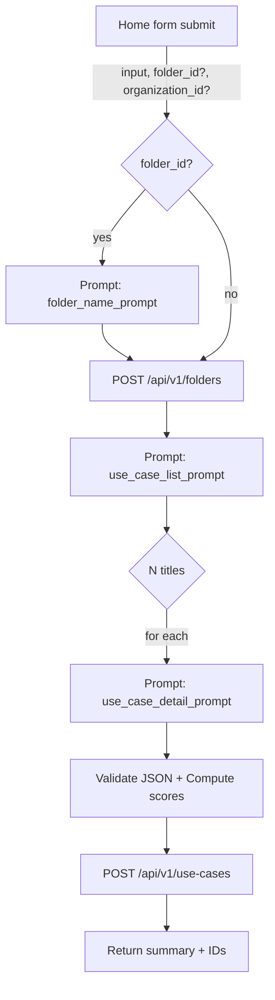

# TECHNICAL SPECIFICATION - Top AI Ideas

## 0) Design Patterns & Component Lifecycle (directives)

### Core Patterns (API)
- **Routes -> Services -> Data access**: keep routing thin, business logic in services, and database access centralized.
- **Schema-first validation**: validate all inputs with Zod and keep API contracts in sync with OpenAPI.
- **Single source of truth**: server-side calculations remain authoritative (UI mirrors, never redefines).
- **Error contracts**: return structured errors with stable codes for UI handling.
- **Tenancy-first access**: all data access must be workspace-scoped and role-checked at the API boundary.
- **Idempotent mutations**: prefer idempotent updates for retriable actions (especially queue and async flows).

### Core Patterns (UI)
- **State in stores**: Svelte stores are the source of truth; components stay presentational.
- **Container vs presentational**: route pages orchestrate data; components render.
- **Deterministic UI**: avoid hidden side effects in components; keep side effects in stores/services.
- **I18n-first UI**: user-facing strings must be localized; keep technical identifiers in English.
- **Progressive disclosure**: advanced actions live behind menus, not in primary flows.

### Component Lifecycle (API/UI)
- When adding or changing a key component (API service, UI store, major component):
  - Update the relevant spec sections to reflect new behavior.
  - Update tests in the existing structure (`api/tests/**`, `ui/tests/**/*.ts`, `e2e/tests/**`).
  - Document tech debt and refactor needs in `.components/tech-debt-<service>.md`.
  - If a refactor plan is required, add a short "Refactor Plan" subsection in the most relevant spec.

### Upcoming Patterns (TODO-driven)
- **Print templates (docx)**: treat print/export as a template pipeline (data -> template -> render) with strict separation between data mapping and template layout.
- **Bilingual content**: design objects with a master language plus optional translations; avoid cross-language field drift.
- **Use case ideation constraints**: extend use case data with structured constraints; keep rendering and print layouts aligned.
- **Matrix generation per organization**: matrix templates are organization-owned with optional per-folder overrides.

## 1) Functional map and screens

Screens and responsibilities are implemented in Svelte with SvelteKit (file-based routing) and Svelte stores for shared state. The TypeScript REST API is the source of truth (no critical persistence in localStorage).

1. Home `Index` (/)
   - CTA to start and redirect to `/home`.
   - No state; UI toasts only.

2. Generation `Home` (/home)
   - Fields: `currentInput` (free text), optional `organization` selection, `createNewFolder` option.
   - Actions: `generateUseCases(input, createNewFolder)` → optionally creates a folder + generates a list of use cases and their details via OpenAI.
   - Dependencies: `organizations`, `currentOrganizationId`, `folders`, `currentFolderId`, toasts.
   - Navigation: redirect to `/cas-usage` on success.

3. Folders `Folders` (/dossiers)
   - Folder CRUD: `addFolder(name, description)`, `updateFolder`, `deleteFolder`, `setCurrentFolder`.
   - Shows number of use cases per folder, optional association to an `organizationId`.
   - Navigation: selecting a folder redirects to `/cas-usage`.

4. Use case list `UseCaseList` (/cas-usage)
   - Filter by `currentFolderId`.
   - Actions: view details, delete (dialog), future manual creation.
   - Shows value/complexity summary notes based on `matrixConfig`.

5. Use case detail `UseCaseDetail` (/cas-usage/:id)
   - Displays `UseCase` fields and allows editing: description, benefits, metrics, risks, nextSteps, sources, relatedData, process, technology, deadline, contact.
   - Evaluation tables by `valueScores` and `complexityScores` with recomputation of `totalValueScore`/`totalComplexityScore`.
   - Use case deletion.

6. Dashboard `Dashboard` (/dashboard)
   - Scatter visualization Value vs Ease of implementation (inverse of complexity), legend by `process`.
   - Counts/thresholds based on `matrixConfig` and cases in the `currentFolder`.

7. Matrix `Matrix` (/matrice)
   - Configure value/complexity axes (weights), thresholds (points, threshold, cases) and level descriptions (1..5).
   - Updates scores for use cases in the current folder.

8. Organizations `Organizations` (/organisations, /organisations/:id)
   - Organization CRUD, selection of a `currentOrganizationId`.
   - Used to contextualize generation prompts (OpenAI) and folder→organization association.

9. Settings `Settings` (/parametres)
   - Stored via backend API: prompts, models (list/detail/folder/organization), advanced settings `maxRetries`, `parallelQueue`. `OPENAI_API_KEY` stays server-side (never client-side).

10. Business configuration `BusinessConfiguration` (/configuration-metier)
    - **To implement** - Basic list/edit of sectors and processes.
    - Reference for detailed prompt consistency.

11. Data `Data` (/donnees)
    - **To implement** - Technical/tooling view (tables, data preview).

12. 404 `NotFound`
    - Simple error page.

### Header (Main navigation)

- Intent: provide a coherent navigation bar, quick access to main views, auth status, FR/EN language selector.
- Items:
  - Home `/`
  - Folders `/dossiers`
  - Organizations `/organisations`
  - Sectors and processes `/configuration-metier`
  - Use cases `/cas-usage`
  - Matrix `/matrice`
  - Dashboard `/dashboard`
  - Design `/design`
  - Data `/donnees`
  - Settings `/parametres`
- Behavior:
  - Highlight active tab.
  - Right side: Login button (Google/LinkedIn) when logged out; avatar + menu (Logout) when logged in; FR/EN selector.
  - Responsive (vertical stack on mobile, horizontal on desktop).

### 1.1) Per-screen details: flows, API, and data

1) Home `Index` (/)
- Intent: minimal onboarding; introduces the tool and drives the user to generation.
- UI: Title + CTA "Start" → redirect to `/home`.
- API: no calls.
- State: none.

2) Generation `Home` (/home)
- Intent: business entry point to describe context and trigger a guided generation (folder + use cases) via **job queue**.
- UI:
  - Text area `currentInput` (required).
  - Organization selector (optional) backed by `/organizations`.
  - `createNewFolder` checkbox (default: true).
- Stores used: `organizationsStore`, `foldersStore` (read), `useCasesStore` (no direct writes here).
- API:
  - GET `/api/v1/organizations`
    - Response 200: `{ items: Organization[] }`
  - POST `/api/v1/use-cases/generate`
    - Request JSON: `{ input: string; folder_id?: string; organization_id?: string }`
    - Response 200: `{ success: true; status: "generating"; created_folder_id?: string; jobId: string }`
    - Server effects: optional folder creation (`folders.status="generating"`), enqueue `usecase_list` job (then `usecase_detail`), persistence, streaming via `chat_stream_events` + global SSE.
  - Errors: 400 if `input` is empty, 429/5xx for OpenAI/server; UI shows error toasts.
- State/UI:
  - Loading during generation; progress toasts.
  - Success → navigate to `/dossiers` (status/stream tracking), then access `/cas-usage` list.

3) Folders `Folders` (/dossiers)
- Intent: organize production by scope; associate a folder to an organization; manage the active folder.
- UI:
  - Folder list with: name, description, date, associated organization (if any), use case count.
  - Actions: Create, Edit, Delete, Select (sets active folder in store).
- Stores: `foldersStore` (list + currentFolderId), `organizationsStore` (for organization name), `useCasesStore` (count per folder on front-end or via optional count API).
- API:
  - GET `/api/v1/folders` → `{ items: Folder[] }`
  - POST `/api/v1/folders` body `{ name, description, organizationId? }` → `{ id, ... }`
  - PUT `/api/v1/folders/{id}` body `{ name?, description?, organizationId?, matrix_config? }` → `{ id, ... }`
  - DELETE `/api/v1/folders/{id}` → 204 (cascade `use_cases`)
  - Optional (count): GET `/api/v1/use-cases/count?folder_id=...` → `{ count: number }`
- State/UI: create/edit/delete modals; confirmations; toasts.

4) Use case list `UseCaseList` (/cas-usage)
- Intent: quickly view cases in the active folder, access details, basic sorting, prepare prioritization.
- UI:
  - Grid/list of cases filtered by active folder.
  - Actions: View detail, Delete, (future Manual creation).
- Stores: `useCasesStore` (list), `matrixStore` (thresholds for rating rendering), `foldersStore` (active folder).
- API:
  - GET `/api/v1/use-cases?folder_id={currentFolderId}` → `{ items: UseCase[] }`
  - DELETE `/api/v1/use-cases/{id}` → 204
 - State/UI: empty state if no active folder or list is empty; success/error toasts.

5) Use case detail `UseCaseDetail` (/cas-usage/:id)
- Intent: enable enriched editing and full qualification of a case with score traceability.
- UI:
  - Displays/edits: `name`, `description`, `benefits[]`, `metrics[]`, `risks[]`, `next_steps[]`, `sources[]`, `related_data[]`, `process`, `technology`, `deadline`, `contact`.
  - Rating tables: `value_scores[]`, `complexity_scores[]` with `rating` (1..5) and per-level `description`.
  - Shows `total_value_score`, `total_complexity_score` and aggregated levels as stars/crosses.
  - Actions: Save, Delete, Back to list.
- Stores: `useCasesStore` (read/write after PUT), `matrixStore` (axes/thresholds).
- API:
  - GET `/api/v1/use-cases/{id}` → `UseCase`
  - PUT `/api/v1/use-cases/{id}` body `Partial<UseCase>` → `UseCase`
    - Server: recalculates scores (2.1) based on the linked folder `matrix_config`; returns the final object.
  - DELETE `/api/v1/use-cases/{id}` → 204
 - State/UI: list fields handled via textarea (1 item per line); save/delete toasts.

6) Dashboard `Dashboard` (/dashboard)
- Intent: provide a portfolio view prioritized by value/ease with summary KPIs per folder.
- UI:
  - KPI cards: number of cases, average value, average complexity.
  - Scatter Value (%) vs Ease (% = 100−complexity_norm) colored by `process`.
- Stores: `foldersStore` (active folder), `matrixStore` (for bounds if needed).
- API (server-side aggregation):
  - GET `/api/v1/analytics/summary?folder_id=...`
    - Response: `{ total_use_cases: number; avg_value: number; avg_complexity: number }`
  - GET `/api/v1/analytics/scatter?folder_id=...`
    - Response: `{ items: { id: string; name: string; process: string; value_norm: number; ease: number; original_value: number; original_ease: number }[] }`
 - State/UI: loading; empty state when no cases.

7) Matrix `Matrix` (/matrice)
- Intent: govern the evaluation method (axes, weights, thresholds, descriptions) and recalculate case scores.
- UI:
  - Weight edit tables for value/complexity axes.
  - `thresholds` edit tables (points, threshold) for levels 1..5 (value and complexity).
  - Dialog to edit `level_descriptions` (per axis, 5 levels).
  - Action "Save configuration".
- Stores: `matrixStore`, `foldersStore` (active folder).
- API:
  - GET `/api/v1/folders/{id}/matrix` → `MatrixConfig`
  - PUT `/api/v1/folders/{id}/matrix` body `MatrixConfig` → `MatrixConfig`
  - POST `/api/v1/folders/{id}/recalculate` → 202/200 (recalculates all folder scores)
- State/UI: impact confirmation (recalculation); success/error toasts.

8) Organizations `Organizations` (/organisations, /organisations/:id)
- Intent: create/maintain rich organization profiles to contextualize generation and analysis.
- UI:
  - Organization list; detail with `name` + profile in `data` (`industry`, `size`, `products`, `processes`, `kpis`, `challenges`, `objectives`, `technologies`, `references`).
  - Actions: Create/Edit/Delete; set "active" in store if needed for `/home`.
  - Option: auto-fill via OpenAI on name input.
- Stores: `organizationsStore` (list + currentOrganizationId).
- API:
  - GET `/api/v1/organizations` → `{ items: Organization[] }`
  - POST `/api/v1/organizations` body `OrganizationInput` → `Organization`
  - GET `/api/v1/organizations/{id}` → `Organization`
  - PUT `/api/v1/organizations/{id}` body `Partial<Organization>` → `Organization`
  - DELETE `/api/v1/organizations/{id}` → 204
  - POST `/api/v1/organizations/{id}/enrich` body `{ model?: string }` → `{ success: true; status: "enriching"; jobId: string }`
  - POST `/api/v1/organizations/ai-enrich` body `{ name: string; model?: string }` → `OrganizationData` (sync enrichment, no persistence)
- State/UI: side sheet for create/edit; toasts.

9) Settings `Settings` (/parametres)
- Intent: industrialize generation (prompts, models, limits), separate secrets and tuning server-side.
- UI:
  - Prompt editing: `useCaseListPrompt`, `useCaseDetailPrompt`, `folderNamePrompt`, `organizationInfoPrompt`.
  - Model selection: `listModel`, `detailModel`, `folderModel`, `organizationInfoModel`.
  - Limits: `maxRetries`, `parallelQueue`.
  - Actions: Save, Reset.
- Store: `settingsStore`.
- API:
  - GET `/api/v1/settings` → `Settings`
  - PUT `/api/v1/settings` body `SettingsInput` → `Settings`
 - State/UI: simple validation; toasts.

10) Business configuration `BusinessConfiguration` (/configuration-metier)
- Intent: control the sectors/processes reference used by prompts and analysis.
- UI:
  - Editable tables for sectors and processes; actions Add/Edit/Delete.
- Store: `businessStore`.
- API:
  - GET `/api/v1/business-config` → `{ sectors: Sector[]; processes: Process[] }`
  - PUT `/api/v1/business-config` body `{ sectors: Sector[]; processes: Process[] }` → same object
- State/UI: success/error toasts.

11) 404 `NotFound`
- No calls; back link to `/`.

12) Design `/design`
- Intent: UI exploration space (component library, visual prototypes).
- API: no business calls.

13) Data `/donnees`
- Intent: technical/tooling view (tables, data preview).
- API: utility endpoints if needed (optional), otherwise mock/demo.

14) Collaboration — Comments (ChatWidget)
- Scope: comments are scoped to the **current object view** (contextType + contextId), not to the whole workspace.
- Menu: comment menu lists **all threads for the current object view** (no section filter in the menu).
- Threads: flat conversations by `thread_id` (no nested replies).
- Roles:
  - `viewer`: read-only, cannot comment.
  - `commenter`: can comment but cannot edit objects.
  - `editor`/`admin`: can edit objects and comment.
- Resolve flow:
  - Resolve/reopen is **thread-level** (`status=open|closed`).
  - Only the **thread creator** or **workspace admin** can resolve/reopen.
  - On resolve, selection moves to the next open thread (same section → next section → none).
- Resolved visibility:
  - Toggle in comment menu to show resolved items (strikethrough).
  - Resolved threads are **excluded** from badge counts.
  - Comment composer is disabled for resolved threads (distinct placeholder).
- Timestamps:
  - Display uses browser timezone from the ISO timestamp (backend sends timezone offset).
- AI traceability:
  - Comments created by the tool carry `tool_call_id`.
  - UI renders an AI badge on comments with `tool_call_id`.
- Comment resolution tool:
  - Proposes actions (close/reassign/note) and requires explicit confirmation before applying.
  - Context scoping follows existing tool expansion rules (usecase strict; folder/org expand).

15) Collaboration — Import/Export (permissions)
- Workspace export: **admin only**.
- Object export (folder/usecase/organization/matrix): **admin + editor**.
- Workspace import into a **new** workspace: any authenticated user (API creates workspace).
- Workspace import into the **current** workspace: **admin only**.
- Object import into current workspace: **admin + editor**.
- Commenter/viewer: cannot import/export.
- Endpoints:
  - `POST /api/v1/exports` (JSON body, ZIP response)
  - `POST /api/v1/imports/preview` (multipart form-data: `file`)
  - `POST /api/v1/imports` (multipart form-data: `file`, optional `target_workspace_id`)
- Export options:
  - `include[]` controls related data (folders/organizations/usecases/matrix).
  - `export_kind` identifies workspace list exports (organizations/folders) for filenames.
  - Filename pattern: `<scope>_<slug>_YYYYMMDD.zip`.
- Import options:
  - `selected_types` to import only selected object types.
  - `target_folder_id`, `target_folder_create`, `target_folder_source_id` for folder-scoped imports.
- Import UI:
  - Type-based selection (organizations/folders/usecases/matrix).
  - Target workspace selection with "create new workspace".
  - Folder target selection for folder-scoped imports (existing / create new / from imported metadata).

Key backend/API variables:
- Entity management: `Organization`, `Folder`, `UseCase`, `MatrixConfig` (axes, weights, thresholds, descriptions), `BusinessConfig` (sectors, processes).
- Generation context: `currentOrganizationId`, folder→organization association, prompts/configs.
- Aggregations: counts by level, scoring, normalization for charts.

## 2) Data model (PostgreSQL 17 + Drizzle + workspaces)

Base: **PostgreSQL 17** (Docker volume `pg_data`). ORM: **Drizzle** (`api/src/db/schema.ts`). Migrations: `api/drizzle/`.

Principle: **workspace tenancy** (private-by-default):
- `workspaces` table
- All business objects are scoped by `workspace_id` (`organizations`, `folders`, `use_cases`, `job_queue`, etc.)

Main tables (simplified):
- `workspaces`: `id`, `owner_user_id` (unique nullable), `name`, timestamps
- `users`: `id`, `email`, `display_name`, `role`, `account_status`, `approval_due_at`, `email_verified`, timestamps
- `organizations`: `id`, `workspace_id`, `name`, `status` (`draft|enriching|completed`), `data` (**JSONB**: contains `industry`, `size`, `products`, `processes`, `kpis`, `references`, etc.)
- `folders`: `id`, `workspace_id`, `name`, `organization_id?`, `matrix_config` (JSON text), `status` (`generating|completed`), `executive_summary` (JSON text)
- `use_cases`: `id`, `workspace_id`, `folder_id`, `organization_id?`, `status` (`draft|generating|detailing|completed`), `model?`, `data` (**JSONB**: contains `name`, `description`, `valueScores`, `complexityScores`, `references`, etc.)
- `job_queue`: `id`, `workspace_id`, `type`, `status`, `data` (JSON string), `result?`, `error?`, timestamps

Auth & sessions:
- `user_sessions`: sessions (hash token + refresh, expiresAt, deviceName, ip/userAgent)
- `webauthn_credentials`: passkeys (credential_id, public_key, counter, uv, etc.)
- `webauthn_challenges`: challenges registration/auth
- `magic_links`: tokens magic link (hash + expiresAt)
- `email_verification_codes`: codes email (hash + verificationToken)

Streaming/chat:
- `chat_sessions` (inclut `workspace_id` pour le scoping standard)
- `chat_messages`
- `chat_stream_events`
- `chat_generation_traces` (debug)

### 2.1) Score computation method (server)

Definitions:
- Let `value_axes = [{ name, weight, level_descriptions? }]` and `complexity_axes = [...]`.
- Let `value_thresholds = [{ level ∈ {1..5}, points, threshold }, ...]` and `complexity_thresholds = [...]`.
- Each use case has `value_scores = [{ axisId: name, rating ∈ {1..5}, description }]` and `complexity_scores = [...]`.

Axis point computation:
- For each value axis `a` with weight `w_a` and rating `r_a`, read `points(r_a)` from `value_thresholds` (the entry where `level = r_a`).
- Value axis contribution: `c_a = points(r_a) × w_a`.
- Total value: `total_value_score = Σ_a c_a`.

- For complexity, same: `d_c = points(r_c) × w_c` and `total_complexity_score = Σ_c d_c`.

Aggregated levels (1..5):
- Determine the aggregated level by finding the largest `level` such that `total_score ≥ threshold(level)` in the thresholds table.

Bounds and normalization (Dashboard):
- `max_possible_value = Σ_a points(level=5) × w_a`.
- `max_possible_complexity = Σ_c points(level=5) × w_c`.
- Value normalization: `value_norm = round(100 × total_value_score / max_possible_value)`.
- Complexity normalization: `complexity_norm = round(100 × total_complexity_score / max_possible_complexity)`.
- Ease of implementation: `ease = 100 − complexity_norm`.

API implementation notes:
- `total_*` columns are no longer stored in DB: aggregated scores are **computed dynamically** in API/UI from `matrix_config` + `use_cases.data.valueScores|complexityScores`.
- AI generation fills scores in `use_cases.data` (JSONB).

## 3) API backend (TypeScript) – Contracts

Base: `/api/v1` (Node + TypeScript; framework: **Hono**; ORM: **Drizzle**; DB: **PostgreSQL 17**; migrations Drizzle Kit)

Auth (passwordless):
- **UI login**: **WebAuthn** (passkeys) via `POST /api/v1/auth/login/options` then `POST /api/v1/auth/login/verify`.
- **Registration / device enrollment**: email proof via **6-digit code** to obtain a `verificationToken` (`/api/v1/auth/email/*`), then `POST /api/v1/auth/register/options|verify`.
- **Magic link (utility, not exposed on login screen)**: endpoints exist (`POST /api/v1/auth/magic-link/request|verify`) + page `/auth/magic-link/verify`, mainly for tests/E2E/ops (not a “product” login method).
- Server sessions (cookie `HttpOnly`, `Secure`, `SameSite=Lax`), sessions stored in PostgreSQL.
- RBAC with role hierarchy (admin_app > admin_org > editor > guest).
- Multi-device management with activation/revocation.
- Required variables: `WEBAUTHN_RP_ID`, `WEBAUTHN_RP_NAME`, `WEBAUTHN_ORIGIN`, `JWT_SECRET`, `MAIL_HOST`, `MAIL_PORT`, `MAIL_SECURE`, `MAIL_USERNAME`, `MAIL_PASSWORD`, `MAIL_FROM`, `ADMIN_EMAIL`.
- For full workflow details, see [WORKFLOW_AUTH.md](WORKFLOW_AUTH.md).

### 3.1) Architecture WebAuthn

WebAuthn authentication is implemented with the following components:

**Database schema:**
- `users`: users with email, role, and email verification status
- `webauthn_credentials`: WebAuthn credentials (devices) linked to users
- `webauthn_challenges`: temporary challenges for WebAuthn ceremonies (TTL)
- `user_sessions`: user sessions with JWT tokens
- `magic_links`: magic link tokens for activation/reset (TTL)

**Backend services:**
- `webauthn-registration.ts`: device enrollment management
- `webauthn-authentication.ts`: device authentication management
- `session-manager.ts`: JWT session management
- `challenge-manager.ts`: WebAuthn challenge management
- `email-verification.ts`: email verification with 6-digit code
- `magic-link.ts`: magic link generation and verification

**WebAuthn configuration:**
- Relying Party (RP) configured via environment variables
- Support for discoverable credentials (passkeys)
- User Verification (UV) required for admins, preferred for other roles
- Default attestation: `none` (configurable)

For more authentication workflow details, see [WORKFLOW_AUTH.md](WORKFLOW_AUTH.md).

### 3.2) Endpoints d'authentification (API v1)

**Email Verification:**
- POST `/api/v1/auth/email/verify-request` → request a 6-digit verification code (body: `{ email: string }`)
- POST `/api/v1/auth/email/verify-code` → verify the code and return a temporary validation token (body: `{ email: string, code: string }`)

**WebAuthn Registration:**
- POST `/api/v1/auth/register/options` → generate WebAuthn registration options (body: `{ email: string, verificationToken: string }`)
- POST `/api/v1/auth/register/verify` → verify enrollment response and create user + device (body: `{ email: string, verificationToken: string, userId: string, credential: RegistrationResponseJSON, deviceName?: string }`)

**WebAuthn Authentication:**
- POST `/api/v1/auth/login/options` → generate WebAuthn auth options (body: `{ email?: string }` - optional for passkeys)
- POST `/api/v1/auth/login/verify` → verify auth response and create a session (body: `{ credential: AuthenticationResponseJSON, deviceName?: string }`)

**Magic Link (Fallback):**
- POST `/api/v1/auth/magic-link/request` → generate and send a magic link (body: `{ email: string }`)
- POST `/api/v1/auth/magic-link/verify` → verify magic link and activate device (body: `{ token: string }`)
- GET `/api/v1/auth/magic-link/verify?token=xxx` → GET version for email redirects

**Session Management:**
- GET `/api/v1/auth/session` → get current session info
- POST `/api/v1/auth/session/refresh` → refresh session token (body: `{ refreshToken: string }`)
- DELETE `/api/v1/auth/session` → logout current session
- DELETE `/api/v1/auth/session/all` → logout all user sessions
- GET `/api/v1/auth/session/list` → list all user sessions

**Credential Management:**
- GET `/api/v1/auth/credentials` → list all registered devices
- PUT `/api/v1/auth/credentials/:id` → update device name (body: `{ deviceName: string }`)
- DELETE `/api/v1/auth/credentials/:id` → revoke a device (delete)

**Health Check:**
- GET `/api/v1/auth/health` → auth service health check

**Security:**
- Rate limiting on all auth endpoints
- CSRF protection via SameSite cookies
- Strict challenge validation (anti-replay)
- Credential counter verification (anti-cloning)
- JWT sessions with configurable expiration

Main endpoints (API v1):
- Health
  - GET `/api/v1/health` → health check

- Organizations
  - GET `/api/v1/organizations` → list
  - POST `/api/v1/organizations` → create (body = Organization sans id)
  - GET `/api/v1/organizations/{id}` → retrieve
  - PUT `/api/v1/organizations/{id}` → update
  - DELETE `/api/v1/organizations/{id}` → delete
  - POST `/api/v1/organizations/{id}/enrich` → async AI enrichment (queue)
  - POST `/api/v1/organizations/ai-enrich` → sync AI enrichment (no persistence)

- Folders
  - GET `/api/v1/folders` → list (+ organization_id filter)
  - POST `/api/v1/folders` → create (name, description, organizationId?)
  - GET `/api/v1/folders/{id}` → retrieve (incl. `matrix_config`)
  - PUT `/api/v1/folders/{id}` → update (name, description, organizationId, matrix_config)
  - DELETE `/api/v1/folders/{id}` → delete (cascade use_cases)

- Use Cases
  - GET `/api/v1/use-cases?folder_id=...` → list by folder
  - POST `/api/v1/use-cases` → create
  - GET `/api/v1/use-cases/{id}` → retrieve
  - PUT `/api/v1/use-cases/{id}` → update
  - DELETE `/api/v1/use-cases/{id}` → delete
  - POST `/api/v1/use-cases/generate` → start generation (job queue): body `{ input, folder_id?, organization_id? }` → returns `{ created_folder_id, jobId }`

- Analytics
  - GET `/api/v1/analytics/summary?folder_id=...` → summary stats
  - GET `/api/v1/analytics/scatter?folder_id=...` → scatter plot data

- Settings/Prompts
  - GET `/api/v1/settings` → single config (or multi-profile if needed)
  - PUT `/api/v1/settings` → update `prompts`, `openai_models`, `generation_limits`
  - GET `/api/v1/prompts` → list default prompts
  - PUT `/api/v1/prompts` → update prompts

- AI Settings
  - GET `/api/v1/ai-settings` → AI settings
  - PUT `/api/v1/ai-settings` → update AI settings

- Business Config
  - GET `/api/v1/business-config`
  - PUT `/api/v1/business-config`

- Queue Management
  - GET `/api/v1/queue/jobs` → list jobs
  - GET `/api/v1/queue/jobs/{id}` → job status
  - POST `/api/v1/queue/jobs/{id}/cancel` → cancel a job
  - POST `/api/v1/queue/jobs/{id}/retry` → retry a job
  - DELETE `/api/v1/queue/jobs/{id}` → delete a job
  - POST `/api/v1/queue/purge` → purge the queue

- Admin
  - GET `/api/v1/admin/status` → system status

Schemas (Zod/TypeBox) aligned with front-end types, `camelCase` in JSON, `snake_case` in DB.

Computation rules:
- Scores are recalculated server-side per 2.1.
- Aggregation endpoints for the dashboard return `value_norm`, `ease`, and max bounds directly.

## 4) LLM generation (OpenAI, Node)

Dedicated TypeScript services:
- `api/src/services/queue-manager.ts` → **PostgreSQL** queue manager (table `job_queue`) for async jobs
- `api/src/services/context-organization.ts` → AI organization enrichment
- `api/src/services/context-usecase.ts` → AI use case generation
- `api/src/services/settings.ts` → settings and configuration management
- `api/src/services/tools.ts` → general utilities and tools

AI generation functions:
- `generateFolderNameAndDescription(input, model, organization?)`
- `generateUseCaseList(input, model, organization?)`
- `generateUseCaseDetail(title, input, matrix_config, model, organization?)` → returns strict JSON; API validates (Zod), computes scores, and persists.

Parameters: prompts, models, limits (retries/parallelism) stored in DB (`/settings`). `OPENAI_API_KEY` server-side only. Concurrency controlled (p-limit) + exponential retries.

### 4.1) Prompts and orchestration

**Available prompts:**
- `use_case_list_prompt` → use case list generation
- `use_case_detail_prompt` → detailed use case generation with scoring
- `folder_name_prompt` → folder name and description generation
- `organization_info_prompt` → organization information enrichment

**Prompt ↔ endpoint mapping:**
- `/api/v1/use-cases/generate` :
  - If `folder_id` is not provided: creates a folder `folders.status="generating"` (name/description may be generated via prompt)
  - Enqueue `usecase_list` job (list prompt), then `usecase_detail` jobs (detail prompt)
  - Persistence in `use_cases.data` (JSONB) + stream events in `chat_stream_events`
- `/api/v1/organizations/{id}/enrich` : enqueue `organization_enrich` job (organization prompt)
- `/api/v1/organizations/ai-enrich` : sync enrichment (returns data, no persistence)

**Generation workflow:**

## 5) SvelteKit UI (static build, i18n FR/EN)

Routing (adapter-static):
- `/` → Index
- `/home` → Home (generation)
- `/dossiers` → Folders
- `/cas-usage` → UseCaseList
- `/cas-usage/[id]` → UseCaseDetail
- `/dashboard` → Dashboard
- `/matrice` → Matrix
- `/organisations` (+ `/organisations/[id]`) → Organizations
- `/parametres` → Settings
- `/configuration-metier` → BusinessConfiguration
- `+error.svelte` → NotFound

State management:
- Stores Svelte: `organizationsStore`, `foldersStore`, `useCasesStore`, `matrixStore`, `settingsStore`, `businessStore`.
 - Stores sync via the backend API; no critical local persistence. Caches may exist in `sessionStorage` if needed for UX.

Key components:
- Editors (textarea/input) for all `UseCaseDetail` fields with optimistic updates and save on PUT.
- `RatingsTable` tables for value/complexity axes; direct store binding + recompute (server-side API or client-side display only).
- `Matrix` page: weight/threshold forms, dialog to edit level descriptions.
- `Dashboard`: charts (Recharts → Svelte alternatives: `layercake`, `apexcharts` svelte, or `recharts` via wrapper if needed); backend can provide pre-normalized data.

## 6) DevOps & Tooling (Docker, Make, CI/CD)

Repo structure (implemented):
- `/ui` (SvelteKit 5) → static UI
- `/api` (Hono + TypeScript) → REST API with Drizzle ORM
- `/e2e` (Playwright) → end-to-end tests
- `Makefile` at root with targets: `make build`, `make test`, `make lint`, `make up`, `make down`, `make db-*`.
- `docker-compose.yml` local dev: services `ui`, `api`, `postgres` (+ `maildev` in test/e2e).
- Separate `Dockerfile`s for `ui/` and `api/` (prod-ready, multi-stage build).
- **To implement**: `.github/workflows/ci.yml` + `deploy.yml` for CI/CD.
- Deployment (to implement):
  - UI: SvelteKit static build.
  - API: build image → push Scaleway Container Registry → deploy Container PaaS (managed PostgreSQL DB or dedicated service).

Variables/Secrets CI:
- `OPENAI_API_KEY` (secret)
- `SCW_ACCESS_KEY`, `SCW_SECRET_KEY`, `SCW_DEFAULT_ORGANIZATION_ID`, `SCW_DEFAULT_PROJECT_ID`, `SCW_NAMESPACE_ID` (secrets)
 - `DOC_STORAGE_BUCKET`, `DOC_STORAGE_ENDPOINT`, `DOC_STORAGE_REGION`, `DOC_STORAGE_ACCESS_KEY`, `DOC_STORAGE_SECRET_KEY` (secrets)
