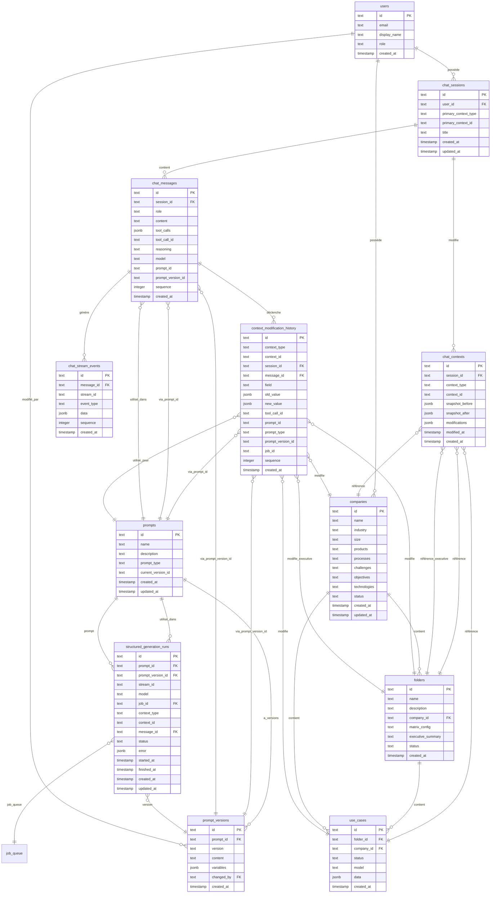

## Spécification fonctionnelle (cas d'usage CU)

> **Résumé :** 21 cas d'usage identifiés (CU-001 à CU-021) couvrant : modification d'objets, historique, streaming reasoning, rejeu, gestion du contexte, switch de modèle, approfondissement, distinction appels structurés/sessions informelles, création d'objets via chat, consultation/recherche, annulation/rollback, multi-contexte, suggestions, export/partage, gestion de sessions, affichage dans les vues, contexte long, validation/confirmation, intégration queue, notifications/feedback, et gestion des erreurs.
        
- [x] **CU-001 : Modification d'objets existants via chat** (use case uniquement)
          - [x] Modification de `use_cases.data.*` via tool `update_usecase_field`
          - [x] Tool `read_usecase` pour lire l'état actuel
          - [ ] Modification de `folders` (à venir)
          - [ ] Modification de `companies` (à venir)
          - [ ] Modification de `executive_summary` (à venir)
          - [ ] Modification par regénération complète (à venir)
          - [ ] L'IA peut modifier plusieurs objets dans une même session (à venir)
- [x] **CU-002 : Historique et traçabilité** (partiel : prompts dans settings, pas de tables prompts/prompt_versions)
          - [x] Chaque objet est associé à son historique complet (primo génération, regénération, sessions interactives)
          - [x] Chaque action d'IA est stockée avec le prompt_id utilisé (dans settings.prompts JSON)
          - [x] `context_modification_history` stocke toutes les modifications
          - [x] `chat_contexts` stocke les snapshots avant/après
          - [x] `chat_stream_events` stocke le reasoning complet
          - [ ] Tables `prompts` et `prompt_versions` (prompts actuellement dans `settings.prompts` JSON)
- [x] **CU-003 : Affichage du reasoning en streaming**
          - [x] Les étapes de raisonnement de l'IA sont affichées en temps réel pendant la génération
          - [x] Le reasoning est streamé via PostgreSQL LISTEN/NOTIFY et affiché dans l'UI
          - [x] Le reasoning complet est stocké pour relecture ultérieure
- [x] **CU-004 : Rejeu de session (affichage)**
          - [x] Possibilité de rejouer une session complète pour voir l'évolution de la conversation
          - [x] Affichage des messages avec reasoning, tool calls, et modifications
          - [x] Endpoints `GET /api/v1/chat/sessions/:id/stream-events` (batch) et `GET /api/v1/chat/messages/:id/stream-events`
- [x] **CU-005 : Contexte et historique dans les sessions** (partiel : use case uniquement)
          - [x] `primaryContextType` et `primaryContextId` dans `chat_sessions`
          - [x] Détection automatique du contexte depuis la route (UI)
          - [x] Tool `read_usecase` pour accéder à l'état actuel
          - [x] Tool `update_usecase_field` pour modifier
          - [ ] Accès à l'historique des modifications de l'objet (via tools) (à venir)
          - [ ] Résumé du contexte si trop long (à venir)
- [ ] **CU-006 : Switch de modèle de langage dans les sessions**
          - [x] Le modèle utilisé pour chaque message est stocké dans `chat_messages.model`
          - [ ] L'utilisateur peut changer de modèle OpenAI en cours de session
          - [ ] L'utilisateur peut spécifier le modèle à utiliser pour la prochaine réponse
- [ ] **CU-007 : Approfondissement avec modèle supérieur**
          - [ ] L'utilisateur peut demander un approfondissement d'un objet avec une version supérieure du modèle
          - [ ] Le système peut suggérer automatiquement l'utilisation d'un modèle supérieur
- [x] **CU-008 : Appels IA structurés (prompts managés)** (partiel : streaming fonctionnel, pas de tables structured_generation_runs)
          - [x] Générations classiques utilisent le streaming (`executeWithToolsStream`)
          - [x] Événements dans `chat_stream_events` avec `message_id=null`
          - [x] `streamId` déterministes : `folder_<folderId>`, `usecase_<useCaseId>`, `company_<companyId>`
          - [x] Affichage dans les vues objets via `StreamMessage` (jobs)
          - [ ] Table `structured_generation_runs` (non créée)
          - [ ] Tables `prompts`/`prompt_versions` (prompts dans `settings.prompts` JSON)
- [ ] **CU-009 : Création d'objets via chat**
          - L'utilisateur ne peut PAS créer directement de nouveaux objets via le chat (pas de création directe)
          - L'IA peut suggérer la création d'objets basés sur la conversation (suggestion uniquement)
          - Les opérations de création/suppression/déplacement de fiches se font via des tools dans le chat
- [x] **CU-010 : Consultation et recherche (navigation historique chat)** (partiel : consultation via tools)
          - [x] L'utilisateur peut consulter les détails d'un objet via le chat (tool `read_usecase`)
          - [x] Tool `web_search` pour rechercher des informations
          - [x] Tool `web_extract` pour extraire le contenu des références
          - [ ] Recherche textuelle dans l'historique des sessions
          - [ ] Recherche dans les modifications d'un objet
- [ ] **CU-011 : Annulation et rollback**
          - [x] Snapshots `snapshot_before` et `snapshot_after` dans `chat_contexts` (infrastructure prête)
          - [ ] L'utilisateur peut annuler une modification en cours avant qu'elle soit appliquée
          - [ ] Système de rollback pour revenir à un état précédent d'un objet
          - [ ] Fonctionnalité de comparaison entre deux versions d'un objet (diff visuel)
- [ ] **CU-012 : Multi-contexte dans une session**
          - [x] Un seul contexte principal par session (`primaryContextType`, `primaryContextId`)
          - [ ] Une session peut modifier plusieurs objets différents
          - [ ] L'IA peut comprendre les relations hiérarchiques entre objets
- [ ] **CU-013 : Suggestions et recommandations**
          - L'IA peut suggérer des améliorations sur demande (pas proactif)
          - L'IA peut détecter des incohérences et proposer des corrections sur demande
          - L'IA peut suggérer des cas d'usage similaires ou complémentaires sur demande
          - Les suggestions sont explicites dans la conversation (pas implicites)
- [ ] **CU-014 : Export et partage**
          - Export d'une session de chat (format : JSON, Markdown, PDF) - fonctionnalité secondaire
          - Partage de sessions entre utilisateurs (collaboration)
          - Export de l'historique des modifications d'un objet pour audit - fonctionnalité secondaire
          - Les exports incluent le reasoning complet pour traçabilité
- [x] **CU-015 : Gestion des sessions** (partiel : création et suppression)
          - [x] Un utilisateur peut avoir plusieurs sessions actives pour le même objet
          - [x] Suppression de sessions (`DELETE /api/v1/chat/sessions/:id`)
          - [ ] Reprise d'une session interrompue (après déconnexion)
          - [ ] Renommage de sessions pour organisation
- [x] **CU-016 : Affichage dans les vues existantes** (partiel : streaming visible dans QueueMonitor)
          - [x] Streaming temps réel via SSE affiché dans QueueMonitor
          - [x] `StreamMessage` unifié pour chat et jobs
          - [ ] Onglet "Historique" dans les vues objets (folder, use case, company)
          - [ ] Liste des sessions ayant modifié l'objet
          - [ ] Lien direct depuis un objet vers la dernière session
          - [ ] Indicateur visuel (badge, icône) sur les objets modifiés via chat
- [ ] **CU-017 : Gestion du contexte long**
          - Limite de tokens pour le contexte envoyé à l'IA (fonction du modèle utilisé)
          - Résumé automatique du contexte si la session devient trop longue (à terme, fonctionnalité future)
          - Sélection manuelle des messages à inclure dans le contexte (fonctionnalité secondaire)
          - Système de "mémoire" persistante pour les objets (résumé des modifications importantes)
- [ ] **CU-018 : Validation et confirmation**
          - [x] Modifications appliquées directement (pas de confirmation)
          - [ ] Confirmation explicite avant d'appliquer une modification (bouton "Appliquer")
          - [ ] Preview des modifications avant application (diff visuel)
          - [ ] Mode "auto-apply" pour les modifications mineures et confirmation pour les majeures
- [x] **CU-019 : Intégration avec la queue existante** (partiel : jobs chat dans queue)
          - [x] Les générations via chat utilisent la même queue (`job_queue`)
          - [x] Affichage du statut de la queue dans l'interface chat (QueueMonitor)
          - [ ] Priorité différente pour les générations chat
          - [ ] Les générations chat sont annulables via la queue
- [x] **CU-020 : Notifications et feedback** (partiel : notifications SSE)
          - [x] Notifications en temps réel via SSE (events `usecase_update`, etc.)
          - [x] Refresh automatique de l'UI après modification
          - [ ] Toast/badge pour notifications visuelles
          - [ ] Feedback utilisateur sur la qualité des suggestions de l'IA (👍/👎)
- [x] **CU-021 : Gestion des erreurs** (partiel : erreurs affichées)
          - [x] Messages d'erreur dans le stream (`error` event)
          - [x] Affichage des erreurs dans `StreamMessage`
          - [ ] Retry automatique avec correction pour les erreurs récupérables
          - [ ] Messages d'erreur clairs avec suggestions de correction
- [ ] **CU-022 : Contexte documentaire attaché aux objets**
          - [ ] Attacher un ou plusieurs documents à une entreprise, un dossier ou un cas d'usage
          - [ ] Upload avec résumé automatique (0,1k token/page)
          - [ ] Consultation des métadonnées et du résumé

## Streaming OpenAI → DB → NOTIFY → SSE

- [x] Transport : appel OpenAI en streaming côté API/worker (Hono). Chaque chunk est écrit dans `chat_stream_events` puis un `NOTIFY` (payload minimal : `stream_id`, `sequence`, éventuellement `event_type`) signale la nouveauté. L'UI SvelteKit (SPA statique) consomme un endpoint SSE global `GET /api/v1/streams/sse` qui est abonné aux NOTIFY PG ; pas de forward direct OpenAI → SSE. Websocket optionnelle plus tard, SSE par défaut.
- [x] Identifiants de flux : `stream_id` = `message_id` pour sessions informelles ; pour appels structurés `stream_id` = `folder_<folderId>`, `usecase_<useCaseId>`, `company_<companyId>` (déterministes par entité).
- [x] Événements stockés dans `chat_stream_events` (ordre par `sequence` sur `stream_id`), `message_id` nullable pour appels structurés.

Types d'événements (payload JSON, clé `type` + `data`) :
- `reasoning_delta` : `{ delta: string }` (tokens de reasoning)
- `content_delta` : `{ delta: string }` (tokens assistant)
- `tool_call_start` : `{ tool_call_id, name, args }`
- `tool_call_delta` : `{ tool_call_id, delta }`
- `tool_call_result` : `{ tool_call_id, result }`
- `status` : `{ state: 'started' | 'queued' | 'running' | 'succeeded' | 'failed' | 'cancelled', job_id? }`
- `error` : `{ code?, message }`
- `done` : `{}` (fin de flux)

Persisté :
- `chat_stream_events`: `stream_id`, `message_id` (nullable), `event_type`, `data`, `sequence`.
- `structured_generation_runs`: `stream_id`, `status`, `job_id`, `prompt_version_id`, `context_type/id`, timestamps.
- PG LISTEN/NOTIFY : sert uniquement de signal temps réel (pas de stockage). Le payload complet reste dans la base (`chat_stream_events`). Si le payload NOTIFY dépasse 8k, on envoie uniquement un pointeur (`stream_id`, `sequence`) et le SSE relit l’event en base.

Règles :
- Séquence strictement croissante par `stream_id`.
- `status.started` dès ouverture de flux, `done` ou `error` clôture.
- Tool calls : `tool_call_start` puis zéro ou plusieurs `tool_call_delta`, puis `tool_call_result`.
- Les deltas reasoning/content sont alternables, l’UI agrège.

## Composants UI & Streaming (SvelteKit)

- [x] **Composants clés implémentés** :
  - [x] `StreamMessage.svelte` : composant unifié pour chat et jobs, affiche reasoning en cours, contenu généré, et sous-sections pour tool calls (start/deltas/result)
  - [x] `ChatWidget.svelte` : widget flottant global (bulle + panneau) avec switch Chat ↔ QueueMonitor
  - [x] `ChatPanel.svelte` : liste sessions + messages + composer
  - [x] `QueueMonitor.svelte` : affichage des jobs avec streaming
  - [x] Historique streaming : reconstruit depuis `chat_stream_events` pour rejouer (via `historySource="chat"` ou `historySource="stream"`)
  - [ ] `DiffViewer.svelte` : avant/après sur objets (à venir)
  - [ ] Barre de contrôle : choix du modèle, arrêt/annulation (à venir)

- [x] **Architecture simplifiée** : Composants intégrés dans l'app au lieu d'un module autonome. `StreamMessage` unifie chat et jobs.

- [x] **SSE global** : Endpoint unique `GET /api/v1/streams/sse` avec filtrage côté client par `streamId` (au lieu d'endpoints dédiés par stream).

## Archi technique (queue + PG LISTEN/Notify)

- [x] **Chemin happy path (session informelle)** :
  1. `POST /api/v1/chat/messages` → crée `chat_message` (user), lance stream OpenAI (assistant) via job `chat_message` en queue
  2. Streaming → push `chat_stream_events` (+ NOTIFY) ; SSE global lit sur `stream_id` (filtrage client)
  3. Tool call éventuel → exécution, puis `context_modification_history` + snapshots dans `chat_contexts`
  4. Fin : `done` + update status (message/stream)

- [x] **Chemin appels structurés (générations classiques)** :
  1. Générations classiques (use_case_list, use_case_detail, executive_summary, company_enrich) → job en queue
  2. Worker exécute OpenAI stream → écrit `chat_stream_events` (message_id null) avec `streamId` déterministe (`folder_<id>`, `usecase_<id>`, etc.)
  3. Modifications → `context_modification_history` (session_id null pour générations classiques)
  4. NOTIFY → SSE client abonné au `stream_id` via endpoint global

- [ ] **Annulation / erreurs** :
  - [x] `error` event envoyé, propagation UI
  - [ ] Annulation via `job_id` (cancel queue + stop stream)

- [x] **Index/contraintes** :
  - [x] `chat_stream_events(stream_id, sequence)` unique
  - [ ] `structured_generation_runs` (table non créée)


## Modèle de données

### Schéma de base de données

Le modèle de données pour le chatbot permet de :
- Gérer les sessions de chat utilisateur
- Lier les sessions aux objets métier (companies, folders, usecases, executive_summary)
- Stocker l'historique complet des messages avec reasoning
- Tracker les modifications d'objets via les sessions
- Permettre le rejeu de sessions
- Streamer les réponses en temps réel via PostgreSQL LISTEN/NOTIFY

#### Tables documents contextuels (à ajouter)
- `context_documents` : id, context_type (company|folder|usecase), context_id, filename, mime_type, size_bytes, storage_key (S3/MinIO), status (`uploaded|processing|ready|failed`), summary, summary_lang, prompt_id/prompt_version_id pour le résumé, created_at/updated_at, version.
- `context_document_versions` (optionnel) : historique des fichiers/résumés (document_id, version, summary, storage_key, created_at).
- Traçabilité : events `document_added` / `document_summarized` dans `context_modification_history` (avec prompt_version_id du résumé et job_id du résumé).

### Diagramme ERD



### Tables principales

#### Tables créées ✅
- [x] `chat_sessions`
- [x] `chat_messages`
- [x] `chat_contexts`
- [x] `chat_stream_events`
- [x] `context_modification_history`

#### Tables non créées (prévues)
- [ ] `structured_generation_runs` (générations classiques trackées via `chat_stream_events` avec `message_id=null`)
- [ ] `prompts` (prompts actuellement dans `settings.prompts` JSON)
- [ ] `prompt_versions` (prompts actuellement dans `settings.prompts` JSON)
- [ ] `context_documents` (prévu Lot B)

#### `chat_sessions`
Table principale pour les sessions de chat utilisateur.

**Colonnes :**
- `id` (PK) : Identifiant unique de la session
- `user_id` (FK → users.id) : Utilisateur propriétaire de la session
- `primary_context_type` : Type du contexte principal ('company' | 'folder' | 'usecase' | 'executive_summary')
- `primary_context_id` : ID de l'objet principal (facilite les requêtes)
- `title` : Titre de la session (peut être généré automatiquement)
- `created_at` : Date de création
- `updated_at` : Date de dernière mise à jour

**Index :**
- `chat_sessions_user_id_idx` : Sur `user_id`
- `chat_sessions_primary_context_idx` : Sur `primary_context_type, primary_context_id`

#### `chat_messages`
Messages de la conversation (utilisateur et assistant).

**Colonnes :**
- `id` (PK) : Identifiant unique du message
- `session_id` (FK → chat_sessions.id) : Session à laquelle appartient le message
- `role` : Rôle du message ('user' | 'assistant' | 'system' | 'tool')
- `content` : Contenu textuel du message (peut être null pour tool calls)
- `tool_calls` (JSONB) : Appels d'outils effectués (array de tool calls OpenAI)
- `tool_call_id` : ID du tool call si ce message est un résultat d'outil
- `reasoning` : Tokens de reasoning (pour modèles avec reasoning comme o1)
- `model` : Modèle OpenAI utilisé pour cette réponse
- `prompt_id` : ID du prompt utilisé (référence aux prompts dans settings)
- `prompt_version_id` (FK → prompt_versions.id) : Version précise du prompt utilisé (nullable pour sessions informelles)
- `sequence` : Ordre du message dans la conversation
- `created_at` : Date de création

**Index :**
- `chat_messages_session_id_idx` : Sur `session_id`
- `chat_messages_sequence_idx` : Sur `session_id, sequence`
- `chat_messages_prompt_version_idx` : Sur `prompt_version_id`

#### `chat_contexts`
Table de liaison entre les sessions de chat et les objets métier modifiés.

**Colonnes :**
- `id` (PK) : Identifiant unique
- `session_id` (FK → chat_sessions.id) : Session qui modifie l'objet
- `context_type` : Type d'objet ('company' | 'folder' | 'usecase' | 'executive_summary')
- `context_id` : ID de l'objet modifié
- `snapshot_before` (JSONB) : État de l'objet avant modification (pour comparaison/revert)
- `snapshot_after` (JSONB) : État de l'objet après modification
- `modifications` (JSONB) : Détail des champs modifiés et leurs valeurs
- `modified_at` : Date de dernière modification
- `created_at` : Date de création

**Index :**
- `chat_contexts_session_id_idx` : Sur `session_id`
- `chat_contexts_context_idx` : Sur `context_type, context_id`
- `chat_contexts_context_type_id_idx` : Sur `context_type, context_id` (composite)

**Relations :**
- `context_type='company'` + `context_id` → référence `companies.id`
- `context_type='folder'` + `context_id` → référence `folders.id`
- `context_type='usecase'` + `context_id` → référence `use_cases.id`
- `context_type='executive_summary'` + `context_id` → référence `folders.id` (executive_summary est dans folders)

#### `chat_stream_events`
Événements de streaming en temps réel pour chaque message ou appel structuré.

**Colonnes :**
- `id` (PK) : Identifiant unique
- `message_id` (FK → chat_messages.id, nullable) : Message associé (nullable pour appels structurés)
- `stream_id` : Identifiant du stream (message_id pour sessions, `folder_<folderId>`, `usecase_<useCaseId>`, `company_<companyId>` pour appels structurés)
- `event_type` : Type d'événement ('content_delta' | 'reasoning_delta' | 'tool_call_start' | 'tool_call_delta' | 'tool_call_result' | 'status' | 'error' | 'done')
- `data` (JSONB) : Données de l'événement (delta, tool call, etc.)
- `sequence` : Ordre des événements pour ce stream
- `created_at` : Date de création

**Index :**
- `chat_stream_events_message_id_idx` : Sur `message_id`
- `chat_stream_events_stream_id_idx` : Sur `stream_id`
- `chat_stream_events_sequence_idx` : Sur `stream_id, sequence`

**Utilisation :**
- Stockage des événements pour relecture (sessions informelles et appels structurés)
- Notification via PostgreSQL NOTIFY pour streaming temps réel
- Permet de reconstruire le flux complet d'une réponse
- **Note** : Pour les appels structurés, `message_id` est null et `stream_id` est déterministe par entité (`folder_<id>`, `usecase_<id>`, etc.)

#### `context_modification_history`
Historique détaillé de toutes les modifications d'objets (toutes sessions confondues).

**Colonnes :**
- `id` (PK) : Identifiant unique
- `context_type` : Type d'objet modifié ('company' | 'folder' | 'usecase' | 'executive_summary')
- `context_id` : ID de l'objet modifié
- `session_id` (FK → chat_sessions.id) : Session qui a modifié (nullable si modification non liée à une session)
- `message_id` (FK → chat_messages.id) : Message qui a déclenché la modification (nullable)
- `field` : Nom du champ modifié (ex: 'name', 'description', 'data.value_scores')
- `old_value` (JSONB) : Ancienne valeur
- `new_value` (JSONB) : Nouvelle valeur
- `tool_call_id` : ID du tool call si modification via tool
- `prompt_id` : ID du prompt utilisé pour cette modification (obligatoire pour appels structurés)
- `prompt_type` : Type de prompt pour les appels structurés ('company_info' | 'folder_name' | 'use_case_list' | 'use_case_detail' | 'executive_summary') - nullable pour sessions informelles
- `prompt_version_id` (FK → prompt_versions.id) : Version exacte du prompt utilisée (obligatoire pour appels structurés)
- `job_id` (FK → job_queue.id) : Job de génération (appels structurés)
- `sequence` : Ordre des modifications pour cet objet
- `created_at` : Date de création

**Index :**
- `context_modification_history_context_idx` : Sur `context_type, context_id`
- `context_modification_history_session_id_idx` : Sur `session_id`
- `context_modification_history_sequence_idx` : Sur `context_type, context_id, sequence`

**Utilisation :**
- Historique complet des modifications d'un objet
- Traçabilité des changements par session (si `session_id` non null) ou par appel structuré (si `session_id` null)
- Permet de voir l'évolution d'un objet au fil du temps

**Distinction appels structurés vs sessions informelles :**
- **Appels structurés** : `session_id = null`, `prompt_id` obligatoire, `prompt_type` et `prompt_version_id` remplis, `job_id` renseigné si orchestré via la queue
  - Ce sont les générations classiques existantes (ex: `/api/v1/use-cases/generate`, `/api/v1/companies/ai-enrich`)
  - Types de prompts : 'company_info', 'folder_name', 'use_case_list', 'use_case_detail', 'executive_summary'
  - Ce sont des appels uniques avec system prompt fixe, trackés directement dans `context_modification_history` et `structured_generation_runs`
  - Pas de session de chat associée, pas de messages dans `chat_messages` (sauf si déclenché depuis une session : on garde `message_id` nullable)
  - Le streaming/reasoning est tracké via `chat_stream_events` avec identification spécifique (partage de modèle avec sessions informelles)
  - Affichage dans les vues objets : outil dépliable avec titre spécifique (ex: "Génération de la liste des cas d'usage")
  - Intégration dans sessions : via tool si l'IA décide de l'appeler (pas par défaut)
- **Sessions informelles** : `session_id` non null, `prompt_id` optionnel, `prompt_type` et `prompt_version_id` null
  - Conversations libres avec l'IA, trackées dans `chat_sessions` et `chat_messages`
  - Modifications via tools dans le contexte de la conversation

#### `prompts` (non créée, prompts dans `settings.prompts` JSON)
Table prévue pour les prompts managés des appels IA structurés (générations classiques).

**État actuel** : Les prompts sont stockés dans `settings.prompts` (JSON). La table `prompts` permettra de normaliser et de tracker l'historique des versions.

**Mapping prompts → objets générés :**
- `company_info` → modifie `companies` (tous les champs : name, industry, size, products, processes, challenges, objectives, technologies)
- `folder_name` → modifie `folders` (name, description)
- `use_case_list` → crée plusieurs `use_cases` (name, description dans data JSONB)
- `use_case_detail` → modifie `use_cases` (tous les champs dans data JSONB + scoring)
- `executive_summary` → modifie `folders.executive_summary`

#### `prompt_versions` (non créée)
Table prévue pour l'historique des versions de chaque prompt pour traçabilité complète.

#### `structured_generation_runs` (non créée)
Table prévue pour la traçabilité opérationnelle d'un appel structuré (génération classique) et de son exécution.

**État actuel** : Les générations classiques sont trackées via `chat_stream_events` avec `message_id=null` et `streamId` déterministe. Le statut est géré via `job_queue`.

### Relations avec les objets métier existants

#### Companies
- **Relation** : `chat_contexts.context_type='company'` + `context_id=companies.id`
- **Modifications possibles** : Tous les champs de `companies` (name, industry, size, products, processes, challenges, objectives, technologies)
- **Historique** : Stocké dans `context_modification_history` avec `context_type='company'`

#### Folders
- **Relation** : `chat_contexts.context_type='folder'` + `context_id=folders.id`
- **Modifications possibles** : name, description, matrix_config, executive_summary
- **Historique** : Stocké dans `context_modification_history` avec `context_type='folder'`
- **Note** : `executive_summary` est stocké dans `folders.executive_summary` mais peut être traité comme un contexte séparé (`context_type='executive_summary'`)

#### Use Cases
- **Relation** : `chat_contexts.context_type='usecase'` + `context_id=use_cases.id`
- **Modifications possibles** : Tous les champs dans `use_cases.data` (JSONB) : name, description, problem, solution, domain, technologies, valueScores, complexityScores, etc.
- **Historique** : Stocké dans `context_modification_history` avec `context_type='usecase'`
- **Note** : Les modifications de champs dans `data` JSONB sont trackées avec `field` comme 'data.name', 'data.valueScores', etc.

### Exemples d'utilisation

#### Créer une session pour modifier un folder
```typescript
const sessionId = await createChatSession({
  userId: 'user-123',
  contextType: 'folder',
  contextId: 'folder-456',
  title: 'Modification du dossier IA Manufacturing'
});
```

#### Envoyer un message et streamer la réponse
```typescript
const { messageId, streamPromise } = await sendChatMessage({
  sessionId: 'session-789',
  content: 'Peux-tu améliorer la description du cas d\'usage X ?',
  model: 'o1-preview',
  promptId: 'use_case_detail'
});

// Écouter les événements de streaming
const eventSource = new EventSource(`/api/v1/chat/stream/${messageId}`);
eventSource.onmessage = (event) => {
  const data = JSON.parse(event.data);
  if (data.type === 'reasoning_delta') {
    console.log('Reasoning:', data.data.delta);
  } else if (data.type === 'content_delta') {
    console.log('Content:', data.data.delta);
  }
};
```

#### Récupérer l'historique des modifications d'un use case
```typescript
const history = await db
  .select()
  .from(contextModificationHistory)
  .where(
    and(
      eq(contextModificationHistory.contextType, 'usecase'),
      eq(contextModificationHistory.contextId, 'usecase-123')
    )
  )
  .orderBy(contextModificationHistory.sequence);
```

#### Rejouer une session complète
```typescript
const replay = await replayChatSession('session-789');
// Retourne tous les messages avec leur contenu, reasoning, tool calls, etc.
```

### Intégration avec les prompts

**État actuel** : Les prompts sont stockés dans `settings.prompts` (JSON). Les tables `prompts` et `prompt_versions` ne sont pas encore créées.

**Types de prompts disponibles (appels structurés) :**

| `prompt_id` | `prompt_type` | Objet généré | Description |
|-------------|---------------|--------------|-------------|
| `company_info` | `company_info` | `companies` | Enrichissement d'entreprise (name, industry, size, products, processes, challenges, objectives, technologies) |
| `folder_name` | `folder_name` | `folders` | Génération de nom et description de dossier |
| `use_case_list` | `use_case_list` | `use_cases` (multiple) | Génération de liste de cas d'usage (titre + description) |
| `use_case_detail` | `use_case_detail` | `use_cases` (détail) | Génération détaillée d'un cas d'usage avec scoring (data JSONB) |
| `executive_summary` | `executive_summary` | `folders.executive_summary` | Génération de synthèse exécutive complète d'un dossier |

### Flux de données

#### Sessions informelles (chat)
1. **Création de session** → `chat_sessions` + `chat_contexts`
2. **Envoi de message** → `chat_messages` (user) + streaming → `chat_messages` (assistant) + `chat_stream_events`
3. **Modification d'objet via tool** → `context_modification_history` (avec `session_id`) + mise à jour de l'objet (companies/folders/use_cases)
4. **Notification temps réel** → PostgreSQL NOTIFY → Client via SSE
5. **Relecture** → `chat_stream_events` pour reconstruire le flux
6. **Historique** → `context_modification_history` pour voir toutes les modifications d'un objet

#### Appels structurés (générations classiques)
1. **Appel IA structuré** → Appel OpenAI avec system prompt fixe (ex: `use_case_detail`, `company_info`, `folder_name`, `use_case_list`, `executive_summary`)
2. **Prompt utilisé** → Référence dans `settings.prompts` JSON (tables `prompts`/`prompt_versions` non créées)
3. **Streaming** → `chat_stream_events` (avec `message_id=null`, `stream_id` = `folder_<folderId>`, `usecase_<useCaseId>`, `company_<companyId>` - déterministe par entité)
4. **Traçabilité run** → Via `job_queue` et `chat_stream_events` (table `structured_generation_runs` non créée)
5. **Modification d'objet** → `context_modification_history` (avec `session_id=null` pour générations classiques) + mise à jour de l'objet
6. **Notification temps réel** → PostgreSQL NOTIFY → Client via SSE global (même mécanisme)
7. **Historique** → `context_modification_history` pour voir toutes les modifications (appels structurés + sessions)

#### Documents contextuels
1. **Upload** → POST `/api/documents` (context_type/id, fichier) → stockage S3/MinIO, enregistrement `context_documents` (status=uploaded)
2. **Résumé auto** → Job queue “document_summary” lancé immédiatement (prompt résumé versionné, 0,1k token/page, langue configurable, défaut FR) → update `context_documents` (status=processing→ready/failed, summary, prompt_version_id, job_id) + event `document_summarized`
3. **Consultation** → GET `/api/documents?context_type=&context_id=` + GET `/api/documents/:id` (métadonnées + résumé) ; pas de viewer riche (download simple via GET `/api/documents/:id/content` si nécessaire)
4. **Notifications** → l’IA est notifiée à l’upload pour accusé de réception ; le traitement cas d’usage qui dépend du doc attend le statut ready (résumé disponible)
5. **Traçabilité** → `context_modification_history` events `document_added` / `document_summarized` avec `prompt_version_id` et `job_id`

## Étude d'impact technique (ancrage API/UI/DB/queue)

- [x] **Base de données** :
  - [x] Schéma principal : `api/src/db/schema.ts` avec tables `chat_sessions`, `chat_messages`, `chat_contexts`, `chat_stream_events`, `context_modification_history`
  - [x] Index/contrainte : `chat_stream_events(stream_id, sequence)` unique ; snapshots `chat_contexts`
  - [ ] Tables `prompts`, `prompt_versions`, `structured_generation_runs` (non créées, prompts dans `settings.prompts` JSON)

- [x] **Queue** :
  - [x] Jobs `chat_message` dans la queue
  - [x] Générations classiques via queue avec streaming
  - [ ] Annulation via queue (à finaliser)

- [x] **API (Hono)** :
  - [x] Router `api/src/routes/api/chat.ts` monté dans `api/src/routes/api/index.ts`
  - [x] Endpoints : `POST /api/v1/chat/messages`, `GET /api/v1/chat/sessions`, `GET /api/v1/chat/sessions/:id/messages`, `GET /api/v1/chat/sessions/:id/stream-events`, `GET /api/v1/chat/messages/:id/stream-events`, `DELETE /api/v1/chat/sessions/:id`
  - [x] Endpoint SSE global : `GET /api/v1/streams/sse`
  - [x] Endpoint historique : `GET /api/v1/streams/events/:streamId`
  - [x] Services : `chat-service.ts`, `stream-service.ts`, `tool-service.ts`
  - [ ] Routes documents (prévu Lot B)

- [x] **Backend streaming** :
  - [x] SSE handler global (`GET /api/v1/streams/sse`), abonnements PG LISTEN/NOTIFY
  - [x] Écriture `chat_stream_events` au fil du stream + NOTIFY avec payload minimal

- [x] **UI (SvelteKit)** :
  - [x] Composants intégrés : `ChatWidget.svelte`, `ChatPanel.svelte`, `StreamMessage.svelte`, `QueueMonitor.svelte`
  - [x] Chat global disponible partout via `+layout.svelte`
  - [x] Détection automatique du contexte depuis la route
  - [ ] Bloc "Documents" sur les pages objets (prévu Lot B)

- [x] **Tests** :
  - [x] Tests unitaires API (agrégation SSE, tool calls)
  - [x] Tests d'intégration API (endpoints chat, streams, tool calls)
  - [x] Tests unitaires UI (`streamHub` store)
  - [x] Tests E2E Playwright (chat/stream/tool-calls)

## Lots orientés valeur (workplan livrable)

### Lot A — "Mise à jour ciblée d'un objet" ✅ Terminé (fonctionnel + tests)

**Valeur** : Démonstration client dès le premier incrément. L'IA propose et applique une amélioration ciblée sur un objet métier existant avec reasoning temps réel et traçabilité.

**Portée fonctionnelle** : Mise à jour de `use_cases.data.*` via tool `update_usecase_field` (use case uniquement).

**Implémenté** :
- [x] API : POST `/api/v1/chat/messages` (chat informel) + SSE global `/api/v1/streams/sse`
- [x] Tools : `read_usecase`, `update_usecase_field`, `web_search`, `web_extract`
- [x] Rehydratation : GET `/api/v1/chat/sessions/:id/stream-events` (batch) et GET `/api/v1/chat/messages/:id/stream-events`
- [x] UI : `ChatWidget` (bulle + panneau), `ChatPanel` (sessions + messages), `StreamMessage` (reasoning + content + tools)
- [x] Détection automatique du contexte depuis la route
- [x] Données : `chat_stream_events` rempli (reasoning/content/tools), `context_modification_history` écrit pour l'update, snapshots dans `chat_contexts`
- [x] Refresh automatique de l'UI après modification (SSE events)
- [x] Tests unitaires API (`stream-service`, `tool-service`, `tools`)
- [x] Tests d'intégration API (endpoints chat, streams, tool calls)
- [x] Tests unitaires UI (`streamHub` store)
- [x] Tests E2E Playwright (chat, tool calls, génération IA)

**À venir** :
- [ ] Extension aux autres objets (folder, company, executive_summary)

**Couverture CU** : CU-001 (use case), CU-002 (partiel), CU-003, CU-004, CU-005 (use case), CU-010 (partiel), CU-015 (partiel), CU-016 (partiel), CU-019 (partiel), CU-020 (partiel), CU-021 (partiel)

### Lot B — "Contexte documentaire (ingestion + résumé + consultation)"

**Valeur** : Attacher des documents aux objets (company/folder/usecase), lancer automatiquement un résumé (0,1k token/page, langue configurable, défaut FR), consulter le résumé et le statut.

**Couverture CU** : CU-022

**À implémenter** :
- [ ] API : POST `/api/documents` (upload + context_type/id) ; GET `/api/documents?context_type=&context_id=` (liste) ; GET `/api/documents/:id` (meta+résumé) ; GET `/api/documents/:id/content` (download)
- [ ] Job queue "document_summary" déclenché à l'upload ; statut dans `context_documents` ; events `document_added` / `document_summarized`
- [ ] Tables `context_documents` (+ option `context_document_versions`) ; stockage S3/MinIO
- [ ] UI : Bloc "Documents" dans les pages objets (dossiers, cas d'usage, entreprises) : upload, liste, statut, résumé
- [ ] Tests : Unit/int/E2E pour upload → job résumé → statut ready/failed

### Lot C — "Tool-calls parallèles et appels structurés"

**Valeur** : Lancer plusieurs actions en parallèle, voir statut/annuler, appliquer. Finaliser la traçabilité des appels structurés.

**Couverture CU** : CU-008 (finalisation), CU-011 (annulation), CU-012 (multi-contexte), CU-019 (annulation queue)

**Partiellement implémenté** :
- [x] Tool calls parallèles fonctionnels (boucle itérative dans `runAssistantGeneration`)
- [x] Affichage des tool calls dans `StreamMessage` (accordéon par tool_call_id)
- [x] Générations classiques streamées via `chat_stream_events` (message_id null)

**À implémenter** :
- [ ] Table `structured_generation_runs` pour traçabilité complète
- [ ] Tables `prompts`/`prompt_versions` pour versioning des prompts
- [ ] Endpoint POST `/api/structured/:prompt_id` pour appels structurés dédiés
- [ ] Annulation via queue (PATCH `/api/structured/:run_id/cancel`)
- [ ] Multi-contexte dans une session (plusieurs objets)
- [ ] **UndoBar** : Bouton "Annuler" + preview de la dernière modification (via `context_modification_history` + `chat_contexts`), option confirmation humaine pour actions ⚠️
- [ ] Tests : Unit/int/E2E pour appels structurés parallèles, annulation

### Lot D — "Audit, diff et résilience"

**Valeur** : L'utilisateur visualise les diffs, peut rollback, UI intégrée au thème, résilience accrue.

**Couverture CU** : CU-011 (rollback), CU-016 (onglet Historique), CU-017 (contexte long), CU-018 (validation/confirmation)

**Infrastructure prête** :
- [x] Snapshots `snapshot_before` et `snapshot_after` dans `chat_contexts`
- [x] Resync SSE fonctionnel (via `historySource` et endpoints batch)

**À implémenter** :
- [ ] Composant `DiffViewer` pour afficher les différences avant/après
- [ ] Rollback via snapshots (API + UI)
- [ ] Onglet "Historique" dans les vues objets (folder, use case, company)
- [ ] Liste des sessions ayant modifié l'objet
- [ ] Preview des modifications avant application (diff visuel)
- [ ] Confirmation explicite avant d'appliquer une modification (bouton "Appliquer")
- [ ] Gestion du contexte long (limite tokens, résumé automatique)
- [ ] Tests : Unit/int/E2E pour diff/rollback, reprise SSE

### Lot E — "Robustesse + fonctionnalités avancées"

**Valeur** : Parcours complet testé E2E, fonctionnalités avancées (switch modèle, suggestions, export, voix).

**Couverture CU** : CU-006 (switch modèle), CU-007 (approfondissement), CU-009 (création objets), CU-013 (suggestions), CU-014 (export/partage), CU-017 (contexte long), CU-020 (feedback), CU-021 (gestion erreurs améliorée)

**À implémenter** :
- [ ] Switch de modèle dans les sessions (UI + API)
- [ ] Approfondissement avec modèle supérieur
- [ ] Création d'objets via chat (tools)
- [ ] Suggestions et recommandations (IA proactive)
- [ ] Export et partage (JSON, Markdown, PDF)
- [ ] Feedback utilisateur (👍/👎) sur les suggestions
- [ ] Retry automatique avec correction pour erreurs récupérables
- [ ] Extension voix : stub `audio_chunk` (type d'événement) côté SSE
- [ ] Tests : Unit/int/E2E couvrant un flux complet (chat + structured + tool-calls + rollback)