## Spécification fonctionnelle (cas d'usage CU)

> **Résumé :** 21 cas d'usage identifiés (CU-001 à CU-021) couvrant : modification d'objets, historique, streaming reasoning, rejeu, gestion du contexte, switch de modèle, approfondissement, distinction appels structurés/sessions informelles, création d'objets via chat, consultation/recherche, annulation/rollback, multi-contexte, suggestions, export/partage, gestion de sessions, affichage dans les vues, contexte long, validation/confirmation, intégration queue, notifications/feedback, et gestion des erreurs.
        
- [ ] **CU-001 : Modification d'objets existants via chat**
          - Les objets (dossier, cas d'usage, synthèse exécutive, entreprise) peuvent être modifiés via des sessions de chat utilisateur via des tools
          - Modification par regénération complète ou modification ciblée d'un ensemble de champs
          - L'IA peut modifier plusieurs objets dans une même session
- [ ] **CU-002 : Historique et traçabilité**
          - Chaque objet est associé à son historique complet (primo génération, regénération, sessions interactives)
          - Chaque action d'IA (primo ou re-génération) est stockée avec le prompt_id utilisé
          - Chaque prompt_id est associé à un type de génération (entreprise, liste de cas, cas d'usage, synthèse)
- [ ] **CU-003 : Affichage du reasoning en streaming**
          - Les étapes de raisonnement de l'IA sont affichées en temps réel pendant la génération
          - Le reasoning est streamé via PostgreSQL LISTEN/NOTIFY et affiché dans l'UI
          - Le reasoning complet est stocké pour relecture ultérieure
- [ ] **CU-004 : Rejeu de session (affichage)**
          - Possibilité de rejouer une session complète pour voir l'évolution de la conversation
          - Affichage des messages avec reasoning, tool calls, et modifications
- [ ] **CU-005 : Contexte et historique dans les sessions**
          - Pour chaque objet, l'IA d'une session a accès à l'historique de la session (éventuellement résumé si contexte trop long)
          - L'IA peut accéder à l'historique des modifications de l'objet (via tools)
          - L'IA peut actionner les modifications des objets via des tools
- [ ] **CU-006 : Switch de modèle de langage dans les sessions**
          - L'utilisateur peut changer de modèle OpenAI en cours de session (ex: passer de gpt-4.1-nano à gpt-5)
          - Le modèle utilisé pour chaque message est stocké dans `chat_messages.model`
          - L'utilisateur peut spécifier le modèle à utiliser pour la prochaine réponse
          - L'historique de la session est préservé lors du changement de modèle
- [ ] **CU-007 : Approfondissement avec modèle supérieur**
          - L'utilisateur peut demander un approfondissement d'un objet avec une version supérieure du modèle
          - Exemple : "Approfondis ce cas d'usage avec gpt 5" (si généré initialement avec gpt-4.1-nano)
          - Le système peut suggérer automatiquement l'utilisation d'un modèle supérieur pour améliorer la qualité
          - Le modèle utilisé est tracké dans l'historique pour comparaison
- [ ] **CU-008 : Appels IA structurés (prompts managés)**
          - Les appels IA "structurés" sont les générations classiques existantes (distincts des sessions de chat informelles)
          - Types d'appels structurés : génération folder, cas d'usage, entreprise, synthèse exécutive
          - Chaque appel structuré utilise un system prompt fixe avec un `prompt_id` managé (ex: 'use_case_detail', 'company_info', 'folder_name', 'executive_summary')
          - Ces appels ne sont PAS des sessions de chat : ce sont des appels uniques trackés via `context_modification_history` avec `session_id=null`
          - Le `prompt_id` est obligatoire et associé à un type de génération spécifique
          - Le streaming et le reasoning sont trackés de la même manière que les sessions informelles (partage de modèle, identification spécifique dans les tables)
          - Identification requise : champ spécifique pour le type de prompt (entreprise, synthèse exec, folder, cas usage) et la version du prompt (puisqu'il est modifiable)
          - Affichage dans les vues objets : l'appel est vu comme un outil dépliable, comme une session de l'IA mais avec une vue spécifique et un titre (ex: "Génération de la liste des cas d'usage")
          - Intégration dans les sessions : lors d'une session, les appels structurés peuvent être intégrés via un tool en fonction de la demande utilisateur (l'IA décide d'appeler ou non le tool, pas par défaut)
          - L'historique des appels structurés est visible dans les vues objets (folder, use case, company) mais pas dans une interface de chat
- [ ] **CU-009 : Création d'objets via chat**
          - L'utilisateur ne peut PAS créer directement de nouveaux objets via le chat (pas de création directe)
          - L'IA peut suggérer la création d'objets basés sur la conversation (suggestion uniquement)
          - Les opérations de création/suppression/déplacement de fiches se font via des tools dans le chat
- [ ] **CU-010 : Consultation et recherche (navigation historique chat)**
          - L'utilisateur peut consulter les détails d'un objet via le chat (ex: "Montre-moi les détails du cas d'usage X")
          - L'IA peut lire et résumer le contenu d'un objet pour répondre aux questions
          - Recherche textuelle dans l'historique des sessions (avec ou sans chat)
          - Recherche dans les modifications d'un objet (ex: "Quand est-ce que j'ai modifié le champ 'description' ?")
- [ ] **CU-011 : Annulation et rollback**
          - L'utilisateur peut annuler une modification en cours avant qu'elle soit appliquée
          - Système de rollback pour revenir à un état précédent d'un objet (via snapshots dans `chat_contexts`)
          - Fonctionnalité de comparaison entre deux versions d'un objet (diff visuel)
          - Les snapshots `snapshot_before` et `snapshot_after` dans `chat_contexts` sont utilisés pour le rollback
- [ ] **CU-012 : Multi-contexte dans une session**
          - Une session peut modifier plusieurs objets différents (ex: un folder et ses use cases)
          - L'IA peut comprendre les relations hiérarchiques entre objets (ex: "améliore tous les cas d'usage de ce dossier")
          - Pas de limite stricte sur le nombre d'objets modifiables dans une session
          - Contexte partagé pour tous les objets modifiés dans la session
- [ ] **CU-013 : Suggestions et recommandations**
          - L'IA peut suggérer des améliorations sur demande (pas proactif)
          - L'IA peut détecter des incohérences et proposer des corrections sur demande
          - L'IA peut suggérer des cas d'usage similaires ou complémentaires sur demande
          - Les suggestions sont explicites dans la conversation (pas implicites)
- [ ] **CU-014 : Export et partage**
          - Export d'une session de chat (format : JSON, Markdown, PDF) - fonctionnalité secondaire
          - Partage de sessions entre utilisateurs (collaboration)
          - Export de l'historique des modifications d'un objet pour audit - fonctionnalité secondaire
          - Les exports incluent le reasoning complet pour traçabilité
- [ ] **CU-015 : Gestion des sessions**
          - Un utilisateur peut avoir plusieurs sessions actives pour le même objet
          - Reprise d'une session interrompue (après déconnexion)
          - Suppression de sessions (avec impact sur l'historique - les modifications restent dans `context_modification_history`)
          - Renommage de sessions pour organisation
          - Pas de limite stricte de sessions par utilisateur ou par objet
- [ ] **CU-016 : Affichage dans les vues existantes**
          - Dans chaque vue (folder, use case, company), onglet "Historique" avec toutes les sessions et appels structurés
          - Affichage de l'historique des interactions et prompts utilisés
          - Liste des sessions ayant modifié l'objet
          - Lien direct depuis un objet vers la dernière session qui l'a modifié
          - Indicateur visuel (badge, icône) sur les objets modifiés via chat
          - Résumé des modifications récentes dans la vue liste
- [ ] **CU-017 : Gestion du contexte long**
          - Limite de tokens pour le contexte envoyé à l'IA (fonction du modèle utilisé)
          - Résumé automatique du contexte si la session devient trop longue (à terme, fonctionnalité future)
          - Sélection manuelle des messages à inclure dans le contexte (fonctionnalité secondaire)
          - Système de "mémoire" persistante pour les objets (résumé des modifications importantes)
- [ ] **CU-018 : Validation et confirmation**
          - Confirmation explicite avant d'appliquer une modification (bouton "Appliquer")
          - Preview des modifications avant application (diff visuel)
          - Possibilité de modifier les suggestions de l'IA avant application
          - Mode "auto-apply" pour les modifications mineures et confirmation pour les majeures (à définir selon criticité)
- [ ] **CU-019 : Intégration avec la queue existante**
          - Les générations via chat utilisent la même queue (`job_queue`) que les générations classiques
          - Priorité différente pour les générations chat (plus urgentes que les générations classiques)
          - Affichage du statut de la queue dans l'interface chat
          - Les générations chat sont annulables via la queue
- [ ] **CU-020 : Notifications et feedback**
          - Notifications en temps réel quand une modification est appliquée (toast, badge)
          - Feedback utilisateur sur la qualité des suggestions de l'IA (👍/👎)
          - Le feedback est utilisé pour améliorer les suggestions futures (analyse et apprentissage)
          - Notification si une génération échoue ou prend trop de temps
- [ ] **CU-021 : Gestion des erreurs**
          - Si l'IA génère une modification invalide (JSON mal formé, scores hors limites) : message d'erreur clair avec suggestion de correction
          - Retry automatique avec correction pour les erreurs récupérables (ex: JSON mal formé)
          - Message d'erreur clair pour l'utilisateur avec suggestion de correction
          - Logging de toutes les erreurs pour analyse et amélioration
- [ ] Modéliser les données de session live / contexte mgt (objet) / historique
- [ ] Modéliser le streaming via la lib openai / exposition SSE (websocket optionnelle)
  - [ ] L'IA et ses étapes de raisonnement et appels aux tools doivent être prises en compte à toutes les étapes
- [ ] Modéliser les composants d'UI et le streaming (incluant reasoning tokens et tools) avec benchmark rapide (Vercel AI SDK / deepchat)
- [ ] Définir l'archi logicielle incluant la gestion de queue et PG LISTEN/Notify
- [ ] Formaliser le plan d'implémentation

## Streaming OpenAI → DB → NOTIFY → SSE

- Transport : appel OpenAI en streaming côté API/worker (Hono). Chaque chunk est écrit dans `chat_stream_events` puis un `NOTIFY` (payload minimal : `stream_id`, `sequence`, éventuellement `event_type`) signale la nouveauté. L’UI SvelteKit (SPA statique) consomme un endpoint SSE exposé par l’API backend qui est abonné aux NOTIFY PG ; pas de forward direct OpenAI → SSE. Websocket optionnelle plus tard, SSE par défaut.
- Identifiants de flux : `stream_id` = `message_id` pour sessions informelles ; pour appels structurés `stream_id` = `prompt_id` + timestamp (et consigné dans `structured_generation_runs`).
- Événements stockés dans `chat_stream_events` (ordre par `sequence` sur `stream_id`), `message_id` nullable pour appels structurés.

Types d'événements (payload JSON, clé `type` + `data`) :
- `reasoning_delta` : `{ delta: string }` (tokens de reasoning)
- `content_delta` : `{ delta: string }` (tokens assistant)
- `tool_call_start` : `{ tool_call_id, name, args }`
- `tool_call_delta` : `{ tool_call_id, delta }`
- `tool_call_result` : `{ tool_call_id, result }`
- `status` : `{ state: 'started' | 'queued' | 'running' | 'succeeded' | 'failed' | 'cancelled', job_id? }`
- `error` : `{ code?, message }`
- `done` : `{}` (fin de flux)

Persisté :
- `chat_stream_events`: `stream_id`, `message_id` (nullable), `event_type`, `data`, `sequence`.
- `structured_generation_runs`: `stream_id`, `status`, `job_id`, `prompt_version_id`, `context_type/id`, timestamps.
- PG LISTEN/NOTIFY : sert uniquement de signal temps réel (pas de stockage). Le payload complet reste dans la base (`chat_stream_events`). Si le payload NOTIFY dépasse 8k, on envoie uniquement un pointeur (`stream_id`, `sequence`) et le SSE relit l’event en base.

Règles :
- Séquence strictement croissante par `stream_id`.
- `status.started` dès ouverture de flux, `done` ou `error` clôture.
- Tool calls : `tool_call_start` puis zéro ou plusieurs `tool_call_delta`, puis `tool_call_result`.
- Les deltas reasoning/content sont alternables, l’UI agrège.

## Composants UI & Streaming (SvelteKit)

Composants clés :
- Timeline de message : affiche reasoning en cours, contenu généré, et sous-sections pour tool calls (start/deltas/result).
- Panneau outils : liste des tool calls avec statut et résultats.
- Diff viewer : avant/après sur objets quand une modification est appliquée.
- Barre de contrôle : choix du modèle, arrêt/annulation (envoie un cancel sur `job_id`), bascule session/structured call.
- Historique streaming : reconstruit depuis `chat_stream_events` pour rejouer.

Benchmark rapide libs :
- Vercel AI SDK (React-first) : non natif Svelte, partiellement réutilisable côté client SSE mais nécessiterait un wrapper.
- deepchat (React) : pas natif Svelte, valeur limitée. Conclusion : implé Svelte custom (SSE natif) pour garder contrôle reasoning/tool.

### Module Svelte autonome (réutilisable)

Objectif : un module "chat-stream" exportable, sans dépendance forte à l’app hôte (URLs, auth, stores globaux).

Découpage :
- Interfaces injectées :
  - `StreamSource` : abonnement SSE/EventSource (l’app fournit l’URL, headers, auth).
  - `StreamRepository` : `fetchSince(streamId, fromSequence)` pour resync/replay depuis la base.
- Logique/Store :
  - `createStreamController({ streamId, source, repository })` → store Svelte (état agrégé) + méthodes `start()`, `stop()`, `resync(fromSequence)`, `abort()`.
  - Agrégation des événements normalisés : `reasoning_delta`, `content_delta`, `tool_call_start/delta/result`, `status`, `error`, `done`.
  - Séquencement : dédupe par `sequence`, ordre strict par `stream_id`.
- UI (composants) :
  - `MessageStream.svelte` (reasoning + content en cours)
  - `ToolCalls.svelte` (liste/états des tool calls)
  - `StatusBadge.svelte` (queued/running/succeeded/failed/cancelled)
  - `DiffViewer.svelte` (optionnel, branché sur snapshots/modifs)
  - Slots/théming : props pour classes (Tailwind/CSS vars) et slots pour custom render (tool call, badge).

Contrat d’événements consommés (SSE) :
- Payload : `{ stream_id, sequence, type, data, message_id? }`
- Types : `reasoning_delta`, `content_delta`, `tool_call_start`, `tool_call_delta`, `tool_call_result`, `status`, `error`, `done`
- `message_id` nullable (appels structurés). `sequence` obligatoire.
- En cas de perte : `resync(fromSequence)` via `StreamRepository`.

Packaging :
- Dossier : `ui/src/lib/chat-stream/` (ou `ui/packages/chat-stream/` si publié).
- Exports (index.ts) : types d’événements, `createStreamController`, composants UI.
- Dépendances limitées : Svelte + éventuel polyfill EventSource (SSR). Pas de `$app`, pas de store global.

Annulation :
- `abort()` côté controller déclenche un handler ; l’app hôte effectue l’appel API d’annulation (via `job_id`).

Tests :
- Unit : agrégation des deltas, ordre/dupes, resync.
- Composant : rendu reasoning/content/tool, transitions d’état.
- Contract : typage strict des payloads d’événements.

#### Extensions pour modularité avancée

- Indépendance fournisseur IA : un mapper backend normalise tout flux (OpenAI ou autre) vers le contrat commun (`reasoning_delta`, `content_delta`, `tool_call_*`, `status`, `error`, `done`, optionnel `audio_chunk`). Le module Svelte ne dépend pas du fournisseur.
- Parallélisme tools / accordéon : `tool_call_id` sert de sous-flux. Le contrôleur route/agrège par `tool_call_id` et peut afficher/plier les tool calls indépendamment ; les séquences restent monotones par `stream_id` et, si besoin, par (tool_call_id, sequence).
- Voix (évolution) : ajouter le type `audio_chunk` (`{ format, chunk }`) dans le même contrat d’events. L’UI peut ignorer ou jouer via Web Audio. Persistable dans `chat_stream_events`.
- Métadonnées contextuelles : champ `meta` optionnel dans `data` (ex: langue, modalité, confiance). Permet d’ajouter des infos sans casser le contrat.
- Multi-flux logique : un `stream_id` principal + `tool_call_id` pour les sous-flux concurrents suffit. Introduire `sub_stream_id` seulement si un découplage complet est requis ; par défaut, privilégier `tool_call_id`.

## Archi technique (queue + PG LISTEN/Notify)

Chemin happy path (session informelle) :
1. `POST /api/chat/messages` → crée `chat_message` (user), lance stream OpenAI (assistant).
2. Streaming → push `chat_stream_events` (+ NOTIFY) ; SSE lit sur `stream_id`.
3. Tool call éventuel → exécution, puis `context_modification_history` + snapshots.
4. Fin : `done` + update status (message/stream).

Chemin appels structurés (générations classiques) :
1. `POST /api/structured/{prompt_id}` → crée `structured_generation_runs` (status=queued) + `job_queue`.
2. Worker exécute OpenAI stream → écrit `chat_stream_events` (message_id null) + update `structured_generation_runs.status`.
3. Modifications → `context_modification_history` (session_id null, prompt_version_id requis).
4. NOTIFY → SSE client abonné au `stream_id`.

Annulation / erreurs :
- Annulation via `job_id` (cancel queue + stop stream si possible).
- `error` event envoyé, `structured_generation_runs.status=failed`, propagation UI.

Index/contraintes :
- `chat_stream_events(stream_id, sequence)` unique.
- `structured_generation_runs(prompt_id, prompt_version_id, stream_id)` index pour lookup temps réel.


## Modèle de données

### Schéma de base de données

Le modèle de données pour le chatbot permet de :
- Gérer les sessions de chat utilisateur
- Lier les sessions aux objets métier (companies, folders, usecases, executive_summary)
- Stocker l'historique complet des messages avec reasoning
- Tracker les modifications d'objets via les sessions
- Permettre le rejeu de sessions
- Streamer les réponses en temps réel via PostgreSQL LISTEN/NOTIFY

### Diagramme ERD

```mermaid
erDiagram
    users ||--o{ chat_sessions : "possède"
    users ||--o{ companies : "possède"
    
    chat_sessions ||--o{ chat_messages : "contient"
    chat_sessions ||--o{ chat_contexts : "modifie"
    chat_messages ||--o{ chat_stream_events : "génère"
    chat_messages ||--o{ context_modification_history : "déclenche"
    
    chat_contexts }o--|| companies : "référence"
    chat_contexts }o--|| folders : "référence"
    chat_contexts }o--|| use_cases : "référence"
    chat_contexts }o--|| folders : "référence_executive"
    
    companies ||--o{ folders : "contient"
    folders ||--o{ use_cases : "contient"
    companies ||--o{ use_cases : "contient"
    
    context_modification_history }o--|| companies : "modifie"
    context_modification_history }o--|| folders : "modifie"
    context_modification_history }o--|| use_cases : "modifie"
    context_modification_history }o--|| folders : "modifie_executive"
    
    prompts ||--o{ prompt_versions : "a_versions"
    prompts ||--o{ chat_messages : "utilisé_dans"
    prompts ||--o{ context_modification_history : "utilisé_pour"
    prompts ||--o{ structured_generation_runs : "utilisé_dans"
    
    context_modification_history }o--|| prompts : "via_prompt_id"
    context_modification_history }o--|| prompt_versions : "via_prompt_version_id"
    chat_messages }o--|| prompts : "via_prompt_id"
    chat_messages }o--|| prompt_versions : "via_prompt_version_id"
    structured_generation_runs }o--|| prompts : "prompt"
    structured_generation_runs }o--|| prompt_versions : "version"
    structured_generation_runs }o--|| job_queue : "job_queue"
    prompt_versions }o--|| users : "modifié_par"
    
    users {
        text id PK
        text email
        text display_name
        text role
        timestamp created_at
    }
    
    companies {
        text id PK
        text name
        text industry
        text size
        text products
        text processes
        text challenges
        text objectives
        text technologies
        text status
        timestamp created_at
        timestamp updated_at
    }
    
    folders {
        text id PK
        text name
        text description
        text company_id FK
        text matrix_config
        text executive_summary
        text status
        timestamp created_at
    }
    
    use_cases {
        text id PK
        text folder_id FK
        text company_id FK
        text status
        text model
        jsonb data
        timestamp created_at
    }
    
    chat_sessions {
        text id PK
        text user_id FK
        text primary_context_type
        text primary_context_id
        text title
        timestamp created_at
        timestamp updated_at
    }
    
    chat_messages {
        text id PK
        text session_id FK
        text role
        text content
        jsonb tool_calls
        text tool_call_id
        text reasoning
        text model
        text prompt_id
        text prompt_version_id
        integer sequence
        timestamp created_at
    }
    
    chat_contexts {
        text id PK
        text session_id FK
        text context_type
        text context_id
        jsonb snapshot_before
        jsonb snapshot_after
        jsonb modifications
        timestamp modified_at
        timestamp created_at
    }
    
    chat_stream_events {
        text id PK
        text message_id FK
        text stream_id
        text event_type
        jsonb data
        integer sequence
        timestamp created_at
    }
    
    context_modification_history {
        text id PK
        text context_type
        text context_id
        text session_id FK
        text message_id FK
        text field
        jsonb old_value
        jsonb new_value
        text tool_call_id
        text prompt_id
        text prompt_type
        text prompt_version_id
        text job_id
        integer sequence
        timestamp created_at
    }
    
    prompts {
        text id PK
        text name
        text description
        text prompt_type
        text current_version_id
        timestamp created_at
        timestamp updated_at
    }
    
    prompt_versions {
        text id PK
        text prompt_id FK
        text version
        text content
        jsonb variables
        text changed_by FK
        timestamp created_at
    }
    
    structured_generation_runs {
        text id PK
        text prompt_id FK
        text prompt_version_id FK
        text stream_id
        text model
        text job_id FK
        text context_type
        text context_id
        text message_id FK
        text status
        jsonb error
        timestamp started_at
        timestamp finished_at
        timestamp created_at
        timestamp updated_at
    }
```



### Tables principales

#### `chat_sessions`
Table principale pour les sessions de chat utilisateur.

**Colonnes :**
- `id` (PK) : Identifiant unique de la session
- `user_id` (FK → users.id) : Utilisateur propriétaire de la session
- `primary_context_type` : Type du contexte principal ('company' | 'folder' | 'usecase' | 'executive_summary')
- `primary_context_id` : ID de l'objet principal (facilite les requêtes)
- `title` : Titre de la session (peut être généré automatiquement)
- `created_at` : Date de création
- `updated_at` : Date de dernière mise à jour

**Index :**
- `chat_sessions_user_id_idx` : Sur `user_id`
- `chat_sessions_primary_context_idx` : Sur `primary_context_type, primary_context_id`

#### `chat_messages`
Messages de la conversation (utilisateur et assistant).

**Colonnes :**
- `id` (PK) : Identifiant unique du message
- `session_id` (FK → chat_sessions.id) : Session à laquelle appartient le message
- `role` : Rôle du message ('user' | 'assistant' | 'system' | 'tool')
- `content` : Contenu textuel du message (peut être null pour tool calls)
- `tool_calls` (JSONB) : Appels d'outils effectués (array de tool calls OpenAI)
- `tool_call_id` : ID du tool call si ce message est un résultat d'outil
- `reasoning` : Tokens de reasoning (pour modèles avec reasoning comme o1)
- `model` : Modèle OpenAI utilisé pour cette réponse
- `prompt_id` : ID du prompt utilisé (référence aux prompts dans settings)
- `prompt_version_id` (FK → prompt_versions.id) : Version précise du prompt utilisé (nullable pour sessions informelles)
- `sequence` : Ordre du message dans la conversation
- `created_at` : Date de création

**Index :**
- `chat_messages_session_id_idx` : Sur `session_id`
- `chat_messages_sequence_idx` : Sur `session_id, sequence`
- `chat_messages_prompt_version_idx` : Sur `prompt_version_id`

#### `chat_contexts`
Table de liaison entre les sessions de chat et les objets métier modifiés.

**Colonnes :**
- `id` (PK) : Identifiant unique
- `session_id` (FK → chat_sessions.id) : Session qui modifie l'objet
- `context_type` : Type d'objet ('company' | 'folder' | 'usecase' | 'executive_summary')
- `context_id` : ID de l'objet modifié
- `snapshot_before` (JSONB) : État de l'objet avant modification (pour comparaison/revert)
- `snapshot_after` (JSONB) : État de l'objet après modification
- `modifications` (JSONB) : Détail des champs modifiés et leurs valeurs
- `modified_at` : Date de dernière modification
- `created_at` : Date de création

**Index :**
- `chat_contexts_session_id_idx` : Sur `session_id`
- `chat_contexts_context_idx` : Sur `context_type, context_id`
- `chat_contexts_context_type_id_idx` : Sur `context_type, context_id` (composite)

**Relations :**
- `context_type='company'` + `context_id` → référence `companies.id`
- `context_type='folder'` + `context_id` → référence `folders.id`
- `context_type='usecase'` + `context_id` → référence `use_cases.id`
- `context_type='executive_summary'` + `context_id` → référence `folders.id` (executive_summary est dans folders)

#### `chat_stream_events`
Événements de streaming en temps réel pour chaque message ou appel structuré.

**Colonnes :**
- `id` (PK) : Identifiant unique
- `message_id` (FK → chat_messages.id, nullable) : Message associé (nullable pour appels structurés)
- `stream_id` : Identifiant du stream (message_id pour sessions, prompt_id + timestamp pour appels structurés)
- `event_type` : Type d'événement ('content_delta' | 'reasoning_delta' | 'tool_call_start' | 'tool_call_delta' | 'done')
- `data` (JSONB) : Données de l'événement (delta, tool call, etc.)
- `sequence` : Ordre des événements pour ce stream
- `created_at` : Date de création

**Index :**
- `chat_stream_events_message_id_idx` : Sur `message_id`
- `chat_stream_events_stream_id_idx` : Sur `stream_id`
- `chat_stream_events_sequence_idx` : Sur `stream_id, sequence`

**Utilisation :**
- Stockage des événements pour relecture (sessions informelles et appels structurés)
- Notification via PostgreSQL NOTIFY pour streaming temps réel
- Permet de reconstruire le flux complet d'une réponse
- **Note** : Pour les appels structurés, `message_id` est null et `stream_id` identifie le stream via `prompt_id` + timestamp

#### `context_modification_history`
Historique détaillé de toutes les modifications d'objets (toutes sessions confondues).

**Colonnes :**
- `id` (PK) : Identifiant unique
- `context_type` : Type d'objet modifié ('company' | 'folder' | 'usecase' | 'executive_summary')
- `context_id` : ID de l'objet modifié
- `session_id` (FK → chat_sessions.id) : Session qui a modifié (nullable si modification non liée à une session)
- `message_id` (FK → chat_messages.id) : Message qui a déclenché la modification (nullable)
- `field` : Nom du champ modifié (ex: 'name', 'description', 'data.value_scores')
- `old_value` (JSONB) : Ancienne valeur
- `new_value` (JSONB) : Nouvelle valeur
- `tool_call_id` : ID du tool call si modification via tool
- `prompt_id` : ID du prompt utilisé pour cette modification (obligatoire pour appels structurés)
- `prompt_type` : Type de prompt pour les appels structurés ('company_info' | 'folder_name' | 'use_case_list' | 'use_case_detail' | 'executive_summary') - nullable pour sessions informelles
- `prompt_version_id` (FK → prompt_versions.id) : Version exacte du prompt utilisée (obligatoire pour appels structurés)
- `job_id` (FK → job_queue.id) : Job de génération (appels structurés)
- `sequence` : Ordre des modifications pour cet objet
- `created_at` : Date de création

**Index :**
- `context_modification_history_context_idx` : Sur `context_type, context_id`
- `context_modification_history_session_id_idx` : Sur `session_id`
- `context_modification_history_sequence_idx` : Sur `context_type, context_id, sequence`

**Utilisation :**
- Historique complet des modifications d'un objet
- Traçabilité des changements par session (si `session_id` non null) ou par appel structuré (si `session_id` null)
- Permet de voir l'évolution d'un objet au fil du temps

**Distinction appels structurés vs sessions informelles :**
- **Appels structurés** : `session_id = null`, `prompt_id` obligatoire, `prompt_type` et `prompt_version_id` remplis, `job_id` renseigné si orchestré via la queue
  - Ce sont les générations classiques existantes (ex: `/api/v1/use-cases/generate`, `/api/v1/companies/ai-enrich`)
  - Types de prompts : 'company_info', 'folder_name', 'use_case_list', 'use_case_detail', 'executive_summary'
  - Ce sont des appels uniques avec system prompt fixe, trackés directement dans `context_modification_history` et `structured_generation_runs`
  - Pas de session de chat associée, pas de messages dans `chat_messages` (sauf si déclenché depuis une session : on garde `message_id` nullable)
  - Le streaming/reasoning est tracké via `chat_stream_events` avec identification spécifique (partage de modèle avec sessions informelles)
  - Affichage dans les vues objets : outil dépliable avec titre spécifique (ex: "Génération de la liste des cas d'usage")
  - Intégration dans sessions : via tool si l'IA décide de l'appeler (pas par défaut)
- **Sessions informelles** : `session_id` non null, `prompt_id` optionnel, `prompt_type` et `prompt_version_id` null
  - Conversations libres avec l'IA, trackées dans `chat_sessions` et `chat_messages`
  - Modifications via tools dans le contexte de la conversation

#### `prompts`
Table principale pour les prompts managés des appels IA structurés (générations classiques).

**Colonnes :**
- `id` (PK) : Identifiant unique du prompt (ex: 'company_info', 'folder_name', 'use_case_list', 'use_case_detail', 'executive_summary')
- `name` : Nom du prompt (ex: 'Enrichissement d'entreprise', 'Génération de nom de dossier')
- `description` : Description du prompt
- `prompt_type` : Type de prompt ('company_info' | 'folder_name' | 'use_case_list' | 'use_case_detail' | 'executive_summary')
- `current_version_id` (FK → prompt_versions.id) : Version actuelle du prompt
- `created_at` : Date de création
- `updated_at` : Date de dernière modification

**Index :**
- `prompts_prompt_type_idx` : Sur `prompt_type`

**Relations :**
- `chat_messages.prompt_id` → référence `prompts.id` (nullable, pour sessions informelles)
- `chat_messages.prompt_version_id` → référence `prompt_versions.id` (nullable, si prompt managé)
- `context_modification_history.prompt_id` → référence `prompts.id` (obligatoire pour appels structurés)
- `context_modification_history.prompt_type` → correspond à `prompts.prompt_type` pour identification rapide
- `context_modification_history.prompt_version_id` → référence `prompt_versions.id`

**Mapping prompts → objets générés :**
- `company_info` → modifie `companies` (tous les champs : name, industry, size, products, processes, challenges, objectives, technologies)
- `folder_name` → modifie `folders` (name, description)
- `use_case_list` → crée plusieurs `use_cases` (name, description dans data JSONB)
- `use_case_detail` → modifie `use_cases` (tous les champs dans data JSONB + scoring)
- `executive_summary` → modifie `folders.executive_summary`

**Note :** Actuellement, les prompts sont stockés dans `settings.prompts` (JSON avec clé 'prompts'). La table `prompts` permettra de normaliser et de tracker l'historique des versions.

#### `prompt_versions`
Historique des versions de chaque prompt pour traçabilité complète.

**Colonnes :**
- `id` (PK) : Identifiant unique de la version
- `prompt_id` (FK → prompts.id) : Prompt concerné
- `version` : Version du prompt (hash ou timestamp de modification)
- `content` : Contenu du prompt à cette version
- `variables` (JSONB) : Variables utilisées à cette version
- `changed_by` (FK → users.id) : Utilisateur qui a modifié le prompt
- `created_at` : Date de création de cette version

**Index :**
- `prompt_versions_prompt_id_idx` : Sur `prompt_id`
- `prompt_versions_version_idx` : Sur `prompt_id, version`
- `prompt_versions_prompt_id_version_unique` : Contrainte unique (`prompt_id`, `version`)

**Utilisation :**
- Historique complet de toutes les modifications de prompts
- Permet de savoir quelle version d'un prompt a été utilisée pour chaque génération
- Traçabilité des modifications via `changed_by`
- Permet de restaurer une version précédente si nécessaire

**Relation avec `context_modification_history` :**
- `context_modification_history.prompt_version_id` → FK vers `prompt_versions.id` (source de vérité)

#### `structured_generation_runs`
Traçabilité opérationnelle d'un appel structuré (génération classique) et de son exécution.

**Colonnes :**
- `id` (PK) : Identifiant unique du run
- `prompt_id` (FK → prompts.id) : Prompt utilisé
- `prompt_version_id` (FK → prompt_versions.id) : Version précise du prompt
- `stream_id` : Identifiant du flux de streaming (partagé avec `chat_stream_events`)
- `model` : Modèle OpenAI utilisé
- `job_id` (FK → job_queue.id) : Job planifié dans la queue (nullable si hors queue)
- `context_type` / `context_id` : Objet ciblé (optionnel pour lisibilité, doublon avec `context_modification_history`)
- `message_id` (FK → chat_messages.id, nullable) : Si déclenché depuis une session
- `status` : `queued` | `running` | `succeeded` | `failed` | `cancelled`
- `error` (JSONB, nullable) : Détail en cas d'échec
- `started_at` : Date de début d'exécution
- `finished_at` (nullable) : Date de fin
- `created_at` / `updated_at` : Traces système

**Index :**
- `structured_generation_runs_prompt_id_idx` : Sur `prompt_id`
- `structured_generation_runs_prompt_version_id_idx` : Sur `prompt_version_id`
- `structured_generation_runs_job_id_idx` : Sur `job_id`
- `structured_generation_runs_status_idx` : Sur `status`

**Utilisation :**
- Relier un appel structuré à son job queue + modèle + statut d'exécution.
- Alimenter les vues d'historique (statut, timings, erreurs).
- Permettre le suivi temps réel via `stream_id` (SSE/Notify).

### Relations avec les objets métier existants

#### Companies
- **Relation** : `chat_contexts.context_type='company'` + `context_id=companies.id`
- **Modifications possibles** : Tous les champs de `companies` (name, industry, size, products, processes, challenges, objectives, technologies)
- **Historique** : Stocké dans `context_modification_history` avec `context_type='company'`

#### Folders
- **Relation** : `chat_contexts.context_type='folder'` + `context_id=folders.id`
- **Modifications possibles** : name, description, matrix_config, executive_summary
- **Historique** : Stocké dans `context_modification_history` avec `context_type='folder'`
- **Note** : `executive_summary` est stocké dans `folders.executive_summary` mais peut être traité comme un contexte séparé (`context_type='executive_summary'`)

#### Use Cases
- **Relation** : `chat_contexts.context_type='usecase'` + `context_id=use_cases.id`
- **Modifications possibles** : Tous les champs dans `use_cases.data` (JSONB) : name, description, problem, solution, domain, technologies, valueScores, complexityScores, etc.
- **Historique** : Stocké dans `context_modification_history` avec `context_type='usecase'`
- **Note** : Les modifications de champs dans `data` JSONB sont trackées avec `field` comme 'data.name', 'data.valueScores', etc.

### Exemples d'utilisation

#### Créer une session pour modifier un folder
```typescript
const sessionId = await createChatSession({
  userId: 'user-123',
  contextType: 'folder',
  contextId: 'folder-456',
  title: 'Modification du dossier IA Manufacturing'
});
```

#### Envoyer un message et streamer la réponse
```typescript
const { messageId, streamPromise } = await sendChatMessage({
  sessionId: 'session-789',
  content: 'Peux-tu améliorer la description du cas d\'usage X ?',
  model: 'o1-preview',
  promptId: 'use_case_detail'
});

// Écouter les événements de streaming
const eventSource = new EventSource(`/api/v1/chat/stream/${messageId}`);
eventSource.onmessage = (event) => {
  const data = JSON.parse(event.data);
  if (data.type === 'reasoning_delta') {
    console.log('Reasoning:', data.data.delta);
  } else if (data.type === 'content_delta') {
    console.log('Content:', data.data.delta);
  }
};
```

#### Récupérer l'historique des modifications d'un use case
```typescript
const history = await db
  .select()
  .from(contextModificationHistory)
  .where(
    and(
      eq(contextModificationHistory.contextType, 'usecase'),
      eq(contextModificationHistory.contextId, 'usecase-123')
    )
  )
  .orderBy(contextModificationHistory.sequence);
```

#### Rejouer une session complète
```typescript
const replay = await replayChatSession('session-789');
// Retourne tous les messages avec leur contenu, reasoning, tool calls, etc.
```

### Intégration avec les prompts

Les prompts sont stockés dans la table `prompts` (avec historique dans `prompt_versions`) et référencés via `prompt_id` dans :
- `chat_messages.prompt_id` / `prompt_version_id` : Prompt et version utilisés pour générer ce message (optionnel pour sessions informelles)
- `context_modification_history.prompt_id` : Prompt utilisé pour cette modification (obligatoire pour appels structurés)
- `context_modification_history.prompt_version_id` : Version exacte du prompt utilisée (référence à `prompt_versions.id`)
- `structured_generation_runs.prompt_id` / `prompt_version_id` : Traçabilité d'exécution d'un appel structuré

**Note :** Actuellement, les prompts sont stockés dans `settings.prompts` (JSON). La migration vers les tables `prompts` et `prompt_versions` permettra une meilleure gestion et traçabilité de l'historique des versions.

**Types de prompts disponibles (appels structurés) :**

| `prompt_id` | `prompt_type` | Objet généré | Description |
|-------------|---------------|--------------|-------------|
| `company_info` | `company_info` | `companies` | Enrichissement d'entreprise (name, industry, size, products, processes, challenges, objectives, technologies) |
| `folder_name` | `folder_name` | `folders` | Génération de nom et description de dossier |
| `use_case_list` | `use_case_list` | `use_cases` (multiple) | Génération de liste de cas d'usage (titre + description) |
| `use_case_detail` | `use_case_detail` | `use_cases` (détail) | Génération détaillée d'un cas d'usage avec scoring (data JSONB) |
| `executive_summary` | `executive_summary` | `folders.executive_summary` | Génération de synthèse exécutive complète d'un dossier |

**Relations dans l'ERD :**
- `chat_messages.prompt_id` → référence `prompts.id` (nullable, pour sessions informelles)
- `chat_messages.prompt_version_id` → référence `prompt_versions.id` (nullable, si un prompt managé est utilisé)
- `context_modification_history.prompt_id` → référence `prompts.id` (obligatoire pour appels structurés)
- `context_modification_history.prompt_type` → correspond à `prompts.prompt_type` pour identification rapide
- `context_modification_history.prompt_version_id` → référence `prompt_versions.id` pour traçabilité des modifications de prompts
- `structured_generation_runs.prompt_id` / `prompt_version_id` → références `prompts` / `prompt_versions`
- `structured_generation_runs.job_id` → référence `job_queue.id`

**Note :** Les prompts sont actuellement stockés dans `settings.prompts` (JSON), mais l'ERD montre une table `prompts` conceptuelle pour clarifier les relations. Dans l'implémentation, les `prompt_id` référencent les IDs des prompts dans le JSON `settings.prompts`.

### Flux de données

#### Sessions informelles (chat)
1. **Création de session** → `chat_sessions` + `chat_contexts`
2. **Envoi de message** → `chat_messages` (user) + streaming → `chat_messages` (assistant) + `chat_stream_events`
3. **Modification d'objet via tool** → `context_modification_history` (avec `session_id`) + mise à jour de l'objet (companies/folders/use_cases)
4. **Notification temps réel** → PostgreSQL NOTIFY → Client via SSE
5. **Relecture** → `chat_stream_events` pour reconstruire le flux
6. **Historique** → `context_modification_history` pour voir toutes les modifications d'un objet

#### Appels structurés (prompts managés)
1. **Appel IA structuré** → Appel OpenAI avec system prompt fixe (ex: `use_case_detail`, `company_info`, `folder_name`, `use_case_list`, `executive_summary`)
2. **Prompt utilisé** → Référence à `prompts.id` + `prompt_versions.id` (stocké dans `settings.prompts` JSON) via `prompt_id` / `prompt_version_id`
3. **Streaming** → `chat_stream_events` (avec `message_id=null`, `stream_id` = `prompt_id` + timestamp pour identification)
4. **Traçabilité run** → `structured_generation_runs` (status, job_id, modèle, stream_id, context_type/id, prompt_version_id)
5. **Modification d'objet** → `context_modification_history` (avec `session_id=null`, `prompt_id` obligatoire, `prompt_type`, `prompt_version_id` remplis) + mise à jour de l'objet
6. **Notification temps réel** → PostgreSQL NOTIFY → Client via SSE (même mécanisme)
7. **Historique** → `context_modification_history` pour voir toutes les modifications (appels structurés + sessions)

## Étude d’impact technique (ancrage API/UI/DB/queue)

- Base de données :
  - Schéma principal : `api/src/db/schema.ts` (tables prompts, context_modification_history, job_queue, companies/folders/use_cases). Vérifier si `chat_stream_events`, `structured_generation_runs`, `chat_messages` sont présents ; sinon migrations à créer (`api/drizzle/*.sql` via `make db-generate`).
  - Index/contrainte : `chat_stream_events(stream_id, sequence)` unique ; colonnes `prompt_version_id`, `job_id` ; snapshots `chat_contexts`.
  - Migrations à ajouter dans `api/drizzle/` + mise à jour `api/src/db/ensure-indexes.ts` si nécessaire.

- Queue :
  - Implémentation existante : `api/src/routes/api/queue.ts`, services queue dans `api/src/services/` (à identifier), table `job_queue` (schema). Intégration : `structured_generation_runs` doit référencer `job_id`. Annulation : PATCH côté queue ou route dédiée.

- API (Hono) :
  - Nouveau router `api/src/routes/api/chat.ts` (SSE, messages chat, structured runs) à monter dans `api/src/routes/api/index.ts`.
  - Services : placer la logique dans `api/src/services/` (ex : `chat-service.ts`, `stream-service.ts`, `structured-run-service.ts`), avec usage du client DB `api/src/db/client.ts`.
  - OpenAPI : mettre à jour `api/src/openapi/` pour les nouveaux endpoints (chat message, stream SSE, structured, cancel).
  - Middleware : auth/rbac via `api/src/middleware/auth.ts`, `api/src/middleware/rbac.ts`; logger `api/src/logger.ts`.
  - Config : prompts dans `api/src/config/default-prompts.ts`, env dans `api/src/config/env.ts`.

- Backend streaming :
  - SSE handler dédié (nouveau endpoint `/api/chat/stream/:stream_id`), abonnements PG LISTEN/NOTIFY (probablement dans un service).
  - Écriture `chat_stream_events` au fil du stream + NOTIFY avec payload réduit (ou pointeur).

- UI (SvelteKit) :
  - Nouveau module `ui/src/lib/chat-stream/` (controller + composants).
  - Intégration pages métier : `ui/src/routes/dossiers/[id]/+page.svelte`, `ui/src/routes/cas-usage/[id]/+page.svelte`, `ui/src/routes/entreprises/[id]/+page.svelte`.
  - Réutilisation composants communs (`ui/src/lib/` : badges, listes, theming).
  - Routing : appels API via fetchers existants ou nouveaux utilitaires.

- Tests :
  - API/Vitest : dossiers `api/tests/api`, `api/tests/ai`, `api/tests/queue` à compléter pour les nouveaux endpoints/flows.
  - E2E Playwright : `e2e/tests/usecase*.spec.ts`, `folders*.spec.ts`, `executive-summary.spec.ts`, `workflow.spec.ts` à étendre pour le chat/stream/tool-calls.

## Lots orientés valeur (workplan livrable)

### Lot A — “Mise à jour ciblée d’un objet”
- Valeur : démonstration client dès le premier incrément. L’IA propose et applique une amélioration ciblée sur un objet métier existant avec reasoning temps réel et traçabilité.
- Portée fonctionnelle : mise à jour de `folders.description` et `use_cases.data.description` (un des deux suffit pour la démo, mais les deux parcours sont câblés).
- API :
  - POST `/api/chat/messages` (chat informel) + SSE `/api/chat/stream/:message_id` (minimal).
  - Tool: action unique “update_description” (folder | usecase) écrivant dans `context_modification_history`.
  - Rejouer : GET `/api/chat/stream/:message_id?since=seq` (rehydratation simple).
- UI (Svelte) :
  - Composants : `MessageStream` (content + reasoning), `ApplyBar` (bouton Appliquer), `ContextBadge` (folder/usecase ciblé).
  - Affichage du flux SSE, vue de l’objet avant/après (champ description uniquement).
- Données :
  - `chat_stream_events` rempli (reasoning/content).
  - `context_modification_history` écrit pour l’update.
- Tests (ciblés) :
  - Unit : agrégation SSE, application de deltas, tool-call update_description.
  - Intégration : POST message → SSE → update description → lecture DB.
  - E2E : parcours “demande d’amélioration” puis apply, vérif description mise à jour.
- Couverture CU : CU-001, CU-003, CU-004 (minimal), CU-002 (basique), CU-010, CU-016.

### Lot B — “Tool-calls parallèles et appels structurés”
- Valeur : lancer plusieurs actions en parallèle (ex : `use_case_detail`, `executive_summary`), voir statut/annuler, appliquer.
- Portée fonctionnelle : appels structurés sur use case et synthèse de dossier, avec statuts et annulation.
- API :
  - POST `/api/structured/:prompt_id` (use_case_detail, executive_summary).
  - `structured_generation_runs` (statut/job_id/annulation) + NOTIFY ; SSE `/api/chat/stream/:stream_id` avec message_id nullable.
  - Cancel : PATCH `/api/structured/:run_id/cancel` (job_id).
- UI :
  - Composants : `ToolCallsPanel` (accordéon/sous-flux par tool_call_id), `StatusBadge`, `CancelButton`.
  - Resync SSE pour plusieurs flux ; affichage des statuts et du résultat.
- Données :
  - `chat_stream_events` pour les flux structurés (message_id null), `structured_generation_runs` alimenté, `context_modification_history` pour les apply.
- Tests :
  - Unit : gestion statuts, annulation, multi tool_call_id.
  - Intégration : deux appels structurés en parallèle, annulation d’un, application de l’autre.
  - E2E : lancer 2 générations, suivre statuts, annuler, appliquer.
- Couverture CU : CU-008, CU-011, CU-019, CU-020 (notif basique), traçabilité CU-002 renforcée.

### Lot C — “Audit, diff et résilience”
- Valeur : l’utilisateur visualise les diffs, peut rollback, UI intégrée au thème, résilience accrue.
- Portée fonctionnelle : diff/rollback sur une modification d’objet, reprise/resync robuste.
- API :
  - GET `/api/chat/stream/:stream_id?since=seq` robuste (reprise).
  - Rollback via snapshots `chat_contexts.snapshot_before/after` (outil dédié ou action rollback).
- UI :
  - Composants : `DiffViewer`, amélioration `MessageStream` pour afficher le diff appliqué, theming/slots.
  - Gestion erreurs/retries, indication de reprise après coupure SSE.
- Données :
  - Snapshots conservés pour diff/rollback ; gestion payload NOTIFY >8k via pointeur.
- Tests :
  - Unit : diff/rollback, reprise SSE, tolérance aux pertes d’events.
  - Intégration : appliquer puis rollback, vérifier cohérence DB/flux.
  - E2E : parcours avec coupure SSE simulée, reprise, rollback.
- Couverture CU : CU-011, CU-018, CU-017, CU-021.

### Lot D — “Robustesse + option voix”
- Valeur : parcours complet testé E2E, prêt pour extension voix (stub).
- API/UI :
  - Durcissements finaux ; stub `audio_chunk` (type d’événement) côté SSE + neutralisation UI si non utilisé.
  - Tests unit/int/E2E couvrant un flux complet (chat + structured + tool-calls + rollback).
- Tests :
  - Unit/int : couverture accrue sur SSE, queue, structured runs.
  - E2E : scénario bout-en-bout (chat + structured + cancel + apply + diff).
- Couverture : fiabilisation générale, préparation extension voix.