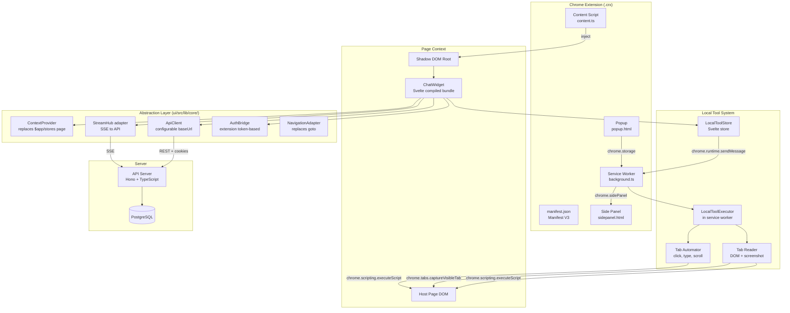
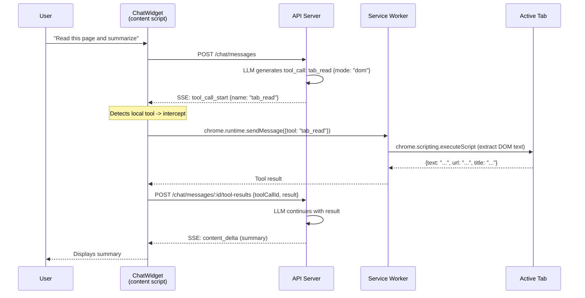

# SPEC — Chrome Extension Plugin

## 1. Overview

The Chrome extension embeds the **ChatWidget** (chat, queue, comments, toasters) directly into any web page, allowing users to interact with the Top AI Ideas assistant without leaving their current browser context.

The extension also exposes **local Chrome tools** (tab reading via DOM or screenshot, automation via clicks/typing) that the assistant can invoke alongside server-side tools (use case CRUD, web search, etc.).

### Constraints

- **Manifest V3** — no remotely hosted code; the full UI bundle is packaged inside the extension.
- **Docker-first** — build pipeline uses `make build-ext`, no npm on the host.
- **Shadow DOM** — CSS isolation from the host page.
- **Dedicated extension authentication** — extension uses its own token pair (access + refresh), stored in extension storage and injected by the background proxy.

---

## 2. Architecture

### 2.1 High-Level Diagram



### 2.2 Component Breakdown

| Component | Location | Responsibility |
|---|---|---|
| **Content Script** | `ui/chrome-ext/content.ts` | Bootstrap: create Shadow DOM, mount compiled ChatWidget bundle |
| **Service Worker** | `ui/chrome-ext/background.ts` | Handle local tool calls, manage side panel, extension lifecycle |
| **Popup** | `ui/chrome-ext/popup.html` | Configure API URL, auth status, toggle on/off |
| **Side Panel** | `ui/chrome-ext/sidepanel.html` | Docked mode (Chrome native side panel API) |
| **Abstraction Layer** | `ui/src/lib/core/` | Decouple ChatWidget from SvelteKit (`$app/*`) |
| **LocalToolStore** | `ui/src/lib/stores/localTools.ts` | Bridge between ChatWidget and service worker |
| **LocalToolExecutor** | `ui/chrome-ext/tool-executor.ts` | Execute Chrome API calls (tabs, scripting) |

---

## 3. Abstraction Layer

To allow the ChatWidget to run both inside SvelteKit (web app) and inside a Chrome extension (content script), the following abstractions are introduced.

### 3.1 ContextProvider

Replaces `import { page } from '$app/stores'` and `import { browser } from '$app/environment'`.

```typescript
// ui/src/lib/core/context-provider.ts
import { writable, type Readable } from 'svelte/store';

export interface AppContext {
  routeId: string | null;
  params: Record<string, string>;
  url: URL;
}

export interface ContextProvider {
  /** Reactive store providing current navigation context */
  context: Readable<AppContext>;
  /** Always true in extension, replaces `browser` from $app/environment */
  isBrowser: boolean;
}

/** Default: wraps SvelteKit $page store */
export function createSvelteKitContextProvider(): ContextProvider { /* ... */ }

/** Extension: driven by content script / service worker */
export function createExtensionContextProvider(): ContextProvider { /* ... */ }
```

### 3.2 ApiClient

Replaces `api.ts` dependency on `$app/environment` and `import.meta.env`.

```typescript
// ui/src/lib/core/api-client.ts
export interface ApiClientConfig {
  baseUrl: string;
  getWorkspaceId?: () => string | null;
}

export function createApiClient(config: ApiClientConfig) {
  return {
    get: <T>(endpoint: string) => apiRequest<T>(config, endpoint, { method: 'GET' }),
    post: <T>(endpoint: string, data?: any) => apiRequest<T>(config, endpoint, { method: 'POST', body: data }),
    patch: <T>(endpoint: string, data?: any) => apiRequest<T>(config, endpoint, { method: 'PATCH', body: data }),
    put: <T>(endpoint: string, data?: any) => apiRequest<T>(config, endpoint, { method: 'PUT', body: data }),
    delete: <T>(endpoint: string) => apiRequest<T>(config, endpoint, { method: 'DELETE' }),
  };
}
```

### 3.3 AuthBridge

Replaces direct dependency on `session.ts` (which uses `$app/navigation` for `goto`).

```typescript
// ui/src/lib/core/auth-bridge.ts
export interface AuthBridge {
  session: Readable<SessionState>;
  isAuthenticated: Readable<boolean>;
  logout(): Promise<void>;
  initialize(): Promise<void>;
}
```

### 3.5 Extension Token Auth Flow (Lot 4B)

The extension does not start WebAuthn or login ceremonies from content script bootstrap.
Authentication starts only from an explicit user action (`Connect`) in extension UI.

Flow:

1. User clicks `Connect` in extension settings.
2. Background calls `POST /auth/session/extension-token` with `credentials: include`.
3. API validates current app session (cookie or bearer) and issues a dedicated extension session pair.
4. Background stores:
   - refresh token + user profile in `chrome.storage.local`
   - access token + expiry + user profile in `chrome.storage.session`
5. All API calls from overlay/sidepanel are proxied through background, with `Authorization: Bearer <access-token>`.
6. On expiry, background refreshes with `/auth/session/refresh` using stored refresh token.
7. `Logout` calls `DELETE /auth/session` with bearer token, then clears extension auth storage.

Security goals:

- No passive WebAuthn prompts on third-party pages.
- No dependency on host page localStorage/cookies for runtime API calls.
- Explicit revoke path for extension session.

### 3.6 WS Delegation Compatibility (forward path)

Future local/remote tool delegation over WS must reuse the same extension auth context:

- WS handshake carries the same extension bearer token used by REST proxy.
- Token refresh remains centralized in background (single authority).
- Overlay/sidepanel never keep independent auth implementations.
- When WS is unavailable, REST proxy remains the fallback transport.

This keeps auth semantics identical across:

- local tool execution (`chrome.runtime` / service worker)
- remote API calls
- future delegated WS channels.

### 3.4 NavigationAdapter

Replaces `goto` from `$app/navigation`.

```typescript
// ui/src/lib/core/navigation-adapter.ts
export interface NavigationAdapter {
  goto(url: string): void;
}

// SvelteKit: wraps $app/navigation goto
// Extension: window.open(url, '_blank') or chrome.tabs.create
```

---

## 4. Local Chrome Tools

### 4.1 Tool Routing Architecture

The LLM generates tool calls server-side. Currently, all tool execution happens in `chat-service.ts` (API). For local Chrome tools, we introduce **client-side interception**: the ChatPanel detects tool calls designated as "local" and routes them to the service worker instead of letting the server execute them.



### 4.2 Local Tool Declaration and Resume Loop

When the extension runtime is available, ChatPanel includes `localToolDefinitions` in `POST /api/v1/chat/messages`.
The API merges these local definitions with server-side tools for model generation.

If the model emits a local tool call:

1. ChatPanel intercepts the tool event.
2. The extension executes the tool in service worker context (`tool_execute`).
3. ChatPanel sends result back through `POST /api/v1/chat/messages/:id/tool-results`.
4. API resumes generation in the same assistant stream.

### 4.3 Unified Local Tools (Lot 6B)

Current contract uses two canonical local tools:

- `tab_read`
  - modes: `info | dom | screenshot | elements`
  - `screenshot` defaults to `png` for readability, optional `jpeg` + quality
  - `elements` returns pre-parsed clickable/editable candidates with selector hints
- `tab_action`
  - actions: `scroll | click | type | wait`
  - accepts single-step args or multi-step `actions[]`
  - supports `waitMs` per step + global `timeoutMs`

Backwards-compat aliases remain accepted in runtime (`tab_info`, `tab_read_dom`, `tab_screenshot`, `tab_click`, `tab_type`, `tab_scroll`) and are mapped to `tab_read:*` / `tab_action:*` permission namespaces.

### 4.4 Runtime Permission Model

Local tools are guarded by a runtime decision gate:

- decisions: `allow_once`, `deny_once`, `allow_always`, `deny_always`
- scope key: `{ toolPattern, originPattern }`
- persistent policies (`allow_always` / `deny_always`) are synced with backend per user/workspace

Policy patterns:

- tools: `tab_read:*`, `tab_action:*`, `tab_action:click`, `tab_action:input`, etc.
- origins: `*`, `https://*`, `*.example.com`, `https://*.example.com`, exact origin

Precedence:

1. Most specific match wins
2. Tie-break by latest `updatedAt`

### 4.5 Local Tool Runtime Components

- `ui/src/lib/stores/localTools.ts`
  - local tool definitions
  - execution lifecycle (`pending`, `executing`, `awaiting_permission`, `completed`, `failed`)
  - permission request/decision bridge
- `ui/chrome-ext/background.ts`
  - message router (`tool_execute`, `tool_permission_decide`, permissions CRUD sync)
  - side panel/open-overlay coordination
- `ui/chrome-ext/tool-executor.ts`
  - robust active-tab resolution (sender tab + fallback queries)
  - non-injectable URL guardrails (`chrome://`, `chrome-extension://`, etc.)

---

## 5. API Evolution (Current)

### 5.1 Chat Message Input

`POST /api/v1/chat/messages` accepts:

- `localToolDefinitions?: Array<{ name; description; parameters }>`

The server merges these with remote tools before calling the model.

### 5.2 Local Tool Result Submission

Endpoint:

- `POST /api/v1/chat/messages/:id/tool-results`

Payload:

- `{ toolCallId: string; result: unknown }`

Behavior:

- stores/accepts the local tool result
- resumes assistant generation when all pending local tool calls are resolved

### 5.3 Tool Permission API

Endpoints:

- `GET /api/v1/chat/tool-permissions`
- `PUT /api/v1/chat/tool-permissions`
- `DELETE /api/v1/chat/tool-permissions`

Server normalizes/safeguards tool/origin patterns and persists to `extension_tool_permissions`.

---

## 6. Manifest V3

```json
{
  "manifest_version": 3,
  "name": "Top AI Ideas Assistant",
  "version": "0.1.0",
  "description": "AI assistant for Top AI Ideas — chat, analyze pages, automate tasks",
  "permissions": [
    "storage",
    "tabs",
    "activeTab",
    "scripting",
    "sidePanel"
  ],
  "host_permissions": [
    "<all_urls>"
  ],
  "background": {
    "service_worker": "background.js",
    "type": "module"
  },
  "content_scripts": [
    {
      "matches": [
        "<all_urls>"
      ],
      "exclude_matches": [
        "http://localhost/*",
        "http://127.0.0.1/*",
        "https://top-ai-ideas.sent-tech.ca/*",
        "https://app.sent-tech.ca/*"
      ],
      "js": ["content.js"],
      "run_at": "document_idle"
    }
  ],
  "side_panel": {
    "default_path": "chrome-ext/sidepanel.html"
  },
  "action": {
    "default_popup": "chrome-ext/popup.html",
    "default_title": "Top AI Ideas Assistant"
  },
  "web_accessible_resources": [
    {
      "resources": ["chatwidget.js", "chatwidget.css", "chunks/*", "assets/*"],
      "matches": ["<all_urls>"]
    }
  ]
}
```

Notes:

- `<all_urls>` is currently used for UAT/development flexibility.
- `exclude_matches` prevents content-script injection on Top AI Ideas app domains and localhost app pages.
- Side panel and popup are hosted in `chrome-ext/*` output paths.

---

## 7. Content Script Bootstrap

```typescript
// ui/chrome-ext/content.ts

const host = document.createElement('div');
host.id = 'top-ai-ideas-ext';
host.style.cssText = 'all: initial; position: fixed; z-index: 2147483647;';
document.body.appendChild(host);

const shadow = host.attachShadow({ mode: 'open' });

const style = document.createElement('link');
style.rel = 'stylesheet';
style.href = chrome.runtime.getURL('chatwidget.css');
shadow.appendChild(style);

const mountPoint = document.createElement('div');
mountPoint.id = 'chat-mount';
shadow.appendChild(mountPoint);

const { mount } = await import(chrome.runtime.getURL('chatwidget.js'));
mount(mountPoint, {
  hostMode: 'overlay',
  initialState: null
});
```

The side panel uses the same ChatWidget bundle with `hostMode: 'sidepanel'` in `ui/chrome-ext/sidepanel.ts`.

---

## 8. Build Pipeline

### 8.1 Vite Config

Separate Vite config for the extension build that compiles the ChatWidget bundle without SvelteKit dependencies.

```
ui/chrome-ext/vite.config.ext.ts
```

Entry points:

- `content.ts` → `content.js` (content script)
- `background.ts` → `background.js` (service worker)
- `popup.ts` → `popup.js` (popup)
- `sidepanel.ts` → `sidepanel.js` (side panel)
- `chatwidget-entry.ts` → `chatwidget.js` + `chatwidget.css` (the compiled UI bundle)

### 8.2 Makefile Targets

```makefile
# Build the Chrome extension
build-ext:
	docker compose run --rm ui npm run build:ext

# Watch mode for extension development
dev-ext:
	docker compose run --rm ui npm run dev:ext

# Package the extension as .zip for Chrome Web Store
package-ext:
	cd ui/chrome-ext/dist && zip -r ../../../top-ai-ideas-ext.zip .
```

### 8.3 Output Structure

```
ui/chrome-ext/dist/
├── manifest.json
├── background.js
├── content.js
├── chatwidget.js
├── chatwidget.css
├── popup.html
├── popup.js
├── sidepanel.html
├── sidepanel.js
└── icons/
    ├── icon-16.png
    ├── icon-32.png
    ├── icon-48.png
    └── icon-128.png
```

---

## 9. i18n

The extension locale follows browser locale (`chrome.i18n.getUILanguage()`), with fallback to `fr`.

Locale initialization is done in `ui/chrome-ext/chatwidget-entry.ts`:

```typescript
import { init as initI18n, register } from 'svelte-i18n';
import en from '../src/locales/en.json';
import fr from '../src/locales/fr.json';

register('en', () => Promise.resolve(en));
register('fr', () => Promise.resolve(fr));

const browserLocale = chrome.i18n.getUILanguage().split('-')[0];
initI18n({
  fallbackLocale: 'fr',
  initialLocale: browserLocale === 'en' ? 'en' : 'fr'
});
```

---

## 10. Security Considerations

- **Host permissions**: `<all_urls>` is currently enabled for UAT; content-script injection is still restricted by `exclude_matches`.
- **CSP / isolation**: content scripts run in isolated world; UI is mounted in Shadow DOM.
- **Authentication**: extension uses dedicated token flow:
  - issue token from explicit user action (`Connect`)
  - access token in `chrome.storage.session`
  - refresh token in `chrome.storage.local`
  - API requests proxied through background with bearer injection
- **WebAuthn side-effects**: no passive WebAuthn bootstrap from content script on third-party pages.
- **Runtime permissions for local tools**: per tool+origin allow/deny decisions are enforced before execution.
- **Data flow**: local tool outputs are sent to API through `/chat/messages/:id/tool-results` and can contain page content.

---

## 11. Delivery Status (current branch)

- Delivered:
  - Abstraction layer + extension packaging + side panel/overlay handoff
  - Unified local tools (`tab_read`, `tab_action`)
  - Runtime tool permissions (`once/always/never`) with backend sync
  - Extension auth token flow and API proxying
  - Tool scope UX in extension sessions (restricted toolset, local toggles, plugin tab behavior)
- Remaining:
  - Cross-spec consolidation and final test/doc gates tracked in `BRANCH.md`

---

## 12. Glossary

| Term | Definition |
|---|---|
| **Content Script** | JS that runs in the context of a web page. Has DOM access but isolated JS world. |
| **Service Worker** | Background script (Manifest V3). No DOM access. Handles events, chrome APIs. |
| **Shadow DOM** | Encapsulated DOM subtree with isolated CSS. Prevents style leakage. |
| **Local Tool** | A tool executed client-side (in the extension) rather than server-side (in the API). |
| **Host Permissions** | Manifest V3 declaration allowing the extension to make cross-origin requests to specified domains. |
