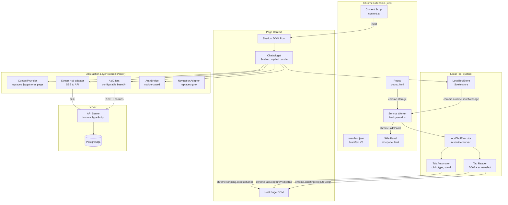
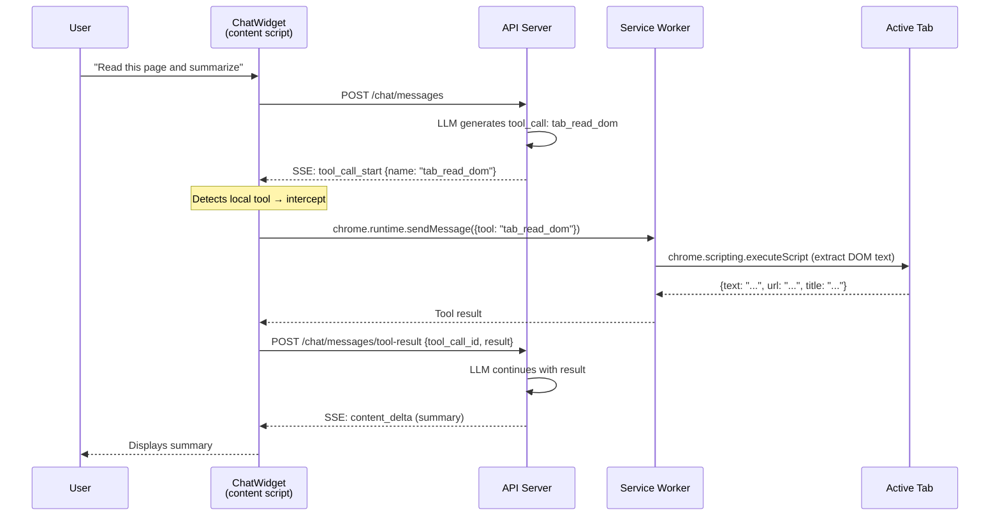

# SPEC — Chrome Extension Plugin

## 1. Overview

The Chrome extension embeds the **ChatWidget** (chat, queue, comments, toasters) directly into any web page, allowing users to interact with the Top AI Ideas assistant without leaving their current browser context.

The extension also exposes **local Chrome tools** (tab reading via DOM or screenshot, automation via clicks/typing) that the assistant can invoke alongside server-side tools (use case CRUD, web search, etc.).

### Constraints

- **Manifest V3** — no remotely hosted code; the full UI bundle is packaged inside the extension.
- **Docker-first** — build pipeline uses `make build-ext`, no npm on the host.
- **Shadow DOM** — CSS isolation from the host page.
- **Shared authentication** — cookies from the API domain are shared via `host_permissions`.

---

## 2. Architecture

### 2.1 High-Level Diagram



### 2.2 Component Breakdown

| Component | Location | Responsibility |
|---|---|---|
| **Content Script** | `ui/chrome-ext/content.ts` | Bootstrap: create Shadow DOM, mount compiled ChatWidget bundle |
| **Service Worker** | `ui/chrome-ext/background.ts` | Handle local tool calls, manage side panel, extension lifecycle |
| **Popup** | `ui/chrome-ext/popup.html` | Configure API URL, auth status, toggle on/off |
| **Side Panel** | `ui/chrome-ext/sidepanel.html` | Docked mode (Chrome native side panel API) |
| **Abstraction Layer** | `ui/src/lib/core/` | Decouple ChatWidget from SvelteKit (`$app/*`) |
| **LocalToolStore** | `ui/src/lib/stores/localTools.ts` | Bridge between ChatWidget and service worker |
| **LocalToolExecutor** | `ui/chrome-ext/tool-executor.ts` | Execute Chrome API calls (tabs, scripting) |

---

## 3. Abstraction Layer

To allow the ChatWidget to run both inside SvelteKit (web app) and inside a Chrome extension (content script), the following abstractions are introduced.

### 3.1 ContextProvider

Replaces `import { page } from '$app/stores'` and `import { browser } from '$app/environment'`.

```typescript
// ui/src/lib/core/context-provider.ts
import { writable, type Readable } from 'svelte/store';

export interface AppContext {
  routeId: string | null;
  params: Record<string, string>;
  url: URL;
}

export interface ContextProvider {
  /** Reactive store providing current navigation context */
  context: Readable<AppContext>;
  /** Always true in extension, replaces `browser` from $app/environment */
  isBrowser: boolean;
}

/** Default: wraps SvelteKit $page store */
export function createSvelteKitContextProvider(): ContextProvider { /* ... */ }

/** Extension: driven by content script / service worker */
export function createExtensionContextProvider(): ContextProvider { /* ... */ }
```

### 3.2 ApiClient

Replaces `api.ts` dependency on `$app/environment` and `import.meta.env`.

```typescript
// ui/src/lib/core/api-client.ts
export interface ApiClientConfig {
  baseUrl: string;
  getWorkspaceId?: () => string | null;
}

export function createApiClient(config: ApiClientConfig) {
  return {
    get: <T>(endpoint: string) => apiRequest<T>(config, endpoint, { method: 'GET' }),
    post: <T>(endpoint: string, data?: any) => apiRequest<T>(config, endpoint, { method: 'POST', body: data }),
    patch: <T>(endpoint: string, data?: any) => apiRequest<T>(config, endpoint, { method: 'PATCH', body: data }),
    put: <T>(endpoint: string, data?: any) => apiRequest<T>(config, endpoint, { method: 'PUT', body: data }),
    delete: <T>(endpoint: string) => apiRequest<T>(config, endpoint, { method: 'DELETE' }),
  };
}
```

### 3.3 AuthBridge

Replaces direct dependency on `session.ts` (which uses `$app/navigation` for `goto`).

```typescript
// ui/src/lib/core/auth-bridge.ts
export interface AuthBridge {
  session: Readable<SessionState>;
  isAuthenticated: Readable<boolean>;
  logout(): Promise<void>;
  initialize(): Promise<void>;
}
```

### 3.4 NavigationAdapter

Replaces `goto` from `$app/navigation`.

```typescript
// ui/src/lib/core/navigation-adapter.ts
export interface NavigationAdapter {
  goto(url: string): void;
}

// SvelteKit: wraps $app/navigation goto
// Extension: window.open(url, '_blank') or chrome.tabs.create
```

---

## 4. Local Chrome Tools

### 4.1 Tool Routing Architecture

The LLM generates tool calls server-side. Currently, all tool execution happens in `chat-service.ts` (API). For local Chrome tools, we introduce **client-side interception**: the ChatPanel detects tool calls designated as "local" and routes them to the service worker instead of letting the server execute them.



### 4.2 Two-Phase Tool Declaration

**Phase 1 — Client-declared tools**: When the extension is active, the ChatWidget includes extra tool definitions in the chat message request. The API passes them to the LLM alongside server-side tools. When the LLM calls a local tool, the client intercepts the `tool_call_start` SSE event and executes it locally.

This requires a small API evolution: the `POST /chat/messages` endpoint accepts an optional `localTools` array of tool definitions. These are merged with server tools before calling the LLM. The tool execution loop in `chat-service.ts` must recognize that some tool_calls have no server-side handler and emit a `tool_call_pending_local` event instead of executing them. The client then sends results back.

**Phase 2 (future)** — Collaboration local/remote: tools registered in a workspace can be flagged as local or remote. The API knows which tools delegate to the client.

### 4.3 Tool Definitions

#### `tab_read_dom` — Read active tab DOM

Extracts text content from the current active tab. Uses `chrome.scripting.executeScript` to run a content extraction function in the target tab.

```typescript
{
  name: "tab_read_dom",
  description: "Read the text content of the currently active browser tab. Returns the page URL, title, and extracted text content. Use this to understand what the user is looking at.",
  parameters: {
    type: "object",
    properties: {
      selector: {
        type: "string",
        description: "Optional CSS selector to limit extraction to a specific part of the page. If omitted, extracts the full page body text."
      },
      includeHtml: {
        type: "boolean",
        description: "If true, return raw HTML instead of text-only. Default false."
      }
    },
    required: []
  }
}
```

**Implementation** (`tool-executor.ts`):
```typescript
async function executeTabReadDom(params: { selector?: string; includeHtml?: boolean }) {
  const [tab] = await chrome.tabs.query({ active: true, currentWindow: true });
  if (!tab?.id) throw new Error('No active tab');

  const results = await chrome.scripting.executeScript({
    target: { tabId: tab.id },
    func: (selector, includeHtml) => {
      const el = selector ? document.querySelector(selector) : document.body;
      if (!el) return { text: '', html: '' };
      return {
        text: el.innerText?.slice(0, 50000) || '',
        html: includeHtml ? el.innerHTML?.slice(0, 100000) || '' : undefined
      };
    },
    args: [params.selector || null, params.includeHtml || false]
  });

  return {
    url: tab.url,
    title: tab.title,
    ...results[0]?.result
  };
}
```

#### `tab_screenshot` — Capture visible tab

Takes a screenshot of the currently visible tab area.

```typescript
{
  name: "tab_screenshot",
  description: "Capture a screenshot of the currently visible browser tab. Returns a base64-encoded PNG image. Use this when visual context is needed (layouts, charts, UI state).",
  parameters: {
    type: "object",
    properties: {
      quality: {
        type: "integer",
        description: "JPEG quality (1-100). Lower = smaller payload. Default 80."
      }
    },
    required: []
  }
}
```

**Implementation**:
```typescript
async function executeTabScreenshot(params: { quality?: number }) {
  const dataUrl = await chrome.tabs.captureVisibleTab(undefined, {
    format: 'jpeg',
    quality: params.quality ?? 80
  });
  return { imageDataUrl: dataUrl, format: 'jpeg' };
}
```

#### `tab_click` — Click an element

Click on a DOM element identified by CSS selector or coordinates.

```typescript
{
  name: "tab_click",
  description: "Click on an element in the active tab. Specify a CSS selector to identify the element, or x/y coordinates for pixel-precise clicking. Use this for button clicks, link navigation, form interactions.",
  parameters: {
    type: "object",
    properties: {
      selector: {
        type: "string",
        description: "CSS selector for the element to click."
      },
      x: { type: "number", description: "X coordinate (viewport-relative). Used if no selector." },
      y: { type: "number", description: "Y coordinate (viewport-relative). Used if no selector." },
      waitForNavigation: {
        type: "boolean",
        description: "If true, wait up to 5s for the page to navigate after clicking. Default false."
      }
    },
    required: []
  }
}
```

**Implementation**:
```typescript
async function executeTabClick(params: { selector?: string; x?: number; y?: number; waitForNavigation?: boolean }) {
  const [tab] = await chrome.tabs.query({ active: true, currentWindow: true });
  if (!tab?.id) throw new Error('No active tab');

  await chrome.scripting.executeScript({
    target: { tabId: tab.id },
    func: (selector, x, y) => {
      let el: Element | null = null;
      if (selector) {
        el = document.querySelector(selector);
      } else if (typeof x === 'number' && typeof y === 'number') {
        el = document.elementFromPoint(x, y);
      }
      if (!el) throw new Error(`Element not found: ${selector || `(${x},${y})`}`);
      (el as HTMLElement).click();
      return { clicked: true, tag: el.tagName, text: (el as HTMLElement).innerText?.slice(0, 200) };
    },
    args: [params.selector || null, params.x ?? null, params.y ?? null]
  });

  if (params.waitForNavigation) {
    await new Promise(r => setTimeout(r, 2000));
  }

  return { success: true };
}
```

#### `tab_type` — Type text into an element

```typescript
{
  name: "tab_type",
  description: "Type text into an input/textarea element in the active tab. The element is identified by CSS selector.",
  parameters: {
    type: "object",
    properties: {
      selector: { type: "string", description: "CSS selector of the input element" },
      text: { type: "string", description: "Text to type" },
      clear: { type: "boolean", description: "If true, clear the field before typing. Default true." }
    },
    required: ["selector", "text"]
  }
}
```

#### `tab_scroll` — Scroll the page

```typescript
{
  name: "tab_scroll",
  description: "Scroll the active tab page. Use to reveal content below/above the fold.",
  parameters: {
    type: "object",
    properties: {
      direction: { type: "string", enum: ["up", "down", "top", "bottom"], description: "Scroll direction" },
      pixels: { type: "integer", description: "Number of pixels to scroll (for up/down). Default 500." },
      selector: { type: "string", description: "Optional: scroll within a specific scrollable container." }
    },
    required: ["direction"]
  }
}
```

#### `tab_info` — Get page metadata

```typescript
{
  name: "tab_info",
  description: "Get metadata about the currently active tab: URL, title, favicon, and basic page structure (headings, links count, form count).",
  parameters: { type: "object", properties: {}, required: [] }
}
```

### 4.4 LocalToolStore

A Svelte store that manages communication between the ChatWidget and the Chrome extension service worker.

```typescript
// ui/src/lib/stores/localTools.ts
import { writable, derived } from 'svelte/store';

export interface LocalToolDefinition {
  name: string;
  description: string;
  parameters: Record<string, unknown>;
}

export interface LocalToolExecution {
  toolCallId: string;
  name: string;
  args: unknown;
  status: 'pending' | 'executing' | 'completed' | 'failed';
  result?: unknown;
  error?: string;
}

interface LocalToolsState {
  available: boolean;            // true if Chrome extension APIs are accessible
  tools: LocalToolDefinition[];  // registered local tools
  executions: Map<string, LocalToolExecution>; // in-flight tool executions
}

export const localToolsStore = writable<LocalToolsState>({
  available: false,
  tools: [],
  executions: new Map()
});

// Called by content script during bootstrap to register tools
export function registerLocalTools(tools: LocalToolDefinition[]) { /* ... */ }

// Called by ChatPanel when it intercepts a local tool_call
export async function executeLocalTool(
  toolCallId: string, name: string, args: unknown
): Promise<unknown> {
  // Send message to service worker
  const result = await chrome.runtime.sendMessage({
    type: 'tool_execute',
    toolCallId,
    name,
    args
  });
  return result;
}
```

### 4.5 Service Worker (background.ts)

```typescript
// ui/chrome-ext/background.ts

// Tool executor registry
const toolExecutors: Record<string, (args: any) => Promise<unknown>> = {
  tab_read_dom: executeTabReadDom,
  tab_screenshot: executeTabScreenshot,
  tab_click: executeTabClick,
  tab_type: executeTabType,
  tab_scroll: executeTabScroll,
  tab_info: executeTabInfo,
};

// Listen for tool execution requests from content script
chrome.runtime.onMessage.addListener((message, sender, sendResponse) => {
  if (message.type === 'tool_execute') {
    const executor = toolExecutors[message.name];
    if (!executor) {
      sendResponse({ error: `Unknown local tool: ${message.name}` });
      return true;
    }
    executor(message.args)
      .then(result => sendResponse({ result }))
      .catch(err => sendResponse({ error: err.message }));
    return true; // async response
  }
});

// Side panel management
chrome.sidePanel.setPanelBehavior({ openPanelOnActionClick: false });
```

---

## 5. API Evolution (Minimal)

### 5.1 Local Tool Declaration in Chat Request

The `POST /api/v1/chat/messages` endpoint gains an optional field:

```typescript
interface ChatMessageInput {
  // ... existing fields
  localToolDefinitions?: Array<{
    name: string;
    description: string;
    parameters: Record<string, unknown>;
  }>;
}
```

The `chat-service.ts` merges these with server-side tools before calling the LLM.

### 5.2 Local Tool Result Submission

New endpoint or extension of existing flow:

```
POST /api/v1/chat/messages/:messageId/tool-results
```

```typescript
interface ToolResultInput {
  toolCallId: string;
  result: unknown;
}
```

The server stores the tool result and resumes the LLM generation loop (pass N+1) with the tool result added to the conversation.

### 5.3 Tool Execution Loop Change

In `chat-service.ts` `runAssistantGeneration`, after detecting tool calls:
1. Check if the tool is in the `localToolDefinitions` list.
2. If **server-side**: execute as today.
3. If **local**: emit a `tool_call_pending_local` SSE event and pause. Wait for the client to submit the result via the new endpoint. Then continue the loop.

The pause mechanism can use a polling approach (the resumed endpoint triggers a new pass) or a deferred promise (WebSocket/long-poll). For Lot 1, the simplest is to **split the generation into two server calls**: the client receives the tool call, executes locally, then POSTs the result which triggers a new `runAssistantGeneration` pass.

---

## 6. Manifest V3

```json
{
  "manifest_version": 3,
  "name": "Top AI Ideas Assistant",
  "version": "0.1.0",
  "description": "AI assistant for Top AI Ideas — chat, analyze pages, automate tasks",
  "permissions": [
    "storage",
    "tabs",
    "activeTab",
    "scripting",
    "sidePanel"
  ],
  "host_permissions": [
    "https://top-ai-ideas-api.sent-tech.ca/*",
    "http://localhost:8787/*"
  ],
  "background": {
    "service_worker": "background.js",
    "type": "module"
  },
  "content_scripts": [
    {
      "matches": ["<all_urls>"],
      "js": ["content.js"],
      "css": [],
      "run_at": "document_idle"
    }
  ],
  "side_panel": {
    "default_path": "sidepanel.html"
  },
  "action": {
    "default_popup": "popup.html",
    "default_icon": {
      "16": "icons/icon-16.png",
      "32": "icons/icon-32.png",
      "48": "icons/icon-48.png",
      "128": "icons/icon-128.png"
    }
  },
  "icons": {
    "16": "icons/icon-16.png",
    "32": "icons/icon-32.png",
    "48": "icons/icon-48.png",
    "128": "icons/icon-128.png"
  }
}
```

---

## 7. Content Script Bootstrap

```typescript
// ui/chrome-ext/content.ts

// Create Shadow DOM container
const host = document.createElement('div');
host.id = 'top-ai-ideas-ext';
host.style.cssText = 'all: initial; position: fixed; z-index: 2147483647;';
document.body.appendChild(host);

const shadow = host.attachShadow({ mode: 'open' });

// Inject compiled CSS
const style = document.createElement('link');
style.rel = 'stylesheet';
style.href = chrome.runtime.getURL('chatwidget.css');
shadow.appendChild(style);

// Mount Svelte ChatWidget into Shadow DOM
const mountPoint = document.createElement('div');
mountPoint.id = 'chat-mount';
shadow.appendChild(mountPoint);

// Import and mount the compiled Svelte bundle
import('./chatwidget.js').then(({ mount }) => {
  mount(mountPoint, {
    apiBaseUrl: 'stored-or-default',
    contextProvider: createExtensionContextProvider(),
    localTools: true
  });
});
```

---

## 8. Build Pipeline

### 8.1 Vite Config

Separate Vite config for the extension build that compiles the ChatWidget bundle without SvelteKit dependencies.

```
ui/chrome-ext/vite.config.ext.ts
```

Entry points:
- `content.ts` → `content.js` (content script)
- `background.ts` → `background.js` (service worker)
- `popup.ts` → `popup.js` (popup)
- `sidepanel.ts` → `sidepanel.js` (side panel)
- `chatwidget-entry.ts` → `chatwidget.js` + `chatwidget.css` (the compiled UI bundle)

### 8.2 Makefile Targets

```makefile
# Build the Chrome extension
build-ext:
	docker compose run --rm ui npm run build:ext

# Watch mode for extension development
dev-ext:
	docker compose run --rm ui npm run dev:ext

# Package the extension as .zip for Chrome Web Store
package-ext:
	cd ui/chrome-ext/dist && zip -r ../../../top-ai-ideas-ext.zip .
```

### 8.3 Output Structure

```
ui/chrome-ext/dist/
├── manifest.json
├── background.js
├── content.js
├── chatwidget.js
├── chatwidget.css
├── popup.html
├── popup.js
├── sidepanel.html
├── sidepanel.js
└── icons/
    ├── icon-16.png
    ├── icon-32.png
    ├── icon-48.png
    └── icon-128.png
```

---

## 9. i18n

The extension locale follows **browser locale** (`navigator.language` / `chrome.i18n.getUILanguage()`), with fallback to `fr`.

The existing `svelte-i18n` setup is reused inside the compiled bundle. The locale is initialized during bootstrap in `content.ts`:

```typescript
import { init, register } from 'svelte-i18n';

register('fr', () => import('./locales/fr.json'));
register('en', () => import('./locales/en.json'));

const browserLocale = chrome.i18n.getUILanguage().split('-')[0];
init({ fallbackLocale: 'fr', initialLocale: browserLocale === 'en' ? 'en' : 'fr' });
```

---

## 10. Security Considerations

- **Host permissions**: The extension requests access to the API domain only. `<all_urls>` is needed for content script injection (to show the chat bubble on any page).
- **CSP in content scripts**: Content scripts run in an isolated world. The Shadow DOM prevents CSS leakage. Scripts cannot access the page's JS context (only DOM).
- **Authentication**: Relies on shared HTTPOnly cookies from the API domain. No tokens stored in `chrome.storage` for Lot 1.
- **Local tools**: `chrome.scripting.executeScript` runs in the target tab's main world. The injected functions are minimal and self-contained (no eval, no dynamic code).
- **Data flow**: Local tool results are sent to the server (API) as tool results in the chat conversation. Sensitive page content should be handled with care (the LLM processes it server-side).

---

## 11. Lot Plan

### Lot 1 — MVP Chrome Extension (this branch: `feat/chrome-plugin`)

| # | Task | Scope |
|---|---|---|
| 1 | Create `ui/src/lib/core/` abstraction layer | `context-provider.ts`, `api-client.ts`, `auth-bridge.ts`, `navigation-adapter.ts` |
| 2 | Refactor ChatWidget + ChatPanel to use abstractions | Replace `$app/*` imports with injected providers. Non-breaking for web app. |
| 3 | Create `ui/src/lib/stores/localTools.ts` | Local tool store + execution bridge |
| 4 | Create `ui/chrome-ext/` skeleton | `manifest.json`, `content.ts`, `background.ts`, `popup.html`, `sidepanel.html` |
| 5 | Implement service worker tool executor | `tab_read_dom`, `tab_screenshot`, `tab_click`, `tab_type`, `tab_scroll`, `tab_info` |
| 6 | Implement content script bootstrap | Shadow DOM, Svelte mount, i18n init |
| 7 | API: `localToolDefinitions` in chat request | Merge local tools with server tools |
| 8 | API: tool result submission endpoint | `POST /chat/messages/:id/tool-results` + resume generation |
| 9 | Vite build config for extension | `vite.config.ext.ts`, entry points |
| 10 | Makefile targets | `build-ext`, `dev-ext`, `package-ext` |
| 11 | Non-regression tests | `make test-ui`, `make test-e2e` — verify existing flows |
| 12 | Manual verification | Load unpacked, test chat + local tools on a sample page |

### Lot 2 — Side Panel + UI Modes

- Chrome side panel as docked mode
- Toasters in extension context
- Bubble positioning persistence

### Lot 3 — Specialized Tools

- Google Workspace tools (Gmail, Sheets, Docs, Slides, Chat, Gemini)
- Microsoft tools (Outlook, Teams, SharePoint)
- GitHub tools (Issues, PR)
- API piloting for acceleration (local/remote delegation via app auth)

---

## 12. Glossary

| Term | Definition |
|---|---|
| **Content Script** | JS that runs in the context of a web page. Has DOM access but isolated JS world. |
| **Service Worker** | Background script (Manifest V3). No DOM access. Handles events, chrome APIs. |
| **Shadow DOM** | Encapsulated DOM subtree with isolated CSS. Prevents style leakage. |
| **Local Tool** | A tool executed client-side (in the extension) rather than server-side (in the API). |
| **Host Permissions** | Manifest V3 declaration allowing the extension to make cross-origin requests to specified domains. |
