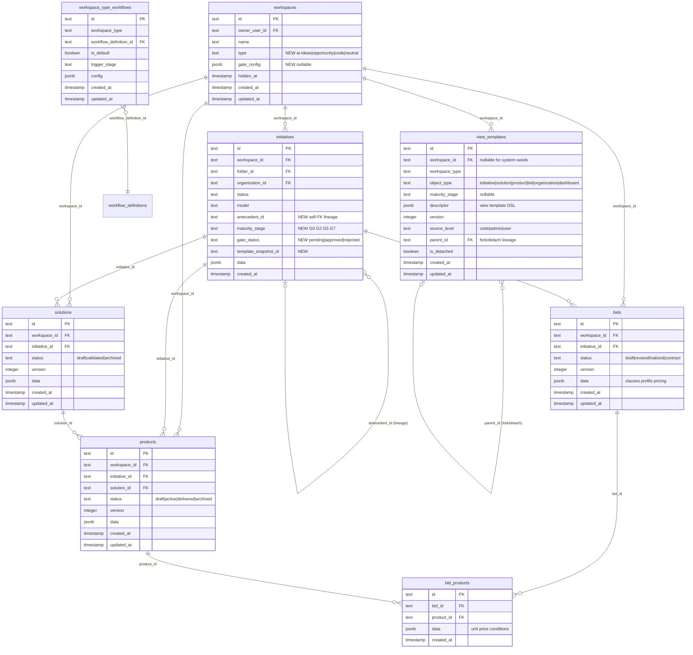

# SPEC EVOL - Workspace Type System, Neutral Orchestrator & Multi-Domain Foundation

Status: Draft (BR-04 Lot 0) — 2026-03-12

## 0) Fusion trajectory

Each section below is tagged with its canonical spec target for post-implementation consolidation (Lot N-1).

| Section | Target canonical spec | Target section |
|---|---|---|
| §1 Data model | `DATA_MODEL.md` | Overview ERD + table descriptions |
| §2 Workspace types | `SPEC.md` | §1 Functional map, §2 Data model |
| §3 Neutral workspace | `SPEC.md` | §1 new screens |
| §4 Initiative model | `SPEC.md` | §1, §2, §3 (rename use_cases) |
| §5 Extended objects | `SPEC.md` | §2 Data model, §3 API contracts |
| §6 Gate system | `SPEC.md` | §2, §3 |
| §7 Multi-workflow registry | `SPEC.md` | §3, §4; absorbs `SPEC_EVOL_AGENTIC_WORKSPACE_TODO.md` §2.2 |
| §8 Agent catalog | `TOOLS.md` | new section per workspace type |
| §9 Template catalog | `SPEC_TEMPLATING.md` | §2 families per type × stage |
| §10 Document generation | `SPEC_TEMPLATING.md` | §5 support model extension |
| §11 API contracts | `SPEC.md` | §3 |
| §12 View template system | `SPEC.md` | §1, §5 (new pattern) |
| §13 UI surfaces | `SPEC.md` | §1 |
| §14 Workspace-type-aware chat & tool scoping | `SPEC_CHATBOT.md` | tool scoping section; `TOOLS.md` per-type tool sets |
| §15 Cross-cutting exclusions & branch articulation | N/A (planning only) | removed after branch merge |

### Articulation with existing SPEC_EVOL files

- **`SPEC_EVOL_AGENTIC_WORKSPACE_TODO.md` §2.2** (Generic multi-workflow runtime): **absorbed** into §7 of this spec. After implementation, §2.2 must be removed from that file and replaced with a pointer to `SPEC.md`.
- **`SPEC_EVOL_AGENTIC_WORKSPACE_TODO.md` §2.3** (Collaborative TODO runtime): **not absorbed**, remains deferred. Updated to note that neutral workspace todo automation (§3) does not cover collaborative editing.
- **`SPEC_EVOL_BR15_AGENT_WORKFLOW_CONFIG_ROBUSTNESS.md`**: **not absorbed** (orthogonal concern: config robustness). BR-04 multi-workflow registry (§7) creates new surface for BR-15 to govern (open task-key configs). Dependency noted: BR-15 should be re-scoped after BR-04 to cover multi-workflow config authority.
- **`SPEC_EVOL_MODEL_AUTH_PROVIDERS.md`**: **not absorbed** (BR-08 scope). BR-04 §14 defines workspace-type-aware tool scoping which prepares the extension point for per-type model defaults (future). Cohere addition noted as new provider beyond current W2 scope.
- **`SPEC_EVOL_MODEL_PROVIDERS_RUNTIME.md`**: **not absorbed** (runtime refactoring). BR-04 does not touch LLM runtime. Provider abstraction already clean enough for new providers.
- **Cross-cutting future branches** (§15): ChatPanel/ChatWidget modularization, document connectors (Google Workspace, SharePoint), RAG on document folders — all excluded from BR-04. Extension points prepared in §14 (tool scoping) and §15 (data model hooks).

---

## 1) Target data model

> → cible: `DATA_MODEL.md` (Overview ERD + table descriptions)

### 1.1 Modified tables

**`workspaces`** — add columns:
- `type text NOT NULL DEFAULT 'ai-ideas'` — workspace type taxonomy: `neutral`, `ai-ideas`, `opportunity`, `code`.
- `gate_config jsonb` — nullable. Gate sequence configuration per workspace. `null` = free gates (backward-compatible).

**`use_cases` → renamed `initiatives`** — add columns:
- `antecedent_id text` — self-FK for lineage (parent initiative).
- `maturity_stage text` — current maturity stage (e.g. `G0`, `G2`, `G5`, `G7`). Nullable (null = no gating).
- `gate_status text` — `pending | approved | rejected`. Nullable.
- `template_snapshot_id text` — template version at initiative creation for traceability.

### 1.2 New tables

**`solutions`**
- `id text PK`
- `workspace_id text FK workspaces.id NOT NULL`
- `initiative_id text FK initiatives.id NOT NULL`
- `status text NOT NULL DEFAULT 'draft'` — `draft | validated | archived`
- `version integer NOT NULL DEFAULT 1`
- `data jsonb NOT NULL DEFAULT '{}'` — structured content (description, components, stack, estimation)
- `created_at, updated_at timestamps`

**`products`**
- `id text PK`
- `workspace_id text FK workspaces.id NOT NULL`
- `initiative_id text FK initiatives.id NOT NULL`
- `solution_id text FK solutions.id` — nullable (product may exist without solution)
- `status text NOT NULL DEFAULT 'draft'` — `draft | active | delivered | archived`
- `version integer NOT NULL DEFAULT 1`
- `data jsonb NOT NULL DEFAULT '{}'`
- `created_at, updated_at timestamps`

**`bids`**
- `id text PK`
- `workspace_id text FK workspaces.id NOT NULL`
- `initiative_id text FK initiatives.id NOT NULL`
- `status text NOT NULL DEFAULT 'draft'` — `draft | review | finalized | contract`
- `version integer NOT NULL DEFAULT 1`
- `data jsonb NOT NULL DEFAULT '{}'` — clauses, profils, pricing (data-driven, not document)
- `created_at, updated_at timestamps`

**`bid_products`** (junction N-N)
- `id text PK`
- `bid_id text FK bids.id NOT NULL`
- `product_id text FK products.id NOT NULL`
- `data jsonb NOT NULL DEFAULT '{}'` — unit price, conditions per product in this bid
- `created_at timestamp`
- Unique constraint on `(bid_id, product_id)`

**`workspace_type_workflows`** (multi-workflow registry)
- `id text PK`
- `workspace_type text NOT NULL` — `ai-ideas | opportunity | code`
- `workflow_definition_id text FK workflow_definitions.id NOT NULL`
- `is_default boolean NOT NULL DEFAULT false` — default workflow for this type
- `trigger_stage text` — maturity stage that triggers this workflow (nullable)
- `config jsonb NOT NULL DEFAULT '{}'` — type-specific workflow config overrides
- `created_at, updated_at timestamps`
- Unique constraint on `(workspace_type, workflow_definition_id)`

### 1.3 ERD (new/modified tables only)



### 1.4 Backward compatibility

- `use_cases` → `initiatives`: `ALTER TABLE RENAME`. All Drizzle refs, API routes (`/api/v1/use-cases` → `/api/v1/initiatives`), UI stores updated. Legacy API routes kept as aliases during transition if needed.
- `workspaces.type` defaults to `'ai-ideas'` → existing workspaces auto-typed, zero breakage.
- Neutral workspace auto-created per user on first login (or migration backfill for existing users).
- Existing `workflow_definitions` / `agent_definitions` / `workflow_definition_tasks` unchanged — `workspace_type_workflows` adds registry on top.
- `gate_config` nullable → null = free gates = current behavior preserved.
- All new tables have `workspace_id` FK for RBAC consistency with existing `workspace_memberships` model.

### 1.5 Single migration file scope

One file in `api/drizzle/` (BR04-EX1):

1. `ALTER TABLE use_cases RENAME TO initiatives`
2. `ALTER TABLE initiatives ADD COLUMN antecedent_id text REFERENCES initiatives(id)`
3. `ALTER TABLE initiatives ADD COLUMN maturity_stage text`
4. `ALTER TABLE initiatives ADD COLUMN gate_status text`
5. `ALTER TABLE initiatives ADD COLUMN template_snapshot_id text`
6. `ALTER TABLE workspaces ADD COLUMN type text NOT NULL DEFAULT 'ai-ideas'`
7. `ALTER TABLE workspaces ADD COLUMN gate_config jsonb`
8. `CREATE TABLE solutions (...)`
9. `CREATE TABLE products (...)`
10. `CREATE TABLE bids (...)`
11. `CREATE TABLE bid_products (...)`
12. `CREATE TABLE workspace_type_workflows (...)`
13. `CREATE TABLE view_templates (...)`
14. Indexes + FK constraints
15. `UPDATE workspaces SET type = 'ai-ideas' WHERE type = 'ai-ideas'` (no-op, ensures default applied)
16. Backfill: create one neutral workspace per existing user who doesn't have one
17. Backfill: seed default view_templates per workspace type

---

## 2) Workspace type taxonomy

> → cible: `SPEC.md` §1 Functional map, §2 Data model

### 2.1 Types

| Type | Purpose | Default workflow family | Delegable | Auto-created |
|---|---|---|---|---|
| `neutral` | Orchestrator dashboard, cross-workspace tools, task dispatch | None (orchestrator only) | No (non-delegable) | Yes (one per user) |
| `ai-ideas` | AI use case ideation and qualification | `ai_usecase_generation` | Yes | No (user-created) |
| `opportunity` | Commercial opportunity management (demand → bid → contract → delivery) | `opportunity_qualification` (to spec) | Yes | No (user-created) |
| `code` | Developer/code project workspace (VSCode integration) | `code_analysis` (to spec) | Yes | No (user-created) |

### 2.2 Type immutability

A workspace type is set at creation and cannot be changed. This avoids data model conflicts (an `ai-ideas` initiative has different semantics than an `opportunity` initiative in the same workspace).

### 2.3 Workspace creation rules

- **Neutral**: auto-created on user registration or first login. One per user. Cannot be created manually. Cannot be hidden/deleted.
- **ai-ideas / opportunity / code**: user-created via existing workspace creation flow. Type specified at creation.

---

## 3) Neutral workspace

> → cible: `SPEC.md` §1 (new screen), §3 (API)

### 3.1 Purpose

The neutral workspace is the user's default landing. It aggregates activity across all owned/accessible workspaces and provides cross-workspace orchestration.

### 3.2 Landing view (card-based dashboard)

- Card per owned workspace showing: name, type, last activity, active initiative count, pending gate reviews.
- Quick actions: create new workspace (type selector), navigate to workspace.
- Cross-workspace activity feed: recent events across all workspaces (initiative created, gate passed, bid finalized, etc.).

### 3.3 Cross-workspace tools

Tools available from the neutral workspace chat context:

- `workspace_list` — list owned + accessible workspaces with summary stats.
- `workspace_create` — create a new typed workspace.
- `initiative_search` — search initiatives across workspaces (by name, status, maturity stage).
- `task_dispatch` — create a todo in a target workspace on behalf of the user.

These tools follow existing security/scope rules: workspace membership is checked before any cross-workspace read/write.

### 3.4 Todo automation

The neutral workspace can auto-create todos from events in other workspaces:

- Initiative reaches a gate → todo "Review gate Gx for [initiative]" assigned to workspace owner.
- Bid finalized → todo "Validate bid for [initiative]" assigned to workspace owner.
- Comment assigned to user → todo mirrored in neutral workspace.

Mechanism: event listener on `execution_events` + comment assignment. Creates normal `todos` with `ownerUserId` = target user, `metadata.source` = `{ "source": "event", "event_type": "...", "source_workspace_id": "..." }` per D2 decision.

### 3.5 Constraints

- Non-delegable: `workspace_memberships` cannot be created for neutral workspaces (enforced at API level).
- No initiatives directly in neutral workspace (it's an orchestrator, not a content workspace).
- No generation workflows attached to neutral type (no entry in `workspace_type_workflows` for `neutral`).

---

## 4) Initiative object model

> → cible: `SPEC.md` §1, §2, §3 (rename use_cases → initiatives everywhere)

### 4.1 Universal initiative

"Initiative" is the universal business object replacing "use case". An initiative can be:
- An AI use case idea (workspace type `ai-ideas`)
- A commercial opportunity / client demand (workspace type `opportunity`)
- A code project / technical initiative (workspace type `code`)

The workspace type determines the initiative's personality (which fields in `data` JSONB are relevant, which workflow generates/qualifies it, which gates apply).

### 4.2 Maturity lifecycle

Initiatives follow a maturity model inspired by industrial gate reviews:

| Stage | Label | Meaning |
|---|---|---|
| `G0` | Idea | Raw idea/demand captured |
| `G2` | Qualified | Feasibility confirmed, scope defined |
| `G5` | Designed | Solution designed, ready for bid/build |
| `G7` | Delivered | Product delivered, in operation |

Gate transitions are governed by the workspace's `gate_config`:
- **free**: any transition allowed without review.
- **soft-gate**: transition allowed with warning if criteria not met.
- **hard-gate**: transition blocked until criteria validated (guardrail evaluation).

Gate criteria are evaluated via existing `guardrails` table (category = `approval`, entity = initiative).

### 4.3 Lineage

`antecedent_id` creates a directed graph of initiative derivation:
- An opportunity can spawn from an AI idea (initiative in `ai-ideas` workspace → fork as initiative in `opportunity` workspace, `antecedent_id` = original).
- A bid can reference a solution which references an initiative.

Lineage is informational (traceability), not structural (no cascade delete).

### 4.4 Template snapshot

`template_snapshot_id` records which template version was used to generate/create the initiative. This enables:
- Tracing which template produced which artifacts.
- No automatic re-generation when templates change (AWT-Q3 decision).

---

## 5) Extended business objects

> → cible: `SPEC.md` §2 Data model, §3 API contracts

### 5.1 Solution

Attached to an initiative (1 initiative → N solutions). Represents a proposed technical/business solution.

- Lifecycle: `draft → validated → archived`
- Content in `data` JSONB: description, architecture/components, technology stack, cost estimation, timeline. Structure varies by workspace type.
- Versioned (`version` integer, incremented on significant update).

### 5.2 Product

Attached to a solution (1 solution → N products) and to an initiative (direct FK for query convenience).

- Lifecycle: `draft → active → delivered → archived`
- Content in `data` JSONB: product definition, deliverables, acceptance criteria.
- `solution_id` nullable: a product may exist independently (e.g. existing catalog product referenced in a bid).

### 5.3 Bid / Contract

Attached to an initiative (1 initiative → N bids). Data-driven object (clauses, profiles, pricing), not a document.

- Lifecycle: `draft → review → finalized → contract`
- Content in `data` JSONB: clauses array, team profiles, pricing grid, terms, validity period.
- A bid references N products via `bid_products` junction (with per-product pricing/conditions in `data`).
- A finalized bid becomes a contract (same row, status = `contract`). No separate contract table in v1.

### 5.4 Business chain

The logical chain for an `opportunity` workspace:

```
Initiative (demand/opportunity)
  → Solution (proposed answer)
    → Product (deliverables)
  → Bid (commercial proposal, references products)
    → Contract (finalized bid)
      → Delivery tracking (via product status)
```

Not strictly sequential — a bid can be created before all products are fully specified.

### 5.5 Portfolio view

Portfolio = aggregate view across initiatives (no dedicated table). Implemented as API query + UI dashboard:
- Group by workspace, folder, maturity stage, status.
- Aggregation: count, value scores, pipeline progress.
- Available from neutral workspace (cross-workspace) and per typed workspace.

---

## 6) Gate system

> → cible: `SPEC.md` §2, §3

### 6.1 Configuration

Gate behavior is per workspace type (OQ-9 decision: no folder-level override in v1).

`workspaces.gate_config` JSONB structure:
```json
{
  "mode": "free | soft | hard",
  "stages": ["G0", "G2", "G5", "G7"],
  "criteria": {
    "G2": { "required_fields": ["data.description", "data.domain"], "guardrail_categories": ["scope"] },
    "G5": { "required_fields": ["data.solution"], "guardrail_categories": ["scope", "quality"] },
    "G7": { "required_fields": [], "guardrail_categories": ["approval"] }
  }
}
```

### 6.2 Gate evaluation

On `PATCH /api/v1/initiatives/:id` with `maturity_stage` change:
1. Check `gate_config.mode`:
   - `free`: allow transition, no checks.
   - `soft`: evaluate criteria, warn if not met, allow anyway.
   - `hard`: evaluate criteria, block if not met.
2. Criteria evaluation:
   - `required_fields`: check initiative `data` JSONB has non-empty values.
   - `guardrail_categories`: evaluate active guardrails for this initiative (reuse existing `guardrails` + `evaluateTaskGuardrails` pattern from `todo-orchestration.ts`).
3. Response includes gate evaluation result: `{ gate_passed: boolean, warnings: [], blockers: [] }`.

### 6.3 Default gate configs per workspace type

- `ai-ideas`: `{ "mode": "free", "stages": ["G0", "G2"] }` — lightweight, ideation-focused.
- `opportunity`: `{ "mode": "soft", "stages": ["G0", "G2", "G5", "G7"] }` — full lifecycle with soft gates.
- `code`: `{ "mode": "free", "stages": ["G0", "G2", "G5"] }` — dev lifecycle, free by default.
- `neutral`: no gate config (no initiatives).

---

## 7) Multi-workflow registry

> → cible: `SPEC.md` §3, §4; **absorbs `SPEC_EVOL_AGENTIC_WORKSPACE_TODO.md` §2.2**

This section replaces and supersedes §2.2 "Generic multi-workflow runtime" of `SPEC_EVOL_AGENTIC_WORKSPACE_TODO.md`.

### 7.1 Current limitations (from BR-03)

As documented in `SPEC_EVOL_AGENTIC_WORKSPACE_TODO.md` §2.2:
- Generation task identity constrained by closed compile-time types (`GenerationAgentKey`, `UseCaseGenerationWorkflowTaskKey`).
- Orchestration routing contains generation-specific switch/enum logic.
- Task assignment relies on generation-specific fixed fields.
- Runtime assumes one canonical generation workflow key (`ai_usecase_generation_v1`).
- Workflow `config` is metadata-oriented, not a full executable graph.

### 7.2 Registry model

`workspace_type_workflows` maps workspace types to available workflows:

- Each workspace type has 0..N registered workflows.
- One workflow per type is marked `is_default` (fallback per AWT-Q4 decision).
- `trigger_stage` optionally binds a workflow to a maturity gate (e.g. "run qualification workflow when initiative reaches G2").
- `config` JSONB allows per-type overrides of workflow behavior.

### 7.3 Open task-key mapping

Replace closed compile-time types with runtime resolution:

**Current** (BR-03):
```typescript
type GenerationAgentKey = 'generation_orchestrator' | 'matrix_generation_agent' | ...;
type UseCaseGenerationWorkflowTaskKey = 'context_prepare' | 'matrix_prepare' | ...;
```

**Target** (BR-04):
- `workflow_definition_tasks.task_key` is a free `text` field (already the case in DB schema).
- Agent resolution: `task_key` → lookup `agentDefinitionId` on the `workflow_definition_tasks` row (already the FK).
- Compile-time types replaced by runtime lookup. Type safety at service boundaries via Zod validation of workflow structure.
- `default-workflows.ts` and `default-agents.ts` become seed data for `ai-ideas` type. Other types get their own seed data.

### 7.4 Generic dispatch

Replace generation-specific dispatch in `todo-orchestration.ts`:

**Current**: `startUseCaseGenerationWorkflow()` hardcodes the workflow key and task sequence.

**Target**: `startWorkflow(workspaceId, workflowKey)` resolves the workflow from `workspace_type_workflows` → `workflow_definitions` → ordered `workflow_definition_tasks`, then dispatches generically. The generation-specific logic moves into the agents themselves (via `config.promptTemplate`), not the orchestration layer.

The generic dispatch spans TWO services:
- `todo-orchestration.ts`: resolves workflow tasks from DB, builds an `agentMap: Record<string, string>` (task key → agent definition ID), dispatches jobs with the agentMap.
- `queue-manager.ts`: receives jobs with the agentMap, resolves agent prompt from DB via agent definition ID. NO hardcoded task assignment fields, NO legacy named fields (`usecaseDetailAgentId`, etc.), NO switch on task keys. The `GenerationWorkflowRuntimeContext` carries `agentMap` instead of named `taskAssignments`.

**Zero legacy**: after §7.4 is complete, there must be NO reference to `usecaseListAgentId`, `usecaseDetailAgentId`, `ROLE_TO_LEGACY_FIELD`, `ROLE_TO_LEGACY_ALIAS`, or any hardcoded task-key-to-agent mapping. Agent resolution is ALWAYS by task key lookup in the agentMap or by querying the DB.

### 7.5 Workflow versioning

Workflow keys are logical identifiers (e.g. `ai_usecase_generation`, not `ai_usecase_generation_v1`). Versioning is managed by the registry:
- `workflow_definitions` rows can be forked/detached (existing BR-03 mechanism).
- `workspace_type_workflows` points to the current active version.
- Historical versions remain in `workflow_definitions` with different `id` but same `key` pattern.

### 7.6 Seed workflows per type

| Workspace type | Default workflow key | Seed tasks |
|---|---|---|
| `ai-ideas` | `ai_usecase_generation` | context_prepare, matrix_prepare, usecase_list, todo_sync, usecase_detail, executive_summary |
| `opportunity` | `opportunity_identification` | context_prepare, matrix_prepare, opportunity_list, todo_sync, opportunity_detail, executive_summary |
| `opportunity` | `opportunity_qualification` | context_prepare, demand_analysis, solution_draft, bid_preparation, gate_review |
| `code` | `code_analysis` | context_prepare, codebase_scan, issue_triage, implementation_plan |

Seed data created on workspace creation (same pattern as BR-03 `ensureDefaultGenerationAgents`).

### 7.7 Dependency on BR-15

BR-15 (agent/workflow config robustness) must be re-scoped after BR-04 to cover:
- Multi-workflow config authority (not just single generation workflow).
- Open task-key validation in settings UI.
- Per-type workflow config editing.

---

## 8) Agent catalog per workspace type

> → cible: `TOOLS.md` (new section)

### 8.1 Agent provisioning

Each workspace type gets its own set of seed agents (via `default-agents.ts` extension):
- `ai-ideas`: existing 6 agents (unchanged).
- `opportunity`: new agents — demand_analyst, solution_architect, bid_writer, gate_reviewer, etc.
- `code`: new agents — codebase_analyst, issue_triager, implementation_planner, etc.

Agents are customizable per workspace via existing fork/detach mechanism (BR-03).

### 8.2 Cross-workspace agents (neutral)

Neutral workspace has special-purpose agents (not generation agents):
- `task_dispatcher` — creates todos in target workspaces from cross-workspace context.
- `activity_aggregator` — summarizes recent activity across workspaces.

These are chat tools (§3.3), not workflow agents.

---

### 8.3 Agent/prompt restructuration — delete `default-prompts.ts`

#### Problem
`default-prompts.ts` contains 19 prompts mixing infrastructure (chat reasoning eval) with business logic (use-case generation). Business prompts are AI-oriented and cannot serve `opportunity` or `code` workspaces. Agents for `opportunity` and `code` are empty shells (no prompts, no generation logic).

#### Target: each agent carries its own prompt

**`default-prompts.ts` is deleted entirely.** All content migrates to specialized files:

| Target file | Content |
|---|---|
| `default-chat-system.ts` | Chat system prompt per workspace type (cadrage AI / opportunity / code) + chat-level prompts common to all types (reasoning eval, session title, conversation auto) |
| `default-agents-ai-ideas.ts` | AI-specific agents with prompts: `generation_orchestrator`, `matrix_generation_agent` (AI matrix prompt), `usecase_list_agent` (AI list prompt), `todo_projection_agent`, `usecase_detail_agent` (AI detail prompt), `executive_synthesis_agent` (AI synthesis prompt) |
| `default-agents-opportunity.ts` | Opportunity-specific agents with neutral prompts: `opportunity_orchestrator`, `matrix_generation_agent` (neutral matrix prompt), `opportunity_list_agent` (neutral list prompt), `todo_projection_agent`, `opportunity_detail_agent` (neutral detail prompt), `executive_synthesis_agent` (neutral synthesis prompt) |
| `default-agents-code.ts` | Code-specific agents with prompts: `codebase_analyst`, `issue_triager`, `implementation_planner` |
| `default-agents-shared.ts` | Agents available on ALL workspace types: `demand_analyst`, `solution_architect`, `bid_writer`, `gate_reviewer`, `comment_assistant`, `history_analyzer`, `document_summarizer`, `document_analyzer` — each with its prompt |

`structured_json_repair` prompt moves to a local constant in `context-initiative.ts` (utility, not an agent).

#### Agent prompt storage

Each agent definition carries its prompt in `config.promptTemplate` (string). No more `promptId` pointing to `default-prompts.ts`. Agents are seeded code-based (`sourceLevel: "code"`) with their prompt baked in.

#### Workspace type → agent seed

| Workspace type | Specific agents | Shared agents (all types) |
|---|---|---|
| ai-ideas | `generation_orchestrator`, `matrix_generation_agent`, `usecase_list_agent`, `todo_projection_agent`, `usecase_detail_agent`, `executive_synthesis_agent` | `demand_analyst`, `solution_architect`, `bid_writer`, `gate_reviewer`, `comment_assistant`, `history_analyzer`, `document_summarizer`, `document_analyzer` |
| opportunity | `opportunity_orchestrator`, `matrix_generation_agent` (neutral prompt), `opportunity_list_agent`, `todo_projection_agent`, `opportunity_detail_agent`, `executive_synthesis_agent` (neutral prompt) | same shared agents |
| code | `codebase_analyst`, `issue_triager`, `implementation_planner` | same shared agents |

#### Chat system prompt per workspace type

Moved from `default-prompts.ts` (`chat_system_base`, `chat_code_agent`) to `default-chat-system.ts`:

| Workspace type | Chat cadrage |
|---|---|
| ai-ideas | "Assistant IA pour application B2B d'idées d'IA" (existing) |
| opportunity | "Assistant pour la gestion d'opportunités commerciales" (new, neutral) |
| code | "Assistant pour l'analyse et le développement de code" (existing `chat_code_agent`) |
| neutral | "Assistant de coordination multi-workspace" (new) |

Chat-level prompts (reasoning eval, session title, conversation auto) remain common to all types, stored in `default-chat-system.ts`.

### 8.4 Opportunity identification workflow — neutral prompts (E, F)

The `opportunity_identification` workflow is a clone of `ai_usecase_generation` with neutral prompts. It uses the same task sequence (context_prepare → matrix_prepare → opportunity_list → todo_sync → opportunity_detail → executive_summary) but all agents carry neutral prompts.

#### Neutral prompt guidelines

- No mention of "AI", "IA", "use case IA", "cas d'usage d'IA" — replaced by "opportunity", "initiative", "business opportunity".
- `opportunity_list_agent` prompt: "Generate a list of business opportunities based on the user's request, the organization context, and market analysis." Uses web_search for market intelligence, not AI trends.
- `opportunity_detail_agent` prompt: frames `problem` as "the client/market problem this opportunity addresses", `solution` as "the proposed solution/product/service".
- `executive_synthesis_agent` prompt: neutral synthesis focused on business value, market fit, competitive positioning — not AI adoption.
- `matrix_generation_agent` prompt: adapts matrix descriptions to the organization's business context, not AI maturity.

#### Neutral data fields (F)

The initiative `data` JSONB schema for opportunity type:
- **Kept unchanged**: name, description, problem, solution, benefits, risks, constraints, prerequisites, nextSteps, deadline, metrics, domain, contact, process, references, valueScores, complexityScores.
- **Optional/absent**: `technologies` (included only if relevant to the opportunity).
- **Not populated**: `dataSources`, `dataObjects` — the opportunity prompts do not ask for these fields. They remain in the JSONB schema (flexible) but are not generated.
- `problem` is framed as: "the potential problem the target company/market has that this opportunity addresses".
- `solution` is framed as: "the proposed solution, product, or service offering".

### 8.5 Neutral default matrix for opportunity (E)

The default matrix for `opportunity` workspaces differs from `ai-ideas`:

**Value axes** (unchanged IDs, neutralized descriptions):
- `business_value` — descriptions neutralized (no AI references, focus on business impact).
- `time_criticality` — unchanged (already generic).
- `risk_reduction_opportunity` — unchanged (already generic).

**Complexity axes** (modified):
- `implementation_effort` — descriptions neutralized (no API/PoC IA references, focus on general implementation).
- `regulatory_compliance` (replaces `data_compliance`) — descriptions adapted to general regulatory context, not data/AI-specific compliance.
- `resource_availability` (replaces `data_availability`) — descriptions adapted to general resource/budget/team availability, not data pipeline availability.
- `change_management` — descriptions neutralized (no "agent" references, focus on general organizational change).
- **`ai_maturity` axis removed** — not relevant for general business opportunities.

The neutral matrix is defined in `default-matrix-opportunity.ts` alongside the existing `default-matrix.ts` (AI). The workspace type determines which default matrix is used when creating a new folder.

---

## 9) Template catalog per workspace type × maturity stage

> → cible: `SPEC_TEMPLATING.md` §2 (families extension)

### 9.1 Extended template families

Current families (from `SPEC_TEMPLATING.md`):
- `usecase-onepage` (entity: usecase/initiative)
- `executive-synthesis-multipage` (entity: folder)

New families per workspace type:
- `opportunity-brief` (entity: initiative, type: opportunity, stage: G0-G2)
- `solution-proposal` (entity: solution, type: opportunity, stage: G2-G5)
- `bid-document` (entity: bid, type: opportunity, stage: G5)
- `product-datasheet` (entity: product, type: any, stage: G5-G7)

### 9.2 Template × stage binding

Templates are available based on initiative maturity stage:
- Stage G0: `usecase-onepage`, `opportunity-brief`
- Stage G2: `solution-proposal`
- Stage G5: `bid-document`, `product-datasheet`
- Stage G7: `product-datasheet` (delivery documentation)

This binding is informational (UI suggests relevant templates), not enforced (user can generate any template for any initiative).

### 9.3 Template format expansion

Current: DOCX only.
Target: DOCX + PPTX support (same template engine pattern, different renderer).

PPTX support scope for BR-04: spec only. Implementation may be deferred if budget requires.

---

## 10) Document generation

> → cible: `SPEC_TEMPLATING.md` §5 (support model extension)

### 10.1 Mode A — Template factory (workflow-driven)

A workflow task generates documents as part of the initiative lifecycle:
- Workflow reaches a document-generation task → agent resolves template + data → renders document → attaches to initiative.
- Uses existing `job_queue` with `publishing` queue class.
- Output stored as `context_documents` (existing table) linked to the initiative.

### 10.2 Mode B — Ad-hoc generation (chat tool)

New chat tool `document_generate`:
- User requests document from chat context (e.g. "generate a bid document for this initiative").
- Tool resolves appropriate template based on initiative type + stage.
- Enqueues `docx_generate` job (existing mechanism).
- Returns job reference for download.

### 10.3 PPTX support (spec only)

Same template pipeline: data → template → render. Renderer registry (from `SPEC_TEMPLATING.md` §5.6) extended with PPTX renderer.

Implementation priority: DOCX first, PPTX as stretch goal within BR-04 budget.

---

## 11) API contracts (new/modified endpoints)

> → cible: `SPEC.md` §3

### 11.1 Workspace type endpoints

- `POST /api/v1/workspaces` — add `type` field (required for non-neutral).
- `GET /api/v1/workspaces` — response includes `type` field.
- `GET /api/v1/workspaces/:id` — response includes `type`, `gate_config`.

### 11.2 Initiative endpoints (rename)

- `GET /api/v1/initiatives` — replaces `/api/v1/use-cases` (alias kept temporarily).
- `POST /api/v1/initiatives` — replaces `/api/v1/use-cases`.
- `GET /api/v1/initiatives/:id` — includes `maturity_stage`, `gate_status`, `antecedent_id`.
- `PATCH /api/v1/initiatives/:id` — supports `maturity_stage` transition with gate evaluation.
- `POST /api/v1/initiatives/generate` — replaces `/api/v1/use-cases/generate`.

### 11.3 Extended object endpoints

- `GET/POST /api/v1/initiatives/:id/solutions` — CRUD solutions for an initiative.
- `GET/PUT/DELETE /api/v1/solutions/:id`
- `GET/POST /api/v1/initiatives/:id/products` — CRUD products.
- `GET/POST /api/v1/solutions/:id/products` — CRUD products for a solution.
- `GET/PUT/DELETE /api/v1/products/:id`
- `GET/POST /api/v1/initiatives/:id/bids` — CRUD bids.
- `GET/PUT/DELETE /api/v1/bids/:id`
- `POST /api/v1/bids/:id/products` — attach products to bid.
- `DELETE /api/v1/bids/:id/products/:productId` — detach product from bid.

### 11.4 Gate endpoints

- `POST /api/v1/initiatives/:id/gate-review` — evaluate gate criteria for a maturity stage transition.
  - Request: `{ target_stage: "G2" }`
  - Response: `{ gate_passed: boolean, warnings: [], blockers: [] }`

### 11.5 Workflow registry endpoints

- `GET /api/v1/workspace-types/:type/workflows` — list registered workflows for a type.
- `POST /api/v1/workspace-types/:type/workflows` — register a workflow for a type.
- `DELETE /api/v1/workspace-types/:type/workflows/:id` — unregister.

### 11.6 Cross-workspace endpoints (neutral)

- `GET /api/v1/neutral/dashboard` — aggregated dashboard data across workspaces.
- `POST /api/v1/neutral/dispatch-todo` — create todo in target workspace.

---

## 12) View template system

> → cible: `SPEC.md` §1, §5 (new pattern)

### 12.1 Problem

Current UI has hardcoded views per object type (UseCase detail, Organization detail, Folder detail, Dashboard). With workspace types introducing different object personalities (an ai-ideas initiative ≠ an opportunity initiative) and new objects (solution, bid, product), hardcoded views don't scale. Each workspace type needs contextual rendering: different fields, different layouts, different actions, different dashboard visualizations.

### 12.2 View template model

A **view template** is a data-driven layout descriptor that controls how an object type is rendered in the UI. It defines layout structure, field placement, conditional zones, and available actions.

Resolution key: `(workspace_type, object_type, maturity_stage?)` → view template.

Stored in `data` JSONB on a new registry or as workspace-type seed config (decision: registry table vs JSONB on workspace_type_workflows — TBD in implementation, spec defines the contract).

**Object types** covered by view templates:
- `container` — unified container view (workspace listing folders, folder listing initiatives, neutral listing workspaces). See §12.8.
- `initiative` — initiative detail per workspace type.
- `solution`, `product`, `bid` — extended business object detail views.
- `organization` — organization detail (all workspace types).
- `dashboard` — per workspace type dashboard.
- `workflow_launch` — workflow launch form per workspace type. See §12.9.

**Workspace type template mapping**: each workspace type defines a complete view template set — the mapping of all its `object_type` entries. This is the workspace type's "personality" in the UI. The neutral workspace defines which views are available at the top level (container of workspaces, cross-workspace dashboard, todo feed).

### 12.3 View template DSL

```json
{
  "object_type": "initiative",
  "workspace_type": "opportunity",
  "layout": "tabs",
  "tabs": [
    {
      "key": "overview",
      "label": "Overview",
      "layout": "two-columns",
      "left": [
        { "key": "data.description", "type": "richtext", "label": "Description" },
        { "key": "data.domain", "type": "tag", "label": "Domain" },
        { "key": "data.contact", "type": "text", "label": "Contact" },
        { "key": "maturity_stage", "type": "stage_badge", "label": "Maturity" }
      ],
      "right": [
        { "key": "data.valueScores", "type": "ratings_table", "label": "Value assessment" },
        { "key": "data.complexityScores", "type": "ratings_table", "label": "Complexity assessment" }
      ]
    },
    {
      "key": "pipeline",
      "label": "Pipeline",
      "layout": "vertical",
      "sections": [
        { "key": "solutions", "type": "child_list", "object": "solution", "label": "Solutions" },
        { "key": "bids", "type": "child_list", "object": "bid", "label": "Bids / Contracts" },
        { "key": "products", "type": "child_list", "object": "product", "label": "Products" }
      ]
    },
    {
      "key": "lineage",
      "label": "Lineage",
      "layout": "vertical",
      "sections": [
        { "key": "antecedent", "type": "lineage_graph", "label": "Origin" }
      ]
    }
  ],
  "actions": [
    { "key": "advance_gate", "label": "Advance gate", "condition": "maturity_stage != 'G7'" },
    { "key": "create_solution", "label": "New solution" },
    { "key": "create_bid", "label": "New bid" },
    { "key": "generate_doc", "label": "Generate document" }
  ]
}
```

### 12.4 Field widget types

The view template renderer supports these widget types:

| Widget type | Renders as | Used for |
|---|---|---|
| `text` | Single-line input | name, contact, domain |
| `richtext` | Multi-line editor (markdown-capable) | description, analysis |
| `tag` | Tag/badge | status, domain, category |
| `list` | Editable list of strings | benefits, risks, nextSteps |
| `ratings_table` | Matrix of axes × ratings (existing pattern) | valueScores, complexityScores |
| `stage_badge` | Maturity stage indicator with gate status | maturity_stage |
| `child_list` | Embedded list of child objects with inline actions | solutions, bids, products |
| `lineage_graph` | Visual lineage tree/chain | antecedent_id chain |
| `pricing_grid` | Structured pricing table | bid pricing, product costs |
| `clause_editor` | Structured clause list with versioning | bid clauses |
| `key_value` | Key-value pairs | metadata, custom fields |
| `image` | Image display/upload | dashboardImage, logos |
| `chart` | Embedded chart (scatter, funnel, bar) | dashboard visualizations |
| `container_header` | Container title + badges + description | container view header |
| `container_list` | Card/row list of children with sort/group | container view body |
| `workflow_picker` | Dropdown of registered workflows for workspace type | workflow launch |
| `folder_picker` | Folder selector within current workspace | workflow launch target |
| `object_picker` | Picker for an existing object (organization, etc.) | workflow launch context |
| `number` | Numeric input | count, budget, score |

New widget types can be added as components without changing the template engine.

### 12.5 View templates per workspace type

**`ai-ideas` initiative** (close to current UseCase detail):
- Layout: vertical sections (no tabs needed for simple ideation)
- Sections: description, problem, solution, benefits, metrics, risks, scores, references
- Actions: generate detail, export DOCX
- Dashboard: scatter Value vs Ease (existing)

**`opportunity` initiative**:
- Layout: tabs (Overview / Pipeline / Lineage)
- Overview: description, domain, contact, scores
- Pipeline: solutions list, bids list, products list
- Actions: advance gate, create solution, create bid, generate doc
- Dashboard: funnel by maturity stage, pipeline value

**`code` initiative**:
- Layout: tabs (Overview / Implementation / Lineage)
- Overview: description, stack, repo link, issue count
- Implementation: tasks, milestones, dependencies
- Actions: advance gate, create implementation plan
- Dashboard: burndown / progress by stage

**`organization`** (all workspace types):
- Layout: vertical (existing, but field set driven by view template)
- Sections: industry, size, products, processes, kpis, challenges, objectives, references

**`bid`**:
- Layout: tabs (Clauses / Products / Pricing / History)
- Clauses: clause editor widget
- Products: child_list of bid_products with per-product pricing
- Pricing: pricing_grid aggregate
- Actions: finalize, clone as new version

**`solution`**:
- Layout: vertical (description, components, stack, estimation)
- Child list: products
- Actions: validate, archive

**`product`**:
- Layout: vertical (definition, deliverables, acceptance criteria)
- Actions: mark delivered, archive

**`dashboard`** (per workspace type):
- `ai-ideas`: scatter Value vs Ease (existing) + maturity distribution
- `opportunity`: pipeline funnel (G0→G2→G5→G7) + value pipeline chart + bid conversion rate
- `code`: progress by stage + velocity metrics
- `neutral`: workspace cards + cross-workspace activity feed + pending gates

### 12.6 View template lifecycle

1. **Seed**: each workspace type ships with default view templates for its object types (created on workspace creation, like workflow seeds).
2. **Customizable**: operator can modify field order, hide/show sections, add custom `key_value` fields — same fork/detach pattern as agents/workflows.
3. **Versioned**: view templates carry a version for snapshot traceability (like `template_snapshot_id` on initiatives).
4. **Renderable**: the Svelte UI has a generic `ViewTemplateRenderer.svelte` component that takes a view template descriptor and renders the appropriate layout/widgets.

### 12.7 Data model addition

**`view_templates`** (new table):
- `id text PK`
- `workspace_id text FK` — nullable (null = system-level seed template)
- `workspace_type text NOT NULL`
- `object_type text NOT NULL` — `container | initiative | solution | product | bid | organization | dashboard | workflow_launch`
- `maturity_stage text` — nullable (null = applies to all stages)
- `descriptor jsonb NOT NULL` — the view template DSL content
- `version integer NOT NULL DEFAULT 1`
- `source_level text NOT NULL DEFAULT 'code'` — `code | admin | user` (same lineage model as agents)
- `parent_id text` — self-FK for fork/detach
- `is_detached boolean NOT NULL DEFAULT false`
- `created_at, updated_at timestamps`
- Unique constraint: `(workspace_id, workspace_type, object_type, maturity_stage)`

This follows the same pattern as `agent_definitions` and `workflow_definitions` (seed + fork/detach + lineage).

> Note: add to §1 data model ERD and §1.5 migration scope after validation.

### 12.8 Container view unification

**Problem**: today there are separate, hardcoded views for different "container" levels — folder view (lists use cases), workspace landing, neutral dashboard. With workspace types, this multiplies: each workspace type × each container level = too many views. The underlying pattern is identical: a container that lists its children with actions.

**Principle**: one unified **container** `object_type` in the view template system, parameterized by what it contains. The same `ViewTemplateRenderer` renders all container levels:

| Container level | Contains | Route pattern | Example |
|---|---|---|---|
| Neutral workspace | Workspace cards | `/` or `/neutral` | Lists all user workspaces grouped by type |
| Workspace root | Folders | `/workspaces/:id` | Lists folders of this workspace |
| Folder | Initiatives | `/folders/:id` | Lists initiatives in this folder |

Each level resolves its view template with `object_type: "container"` and its `workspace_type`. The descriptor specifies:
- `children_type`: what object is listed (`workspace`, `folder`, `initiative`)
- `card_template`: how each child renders as a card/row (fields, badges, actions)
- `list_actions`: actions available at container level (create folder, create initiative, etc.)
- `empty_state`: message when no children exist
- `sort_options`: available sort/group criteria

**Container DSL example** (folder listing initiatives in an `opportunity` workspace):

```json
{
  "object_type": "container",
  "workspace_type": "opportunity",
  "layout": "vertical",
  "sections": [
    {
      "key": "header",
      "type": "container_header",
      "title_field": "name",
      "subtitle_field": "description",
      "badges": ["initiative_count", "maturity_distribution"]
    },
    {
      "key": "children",
      "type": "container_list",
      "children_type": "initiative",
      "card_template": {
        "title": "name",
        "subtitle": "data.domain",
        "badges": ["maturity_stage", "status"],
        "secondary": ["updated_at", "solution_count"]
      },
      "sort_options": ["updated_at", "maturity_stage", "name"],
      "group_by_options": ["maturity_stage", "status"]
    }
  ],
  "actions": [
    { "key": "create_initiative", "label": "New initiative" },
    { "key": "import_initiative", "label": "Import" }
  ]
}
```

**Neutral container** is a special case: `children_type: "workspace"`, cards show workspace type icon, initiative count, last activity. Actions: create workspace.

**Refactoring impact on existing views**:
- Current `FolderDetail` component → replaced by `ViewTemplateRenderer` with `object_type: "container"` resolved for the folder's workspace type.
- Current `UseCaseList` (if separate from folder) → absorbed into container view.
- Current workspace landing → replaced by container view at workspace level.
- This is **not** a new screen — it's a convergence of existing screens into one generic renderer.

### 12.9 Workflow launch templatizing

**Problem**: the current `/home` page is a hardcoded generation entry point for AI use case workflows. With workspace types, each type has a different workflow catalog (§7) and therefore different launch parameters. A `code` workspace launch form needs repo URL + language; an `opportunity` launch needs client + domain + budget range. Hardcoding each is not scalable.

**Principle**: the workflow launch page is a view template with `object_type: "workflow_launch"`. Each workspace type defines its launch form via a view template descriptor. The workspace type template mapping includes `workflow_launch` alongside `container`, `initiative`, `dashboard`, etc.

**Resolution**: when user navigates to launch a workflow, the system resolves:
1. Current workspace type → available workflows (from `workspace_type_workflows`, §7)
2. Selected workflow → view template `(workspace_type, "workflow_launch")` for the form
3. Form fields are driven by the descriptor, not hardcoded

**Workflow launch DSL example** (`ai-ideas` type):

```json
{
  "object_type": "workflow_launch",
  "workspace_type": "ai-ideas",
  "layout": "vertical",
  "sections": [
    {
      "key": "workflow_select",
      "type": "workflow_picker",
      "label": "Generation workflow",
      "default_workflow": "ai_usecase_generation"
    },
    {
      "key": "target",
      "type": "folder_picker",
      "label": "Target folder"
    },
    {
      "key": "params",
      "layout": "vertical",
      "sections": [
        { "key": "organization", "type": "object_picker", "object": "organization", "label": "Organization context" },
        { "key": "prompt", "type": "richtext", "label": "Generation prompt" },
        { "key": "count", "type": "number", "label": "Number to generate", "default": 5 }
      ]
    }
  ],
  "actions": [
    { "key": "launch", "label": "Generate", "primary": true },
    { "key": "cancel", "label": "Cancel" }
  ]
}
```

**`opportunity` launch example** would include: client picker, domain, budget range, deadline, qualification workflow.

**`code` launch example**: repo URL, language/stack selector, analysis scope, code analysis workflow.

**Refactoring impact on existing `/home`**:
- Current `/home` component (hardcoded AI generation form) → replaced by `ViewTemplateRenderer` with `object_type: "workflow_launch"` resolved for the current workspace type.
- The `/home` route remains but renders dynamically based on workspace type context.
- Existing AI generation logic (organization picker, prompt, count) is preserved as the `ai-ideas` workflow launch template — zero functional regression.

### 12.10 Complete workspace type template mapping

Each workspace type defines a complete set of view templates. The mapping is the workspace type's UI personality:

| object_type | `neutral` | `ai-ideas` | `opportunity` | `code` |
|---|---|---|---|---|
| `container` | workspace cards | folder → initiatives | folder → initiatives | folder → initiatives |
| `initiative` | — | vertical (ideation) | tabs (overview/pipeline/lineage) | tabs (overview/implementation/lineage) |
| `solution` | — | — | vertical | vertical |
| `product` | — | — | vertical | vertical |
| `bid` | — | — | tabs (clauses/products/pricing) | — |
| `organization` | — | vertical (existing) | vertical (extended) | vertical |
| `dashboard` | cross-workspace cards + activity | scatter Value vs Ease | pipeline funnel + value | progress + velocity |
| `workflow_launch` | — (orchestrator, no own generation) | AI generation form | qualification form | code analysis form |

`—` = not applicable for this workspace type (no view template seeded).

> Note: add to §1 data model ERD and §1.5 migration scope after validation.

---

## 13) UI surfaces inventory

> → cible: `SPEC.md` §1

### 13.1 New screens

| Screen | Route | Purpose |
|---|---|---|
| Workspace creation | `/workspaces/new` | Type selector + workspace creation form |
| Initiative detail (extended) | `/initiatives/:id` | View-template-driven rendering per workspace type + maturity stage |
| Solution editor | `/initiatives/:id/solutions/:id` | View-template-driven solution CRUD |
| Product editor | `/products/:id` | View-template-driven product CRUD |
| Bid editor | `/initiatives/:id/bids/:id` | View-template-driven bid CRUD with product attachment |
| Gate review | `/initiatives/:id/gate` | Gate criteria evaluation view |

### 13.2 Refactored screens (existing → view-template-driven)

| Screen | Current state | Target state |
|---|---|---|
| Neutral landing (`/`) | N/A (new) | Container view (`object_type: "container"`, `children_type: "workspace"`) + TODO feed |
| Workspace root (`/workspaces/:id`) | Basic workspace view | Container view (`object_type: "container"`, `children_type: "folder"`) |
| Folder detail (`/folders/:id`) | Hardcoded `FolderDetail` component listing use cases | Container view (`object_type: "container"`, `children_type: "initiative"`) — same renderer as workspace/neutral |
| Home / workflow launch (`/home`) | Hardcoded AI generation form | View-template-driven form (`object_type: "workflow_launch"`) — workspace type determines fields (§12.9) |
| Dashboard (`/dashboard`) | Hardcoded scatter chart | View-template-driven dashboard per workspace type |

**Key refactoring principle**: `FolderDetail`, workspace landing, and neutral landing converge into a single `ViewTemplateRenderer` invocation with `object_type: "container"`. The component tree shrinks — one generic renderer replaces three hardcoded views.

### 13.3 Modified screens (non-refactored)

| Screen | Changes |
|---|---|
| Settings (`/settings`) | Multi-workflow config per workspace type |

### 13.4 Navigation

- Default landing: neutral workspace (container of workspaces).
- Workspace switcher in header (existing) enhanced with type icon.
- Breadcrumb: Neutral > Workspace > Folder > Initiative > Solution/Bid/Product.
- `/home` route contextual: resolves `workflow_launch` view template for current workspace type. Not available in neutral workspace (orchestrator has no own generation).

---

## 14) Workspace-type-aware chat & tool scoping

> → cible: `SPEC_CHATBOT.md` (tool scoping), `TOOLS.md` (per-type tool sets)

### 14.1 Problem

Current tool scoping in chat depends only on `contextType` (organization, folder, usecase, executive_summary) and workspace role (viewer/editor/admin). With workspace types, the same `contextType=initiative` in an `opportunity` workspace needs bid/solution/product tools, while in an `ai-ideas` workspace it needs generation tools only. The tool registry is workspace-type-blind.

Key files impacted:
- `api/src/services/tools.ts` — tool definitions (hardcoded set)
- `api/src/services/tool-service.ts` — tool dispatch
- `api/src/services/chat-service.ts` → `buildChatGenerationContext()` — tool set assembly
- `ui/src/lib/utils/chat-tool-scope.ts` — client-side tool access control

### 14.2 Target: workspace-type-aware tool resolution

Tool availability becomes a function of `(workspace_type, context_type, role)` instead of just `(context_type, role)`.

**Resolution chain**:
1. Base tools always available: `web_search`, `web_extract`, `documents`, `history_analyze`
2. Context-type tools (existing): `organizations_list`, `folders_list`, `usecases_list` → renamed to `initiatives_list`
3. **Workspace-type tools** (new layer):
   - `ai-ideas`: `read_initiative`, `update_initiative_field`, `comment_assistant` (existing, renamed)
   - `opportunity`: all of `ai-ideas` + `solutions_list`, `solution_get`, `bids_list`, `bid_get`, `products_list`, `product_get`, `gate_review`
   - `code`: `read_initiative`, `update_initiative_field` + code-specific tools (TBD, depends on BR-10 VSCode v2)
   - `neutral`: cross-workspace tools only (`dispatch_todo`, `workspaces_list`, `initiative_search_cross_workspace`)

**Implementation in BR-04**:
- Add `workspace_type` parameter to `buildChatGenerationContext()` tool resolution
- Register new tools for extended objects (solution, bid, product CRUD tools)
- Update `chat-tool-scope.ts` to include workspace-type filtering
- Tool definitions remain in `tools.ts` but selection is workspace-type-aware

### 14.3 Existing tool rename impact

BR-04 `use_cases` → `initiatives` rename affects:
- Tool names: `read_usecase` → `read_initiative`, `update_usecase_field` → `update_initiative`, `usecases_list` → `initiatives_list`
- Tool descriptions and parameter names
- `contextType` values in DB: `'usecase'` → `'initiative'` in `chat_contexts.context_type`, `chat_sessions.primary_context_type`, `comments.context_type`, `object_locks.object_type`, `context_modification_history.context_type`. Migration in 0024.
- All hardcoded `'usecase'` string values in API code (`import-export.ts`, `streams.ts`, `admin.ts`, `folders.ts`, `docx.ts`, `todo-orchestration.ts`) and UI code (~490 occurrences across 20 files)
- Client-side `chat-tool-scope.ts` references
- SSE event names (`usecase_update` → `initiative_update`)

**Note**: this rename must be complete — no backward compat aliases. Zero occurrences of `'usecase'` as a value in code or DB after completion (i18n keys and CSS class names excluded).

### 14.4 Chat × workspace type: what BR-04 does vs does NOT do

**BR-04 delivers**:
- Workspace-type-aware tool resolution in `buildChatGenerationContext()`
- New tools for extended objects (solution, bid, product, gate CRUD)
- Tool rename (`usecase` → `initiative` across all tool names/params)
- `contextType` migration (`usecase` → `initiative` in `chatContexts`)

**BR-04 does NOT deliver** (deferred to future branches):
- ChatPanel/ChatWidget UI refactoring — separate branch (§15.1)
- New LLM providers (Claude, Mistral, Cohere) — BR-08 scope
- Document connectors (Google Workspace, SharePoint) — new branch (§15.2)
- RAG / vector embeddings — new branch (§15.3)
- Workspace-type-aware model defaults (e.g., opportunity workspace prefers a specific model) — future evolution

---

## 15) Cross-cutting exclusions & branch articulation

> → cible: N/A (planning section, removed after branch merge)

This section defines what BR-04 explicitly **excludes** and which future branches are expected to deliver these capabilities. BR-04 prepares extension points where noted.

### 15.1 ChatPanel/ChatWidget modularization (new branch)

**Current state**: `ChatPanel.svelte` (59K) and `ChatWidget.svelte` (37K) are monolithic components handling session lifecycle, message rendering, tool display, document upload, streaming, layout management.

**Objective**: decompose into modular sub-components (message list, tool call renderer, document panel, input bar, session manager, stream handler) to enable parallel development.

**BR-04 boundary**: BR-04 modifies ChatPanel/ChatWidget only for:
- Workspace type context propagation (passing `workspace_type` to chat session)
- Tool scope display updates (showing workspace-type-specific tools)
- `usecase` → `initiative` rename in UI labels/references

BR-04 does NOT refactor the component architecture. The modularization branch can start after BR-04 merge or in parallel if scoped to non-overlapping sub-components.

**Dependency**: low. The modularization is structural (component splitting), BR-04 changes are functional (new props, renamed refs). Merge conflicts expected but mechanical.

**Suggested branch**: `feat/chat-modularization` — no BR number assigned yet.

### 15.2 Document connectors: Google Workspace & SharePoint (new branch)

**Current state**: documents are uploaded locally and stored in S3-compatible storage. `contextDocuments` table tracks `filename`, `mimeType`, `storageKey`, `status`. No concept of external connector.

**Target**: add connector abstraction to support Google Drive, Google Docs, SharePoint/OneDrive as document sources. Documents can be synced (metadata + content extraction) or linked (reference only).

**Data model extension points** (NOT implemented in BR-04, but noted for future migration):
- `contextDocuments.connector_type text DEFAULT 'local'` — `local | google_drive | sharepoint | onedrive`
- `contextDocuments.external_ref text` — external URL or ID for linked documents
- `contextDocuments.sync_status text` — `synced | stale | error` for connected documents
- New table `document_connectors` — per-workspace connector config (OAuth tokens, folder mappings)

**BR-04 boundary**: BR-04 does NOT touch document model. The `contextDocuments` table keeps its current schema. Document `contextType` values remain as-is (no rename needed — documents attach by context_id, not by type name).

**Impact of BR-04 on this branch**: `use_cases` → `initiatives` rename means connector branch must use `initiative` as context type for initiative-attached documents. Low impact.

**Suggested branch**: `feat/document-connectors` — no BR number assigned yet. Depends on BR-04 (for initiative rename) but can be developed in parallel on document-specific files.

### 15.3 RAG on document folders (new branch)

**Current state**: no vector embeddings, no semantic search. Documents are summarized by LLM and the summary is passed as chat context. The `documents` tool lists documents by context but has no retrieval scoring.

**Target**: Retrieval-Augmented Generation on documents attached to a context (folder, organization, initiative). When the LLM needs document context, it retrieves relevant chunks rather than dumping full summaries.

**Architecture sketch** (NOT implemented in BR-04):
- Document processing pipeline extended: extract → chunk → embed → store
- New table `document_chunks(id, document_id, chunk_index, content, embedding vector, metadata jsonb)`
- Vector store: `pgvector` extension on PostgreSQL (preferred for single-DB simplicity)
- Retrieval: `documents` tool gains a `semantic_search(query, context, top_k)` mode
- Chat integration: `buildChatGenerationContext()` injects top-K relevant chunks instead of full summaries

**BR-04 boundary**: BR-04 does NOT implement RAG. No schema changes for chunks/embeddings. The document processing pipeline is not modified.

**Dependency**: depends on document connector branch (§15.2) for multi-source documents, but can also work with local-only documents first.

**Suggested branch**: `feat/rag-documents` — no BR number assigned yet. Can be developed independently of BR-04 on document-specific files.

### 15.4 LLM provider expansion: Cohere (extends BR-08)

**Current state**: BR-08 (`feat/model-runtime-claude-mistral`) is planned to add Claude (Anthropic) and Mistral providers (see `SPEC_EVOL_MODEL_AUTH_PROVIDERS.md` §4.2 W2).

**New demand**: add Cohere as a third new provider. The `ProviderRuntime` interface is already designed for extension. Cohere supports chat completion, embeddings (useful for RAG §15.3), and reranking.

**BR-04 boundary**: BR-04 does NOT add any LLM provider. Provider registry and runtime are untouched.

**Action**: extend BR-08 scope to include Cohere, or create a follow-up branch. Update `SPEC_EVOL_MODEL_AUTH_PROVIDERS.md` accordingly.

### 15.5 Branch parallelization matrix

| Future branch | Depends on BR-04? | Can parallel with BR-04? | Key conflict zones |
|---|---|---|---|
| `feat/chat-modularization` | low | yes (if scoped to non-functional refactoring) | ChatPanel/ChatWidget — mechanical merge conflicts |
| `feat/document-connectors` | low (initiative rename) | yes (document-specific files) | `contextDocuments` schema if BR-04 adds migration |
| `feat/rag-documents` | none | yes | document processing pipeline only |
| BR-08 + Cohere | none | yes | provider-specific files only |
| BR-10 (VSCode v2) | **high** | no — must wait for BR-04 | workspace-type-aware agent dispatch |
