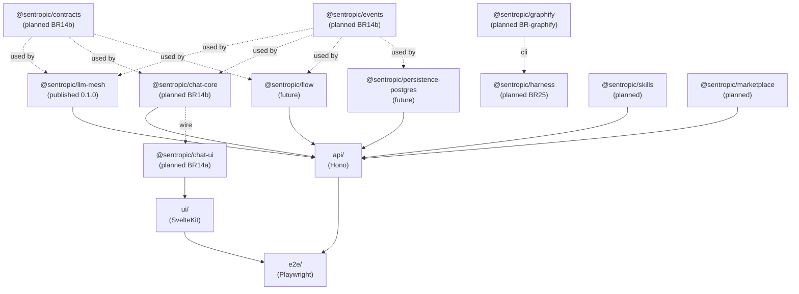
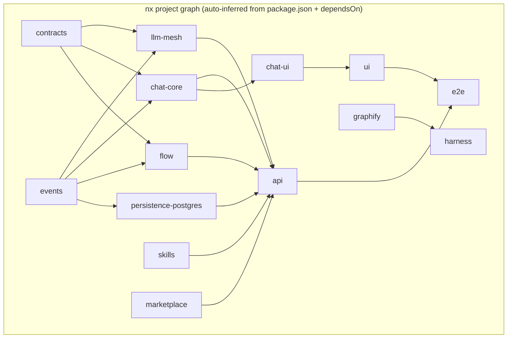

# SPEC_STUDY — Make to nx migration

Status: study, doc-only.
Baseline: `origin/main` @ `a7541823`.
Author: chore/make-to-nx-study.
Charter: assess honestly whether adopting nx as the build/test/CI orchestrator is a net gain for sentropic, given current Make-only Docker-first contract. User has previously rejected nx ("pas bon") — this study must either confirm rejection with evidence or change the recommendation with evidence.

Architecture rule already in force: `rules/architecture.md` — "do not introduce Nx or another orchestrator as a required workflow without a dedicated architecture decision." This document IS that dedicated decision record.

---

## 1. Status quo

### 1.1 Make pipeline inventory

Source: `Makefile`, 1418 lines, 149 declared targets.

Grouped by domain (target counts approximate; some targets are aliases/dependencies):

| Domain | Sample targets | Approx. count |
| --- | --- | --- |
| Help / introspection | `help`, `version`, `cloc`, `test-cloc`, `test-count`, `ps`, `ps-all`, `docker-stats`, `git-stats` | 9 |
| Commit / workflow | `commit`, `conductor-agent-report` (+ aliases) | 6 |
| Install / lock | `install-ui`, `install-ui-dev`, `install-api`, `install-api-dev`, `lock-api`, `lock-root` | 6 |
| Build (apps) | `build`, `build-ui`, `build-ui-image`, `build-api`, `build-api-image`, `build-ext-chrome`, `build-ext-vscode` | 7 |
| Build (packages) | `build-llm-mesh`, `pack-llm-mesh`, `publish-llm-mesh`, `publish-llm-mesh-token` | 4 |
| Docker artifacts | `save-ui`, `load-ui`, `save-api`, `load-api`, `build-e2e`, `save-e2e`, `load-e2e`, `run-e2e` | 8 |
| Registry | `docker-login`, `check-api-image`, `pull-api-image`, `publish-api-image`, `check-ui-image`, `pull-ui-image`, `publish-ui-image`, `check-e2e-image`, `pull-e2e-image`, `publish-e2e-image` | 10 |
| Deploy | `check-scw`, `deploy-api-container-init`, `deploy-api-container`, `wait-for-container`, `deploy-api` | 5 |
| Typecheck | `typecheck`, `typecheck-ui`, `typecheck-api`, `typecheck-llm-mesh` | 4 |
| Lint / format / audit | `lint`, `lint-ui`, `lint-api`, `format`, `format-check`, `audit` | 6 |
| Test (UI) | `test-ui` | 1 |
| Test (API) | `test`, `test-api`, `test-api-smoke`, `test-api-unit`, `test-api-endpoints`, `test-api-queue`, `test-api-security`, `test-api-ai`, `test-api-limit`, `test-api-smoke-restore`, `test-contract`, `wait-ready`, `wait-ready-api` | ~13 |
| Test (E2E) | `test-e2e`, `test-e2e-vscode`, `test-smoke`, `test-load`, `coverage`, `coverage-report` | 6 |
| Test (llm-mesh) | `test-llm-mesh` | 1 |
| Test (security) | `test-security`, `test-security-iac`, `test-security-sast`, `test-security-sca`, `test-security-container`, (+ per-service `test-api-security-*`, `test-ui-security-*`) | ~10 |
| Stack lifecycle | `dev`, `dev-ui`, `dev-api`, `up`, `up-api`, `up-api-test`, `up-api-test-ci`, `up-ui`, `up-e2e`, `up-e2e-vscode`, `up-maildev`, `down`, `down-e2e-vscode`, `down-maildev`, `down-dev-vscode`, `down-dev-playwright`, `logs`, `logs-e2e-vscode`, `logs-dev-vscode`, `logs-dev-playwright`, `restart-api`, `restart-db`, `clean`, `clean-all`, `clean-db`, `prepare-node-workspace` | ~26 |
| Dev extensions | `dev-ext`, `dev-ext-vscode`, `up-dev-vscode`, `ps-dev-vscode`, `up-dev-playwright`, `ps-dev-playwright`, `shell-dev-playwright`, `exec-playwright-dev`, `record-dev-playwright-auth`, `test-e2e-dev` | 10 |
| Database | `db-generate`, `db-migrate`, `db-reset`, `db-status`, `db-inspect`, `db-query`, `db-inspect-initiatives`, `db-inspect-folders`, `db-inspect-users`, `db-backup`, `db-backup-prod`, `db-restore`, `db-fresh`, `db-init` (implicit), `db-seed`, `db-seed-test`, `db-migrate-data`, `db-create-indexes`, `db-lint`, `backup-dir` | ~20 |
| Doc storage | `doc-backup`, `doc-backup-prod`, `doc-restore` | 3 |
| Queue | `queue-clear`, `queue-status`, `queue-reset` | 3 |
| Shell / debug | `sh-ui`, `sh-api` | 2 |

Cross-cutting design principles (enforced by `rules/MASTER.md`):
- **Docker-first**: every target wraps `docker compose`, `docker run`, or `$(DOCKER_COMPOSE)`. No native `npm`/`node`/`python` on host.
- **ENV isolation**: targets accept `ENV=<branch-slug>` as last argument to isolate compose project, networks, volumes, ports.
- **Port overrides**: `API_PORT`, `UI_PORT`, `MAILDEV_UI_PORT` passed as Make variables.
- **Root npm workspace** introduced by BR-14f: `packages/*` resolved through workspace root; `@sentropic/llm-mesh` consumed by `api/` via `file:../packages/llm-mesh`.
- **Make = developer API + agent API + CI API**: same surface used locally, by sub-agents, and in `.github/workflows/ci.yml`.

### 1.2 CI workflow inventory

Source: `.github/workflows/ci.yml`, single 24,566-byte file, 21 jobs.

Triggers: `push: branches: [main]`, `pull_request: branches: [main]`.

Jobs (in declaration order, with their `needs`):

| # | Job | Needs | Purpose |
| --- | --- | --- | --- |
| 1 | `changes` | — | `dorny/paths-filter` produces 7 outputs (`global`, `api`, `scheduler`, `workers`, `ui`, `ai`, `llm_mesh`). |
| 2 | `build-e2e` | `changes` | Conditional rebuild + publish of E2E image (only if `check-e2e-image` fails). |
| 3 | `typecheck-lint-ui` | `changes` | `make typecheck-ui` + `make lint-ui` (gated by `ui` or `global`). |
| 4 | `typecheck-lint-api` | `changes` | `make typecheck-api` + `make lint-api` (gated by `api` or `global`). |
| 5 | `validate-llm-mesh` | `changes` | `make typecheck-llm-mesh` + `make test-llm-mesh` + `make build-llm-mesh` + `make pack-llm-mesh`. Gate: `llm_mesh` or `global`. |
| 6 | `build-api-image` | `changes` | `make build-api` + `make save-api` + upload `api-image.tar` artifact. |
| 7 | `test-api-unit-integration` | `changes`, `build-api-image` | Matrix of 12 entries (smoke, unit, queue, 3× ai, security, limit, 4× endpoints-shard). Reuses uploaded API image. |
| 8 | `build-ui` | `changes` | Builds Chrome extension, VSCode extension, UI image, runs `make test-ui`, builds static UI, uploads UI image + Pages artifact. |
| 9 | `test-e2e` | `changes`, `typecheck-lint-ui`, `typecheck-lint-api`, `build-api-image`, `build-ui`, `build-e2e`, `security-sast-sca` | Matrix of 5 groups (`group-a..e`), each calling `make test-e2e E2E_GROUP=<id>`. |
| 10 | `e2e-vscode` | same as `test-e2e` | Single VSCode E2E lane via `make test-e2e-vscode`. |
| 11 | `security-sast-sca` | `changes` | SAST + SCA scans on api/ui (Semgrep/Trivy via `make test-*-security-sast`/`-sca`). |
| 12 | `security-iac` | `changes` | `make test-security-iac` (Trivy on docker-compose + Makefile). Gate: `global` only. |
| 13 | `security-container` | `changes`, `build-api-image`, `build-ui` | Trivy on built images. |
| 14 | `test-smoke-restore` | `changes`, `build-api-image`, `build-ui`, `build-e2e`, `security-sast-sca` | Backs up prod DB, restores locally, runs `make test-api-smoke-restore`. |
| 15 | `publish-ui-image` | `changes`, `test-e2e`, `e2e-vscode`, `security-container` | Push UI image to registry. Main branch only. |
| 16 | `publish-api-image` | `changes`, `test-api-unit-integration`, `test-e2e`, `e2e-vscode`, `test-smoke-restore`, `security-container` | Push API image to registry. Main branch only. |
| 17 | `publish-llm-mesh` | `changes`, `validate-llm-mesh`, `test-api-unit-integration`, `test-e2e`, `e2e-vscode`, `test-smoke-restore`, `security-container` | npm publish via OIDC; gated by `llm_mesh` change and `main` branch. |
| 18 | `deploy-api` | `changes`, `publish-api-image` | Scaleway container deploy. |
| 19 | `deploy-ui-only` | `changes`, `build-ui`, `publish-ui-image` | UI-only deploy when API unchanged. |
| 20 | `deploy-ui` | `changes`, `build-ui`, `publish-ui-image`, `deploy-api` | UI deploy when API also changed. |
| (changes) | (same) | — | (counted as #1) |

Cache strategy:
- Docker BuildX cache via `docker/setup-buildx-action@v4`.
- Image artifacts shared via `actions/upload-artifact@v7` / `download-artifact@v8` (`api-image.tar`, `ui-image.tar`).
- npm cache: implicit via Docker layer caching (no native `actions/setup-node` cache, since everything runs through Docker).
- No nx cache, no Bazel cache. Affected detection is bespoke via `dorny/paths-filter` (lines 14-48 of `ci.yml`).

### 1.3 Cross-cutting concerns

- **No nodes_modules on host**: developers and agents never install JS deps natively. nx by default expects a host node_modules tree to invoke its plugins → this is a structural friction point.
- **Workspace topology**: `package.json` declares 3 workspace roots (`api`, `ui`, `packages/*`). Currently 1 published package (`@sentropic/llm-mesh`). Target landscape (per `SPEC_STUDY_ARCHITECTURE_BOUNDARIES.md` §1) is 11 packages: `contracts`, `events`, `llm-mesh`, `chat-core`, `chat-ui`, `flow`, `persistence-postgres`, `harness`, `graphify`, `skills`, `marketplace`.
- **Affected detection today**: `dorny/paths-filter` with 4 path filters: `global`, `api`, `ui`, `llm_mesh`. Coarse-grained, hand-maintained.
- **Branch isolation via ENV**: every CI job and dev session uses `ENV=<branch-slug>` as compose project name. nx has no native concept here — nx caches at task/project level, not at ENV level.

---

## 2. Why nx was previously rejected (reconstruction)

User said "pas bon"; rules already encode the architectural objection. Reconstructing the likely arguments, in order of weight:

1. **Make is already a build orchestrator.** Adding nx layers a second task-graph engine over Make, doubling the surface area. Two systems means two places to debug a broken `typecheck` dependency.
2. **Docker-first invariant breaks nx's default model.** nx expects `nx run api:typecheck` to execute `tsc` *on the host*. Sentropic's contract is: never run `tsc` natively. We'd have to write nx executors that shell out to `docker compose run`, which is exactly what `make typecheck-api` already does. nx becomes a wrapper around Make instead of a replacement.
3. **`dorny/paths-filter` already covers "affected".** Sentropic's affected detection is 35 YAML lines in `ci.yml`. nx affected requires nx daemon + project graph + git-base resolution; net code added > 35 lines of YAML.
4. **nx Cloud lock-in / cost.** The headline argument for nx (remote cache, distributed builds) requires nx Cloud (paid, third-party, telemetry). Without nx Cloud, nx's affected runs on a single CI runner — sentropic already does that.
5. **TypeScript bias.** nx is excellent for TS monorepos with many packages compiled the same way. Sentropic has: SvelteKit UI (vite-based), Hono API (esbuild-bundled), `@sentropic/llm-mesh` (tsc lib), planned multi-runtime packages. Each has a custom build command. nx generators won't fit; we'd write custom executors anyway.
6. **Project size doesn't justify it.** As of 2026-05, sentropic has 1 published package + api + ui. Even with the planned 11-package landscape, nx's "thousands of projects" feature set is overkill. The break-even for nx complexity is usually 10+ active packages with shared TS configs.
7. **Plugin ecosystem volatility.** `@nx/svelte`, `@nx/hono`, `@nx/vite` change majors frequently. Each major upgrade is a chore. Sentropic's Makefile has not changed shape in 18 months.
8. **Learning curve for agents.** All sub-agent prompts assume `make <target>`. Migrating to `nx run <project>:<target>` invalidates every rule file, every BRANCH.md template, every conductor launch packet.
9. **Daemon flakiness in CI.** nx daemon has a history of stalls on CI runners (open issues with `NX_DAEMON=false` workarounds). Sentropic CI is currently green on main; introducing daemon risk is regression-prone.

These arguments are valid. None of them are myths.

---

## 3. What nx would change

### 3.1 Mechanically

nx would add to each workspace a `project.json` (or augment `package.json` with `nx` block):

```jsonc
// packages/llm-mesh/project.json (hypothetical)
{
  "name": "llm-mesh",
  "sourceRoot": "packages/llm-mesh/src",
  "projectType": "library",
  "targets": {
    "build":     { "executor": "nx:run-commands", "options": { "command": "make build-llm-mesh" } },
    "typecheck": { "executor": "nx:run-commands", "options": { "command": "make typecheck-llm-mesh" } },
    "test":      { "executor": "nx:run-commands", "options": { "command": "make test-llm-mesh" } }
  }
}
```

Note: the `executor` is `nx:run-commands` calling `make`. nx does NOT replace Docker invocation — it wraps it. Sentropic's Docker-first contract is preserved only by accepting this wrapping pattern.

Workspace root gains `nx.json` (~50 lines) declaring `targetDefaults`, `defaultBase` (typically `origin/main`), `cacheableOperations`, `namedInputs`.

### 3.2 Conceptually

- **Project graph**: nx infers a DAG from `package.json` dependencies (`@sentropic/llm-mesh` is a dep of `api` → edge `llm-mesh → api`).
- **Task graph**: derived from project graph + `dependsOn` declarations (`api:build` depends on `llm-mesh:build`).
- **Local cache**: each `(project, target, input-hash)` triple is cached on disk (`~/.nx/cache`). Re-runs short-circuit when inputs are unchanged.
- **Affected mode**: `nx affected -t typecheck --base=origin/main` resolves the changed projects vs base, transitively expands by dependency graph, and runs only those. **This is the headline feature.**
- **Remote cache (optional, nx Cloud)**: shares cache between CI runs and developers. Paid. Off by default. Can be replaced by self-hosted (e.g. `@nx/azure-cache` or `nx-aws-cache` plugins) at integration cost.

### 3.3 What does NOT change

- The actual build commands (still `tsc`, `vite build`, `esbuild`, `vitest`).
- The Docker invariant (still `docker compose run` underneath).
- The compose isolation (`ENV=<slug>` still required for parallel branch CI).
- The CI runner (still GitHub Actions, Ubuntu, BuildX cache).
- The test framework choices (vitest, Playwright).

**Key insight**: nx changes the *traverser* of the build graph, not the graph itself, not the build steps. The graph is determined by package.json deps + chosen `dependsOn`. The build steps are whatever `make` already runs.

---

## 4. Dependency graph: today vs nx

### 4.1 Current dependency graph (post-BR-14f, with future packages projected)

Solid arrows = `package.json` deps. Dashed arrows = "consumed by" relationships not yet wired.



### 4.2 Same graph in nx

Identical. `project.json` for each node, `dependsOn` declarations mirror the arrows. nx project-graph command would print the exact same DAG.



**Conclusion §4**: the graph is structurally identical. nx adds:
- a machine-readable name for each edge (`nx graph` HTML viewer),
- the ability to compute "affected subset" from a `git diff` against `defaultBase`,
- task-level caching keyed by file hashes.

The graph itself is determined by *the code*, not by *the orchestrator*. Make + `dorny/paths-filter` produce the same logical affected set, just less granularly.

---

## 5. CI before / after

### 5.1 Current CI on a chat-only PR (touches `packages/chat-core/**` only, say)

Hypothetical change: 5 files in `packages/chat-core/src/`. Today `chat-core` doesn't exist yet — but to simulate, assume `dorny/paths-filter` gets a new `chat_core` output (or it falls under `api` if `chat-core` becomes a dep of `api`).

| Job | Triggered? | Reason | Wall time (rough) |
| --- | --- | --- | --- |
| `changes` | yes | always | 20s |
| `build-e2e` | yes | hits `global` if Makefile changes; else gated by ui/api/global. For chat-core-only, `api` output = `true` (because chat-core is in `packages/llm-mesh/**` filter currently → would need new filter). | 1-3m |
| `typecheck-lint-ui` | maybe | gated `ui||global`; on chat-core-only PR: skipped. | — |
| `typecheck-lint-api` | yes | `api||global`; api consumes chat-core. | 1-2m |
| `validate-llm-mesh` | maybe | gated `llm_mesh||global`; on chat-core-only PR: skipped. | — |
| `build-api-image` | yes | `api||global`. | 4-7m |
| `test-api-unit-integration` (×12) | yes | `api||global`; 12 matrix entries. | 5-15m each, parallel |
| `build-ui` | maybe | `ui||global`; skipped. | — |
| `test-e2e` (×5) | yes | `ui||api||global`. | 10-20m each, parallel |
| `e2e-vscode` | yes | same. | 10-20m |
| `security-sast-sca` | yes | `api||ui||global`. | 2-5m |
| `security-iac` | no | `global` only; skipped. | — |
| `security-container` | yes | `api||ui||global`. | 3-7m |
| `test-smoke-restore` | yes | `api||global`. | 5-10m |

For a chat-core-only PR today: ~14 jobs trigger. Most are conditional `if:` blocks that still spin up a runner, checkout, setup Docker, then skip steps. Runner allocation cost ≈ 20-60s per skipped job.

### 5.2 Hypothetical CI with nx affected

Same PR, after nx adoption with full `project.json` per package:

```yaml
# Hypothetical .github/workflows/ci.yml (post-nx)
jobs:
  setup:
    runs-on: ubuntu-latest
    outputs:
      affected_projects: ${{ steps.affected.outputs.list }}
    steps:
      - uses: actions/checkout@v6
        with: { fetch-depth: 0 }
      - run: make nx-affected-list BASE=origin/main  # wraps `nx show projects --affected`
        id: affected
  typecheck:
    needs: setup
    if: contains(needs.setup.outputs.affected_projects, 'typecheck')
    runs-on: ubuntu-latest
    steps:
      - run: make nx-affected TARGET=typecheck BASE=origin/main
  lint:
    needs: setup
    runs-on: ubuntu-latest
    steps:
      - run: make nx-affected TARGET=lint BASE=origin/main
  test:
    needs: setup
    runs-on: ubuntu-latest
    steps:
      - run: make nx-affected TARGET=test BASE=origin/main
  # build-image, e2e, security: stay matrix-based (Docker artifacts), not nx-targetable
```

For the chat-core-only PR:
- `nx affected -t typecheck` → resolves `chat-core, api` (api transitively depends). Skips `ui`, `mesh`, `flow`, `persistence-postgres`, `harness`, etc.
- `nx affected -t test` → same set, plus any test target on these projects.
- `nx affected -t build` → builds only `chat-core` + relink → produces fresh artifacts for `api`.

Estimated savings on a chat-only PR with 11 packages:
- Today: typecheck-lint runs on all of api/ui that change-filter matches → coarse.
- nx affected: typecheck runs on ~2/11 = 18% of projects, savings ~80% on typecheck minutes.

**But**: the heavy CI cost is NOT typecheck. It's:
1. **Building Docker images** (build-api-image, build-ui) — these are NOT nx-targetable (they wrap a Dockerfile, not a TS compile). 4-7 minutes each.
2. **E2E** (5 matrix groups × 10-20 min) — runs full stack, not granular.
3. **Security container scans** — run on full images.

These together represent ~70-80% of CI wall time. **nx affected does not address them.** They're already gated by `dorny/paths-filter` at coarse granularity.

### 5.3 Side-by-side: command-by-command

| CI step | Today | With nx affected |
| --- | --- | --- |
| Affected detection | `dorny/paths-filter` (35 YAML lines, 4 filters) | `nx show projects --affected --base=origin/main` (requires nx daemon + project graph build, ~10-30s overhead per job) |
| Typecheck (UI) | `make typecheck-ui` (gated by `ui||global`) | `nx affected -t typecheck` (only if `ui` in affected) |
| Typecheck (API) | `make typecheck-api` (gated by `api||global`) | `nx affected -t typecheck` (only if `api` in affected) |
| Typecheck (llm-mesh) | `make typecheck-llm-mesh` (gated by `llm_mesh||global`) | `nx affected -t typecheck` (only if `llm-mesh` in affected) |
| Lint | `make lint-ui` / `make lint-api` | `nx affected -t lint` |
| Test (unit) | matrix of 12 (smoke/unit/queue/ai×3/security/limit/endpoints×4) | matrix preserved + nx-affected gate (no real change — matrix is API-test-only) |
| Test (UI) | `make test-ui` inside `build-ui` job | `nx affected -t test` for UI projects |
| Test (llm-mesh) | `make test-llm-mesh` | `nx affected -t test` for llm-mesh project |
| Build (API image) | `make build-api` (always when `api||global`) | unchanged — Docker image build is not an nx target naturally |
| Build (UI image) | `make build-ui-image` (always when `ui||api||global`) | unchanged |
| E2E (5 groups) | `make test-e2e E2E_GROUP=<id>` | unchanged — E2E runs on the full integrated stack |
| Security (SAST/SCA) | `make test-*-security-sast`/`-sca` | could become `nx affected -t security-sast` per project (savings minimal — Semgrep/Trivy are already fast) |
| Security (container) | unchanged (runs on built images) | unchanged |
| Publish (npm: llm-mesh) | gated by `llm_mesh==true` | `nx affected -t publish` (only if changed) — same outcome |
| Publish (Docker: api/ui) | gated by `api||global` / `ui||global` | gated by nx-affected (same outcome) |
| Deploy | gated by `api||global` / `ui||global` + main branch | unchanged |

Net for CI:
- nx affected gives finer granularity on typecheck/lint/test of pure-TS packages. Saving: **~5-15 minutes of cumulative typecheck/lint/unit time on a single-package PR**, distributed across cheap jobs.
- nx affected gives NO saving on the expensive jobs: Docker image builds, E2E (5 groups × ~15 min), security container scans, smoke-restore.
- nx affected adds: project-graph computation cost (~30s startup per job invoking nx), nx daemon liveness risk, additional config file maintenance (11 × `project.json` + `nx.json`).

**Quantitative summary**: with 11 packages and a typical single-package PR, nx affected saves on the order of **10-20% of total CI minutes** (and only on the cheap jobs that are already short). The expensive 70-80% (Docker + E2E + security) is unaffected.

### 5.4 Misconfiguration risk

- A missing `dependsOn` edge in `project.json` makes nx miss a dependent rebuild → silent staleness → broken artifact in production. With Make + `dorny/paths-filter`, missing a filter triggers a too-coarse build (slower) but never silently skips.
- nx affected with `--base=origin/main` requires `fetch-depth: 0` in `actions/checkout` (else nx can't compute diff). Current CI uses default (depth 1). This is a one-line change but a common foot-gun.
- nx cache poisoning: a cached typecheck for project X using stale `node_modules` of a workspace dep can return success when fresh would fail. Mitigated by `namedInputs` correctness (extra config to maintain).

---

## 6. Transition plan — one branch

Goal: introduce nx without breaking existing Make-based contract. Make stays the dev/agent/CI surface. nx is invisible underneath, gated by an opt-in.

### Lot 0 — Scoping (no code change)
- This study spec is delivered. User decision required: adopt / adapt / reject.
- If user says reject: branch closes here. No further lots.
- If user says adapt/adopt: continue.

### Lot 1 — nx skeleton (install + base config)
- Add `nx` + `@nrwl/devkit` (or `nx@latest`) to root `package.json` devDeps via `make install-root-dev nx`. Cost: ~1 line in package.json + lockfile churn.
- Add `nx.json` at root (≤50 lines): `targetDefaults`, `defaultBase: origin/main`, `cacheableOperations: [typecheck, test, lint, build]`, `namedInputs` declaring "default" and "production".
- Add `project.json` for each existing workspace (`api`, `ui`, `packages/llm-mesh`), each ≤30 lines, declaring targets that call `make <target>` via `nx:run-commands`.
- DO NOT change any Make target.
- DO NOT change `.github/workflows/ci.yml`.
- Validate: run `make typecheck` and `make test-llm-mesh` locally — must work unchanged.
- Validate: run `make nx-affected-list BASE=origin/main` (new Make target) — must print expected project set.
- Size estimate: ~150-250 lines (configs only).
- Exit gate: CI green on `main` (no changes to CI = no risk).

### Lot 2 — Make wrappers for nx
- Add new Make targets (NOT replace existing):
  - `nx-affected TARGET=<x> BASE=<git-ref>` → calls `docker run --rm -v $(CURDIR):/workspace -w /workspace $(NX_IMAGE) nx affected -t $(TARGET) --base=$(BASE)`.
  - `nx-graph` → produces `nx graph --file=nx-graph.html` artifact.
  - `nx-affected-list BASE=<git-ref>` → prints affected project names for CI matrix generation.
- The existing `make typecheck`, `make test`, etc. remain UNCHANGED — they still call the per-service Make targets directly.
- Devs continue to use `make typecheck` (full) or `make typecheck-api` (single).
- Sub-agents continue with the same prompts.
- Size estimate: ~80-120 lines in Makefile.
- Exit gate: `make nx-affected TARGET=typecheck BASE=origin/main` works on the branch.

### Lot 3 — CI shadow run
- Add a NEW job in `ci.yml` called `nx-affected-shadow` that runs `make nx-affected TARGET=typecheck` + `make nx-affected TARGET=lint` + `make nx-affected TARGET=test` for the unit suites. This job is `continue-on-error: true`.
- Run it for 1-2 weeks alongside existing jobs.
- Compare: does nx miss anything? Does it catch anything Make missed? (It won't — Make already runs everything.)
- Size estimate: ~30-50 lines in `ci.yml`.
- Exit gate: 5 consecutive PRs where shadow job produced same result as primary jobs (modulo cache hits).

### Lot 4 — Decision point
- Based on shadow data, user decides:
  - **Option A — Flip CI to nx-affected as primary**: replace `typecheck-lint-ui` / `typecheck-lint-api` / `validate-llm-mesh` jobs with a single `nx-affected-typecheck-lint` job. Estimated saving: 1-3 minutes on cheap jobs per PR. Cost: nx daemon + cache reliance.
  - **Option B — Keep nx as developer-only tool**: leave CI on Make-only. Devs can opt in via `make nx-affected` locally to speed up pre-push checks. nx never touches CI hot path.
  - **Option C — Roll back**: remove nx config files; revert Lot 1-3.
- Size estimate: 30-100 lines depending on option chosen.

### Lot 5 — (option A only) Cleanup
- Remove redundant `dorny/paths-filter` outputs once nx-affected drives all gates.
- Remove `if: needs.changes.outputs.X == 'true'` from converted jobs.
- Update `rules/architecture.md`: replace "do not introduce Nx" clause with "Nx is used as a CI optimizer wrapped by Make; Make remains the developer/agent surface".
- Size estimate: ~50-80 lines net delta in `ci.yml`.

### Total estimated branch size
- Lot 1-3 minimum (adapt path, option B): **~250-450 lines** in 3-4 commits.
- Lot 1-5 full (adopt path, option A): **~500-900 lines** in 5-7 commits.

This fits in a single branch under the 150-line-per-commit guideline (BR-04 cap), distributed across 4-7 atomic commits.

---

## 7. Risks and rollback

| ID | Risk | Severity | Mitigation | Rollback |
| --- | --- | --- | --- | --- |
| R1 | nx daemon stalls CI runner | High (CI red on main = blocker) | Use `NX_DAEMON=false` env in CI; daemon is for dev only | Revert Lot 3 (single commit); CI returns to status quo |
| R2 | nx cache poisoning (false-positive cache hit) | Medium | Enforce `namedInputs` correctness review per package; disable remote cache | `rm -rf ~/.nx/cache`; rerun affected; revert Lot 1 if systemic |
| R3 | Developers must learn `nx` CLI | Low | Make wrappers keep `make` as the only surface in docs/agent prompts (Lot 2) | n/a — wrappers absorb the learning curve |
| R4 | nx Cloud telemetry leak | Medium (privacy/data residency) | Do NOT enable nx Cloud; ensure `nx.json` has no `nxCloudAccessToken` | Disable env var; revoke token |
| R5 | Plugin churn (nx majors every 6 months) | Medium | Pin `nx@x.y.z`; treat majors as a dedicated branch like any other dep upgrade | Revert version pin |
| R6 | Sub-agent prompts become stale | Low | Make wrappers preserve `make <target>` as the public API; agents see no diff | n/a |
| R7 | `actions/checkout` fetch-depth required | Low | Add `with: fetch-depth: 0` to nx-running jobs only | Single-line revert |
| R8 | nx misses a transitive rebuild → broken prod artifact | High | Lot 3 shadow run catches discrepancies before Lot 4 flip | Stay on Lot 3 indefinitely or revert |
| R9 | Confusion: "is this PR using nx or Make?" | Medium | Documentation + `rules/MASTER.md` update; single source of truth | n/a |
| R10 | Two task graphs to debug when something breaks | Medium | Adapt path (option B) keeps nx out of CI, eliminates the dual-graph problem | Roll back to Lot 1-2 only |

Hard rollback path: `git revert <merge commit of this branch>` reverts every config in one shot. nx leaves no DB schema, no migration, no on-disk state outside `~/.nx/cache` (which is dev-local).

---

## 8. Honest recommendation

### Decision: **REJECT** (with a sub-option: optional adapt for power-developers)

Reasoning, in priority order:

1. **The expensive 70-80% of CI wall time is Docker image builds + E2E + security container scans.** nx affected gives zero saving there. The savings would land on typecheck/lint/unit-test (the already-cheap jobs).

2. **Affected detection already works.** `dorny/paths-filter` (35 YAML lines) gates the right jobs today. Going from "filter by 4 paths" to "filter by 11 projects" via nx is a marginal improvement — and most of those 11 projects will share `api` as a downstream, so any change in `chat-core` still triggers `api` builds and downstream E2E. The fan-out is dictated by `api/` being the single Node integration point.

3. **The dual-graph cost is real.** Today, when a Make target breaks, the developer reads the Makefile. After nx, they'd have to read `Makefile` AND `nx.json` AND `project.json` per package. Two systems to debug. Skill matrix doubled. For 11 packages with ~3 targets each, that's 33 `project.json` target declarations to keep in sync with their Make counterparts.

4. **The architectural rule already forbids this.** `rules/architecture.md` states: "do not introduce Nx or another orchestrator as a required workflow without a dedicated architecture decision." This study IS that decision — and the data does not justify overriding the rule.

5. **The break-even doesn't exist.** Industry rule of thumb for nx is: net win above ~10 active packages with shared TS configs. Sentropic has 1 active package, with 10 more planned over 12-18 months. Even at the projected scale, the shared-config benefit is limited because each package has a distinct toolchain (tsc, vite, esbuild, vitest, Playwright, drizzle).

6. **Make is good enough and stable.** 1418-line Makefile, 149 targets, organized by domain, stable for 18+ months. The pain points users actually report (long E2E times, Docker image build duration) are not addressed by nx.

### Sub-recommendation: an alternative for selective rebuilds without nx

If the user wants finer-grained "affected" without paying the nx tax, add a single Make target:

```makefile
# Hypothetical — not part of this branch's scope
.PHONY: typecheck-affected
typecheck-affected: ## Run typecheck only on workspaces touched since BASE (default: origin/main)
	@base=$${BASE:-origin/main}; \
	changed=$$(git diff --name-only "$$base"...HEAD); \
	echo "$$changed" | grep -q '^packages/llm-mesh/' && $(MAKE) typecheck-llm-mesh; \
	echo "$$changed" | grep -q '^api/'                && $(MAKE) typecheck-api; \
	echo "$$changed" | grep -q '^ui/'                 && $(MAKE) typecheck-ui; \
	echo "$$changed" | grep -q -E '^(Makefile|docker-compose|package(-lock)?\.json)' && $(MAKE) typecheck
```

Cost: ~20 lines of Make. No new dependency. No daemon. No external tool. Same affected-detection benefit for the cheap jobs. Easily extensible per package as the landscape grows from 1 to 11. Sub-agents discover it via `make help`. Conductor prompts unchanged.

If `make typecheck-affected` proves valuable, generalize to `make <verb>-affected` for `lint`, `test`, `build`. ~80 lines total. Replaces every nx benefit listed in §3, at <1% of the integration cost.

### When to revisit nx

Revisit this decision when ALL three are true:
- Active package count > 12 (today: 1, projected: 11).
- Cross-package TS config sharing exceeds 50% (today: each package has its own `tsconfig.json` style).
- CI typecheck/lint time exceeds 30% of total CI wall time (today: <10%, dominated by Docker builds and E2E).

Until then: **Make + dorny/paths-filter + optional `make *-affected` custom targets** is the optimal point on the cost/value curve.

---

## 9. Appendix — verification commands

These commands were used to produce this study. They are listed here for reproducibility, not as recommended commands to run again (they ran during the study only).

```bash
# Make target inventory
grep -E "^[a-zA-Z][a-zA-Z0-9_.-]*:" Makefile | wc -l    # 149
wc -l Makefile                                          # 1418

# CI workflow inventory
grep -n "^  [a-z][a-z0-9_-]*:" .github/workflows/ci.yml # 21 jobs
ls .github/workflows/                                   # ci.yml only

# Workspace inventory
cat package.json | grep -A5 workspaces                  # api, ui, packages/*
find packages -maxdepth 2 -name package.json            # 1 (llm-mesh)
```

End of study.
