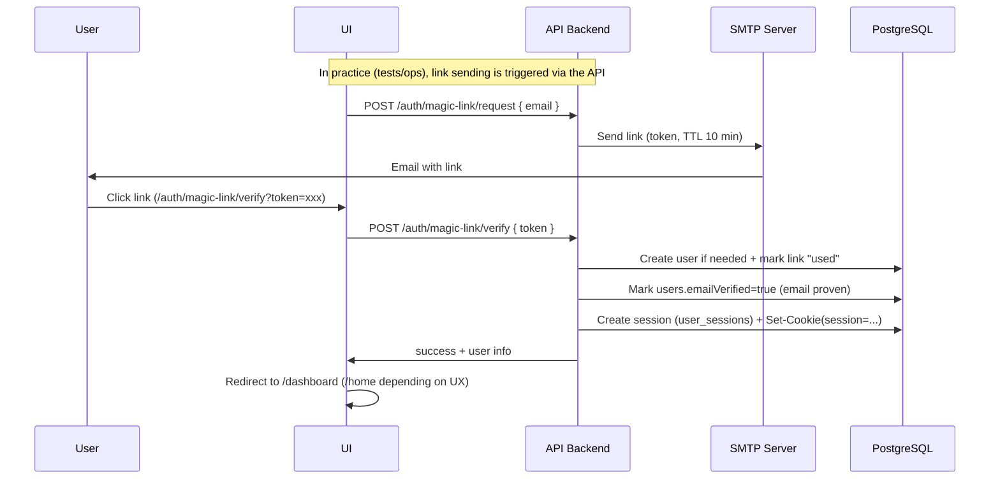
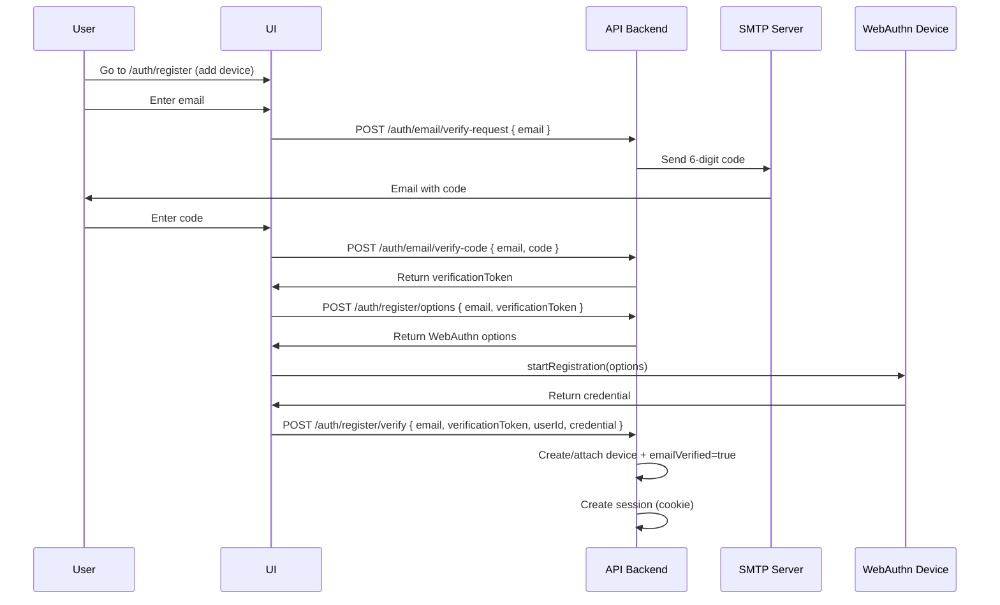
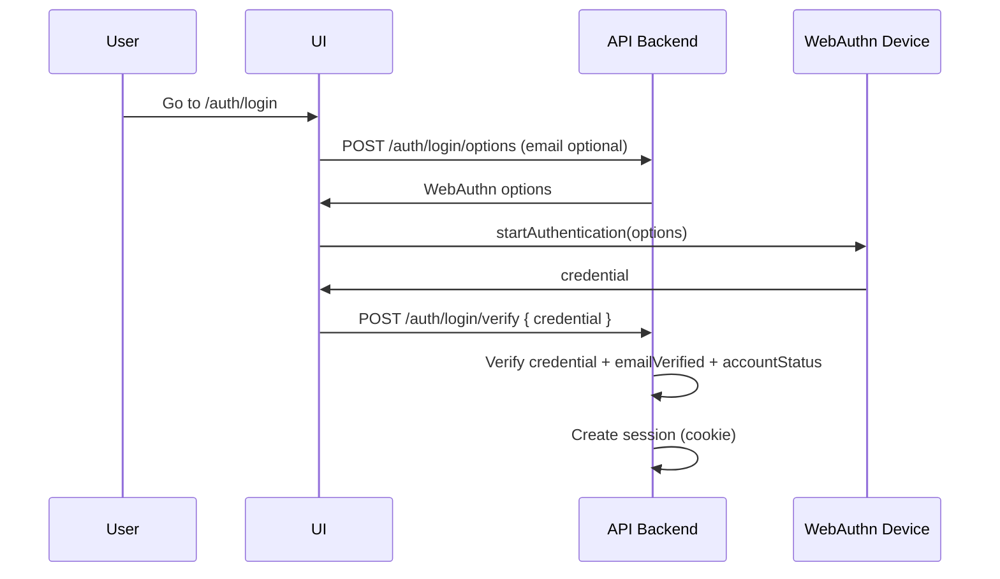
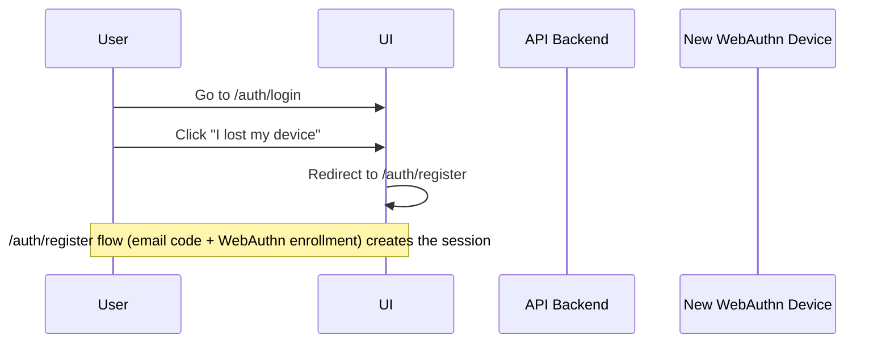
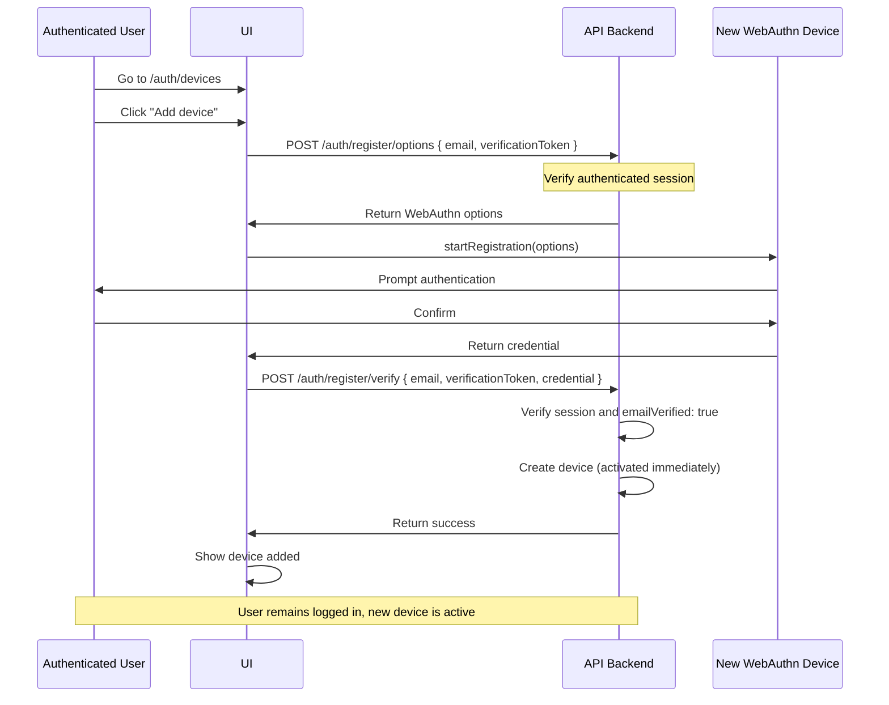

# Authentication Workflow (WebAuthn + utility Magic Link)

## Security principles

1. **Verified email required for a session**: `validateSession()` blocks if `users.emailVerified=false`.
2. **Login exposed in UI**: **WebAuthn** (passkeys / discoverable credentials) — single button on `/auth/login`.
3. **Email verification via 6-digit code**: used on `/auth/register` to obtain a `verificationToken` required for WebAuthn enrollment (anti‑abuse).
4. **Magic link (utility, not exposed on login screen)**: API endpoints exist + UI page `/auth/magic-link/verify`, mainly for tests/E2E/ops (not a “product” login method).
5. **Sessions**: `session` cookie `HttpOnly`, `Secure` in prod, `SameSite=Lax`, persisted in DB (`user_sessions`).
6. **Access rules**: account status (`accountStatus` + `approvalDueAt`) and `emailVerified` impact access (see `session-manager.ts`).

## Detailed workflows

### 1. Magic link (utility, not exposed in UI login)

This flow exists in API and via `/auth/magic-link/verify`, but **is not proposed as a login method in the login UI** (no email field / no “receive link” button).

**Details:**
1. UI requests a link via `POST /api/v1/auth/magic-link/request`.
2. User clicks the link; UI calls `POST /api/v1/auth/magic-link/verify`.
3. Backend creates user if needed, **sets `emailVerified=true`**, and creates a session (cookie).

### 2. WebAuthn enrollment via email code (UI `/auth/register`)

This flow adds a passkey for future logins.

**Details:**
1. Email code yields a `verificationToken` (TTL, single‑use).
2. Token is required for `POST /auth/register/options` and `POST /auth/register/verify`.
3. `register/verify` creates the credential and opens a session.

### 3. WebAuthn login (passkeys)

### 4. Device loss / recovery (UI “I lost my device”)

**Details:**
1. User goes to /auth/login.
2. Clicks "I lost my device".
3. Follows `/auth/register` flow: email code + WebAuthn enrollment (same as registration).
   → POST /auth/register/options (with email)  
   → Browser prompts user to use their device (biometrics, PIN, etc.)  
   → POST /auth/register/verify (with device credential)  
   → Backend ensures device is not already registered for this user:  
     * If device exists: return error "This device is already registered, use it to log in"  
     * Suggest redirect to /auth/login  
   → Mark `emailVerified=true` during `/auth/register/verify` (email proof)  
   → Create session (cookie)
4. User can now log in with the new WebAuthn device.

### 5. Register an additional device (already authenticated user)

**Details:**
1. Authenticated user goes to /auth/devices.
2. Clicks "Add device".
3. Registers new device → POST /auth/register/options then /verify  
   → Verify user is authenticated  
   → Verify emailVerified: true  
   → Create device (activated because email already verified)  
   → No new session (user already authenticated)

## API security rules

### POST /auth/email/verify-request
- ✅ Accepts email
- ✅ Generates 6‑digit code (random)
- ✅ Hashes code (SHA‑256) before storage
- ✅ Stores code with email, expiration (10 min), used: false
- ✅ Sends the code by email (not hashed)
- ✅ Rate limiting: max 3 codes per email every 10 minutes

### POST /auth/email/verify-code
- ✅ Accepts email + code (6 digits)
- ✅ Verifies code (hash match, not expired, not used)
- ✅ Marks code as used
- ✅ Generates a temporary validation token (JWT, valid 15 minutes)
- ✅ Returns the validation token
- ✅ Token is used to validate email during WebAuthn enrollment

### POST /auth/register/options
- ✅ Accepts email + verificationToken (token returned by verify-code)
- ✅ Verifies the verificationToken is valid and matches email
- ✅ Returns WebAuthn options

### POST /auth/register/verify
- ✅ Accepts email + verificationToken + credential
- ✅ Verifies verificationToken is valid and matches email
- ✅ Verifies device is not already registered for this user
  - If device exists: return error "This device is already registered, use it to log in"
- ✅ Creates user (emailVerified: true directly)
- ✅ Creates WebAuthn device (activated and usable)
- ✅ Creates a full session (cookie)
- ✅ Returns success with session

### POST /auth/login/options
- ✅ Generates WebAuthn options for discoverable credentials (no email required)
- ✅ Enables passkey selection directly by the browser

### POST /auth/login/verify
- ✅ Verifies device exists and is valid
- ✅ Verifies emailVerified: true (device activated)
- ✅ Blocks login if email not verified (device inactive)
- ✅ Creates a session only if all checks pass

### POST /auth/magic-link/request
- ✅ Generates and sends magic link
- ✅ Can be used for login (existing user) or first registration (creates user if needed)

### POST /auth/magic-link/verify
- ✅ Marks `users.emailVerified = true` (email proven) after verification
- ✅ Creates a session (cookie `session`) if account is not disabled
  - Existing devices remain active (unless explicitly revoked)
- ✅ Checks if user has a new device pending activation
- ✅ If validation after enrollment (new device pending):
  - Creates a full session
  - Redirects to /home
  - New device is now active and usable
- ✅ If no pending device (edge case):
  - Creates a temporary session
  - Redirects to /auth/register for enrollment

### GET /auth/magic-link/verify (UI page)
- ✅ Same logic as POST /verify
- ✅ Redirects to /home if session created (post-enrollment validation)
- ✅ Redirects to /auth/register if no pending device (edge case)

### GET /auth/login
- ✅ Does NOT show an email field (not needed with passkeys)
- ✅ Shows only the WebAuthn button (discoverable passkeys)
- ✅ Does NOT show magic link as a primary login method
- ✅ Shows "I lost my device" → redirects to `/auth/register` (email code + WebAuthn enrollment)

## Session validation

### validateSession()
- ✅ Verifies user has `emailVerified: true`
- ✅ Blocks sessions if email not verified (security reinforcement)

## WebAuthn device management

### Device states
- **Registered but inactive**: device exists but emailVerified: false → NOT usable for login
- **Active**: device exists and emailVerified: true → usable for login

### Device activation
- Devices become usable when `users.emailVerified=true` (e.g., email code on `/auth/register`, or utility magic link).
- A user can have multiple devices, all usable once the email is verified.

## User states

1. **Email not verified, device registered (inactive)**:
   - Device exists but cannot be used for login
   - Must verify email (via code on `/auth/register`, or utility magic link)
   - No active session

2. **Email verified, device registered (active)**:
   - Device usable for login
   - User can log in via WebAuthn

3. **Email verified, registered devices (lost)**:
   - Enroll a new device via `/auth/register` (email code proof)
   - Old devices remain active (can be revoked later)

4. **Email verified, no device (edge case)**:
   - Can register a device, activated immediately
   - Magic link would create a session, redirect to register if needed

## Activation flow after email validation

When a mechanism validates the email (code `/auth/register` or utility magic link):
1. Mark `emailVerified: true` on the user
2. WebAuthn credentials become usable for login
3. Enrollment flows typically create a session (cookie) at the end

## Migration

For existing users without `emailVerified`:
- Default `emailVerified: false`
- They must redo email verification if needed
- Or one‑time migration to mark as verified (to decide)
