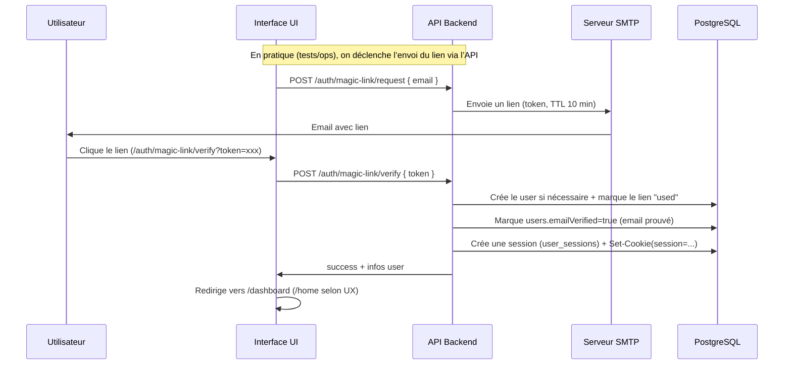
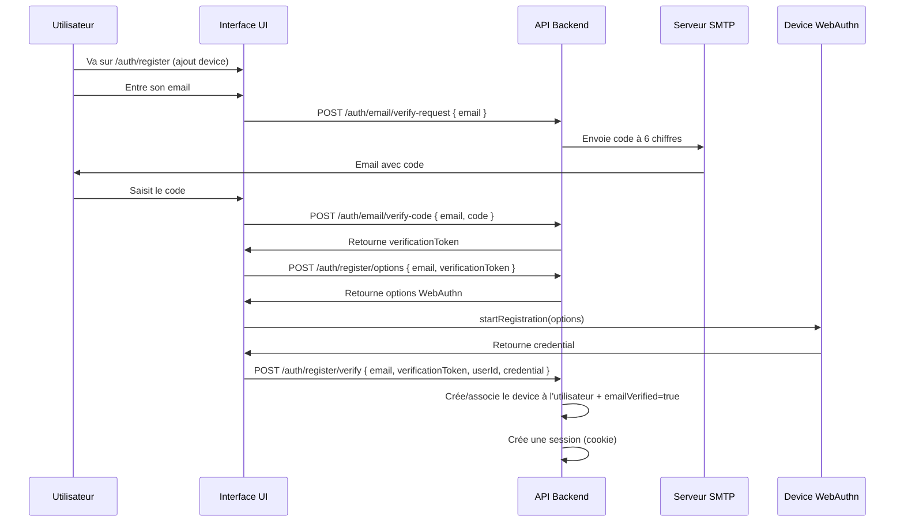
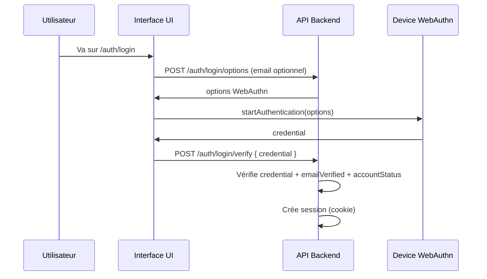
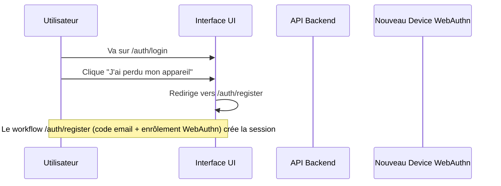
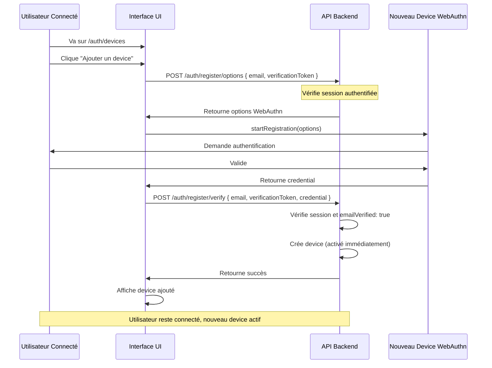

# Workflow d'Authentification (WebAuthn + Magic Link utilitaire)

## Principes de sécurité

1. **Email vérifié requis pour une session** : `validateSession()` bloque si `users.emailVerified=false`.
2. **Connexion exposée dans l’UI** : **WebAuthn** (passkeys / discoverable credentials) — bouton unique sur `/auth/login`.
3. **Vérification email par code (6 chiffres)** : utilisée sur `/auth/register` pour obtenir un `verificationToken` nécessaire à l’enrôlement WebAuthn (anti-abus).
4. **Magic link (utilitaire, non exposé sur l’écran de login)** : endpoints API présents + page UI `/auth/magic-link/verify`, principalement utile pour tests/E2E/ops (pas un mode de connexion “produit” dans l’écran de login).
5. **Sessions** : cookie `session` HttpOnly, `Secure` en prod, `SameSite=Lax`, persistées en DB (`user_sessions`).
6. **Règles d’accès** : statut de compte (`accountStatus` + `approvalDueAt`) et `emailVerified` influencent l’accès (voir `session-manager.ts`).

## Workflows détaillés

### 1. Magic link (utilitaire, non exposé dans l’UI de login)

Ce flux existe côté API et via la page `/auth/magic-link/verify`, mais **n’est pas proposé comme méthode de connexion dans l’UI de login** (pas de champ email / pas de bouton “recevoir un lien”).

**Détails :**
1. UI demande un lien via `POST /api/v1/auth/magic-link/request`.
2. L’utilisateur clique le lien ; l’UI appelle `POST /api/v1/auth/magic-link/verify`.
3. Le backend crée l’utilisateur si besoin, **met `emailVerified=true`**, et crée une session (cookie).

### 2. Enrôlement WebAuthn via code email (UI `/auth/register`)

Ce flux permet d’ajouter une passkey pour les connexions futures.

**Détails :**
1. Le code email donne un `verificationToken` (TTL, usage unique).
2. Ce token est requis pour `POST /auth/register/options` et `POST /auth/register/verify`.
3. `register/verify` crée le credential et ouvre une session.

### 3. Connexion WebAuthn (passkeys)

### 4. Perte d’appareil / récupération (UI “J’ai perdu mon appareil”)

**Détails :**
1. Utilisateur va sur /auth/login
2. Clique sur "J'ai perdu mon appareil"
3. Suit le workflow `/auth/register` : code email + enrôlement WebAuthn (même principe que l’inscription)
   → POST /auth/register/options (avec email)
     - Le navigateur demande à l'utilisateur d'utiliser son device (biométrie, PIN, etc.)
     - L'utilisateur valide sur son device (empreinte digitale, Face ID, etc.)
   → POST /auth/register/verify (avec credential retourné par le device)
   → Vérifie que le device n'est pas déjà enregistré pour cet utilisateur
     * Si le device existe déjà : retourne erreur "Ce device est déjà enregistré, utilisez-le pour vous connecter"
     * Propose de rediriger vers /auth/login
   → Marque `emailVerified=true` pendant `/auth/register/verify` (preuve par code email)
   → Crée une session (cookie)
4. L’utilisateur peut maintenant se connecter avec son nouveau device WebAuthn.

### 5. Enregistrement d'un device supplémentaire (utilisateur déjà connecté)

**Détails :**
1. Utilisateur connecté va sur /auth/devices
2. Clique sur "Ajouter un device"
3. Enregistre le nouveau device → POST /auth/register/options puis /verify
   → Vérifie que l'utilisateur est authentifié
   → Vérifie que emailVerified: true
   → Crée le device (activé car email déjà vérifié)
   → Pas de nouvelle session (utilisateur déjà connecté)

## Règles de sécurité API

### POST /auth/email/verify-request
- ✅ Accepte l'email
- ✅ Génère un code à 6 chiffres (aléatoire)
- ✅ Hash le code (SHA-256) avant stockage
- ✅ Stocke le code en base avec email, expiration (10 min), utilisé: false
- ✅ Envoie le code par email (non hashé)
- ✅ Rate limiting : max 3 codes par email toutes les 10 minutes

### POST /auth/email/verify-code
- ✅ Accepte email + code (6 chiffres)
- ✅ Vérifie le code (hash comparé, non expiré, non utilisé)
- ✅ Marque le code comme utilisé
- ✅ Génère un token de validation temporaire (JWT, valide 15 minutes)
- ✅ Retourne le token de validation
- ✅ Ce token sera utilisé pour valider l'email lors de l'enrôlement WebAuthn

### POST /auth/register/options
- ✅ Accepte l'email + verificationToken (token retourné par verify-code)
- ✅ Vérifie que le verificationToken est valide et correspond à l'email
- ✅ Retourne les options WebAuthn

### POST /auth/register/verify
- ✅ Accepte email + verificationToken + credential
- ✅ Vérifie que le verificationToken est valide et correspond à l'email
- ✅ Vérifie que le device n'est pas déjà enregistré pour cet utilisateur
  - Si le device existe déjà : retourne erreur avec message "Ce device est déjà enregistré, utilisez-le pour vous connecter"
- ✅ Crée l'utilisateur (emailVerified: true directement)
- ✅ Crée le device WebAuthn (activé et utilisable)
- ✅ Crée une session complète (cookie)
- ✅ Retourne success avec session

### POST /auth/login/options
- ✅ Génère les options WebAuthn pour discoverable credentials (pas besoin d'email)
- ✅ Permet la sélection de passkeys directement par le navigateur

### POST /auth/login/verify
- ✅ Vérifie que le device existe et est valide
- ✅ Vérifie que emailVerified: true (device activé)
- ✅ Bloque la connexion si email non vérifié (device inactif)
- ✅ Crée une session uniquement si tout est vérifié

### POST /auth/magic-link/request
- ✅ Génère et envoie le magic link
- ✅ Peut être utilisé pour login (utilisateur existant) ou première inscription (crée l’utilisateur si besoin)

### POST /auth/magic-link/verify
- ✅ Marque `users.emailVerified = true` (email prouvé) après vérification
- ✅ Crée une session (cookie `session`) si le compte n’est pas désactivé
  - Les anciens devices déjà activés restent actifs (sauf si explicitement révoqués)
- ✅ Vérifie si l'utilisateur a un nouveau device en attente d'activation
- ✅ Si c'est la validation après enrôlement (nouveau device en attente) :
  - Crée une session complète
  - Redirige vers /home
  - Le nouveau device est maintenant activé et utilisable
- ✅ Si l'utilisateur n'a pas de device en attente (cas edge) :
  - Crée une session temporaire
  - Redirige vers /auth/register pour enrôlement

### GET /auth/magic-link/verify (page UI)
- ✅ Même logique que POST /verify
- ✅ Redirige vers /home si session créée (validation après enrôlement)
- ✅ Redirige vers /auth/register si pas de device en attente (cas edge)

### GET /auth/login
- ✅ N'affiche PAS de champ email (pas nécessaire avec passkeys)
- ✅ Affiche uniquement le bouton WebAuthn (passkeys discoverables)
- ✅ N'affiche PAS l'option magic link comme méthode de connexion principale
- ✅ Affiche "J'ai perdu mon appareil" → renvoie vers `/auth/register` (code email + enrôlement WebAuthn)

## Validation de session

### validateSession()
- ✅ Vérifie que l'utilisateur a `emailVerified: true`
- ✅ Bloque les sessions si email non vérifié (sécurité renforcée)

## Gestion des devices WebAuthn

### État des devices
- **Enregistré mais inactif** : Device créé mais emailVerified: false → PAS utilisable pour login
- **Actif** : Device créé et emailVerified: true → Utilisable pour login

### Activation des devices
- Les devices deviennent utilisables lorsque `users.emailVerified=true` (ex: preuve d’email par code sur `/auth/register`, ou via magic link utilitaire).
- Un utilisateur peut avoir plusieurs devices, tous utilisables tant que l’email est vérifié.

## États possibles d'un utilisateur

1. **Email non vérifié, device enregistré (inactif)** : 
   - Device existe mais ne peut pas être utilisé pour login
   - Doit vérifier l’email (ex: par code sur `/auth/register`, ou magic link utilitaire)
   - Pas de session active

2. **Email vérifié, device enregistré (actif)** : 
   - Device utilisable pour login
   - Peut se connecter via WebAuthn

3. **Email vérifié, devices enregistrés (perte)** : 
   - Enrôle un nouveau device via `/auth/register` (preuve d’email par code)
   - Les anciens devices restent actifs (peuvent être révoqués plus tard)

4. **Email vérifié, pas de device (cas edge)** : 
   - Peut enregistrer un device, activé immédiatement
   - Magic link aurait créé une session, redirection vers register si besoin

## Flux d'activation après validation email

Lorsqu’un mécanisme valide l’email (code `/auth/register` ou magic link utilitaire) :
1. Marque `emailVerified: true` sur l'utilisateur
2. Les credentials WebAuthn deviennent utilisables pour se connecter
3. Les flows d’enrôlement créent typiquement une session (cookie) à la fin du workflow

## Migration

Pour les utilisateurs existants sans `emailVerified` :
- Par défaut `emailVerified: false`
- Ils doivent refaire la vérification email si nécessaire
- Ou migration one-time pour marquer comme vérifié (à décider selon le cas)
