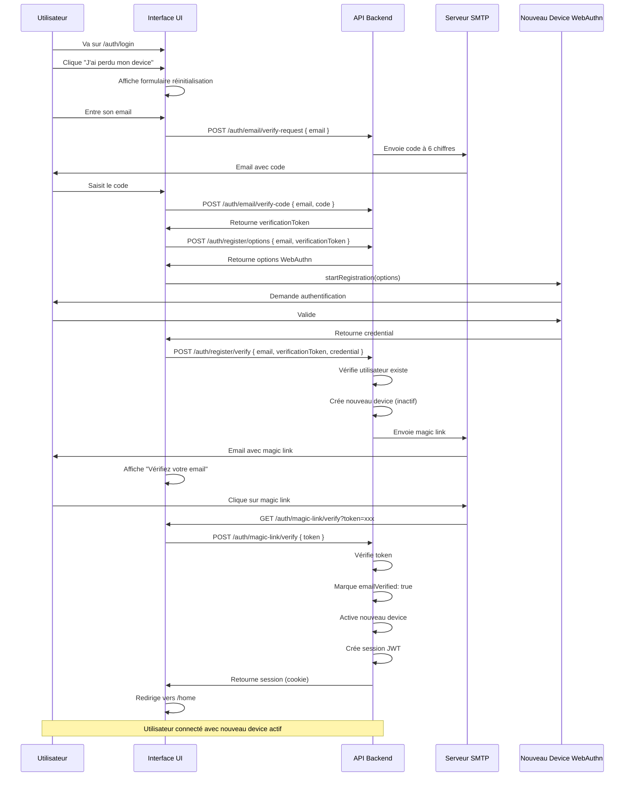

# Workflow d'Authentification Sécurisé WebAuthn

## Principes de sécurité

1. **Enregistrement device avant vérification email** : L'utilisateur peut enregistrer son device WebAuthn avant de valider son email
2. **Device inactif tant que email non vérifié** : Le device WebAuthn n'est PAS utilisable pour se connecter tant que l'email n'est pas vérifié
3. **Déconnexion automatique** : Après enregistrement du device, l'utilisateur est déconnecté (pas de session) tant que l'email n'est pas validé
4. **Activation via magic link** : Le magic link valide l'email et active le device pour qu'il devienne utilisable
5. **Pas de connexion magic link** : Une fois le device activé, on ne peut se connecter QUE via WebAuthn (pas de magic link login)
6. **Fallback pour réinitialisation** : Le magic link sert uniquement à valider l'email et réinitialiser/ajouter un nouveau device

## Workflows détaillés

### 1. Nouvel utilisateur (première inscription)

**Détails :**
1. Utilisateur va sur /auth/register
2. Entre son email
   → Sur blur + email valide : POST /auth/email/verify-request (avec email)
   → Envoie un email avec un code à 6 chiffres
   → Affiche l'input pour saisir le code à 6 chiffres (apparaît sous l'input email)
   
3. Utilisateur saisit le code reçu par email
   → POST /auth/email/verify-code (avec email + code)
   → Vérifie le code (TTL 10 min, usage unique)
   → Retourne un token temporaire de validation (valide pour X minutes)
   → Active le bouton d'enrôlement WebAuthn
   
4. Utilisateur ENRÔLE son device WebAuthn
   → POST /auth/register/options (avec email + validation token)
     - Le navigateur demande à l'utilisateur d'utiliser son device (biométrie, PIN, etc.)
     - L'utilisateur valide sur son device (empreinte digitale, Face ID, etc.)
   → POST /auth/register/verify (avec credential retourné par le device + validation token)
   → Vérifie que le code a été validé pour cet email (via le token)
   → Crée l'utilisateur (emailVerified: true)
   → Crée le device WebAuthn en base (activé et utilisable)
   → Crée une session complète (cookie)
   → Redirige vers /home (utilisateur est connecté)
   
5. Utilisateur peut maintenant se connecter avec son device WebAuthn

### 2. Connexion normale (utilisateur avec device activé)

**Détails :**
1. Utilisateur va sur /auth/login
2. Utilise son device WebAuthn directement (passkeys/discoverable credentials)
   → POST /auth/login/options (pas besoin d'email)
   → Le navigateur demande à l'utilisateur d'utiliser son device (biométrie, PIN, etc.)
   → POST /auth/login/verify (avec credential retourné par le device)
   → Vérifie le device
   → Vérifie que emailVerified: true (device activé)
   → Crée une session
   → Utilisateur est connecté

**Note:** 
- Pas de saisie d'email nécessaire (credentials discoverables/passkeys)
- Magic link n'est PAS disponible comme option de connexion si l'utilisateur a déjà un device activé
- Le magic link est uniquement pour la réinitialisation (perte de device)

### 3. Fallback : Perte de device

**Détails :**
1. Utilisateur va sur /auth/login
2. Clique sur "J'ai perdu mon device" ou "Réinitialiser mon device"
3. Entre son email ET ENRÔLE un nouveau device WebAuthn (même principe que workflow 1)
   → POST /auth/register/options (avec email)
     - Le navigateur demande à l'utilisateur d'utiliser son device (biométrie, PIN, etc.)
     - L'utilisateur valide sur son device (empreinte digitale, Face ID, etc.)
   → POST /auth/register/verify (avec credential retourné par le device)
   → Vérifie que le device n'est pas déjà enregistré pour cet utilisateur
     * Si le device existe déjà : retourne erreur "Ce device est déjà enregistré, utilisez-le pour vous connecter"
     * Propose de rediriger vers /auth/login
   → Vérifie que l'utilisateur existe et a emailVerified: true
   → Crée le nouveau device WebAuthn en base (enregistré mais pas encore activé)
   → NE crée PAS de session (l'utilisateur est déconnecté)
   → Propose de révoquer les anciens devices (optionnel, peut être fait après)
   → Envoie un email avec magic link pour activation du nouveau device
   → Redirige vers une page "Vérifiez votre email"
   
4. Utilisateur reçoit l'email et clique sur le magic link
   → GET /auth/magic-link/verify?token=xxx
   → Vérifie le token du magic link
   → Marque email comme emailVerified: true (si pas déjà fait)
   → Active le nouveau device WebAuthn enregistré (il devient maintenant utilisable)
   → Crée une session complète (cookie)
   → Redirige vers /home (utilisateur est connecté)
   
5. Utilisateur peut maintenant se connecter avec son nouveau device WebAuthn
   → Les anciens devices peuvent être révoqués depuis /auth/devices si nécessaire

### 4. Enregistrement d'un device supplémentaire (utilisateur déjà connecté)

**Détails :**
1. Utilisateur connecté va sur /auth/devices
2. Clique sur "Ajouter un device"
3. Enregistre le nouveau device → POST /auth/register/options puis /verify
   → Vérifie que l'utilisateur est authentifié
   → Vérifie que emailVerified: true
   → Crée le device (activé car email déjà vérifié)
   → Pas de nouvelle session (utilisateur déjà connecté)

## Règles de sécurité API

### POST /auth/email/verify-request
- ✅ Accepte l'email
- ✅ Génère un code à 6 chiffres (aléatoire)
- ✅ Hash le code (SHA-256) avant stockage
- ✅ Stocke le code en base avec email, expiration (10 min), utilisé: false
- ✅ Envoie le code par email (non hashé)
- ✅ Rate limiting : max 3 codes par email toutes les 10 minutes

### POST /auth/email/verify-code
- ✅ Accepte email + code (6 chiffres)
- ✅ Vérifie le code (hash comparé, non expiré, non utilisé)
- ✅ Marque le code comme utilisé
- ✅ Génère un token de validation temporaire (JWT, valide 15 minutes)
- ✅ Retourne le token de validation
- ✅ Ce token sera utilisé pour valider l'email lors de l'enrôlement WebAuthn

### POST /auth/register/options
- ✅ Accepte l'email + verificationToken (token retourné par verify-code)
- ✅ Vérifie que le verificationToken est valide et correspond à l'email
- ✅ Retourne les options WebAuthn

### POST /auth/register/verify
- ✅ Accepte email + verificationToken + credential
- ✅ Vérifie que le verificationToken est valide et correspond à l'email
- ✅ Vérifie que le device n'est pas déjà enregistré pour cet utilisateur
  - Si le device existe déjà : retourne erreur avec message "Ce device est déjà enregistré, utilisez-le pour vous connecter"
- ✅ Crée l'utilisateur (emailVerified: true directement)
- ✅ Crée le device WebAuthn (activé et utilisable)
- ✅ Crée une session complète (cookie)
- ✅ Retourne success avec session

### POST /auth/login/options
- ✅ Génère les options WebAuthn pour discoverable credentials (pas besoin d'email)
- ✅ Permet la sélection de passkeys directement par le navigateur

### POST /auth/login/verify
- ✅ Vérifie que le device existe et est valide
- ✅ Vérifie que emailVerified: true (device activé)
- ✅ Bloque la connexion si email non vérifié (device inactif)
- ✅ Crée une session uniquement si tout est vérifié

### POST /auth/magic-link/request
- ✅ Génère et envoie le magic link
- ✅ Peut être utilisé pour première inscription ou réinitialisation

### POST /auth/magic-link/verify
- ✅ Marque toujours `emailVerified: true` après vérification
- ✅ Active le nouveau device WebAuthn enregistré (devient utilisable)
  - Si plusieurs devices en attente d'activation, active celui enregistré le plus récemment
  - Les anciens devices déjà activés restent actifs (sauf si explicitement révoqués)
- ✅ Vérifie si l'utilisateur a un nouveau device en attente d'activation
- ✅ Si c'est la validation après enrôlement (nouveau device en attente) :
  - Crée une session complète
  - Redirige vers /home
  - Le nouveau device est maintenant activé et utilisable
- ✅ Si l'utilisateur n'a pas de device en attente (cas edge) :
  - Crée une session temporaire
  - Redirige vers /auth/register pour enrôlement

### GET /auth/magic-link/verify (page UI)
- ✅ Même logique que POST /verify
- ✅ Redirige vers /home si session créée (validation après enrôlement)
- ✅ Redirige vers /auth/register si pas de device en attente (cas edge)

### GET /auth/login
- ✅ N'affiche PAS de champ email (pas nécessaire avec passkeys)
- ✅ Affiche uniquement le bouton WebAuthn (passkeys discoverables)
- ✅ N'affiche PAS l'option magic link comme méthode de connexion principale
- ✅ Affiche "J'ai perdu mon device" → magic link (pour réinitialisation uniquement)

## Validation de session

### validateSession()
- ✅ Vérifie que l'utilisateur a `emailVerified: true`
- ✅ Bloque les sessions si email non vérifié (sécurité renforcée)

## Gestion des devices WebAuthn

### État des devices
- **Enregistré mais inactif** : Device créé mais emailVerified: false → PAS utilisable pour login
- **Actif** : Device créé et emailVerified: true → Utilisable pour login

### Activation des devices
- Les devices sont automatiquement activés lorsque l'email est vérifié via magic link
- Un utilisateur peut avoir plusieurs devices, tous activés en même temps quand email vérifié

## États possibles d'un utilisateur

1. **Email non vérifié, device enregistré (inactif)** : 
   - Device existe mais ne peut pas être utilisé pour login
   - Doit vérifier email via magic link
   - Pas de session active

2. **Email vérifié, device enregistré (actif)** : 
   - Device utilisable pour login
   - Peut se connecter via WebAuthn

3. **Email vérifié, devices enregistrés (perte)** : 
   - Enrôle un nouveau device → magic link pour activation
   - Le nouveau device est activé après validation du magic link
   - Les anciens devices restent actifs (peuvent être révoqués plus tard)

4. **Email vérifié, pas de device (cas edge)** : 
   - Peut enregistrer un device, activé immédiatement
   - Magic link aurait créé une session, redirection vers register si besoin

## Flux d'activation après validation email

Lorsque le magic link valide l'email :
1. Marque `emailVerified: true` sur l'utilisateur
2. Active le nouveau device WebAuthn enregistré le plus récemment (qui était en attente)
   - Les devices déjà activés restent actifs (pas de changement)
   - Seul le nouveau device en attente devient activé
3. Crée une session complète
4. Redirige vers /home
5. L'utilisateur peut maintenant utiliser son nouveau device pour se connecter

## Migration

Pour les utilisateurs existants sans `emailVerified` :
- Par défaut `emailVerified: false`
- Ils doivent refaire la vérification email si nécessaire
- Ou migration one-time pour marquer comme vérifié (à décider selon le cas)
